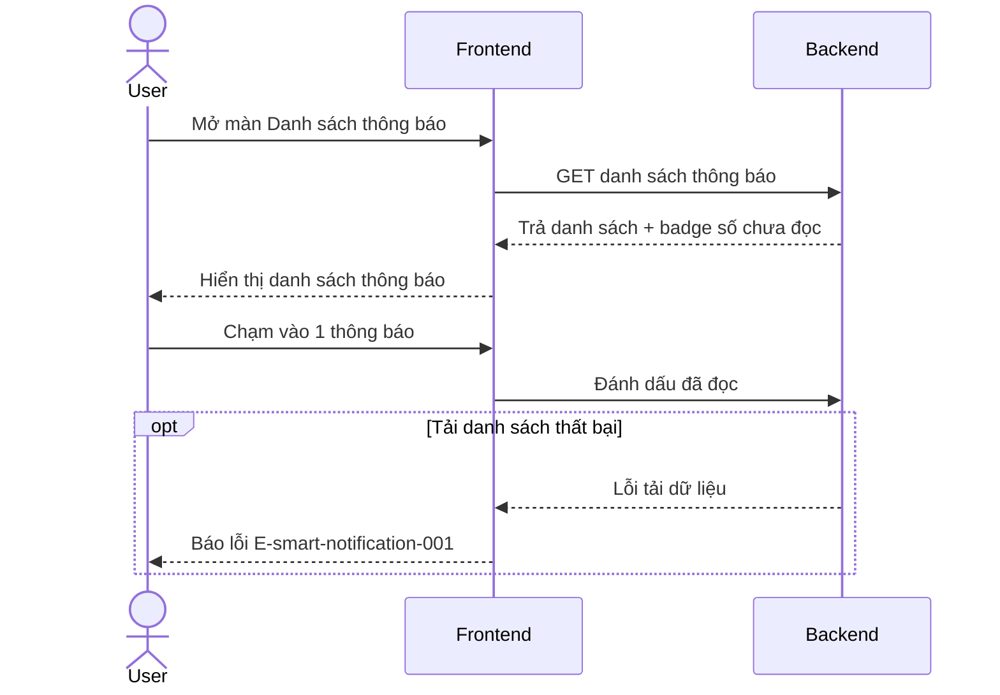
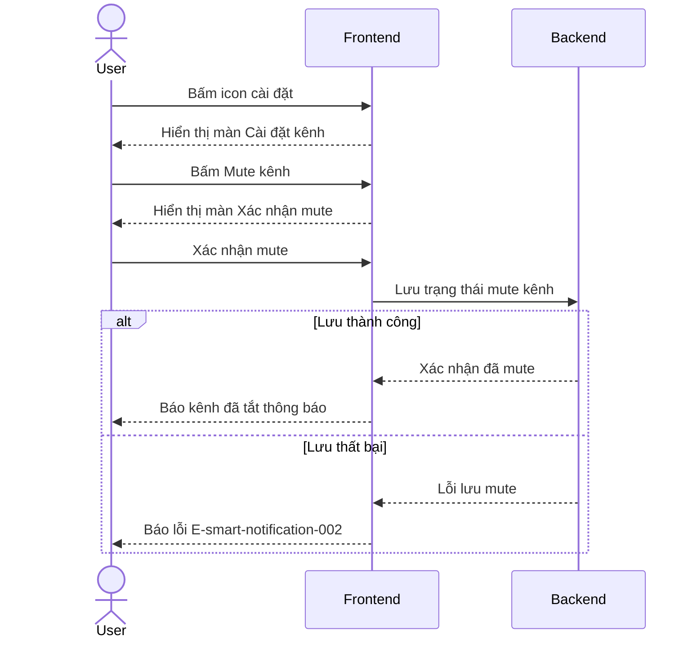

# Smart Notification — Flows‍​​‌‌​‌‌​‌‌‌​​‌​‌‌‌​​​​​​‌​‌‌​‌‌‌‌‌‌​​​​‌​‌‌​‌‌‌‌​‌‌‌‌‌‌‌‌​‌‌​‌​​‌​‌‌‌​​​‌‌‌‌‌‌​​​‌​‌‌‌​​‌‌‌‌‌​​‌​‌‌‌‌‌​‌​​‌‌​​‌​​‌​​​​‌‌​​​​​​‌​‍

## Flow: Xem thông báo‍​​‌‌​‌‌​‌‌‌​​‌​‌‌‌​​​​​​‌​‌‌​‌‌‌‌‌‌​​​​‌​‌‌​‌‌‌‌​‌‌‌‌‌‌‌‌​‌‌​‌​​‌​‌‌‌​​​‌‌‌‌‌‌​​​‌​‌‌‌​​‌‌‌‌‌​​‌​‌‌‌‌‌​‌​​‌‌​​‌​​‌​​​​‌‌​​​​​​‌​‍
__Trigger__: Người dùng mở màn Danh sách thông báo
__Related UC__: [[../usecases/uc-view-notifications.md]]
__Related FR__: FR-smart-notification-001, FR-smart-notification-002, FR-smart-notification-005
__Related E__: E-smart-notification-001‍​​‌‌​‌‌​‌‌‌​​‌​‌‌‌​​​​​​‌​‌‌​‌‌‌‌‌‌​​​​‌​‌‌​‌‌‌‌​‌‌‌‌‌‌‌‌​‌‌​‌​​‌​‌‌‌​​​‌‌‌‌‌‌​​​‌​‌‌‌​​‌‌‌‌‌​​‌​‌‌‌‌‌​‌​​‌‌​​‌​​‌​​​​‌‌​​​​​​‌​‍

## Flow: Mute kênh‍​​‌‌​‌‌​‌‌‌​​‌​‌‌‌​​​​​​‌​‌‌​‌‌‌‌‌‌​​​​‌​‌‌​‌‌‌‌​‌‌‌‌‌‌‌‌​‌‌​‌​​‌​‌‌‌​​​‌‌‌‌‌‌​​​‌​‌‌‌​​‌‌‌‌‌​​‌​‌‌‌‌‌​‌​​‌‌​​‌​​‌​​​​‌‌​​​​​​‌​‍
__Trigger__: Người dùng bấm icon cài đặt từ màn Danh sách thông báo
__Related UC__: [[../usecases/uc-mute-channel.md]]
__Related FR__: FR-smart-notification-003
__Related E__: E-smart-notification-002‍​​‌‌​‌‌​‌‌‌​​‌​‌‌‌​​​​​​‌​‌‌​‌‌‌‌‌‌​​​​‌​‌‌​‌‌‌‌​‌‌‌‌‌‌‌‌​‌‌​‌​​‌​‌‌‌​​​‌‌‌‌‌‌​​​‌​‌‌‌​​‌‌‌‌‌​​‌​‌‌‌‌‌​‌​​‌‌​​‌​​‌​​​​‌‌​​​​​​‌​‍

<!-- wm:3fed37a0598336173f221e8b9a1ea6e6 -->
Tài liệu thuộc bộ AI4BA BA-Kit — bản quyền ai4ba.com
