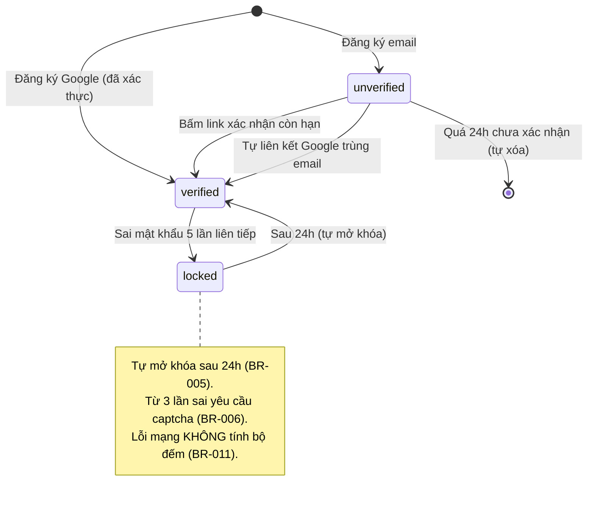
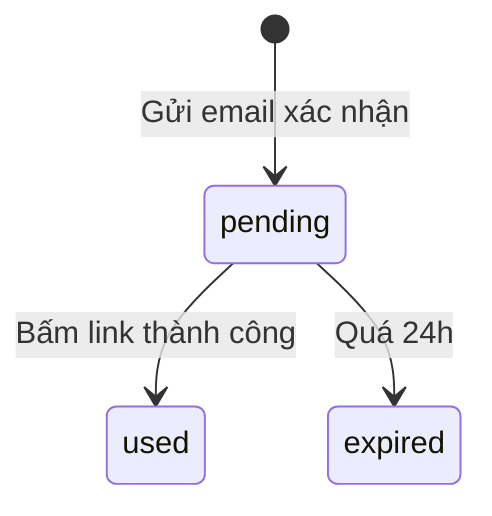
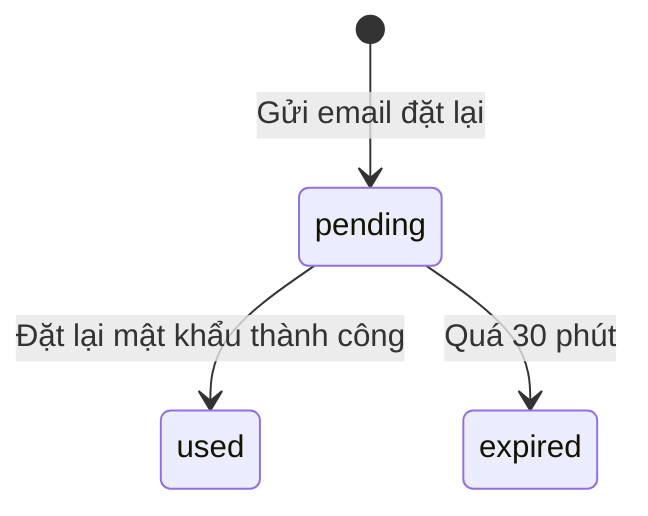
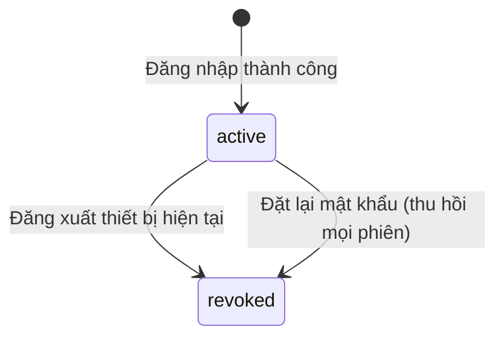

# authentication — State Diagrams‍​​‌‌​‌‌​‌‌‌​​‌​‌‌‌​​​​​​‌​‌‌​‌‌‌‌‌‌​​​​‌​‌‌​‌‌‌‌​‌‌‌‌‌‌‌‌​‌‌​‌​​‌​‌‌‌​​​‌‌‌‌‌‌​​​‌​‌‌‌​​‌‌‌‌‌​​‌​‌‌‌‌‌​‌​​‌‌​​‌​​‌​​​​‌‌​​​​​​‌​‍

> Trạng thái + transition của các entity multi-state trong feature __authentication__: Account, VerificationToken, ResetToken, Session. Mỗi entity 1 section.

## State: Account‍​​‌‌​‌‌​‌‌‌​​‌​‌‌‌​​​​​​‌​‌‌​‌‌‌‌‌‌​​​​‌​‌‌​‌‌‌‌​‌‌‌‌‌‌‌‌​‌‌​‌​​‌​‌‌‌​​​‌‌‌‌‌‌​​​‌​‌‌‌​​‌‌‌‌‌​​‌​‌‌‌‌‌​‌​​‌‌​​‌​​‌​​​​‌‌​​​​​​‌​‍

__Related UC__: uc-signup-email, uc-verify-email, uc-login-email, uc-google-oauth
__Related BR__: BR-authentication-001, 005, 009, 010, 011

States: `unverified`, `verified`, `locked`.

__Transitions:__

| Từ | Sang | Trigger | Điều kiện |
|---|---|---|---|
| (none) | unverified | Đăng ký email thành công | Mật khẩu đạt chính sách + email chưa tồn tại |
| (none) | verified | Đăng ký Google thành công | Callback OK, email Google chưa có tài khoản |
| unverified | verified | Bấm link xác nhận | Token còn hạn + chưa dùng |
| unverified | verified | Tự liên kết Google | Email Google trùng tài khoản `unverified` đã có (BR-003) |
| unverified | (xóa) | Tiến trình nền | Quá 24h chưa xác nhận (BR-010) |
| verified | locked | Đăng nhập sai | 5 lần sai liên tiếp (BR-005) |
| locked | verified | Hết thời gian khóa | 24h trôi qua |

__Invalid transitions:__ verified→unverified (không "hủy xác nhận"); locked→unverified (khóa chỉ áp verified); unverified→locked (unverified không đăng nhập được nên không tích bộ đếm sai).

## State: VerificationToken‍​​‌‌​‌‌​‌‌‌​​‌​‌‌‌​​​​​​‌​‌‌​‌‌‌‌‌‌​​​​‌​‌‌​‌‌‌‌​‌‌‌‌‌‌‌‌​‌‌​‌​​‌​‌‌‌​​​‌‌‌‌‌‌​​​‌​‌‌‌​​‌‌‌‌‌​​‌​‌‌‌‌‌​‌​​‌‌​​‌​​‌​​​​‌‌​​​​​​‌​‍

__Related UC__: uc-verify-email | __Related FR__: FR-005, 006, 007

States: `pending`, `used`, `expired`.

__Invalid transitions:__ used→pending, expired→pending — token đã dùng/hết hạn không tái sử dụng (phải gửi lại tạo token mới).

## State: ResetToken‍​​‌‌​‌‌​‌‌‌​​‌​‌‌‌​​​​​​‌​‌‌​‌‌‌‌‌‌​​​​‌​‌‌​‌‌‌‌​‌‌‌‌‌‌‌‌​‌‌​‌​​‌​‌‌‌​​​‌‌‌‌‌‌​​​‌​‌‌‌​​‌‌‌‌‌​​‌​‌‌‌‌‌​‌​​‌‌​​‌​​‌​​​​‌‌​​​​​​‌​‍

__Related UC__: uc-forgot-password | __Related FR__: FR-017, 018, 020

States: `pending`, `used`, `expired`.

__Invalid transitions:__ used/expired→pending — phải yêu cầu đặt lại mới.

## State: Session‍​​‌‌​‌‌​‌‌‌​​‌​‌‌‌​​​​​​‌​‌‌​‌‌‌‌‌‌​​​​‌​‌‌​‌‌‌‌​‌‌‌‌‌‌‌‌​‌‌​‌​​‌​‌‌‌​​​‌‌‌‌‌‌​​​‌​‌‌‌​​‌‌‌‌‌​​‌​‌‌‌‌‌​‌​​‌‌​​‌​​‌​​​​‌‌​​​​​​‌​‍

__Related UC__: uc-login-email, uc-forgot-password | __Related BR__: BR-007 | __Related FR__: FR-019, 021, 022

States: `active`, `revoked`.

__Transitions:__

| Từ | Sang | Trigger | Điều kiện |
|---|---|---|---|
| active | revoked | Người dùng đăng xuất | Chỉ thu hồi phiên thiết bị hiện tại (FR-022) |
| active | revoked | Đặt lại mật khẩu | Thu hồi TOÀN BỘ phiên mọi thiết bị (BR-007) |

__Invalid transitions:__ revoked→active — phiên đã thu hồi không tái kích hoạt, phải đăng nhập lại. Phiên không tự hết hạn theo thời gian (trừ remember-me hết 30 ngày) và không giới hạn số phiên đồng thời (FR-021).

*Cross-ref: `docs/authentication/srs/authentication-spec.md` Mục 5 Business Rules, Mục 6 Error Matrix.*‍​​‌‌​‌‌​‌‌‌​​‌​‌‌‌​​​​​​‌​‌‌​‌‌‌‌‌‌​​​​‌​‌‌​‌‌‌‌​‌‌‌‌‌‌‌‌​‌‌​‌​​‌​‌‌‌​​​‌‌‌‌‌‌​​​‌​‌‌‌​​‌‌‌‌‌​​‌​‌‌‌‌‌​‌​​‌‌​​‌​​‌​​​​‌‌​​​​​​‌​‍

<!-- wm:3fed37a0598336173f221e8b9a1ea6e6 -->
Tài liệu thuộc bộ AI4BA BA-Kit — bản quyền hoangphan.blog
