# Báo cáo hiệu quả dự án — Entity Relationship Diagram

> Scope: dữ liệu nghiệp vụ mà MH-03, P-06, P-07 đọc / ghi. Dự án, mã outsource và phiên bản PAKD do feature khác sở hữu, feature này chỉ đọc.

## Diagram

```mermaid
erDiagram
    DuAn ||--o{ MaOutsource : "có mã outsource"
    DuAn ||--o{ PhienBanPAKD : "có các phiên bản PAKD"
    DuAn ||--o{ KeHoachThang : "có kế hoạch theo tháng"
    PhienBanPAKD ||--o{ KeHoachThang : "sinh kế hoạch khi được duyệt"
    DuAn ||--o{ ThucTeThang : "có thực tế theo tháng"
    DuAn |o--o{ DongSoThu : "khớp qua mã công trình"
    DuAn |o--o{ DongSoChi : "khớp qua mã dự án"
    DuAn ||--o{ LichSuDuAn : "ghi lịch sử khi import sổ"
    SoKeToan ||--o{ DongSoThu : "gồm dòng dòng tiền thu"
    SoKeToan ||--o{ DongSoChi : "gồm dòng chi thực tế"
    SoKeToan ||--o{ NhatKyImportSo : "ghi nhật ký mỗi lần import"
    NhatKyImportSo ||--o{ DongSoThu : "tạo dòng"
    NhatKyImportSo ||--o{ DongSoChi : "tạo dòng"

    DuAn {
        chuoi duan_id PK "Định danh dự án do hệ thống sinh"
        chuoi ma_tong "Mã tổng, trống khi chưa được cấp mã"
        chuoi ma_kd "Mã KD = Mã tổng.1"
        chuoi ma_sx "Mã SX = Mã tổng.2"
        chuoi khoi "1 trong 6 khối G1, G2, G3, G4, BFSI, GPDV"
        chuoi ten_du_an "Tên dự án"
        ngay ngay_bat_dau "Start"
        ngay ngay_ket_thuc "End"
        chuoi trang_thai "Trạng thái vòng đời, feature quản lý dự án"
    }
    MaOutsource {
        chuoi ma_outsource PK "Mã tổng cộng hậu tố số từ .3, không dùng lại số đã xoá"
        chuoi duan_id FK "Dự án sở hữu"
        chuoi trang_thai "Đang dùng hoặc Đã xoá, mã đã xoá vẫn dùng để khớp sổ"
    }
    PhienBanPAKD {
        chuoi phienbanpakd_id PK "Định danh phiên bản PAKD"
        chuoi duan_id FK "Dự án"
        so phien_ban "V1, V2, ..."
        chuoi tinh_trang_hd "Đã ký hoặc Chưa ký"
        chuoi trang_thai_duyet "Chờ duyệt, Đã duyệt, Từ chối"
        ngay ngay_duyet "Ngày Kế toán duyệt"
    }
    KeHoachThang {
        chuoi duan_id FK "Dự án"
        chuoi phienbanpakd_id FK "Phiên bản PAKD được duyệt sinh ra"
        chuoi thang "MM/YYYY"
        so doanh_thu "VNĐ"
        so thu "Dòng tiền thu, VNĐ"
        so chi_sx "Chi sản xuất, VNĐ"
        so chi_kd "Chi kinh doanh, VNĐ"
        so klcv "Khối lượng công việc, SP, hiện luôn 0"
    }
    ThucTeThang {
        chuoi duan_id FK "Dự án"
        chuoi thang "MM/YYYY"
        so doanh_thu "VNĐ, Kế toán import, có thể chưa có số"
        so thu "VNĐ, từ sổ dòng tiền thu, có thể chưa có số"
        so chi_sx "VNĐ, từ sổ chi thực tế, có thể chưa có số"
        so chi_kd "VNĐ, từ sổ chi thực tế, có thể chưa có số"
        so klcv "SP, Kế toán import, có thể chưa có số"
    }
    SoKeToan {
        chuoi soketoan_id PK "Một bộ sổ toàn công ty"
    }
    DongSoThu {
        chuoi ma_dong PK "Mã dòng do hệ thống sinh"
        chuoi soketoan_id FK "Thuộc sổ toàn công ty"
        chuoi nhatkyimportso_id FK "Lần import tạo dòng"
        chuoi duan_ma_cong_trinh FK "Mã công trình, khớp 1 mã của dự án, có thể trống"
        ngay ngay_hach_toan "Ngày hạch toán"
        chuoi thang "Lấy theo ngày hạch toán"
        chuoi dien_giai "Diễn giải"
        so so_tien "VNĐ, cho phép âm"
        chuoi ten_doi_tuong "Tên đối tượng"
        chuoi ten_cong_trinh "Tên công trình"
        chuoi ma_don_vi "Mã đơn vị"
        chuoi ten_don_vi "Tên đơn vị"
        chuoi trang_thai_dong "Hiệu lực hoặc Đã bị thay"
    }
    DongSoChi {
        chuoi ma_dong PK "Mã dòng do hệ thống sinh"
        chuoi soketoan_id FK "Thuộc sổ toàn công ty"
        chuoi nhatkyimportso_id FK "Lần import tạo dòng"
        chuoi duan_ma_du_an FK "Mã dự án, khớp 1 mã của dự án, bắt buộc"
        chuoi thang "MM/YYYY"
        so chi_sx "Chi sản xuất, VNĐ, cho phép âm"
        so chi_kd "Chi kinh doanh, VNĐ, cho phép âm"
        chuoi ghi_chu "Ghi chú"
        chuoi trang_thai_dong "Hiệu lực hoặc Đã bị thay"
    }
    NhatKyImportSo {
        chuoi nhatkyimportso_id PK "Định danh lần import"
        chuoi soketoan_id FK "Sổ kế toán"
        chuoi loai_so "Dòng tiền thu hoặc Chi thực tế"
        chuoi ten_file "Tên file import"
        chuoi cac_thang "Các tháng có trong file"
        so so_dong "Số dòng import"
        ngay thoi_diem "Thời điểm import"
        chuoi nguoi_import "Tài khoản Kế toán thực hiện"
        chuoi tep_goc "Tệp gốc đã import, lưu trữ, không có màn xem"
    }
    LichSuDuAn {
        chuoi duan_id FK "Dự án"
        ngay thoi_diem "Thời điểm"
        chuoi nguoi "Người thực hiện"
        chuoi hanh_dong "Cập nhật Dòng tiền thu hoặc Chi thực tế từ sổ kế toán"
        chuoi ghi_chu "Tên file và số dòng"
    }
```

## Entity Reference

| Entity | Purpose | Key attributes |
|--------|---------|----------------|
| DuAn (Dự án) | Dự án kinh doanh — feature này chỉ đọc; được nhận diện trong sổ kế toán bằng Mã tổng / Mã KD / Mã SX / mã outsource | Định danh, Mã tổng, Mã KD, Mã SX, Khối, Tên, Start, End, Trạng thái |
| MaOutsource (Mã outsource) | Mã outsource từng cấp cho dự án (mã tổng + hậu tố số, feature quản lý dự án); mọi mã từng cấp, kể cả đã xoá, tham gia khớp dòng sổ (BR-bao-cao-hieu-qua-du-an-020); cấp mã mới làm tính lại thực tế (BR-bao-cao-hieu-qua-du-an-039) | Mã, Dự án, Trạng thái (đang dùng / đã xoá) |
| PhienBanPAKD (Phiên bản PAKD) | Phiên bản PAKD của dự án (feature PAKD); bản được duyệt quyết định dự án thuộc báo cáo và sinh kế hoạch theo tháng | Phiên bản, Tình trạng HĐ, Trạng thái duyệt, Ngày duyệt |
| KeHoachThang (Kế hoạch tháng) | Một tháng kế hoạch của dự án, ghi đè cả dãy khi Kế toán duyệt PAKD | Tháng, Doanh thu, Thu, Chi SX, Chi KD, KLCV |
| ThucTeThang (Thực tế tháng) | Một tháng thực tế của dự án; mỗi chỉ tiêu ghi nhận riêng, có thể "chưa có số" | Tháng, Doanh thu, Thu, Chi SX, Chi KD, KLCV |
| SoKeToan (Sổ kế toán) | Một bộ sổ chi tiết duy nhất toàn công ty, gồm 2 loại dòng + nhật ký | — |
| DongSoThu (Dòng sổ Dòng tiền thu) | 1 dòng sổ tiền gửi ngân hàng; dòng không mã / không khớp vẫn lưu | Ngày hạch toán, Tháng, Diễn giải, Số tiền, Đối tượng, Mã / Tên công trình, Mã / Tên đơn vị, Trạng thái dòng |
| DongSoChi (Dòng sổ Chi thực tế) | 1 dòng chi thực tế theo mã dự án và tháng | Mã dự án, Tháng, Chi SX, Chi KD, Ghi chú, Trạng thái dòng |
| NhatKyImportSo (Nhật ký import sổ) | Mỗi lần Kế toán import 1 file; 10 lần gần nhất hiện ở Lịch sử import; tệp gốc lưu kèm (Đã chốt Phase H — Q-29) | Loại sổ, Tên file, Các tháng, Số dòng, Thời điểm, Người import, Tệp gốc |
| LichSuDuAn (Lịch sử dự án) | Nhật ký thao tác của dự án; import sổ thêm 1 dòng cho mỗi dự án bị ảnh hưởng | Thời điểm, Người, Hành động, Ghi chú |

## Notes & Assumptions

- Quan hệ dòng sổ với dự án là **khớp mã logic**, không phải khoá cứng: Mã công trình / Mã dự án có thể là Mã tổng, Mã KD, Mã SX hoặc mã outsource; so khớp bỏ khoảng trắng đầu / cuối, không phân biệt hoa / thường. Mỗi mã chỉ thuộc 1 dự án — phụ thuộc `quan-ly-du-an-kinh-doanh` BR-006 (mã tổng không trùng) và BR-008 (không dùng lại số mã outsource đã xoá) (Spec Mục 11 Dependencies).
- Import thay thế theo tháng **không xoá cứng**: dòng cũ chuyển "Đã bị thay", chỉ dòng "Hiệu lực" được cộng vào thực tế và hiện ở P-06. Dòng bị thay và tệp gốc được giữ lại nhưng chưa có màn xem / khôi phục — tra cứu qua bộ phận vận hành (NFR-bao-cao-hieu-qua-du-an-001, Đã chốt Phase H — Q-29).
- ThucTeThang là dữ liệu dẫn xuất được lưu: Thu / Chi SX / Chi KD tính lại từ dòng sổ hiệu lực khi import (chỉ cho các tháng có trong file); Thu / Chi SX / Chi KD cũng được tính lại khi dự án được cấp mã tổng / mã outsource mới (BR-bao-cao-hieu-qua-du-an-039). Doanh thu / KLCV do Kế toán import ở feature quản lý dự án; ô trống giữ "chưa có số" (BR-bao-cao-hieu-qua-du-an-036). Lệch với tổng dòng sổ chỉ còn do dữ liệu chuyển đổi đầu kỳ hoặc mã đổi (cảnh báo E-bao-cao-hieu-qua-du-an-015).
- Kế hoạch tháng chỉ sinh từ phiên bản PAKD được duyệt; KLCV kế hoạch hiện luôn 0 (OQ-4).
- **Kết quả hiệu quả dự án** (KH, TT 4 chỉ tiêu trong kỳ, mức sức khoẻ), **Chốt số đến** theo chỉ tiêu và **tư cách thuộc báo cáo** của dự án là giá trị tính mỗi lần xem, không lưu — không vẽ trong sơ đồ.
- **Nhật ký tra soát** (Export, import lỗi, ghi thất bại, thao tác bị từ chối — NFR-bao-cao-hieu-qua-du-an-015) là bản ghi vận hành, không có màn xem, không vẽ trong sơ đồ nghiệp vụ.
