# Báo cáo hiệu quả dự án — Flows

## Flow: F1 — Xem tổng quan cả khối / công ty
__Trigger__: Người xem chọn menu "Quản trị dự án & Tài chính → Báo cáo hiệu quả dự án"
__Related UC__: [[docs/bao-cao-hieu-qua-du-an/usecases/uc-xem-tong-quan-khoi.md]]
__Related FR__: FR-bao-cao-hieu-qua-du-an-001, FR-bao-cao-hieu-qua-du-an-002, FR-bao-cao-hieu-qua-du-an-003, FR-bao-cao-hieu-qua-du-an-004, FR-bao-cao-hieu-qua-du-an-005, FR-bao-cao-hieu-qua-du-an-006, FR-bao-cao-hieu-qua-du-an-007, FR-bao-cao-hieu-qua-du-an-008 · BR-bao-cao-hieu-qua-du-an-002, BR-bao-cao-hieu-qua-du-an-003, BR-bao-cao-hieu-qua-du-an-004, BR-bao-cao-hieu-qua-du-an-005, BR-bao-cao-hieu-qua-du-an-014, BR-bao-cao-hieu-qua-du-an-034, BR-bao-cao-hieu-qua-du-an-037 · NFR-bao-cao-hieu-qua-du-an-011

### Sequence — F1

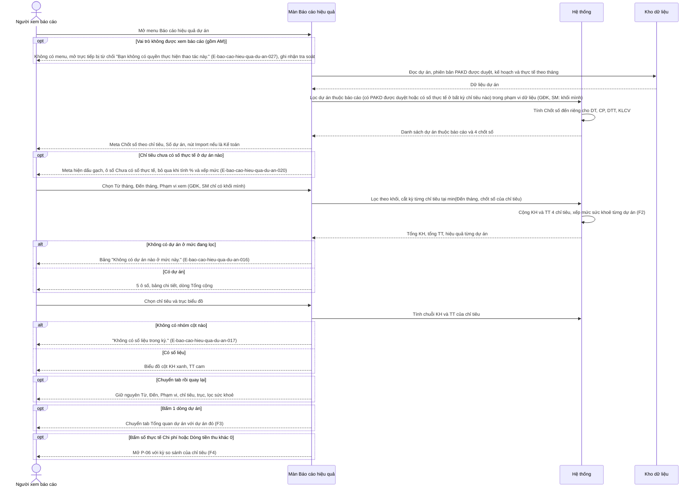

### Activity — F1

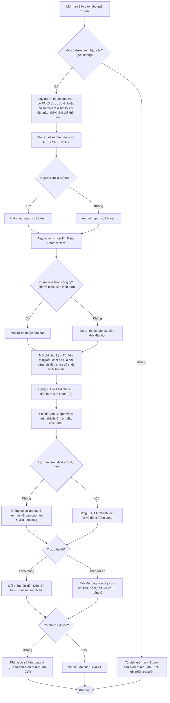

## Flow: F2 — Xếp mức sức khoẻ dự án
__Trigger__: Hệ thống tính bảng chi tiết theo dự án (mở màn, đổi kỳ / phạm vi, sau mỗi lần ghi nhận thực tế)
__Related UC__: [[docs/bao-cao-hieu-qua-du-an/usecases/uc-xem-tong-quan-khoi.md]]
__Related FR__: FR-bao-cao-hieu-qua-du-an-009, FR-bao-cao-hieu-qua-du-an-010 · BR-bao-cao-hieu-qua-du-an-010, BR-bao-cao-hieu-qua-du-an-011, BR-bao-cao-hieu-qua-du-an-012, BR-bao-cao-hieu-qua-du-an-013

### Sequence — F2

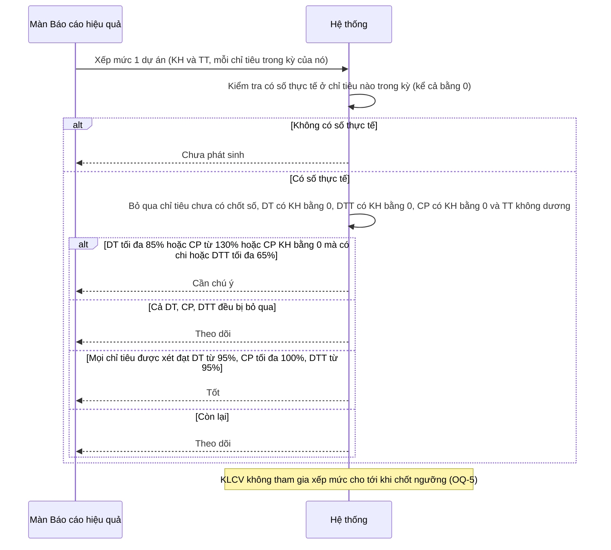

### Activity — F2

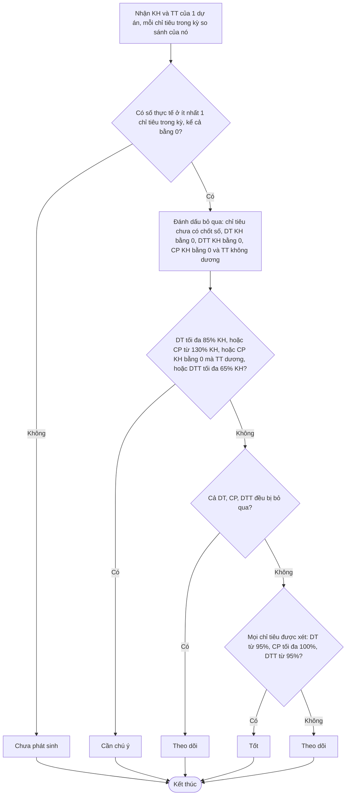

## Flow: F3 — Xem tổng quan một dự án
__Trigger__: Người xem bấm tab "Tổng quan dự án" hoặc bấm 1 dòng dự án ở tab tổng quan
__Related UC__: [[docs/bao-cao-hieu-qua-du-an/usecases/uc-xem-tong-quan-du-an.md]]
__Related FR__: FR-bao-cao-hieu-qua-du-an-003, FR-bao-cao-hieu-qua-du-an-011, FR-bao-cao-hieu-qua-du-an-012, FR-bao-cao-hieu-qua-du-an-013, FR-bao-cao-hieu-qua-du-an-014, FR-bao-cao-hieu-qua-du-an-015 · BR-bao-cao-hieu-qua-du-an-015, BR-bao-cao-hieu-qua-du-an-016, BR-bao-cao-hieu-qua-du-an-017, BR-bao-cao-hieu-qua-du-an-036

### Sequence — F3

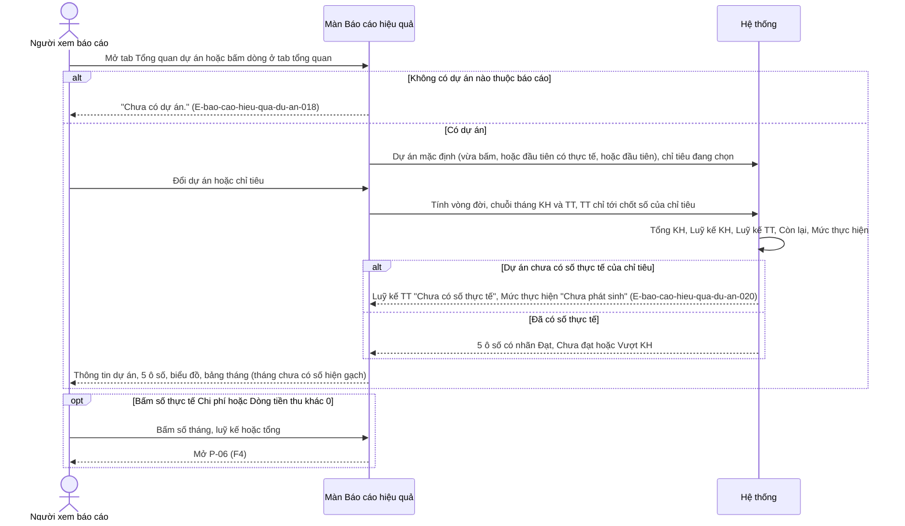

### Activity — F3

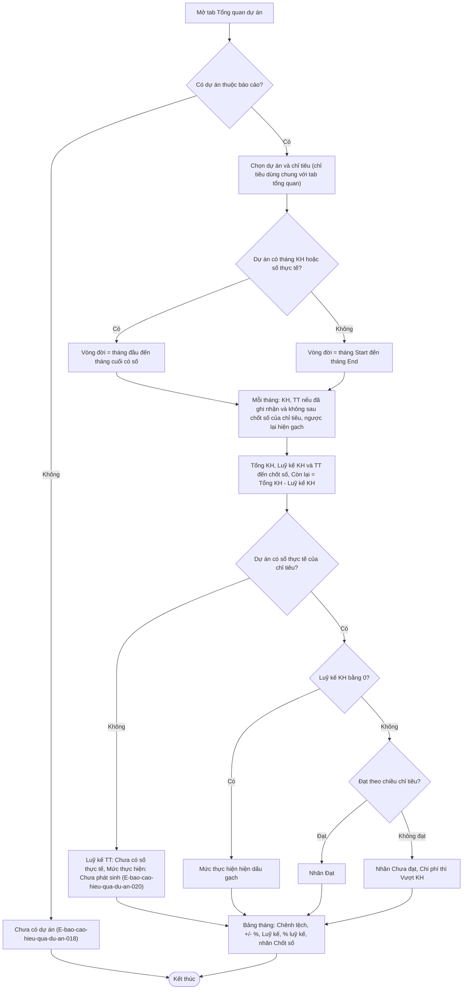

## Flow: F4 — Truy vết chi tiết sổ kế toán (P-06)
__Trigger__: Người xem bấm con số thực tế Chi phí hoặc Dòng tiền thu (khác 0)
__Related UC__: [[docs/bao-cao-hieu-qua-du-an/usecases/uc-tra-cuu-so-ke-toan.md]]
__Related FR__: FR-bao-cao-hieu-qua-du-an-016, FR-bao-cao-hieu-qua-du-an-017, FR-bao-cao-hieu-qua-du-an-018, FR-bao-cao-hieu-qua-du-an-019, FR-bao-cao-hieu-qua-du-an-020, FR-bao-cao-hieu-qua-du-an-021 · BR-bao-cao-hieu-qua-du-an-018, BR-bao-cao-hieu-qua-du-an-019, BR-bao-cao-hieu-qua-du-an-020, BR-bao-cao-hieu-qua-du-an-021, BR-bao-cao-hieu-qua-du-an-022, BR-bao-cao-hieu-qua-du-an-023, BR-bao-cao-hieu-qua-du-an-024, BR-bao-cao-hieu-qua-du-an-040 · NFR-bao-cao-hieu-qua-du-an-008, NFR-bao-cao-hieu-qua-du-an-015

### Sequence — F4

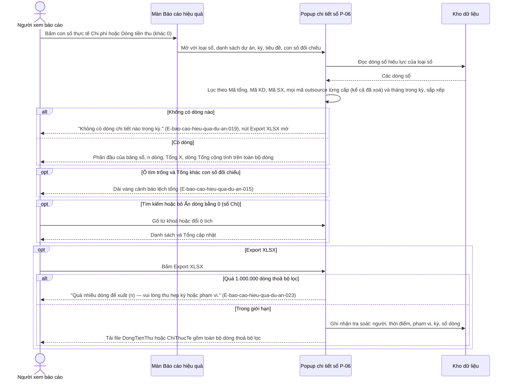

### Activity — F4

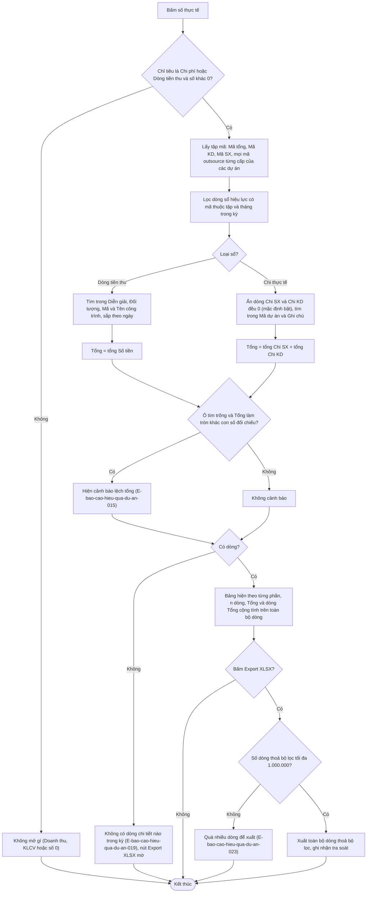

## Flow: F5 — Import sổ kế toán (P-07): đọc, kiểm tra, xem trước
__Trigger__: Kế toán bấm "Import sổ kế toán" trên thanh tiêu đề MH-03
__Related UC__: [[docs/bao-cao-hieu-qua-du-an/usecases/uc-import-so-ke-toan.md]]
__Related FR__: FR-bao-cao-hieu-qua-du-an-022, FR-bao-cao-hieu-qua-du-an-023, FR-bao-cao-hieu-qua-du-an-024, FR-bao-cao-hieu-qua-du-an-025, FR-bao-cao-hieu-qua-du-an-026, FR-bao-cao-hieu-qua-du-an-028, FR-bao-cao-hieu-qua-du-an-029, FR-bao-cao-hieu-qua-du-an-031 · BR-bao-cao-hieu-qua-du-an-025, BR-bao-cao-hieu-qua-du-an-026, BR-bao-cao-hieu-qua-du-an-027, BR-bao-cao-hieu-qua-du-an-028, BR-bao-cao-hieu-qua-du-an-029, BR-bao-cao-hieu-qua-du-an-037 · NFR-bao-cao-hieu-qua-du-an-002, NFR-bao-cao-hieu-qua-du-an-015

### Sequence — F5

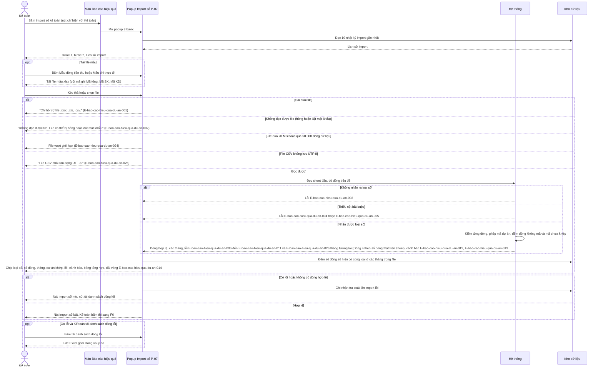

### Activity — F5

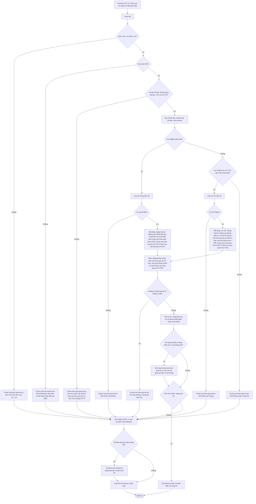

## Flow: F6 — Xác nhận, ghi sổ và tính lại số thực tế
__Trigger__: Kế toán bấm "Import sổ" khi kết quả kiểm tra hợp lệ
__Related UC__: [[docs/bao-cao-hieu-qua-du-an/usecases/uc-import-so-ke-toan.md]]
__Related FR__: FR-bao-cao-hieu-qua-du-an-002, FR-bao-cao-hieu-qua-du-an-027, FR-bao-cao-hieu-qua-du-an-030 · BR-bao-cao-hieu-qua-du-an-030, BR-bao-cao-hieu-qua-du-an-031, BR-bao-cao-hieu-qua-du-an-032, BR-bao-cao-hieu-qua-du-an-036, BR-bao-cao-hieu-qua-du-an-037, BR-bao-cao-hieu-qua-du-an-038, BR-bao-cao-hieu-qua-du-an-039 · NFR-bao-cao-hieu-qua-du-an-013, NFR-bao-cao-hieu-qua-du-an-014, NFR-bao-cao-hieu-qua-du-an-015

### Sequence — F6

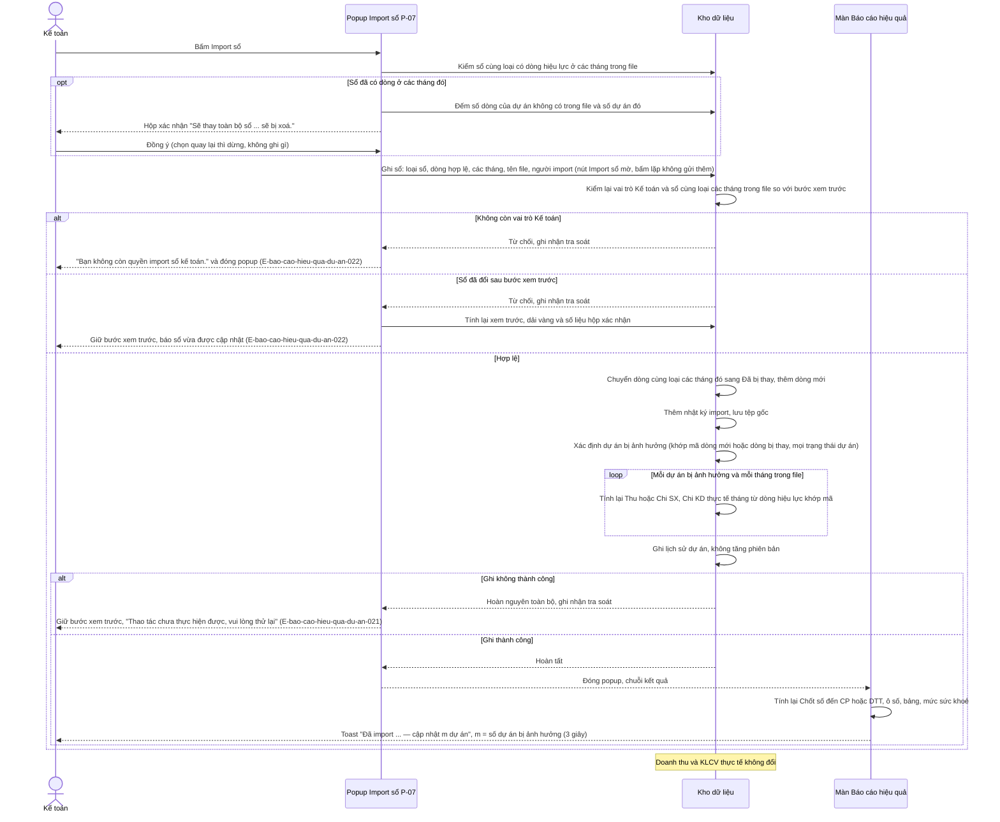

### Activity — F6

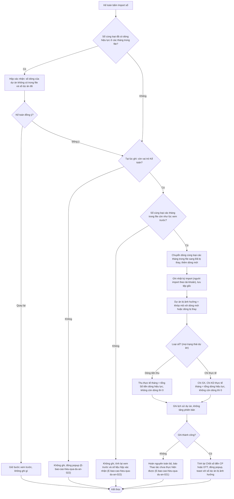

## Notes

- "Kho dữ liệu" = nơi lưu dự án, kế hoạch / thực tế theo tháng, sổ kế toán, nhật ký — cơ chế lưu trữ cụ thể chờ chốt (Spec Mục 11, OQ-7).
- Doanh thu và KLCV thực tế được ghi nhận ở feature `quan-ly-du-an-kinh-doanh` (khối Số liệu theo tháng), chỉ ô có số mới được ghi nhận (BR-bao-cao-hieu-qua-du-an-036); sau đó chốt số DT / KLCV và báo cáo tính lại như F1.
- Khi dự án được cấp mã tổng / mã outsource mới (feature `quan-ly-du-an-kinh-doanh`), hệ thống tính lại Thu / Chi thực tế các tháng có dòng sổ khớp mã đó và ghi lịch sử, cùng cách tính và cùng nguyên tắc ghi trọn vẹn như F6 (BR-bao-cao-hieu-qua-du-an-039).
