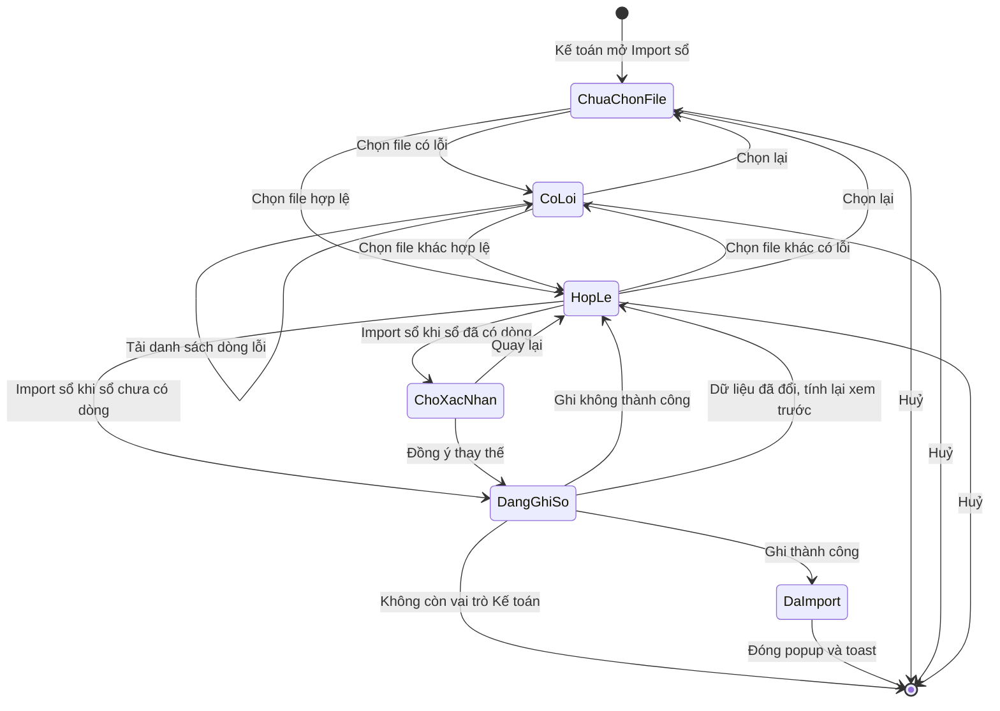
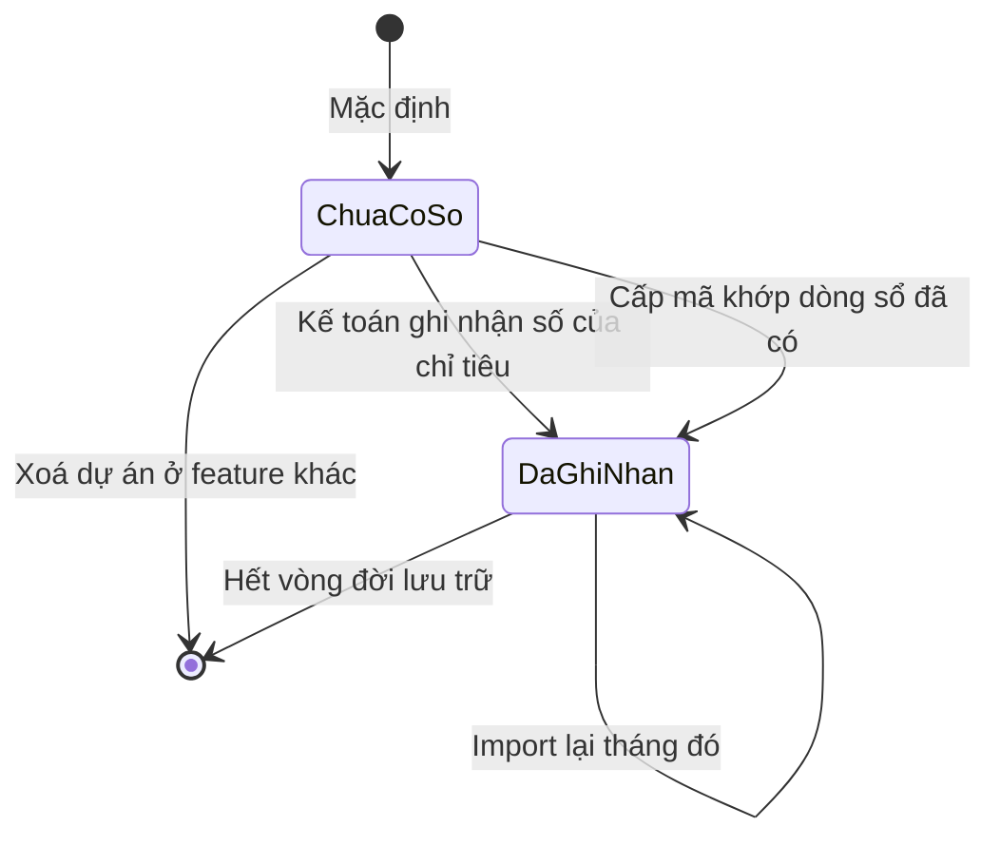
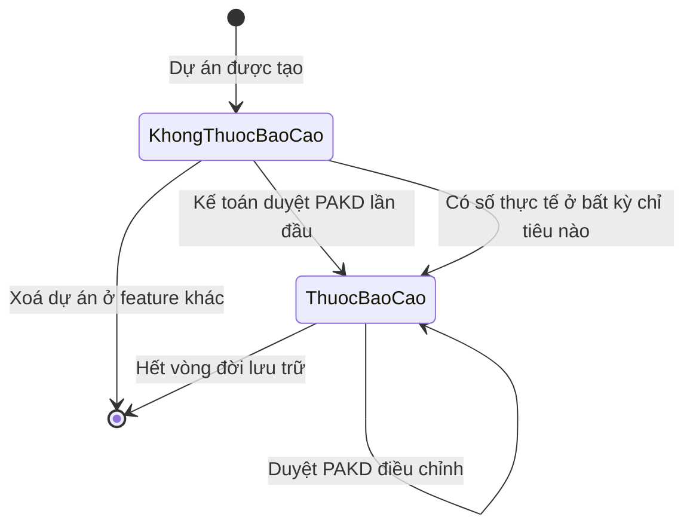

# bao-cao-hieu-qua-du-an — State Diagrams

> State diagram per entity của feature **bao-cao-hieu-qua-du-an**. Mỗi entity 1 section `## State: {Entity}`. Mức sức khoẻ (Tốt / Cần chú ý / Theo dõi / Chưa phát sinh) là phân loại tính lại mỗi lần xem, không có chuyển trạng thái — quy tắc ở Flow F2 trong `srs/bao-cao-hieu-qua-du-an-flows.md`. Trạng thái vòng đời dự án thuộc feature `quan-ly-du-an-kinh-doanh`.

## State: Phiên import sổ kế toán (P-07)

**Related UC**: [[docs/bao-cao-hieu-qua-du-an/usecases/uc-import-so-ke-toan.md]]
**Related BR**: BR-bao-cao-hieu-qua-du-an-028, BR-bao-cao-hieu-qua-du-an-030, BR-bao-cao-hieu-qua-du-an-037, BR-bao-cao-hieu-qua-du-an-038 · NFR-bao-cao-hieu-qua-du-an-013, NFR-bao-cao-hieu-qua-du-an-014

| Trạng thái | Ý nghĩa |
|---|---|
| ChuaChonFile | Popup mở, chưa có kết quả đọc file; hiện bước 1, bước 2 và Lịch sử import |
| CoLoi | Đã đọc file nhưng có ≥ 1 lỗi (E-bao-cao-hieu-qua-du-an-001 – E-bao-cao-hieu-qua-du-an-011, E-bao-cao-hieu-qua-du-an-024 – E-bao-cao-hieu-qua-du-an-026); nút Import sổ mờ; có nút tải danh sách dòng lỗi |
| HopLe | Đã nhận loại sổ, ≥ 1 dòng hợp lệ, 0 lỗi (có thể có cảnh báo E-bao-cao-hieu-qua-du-an-012, 013 và dải vàng E-bao-cao-hieu-qua-du-an-014); nút Import sổ bật |
| ChoXacNhan | Hộp xác nhận thay thế đang mở (FR-bao-cao-hieu-qua-du-an-030) |
| DangGhiSo | Hệ thống kiểm lại vai trò Kế toán và sổ cùng loại các tháng trong file (NFR-bao-cao-hieu-qua-du-an-013), rồi thay thế dòng, tính lại thực tế, ghi nhật ký — tất cả hoặc không (NFR-bao-cao-hieu-qua-du-an-014); nút Import sổ mờ, bấm lặp không ghi thêm lần nào. Sổ đã đổi sau bước xem trước → về HopLe với xem trước, dải vàng, số liệu hộp xác nhận tính lại (E-bao-cao-hieu-qua-du-an-022 (b)); không còn vai trò Kế toán → đóng popup (E-bao-cao-hieu-qua-du-an-022 (a)); lỗi giữa chừng → về HopLe (E-bao-cao-hieu-qua-du-an-021) |
| DaImport | Đã ghi sổ + tính lại thực tế; popup đóng, toast "Đã import …" 3 giây |

### Invalid transitions

| From | To | Why not |
|---|---|---|
| CoLoi | DangGhiSo | Tất cả hoặc không — 1 lỗi chặn cả file (BR-bao-cao-hieu-qua-du-an-028) |
| HopLe | DaImport | Không được ghi khi sổ đã có dòng các tháng trong file mà chưa qua hộp xác nhận (FR-bao-cao-hieu-qua-du-an-030); khi sổ chưa có dòng vẫn phải đi qua DangGhiSo |
| DaImport | HopLe | Không hoàn tác lần import từ popup; import nhầm thì import lại đúng tháng / loại sổ (Đã chốt Phase H — Q-36) |
| DangGhiSo | DaImport (một phần) | Ghi lỗi giữa chừng không được để lại thay đổi dở dang (E-bao-cao-hieu-qua-du-an-021, NFR-bao-cao-hieu-qua-du-an-014) |
| DangGhiSo | DangGhiSo (lần ghi thứ hai) | Bấm Import sổ lặp hoặc 2 lần import cùng loại sổ không được ghi chồng nhau (NFR-bao-cao-hieu-qua-du-an-013) |

## State: Số thực tế của một chỉ tiêu – tháng của dự án

**Related UC**: [[docs/bao-cao-hieu-qua-du-an/usecases/uc-import-so-ke-toan.md]]
**Related BR**: BR-bao-cao-hieu-qua-du-an-031, BR-bao-cao-hieu-qua-du-an-036, BR-bao-cao-hieu-qua-du-an-003, BR-bao-cao-hieu-qua-du-an-039

| Trạng thái | Ý nghĩa |
|---|---|
| ChuaCoSo | Chỉ tiêu – tháng chưa từng được ghi nhận (với DT / KLCV: kể cả ô trống hoặc chỉ tiêu thiếu dòng trong file import thực tế — BR-bao-cao-hieu-qua-du-an-036): hiển thị "–", không tính là "có số thực tế", không đẩy Chốt số đến; khi cộng luỹ kế tính 0 |
| DaGhiNhan | Đã ghi nhận (kể cả bằng 0): Thu từ sổ Dòng tiền thu, Chi SX / Chi KD từ sổ Chi thực tế (khi import hoặc khi mã được cấp — BR-bao-cao-hieu-qua-du-an-039), Doanh thu / KLCV từ import thực tế ở màn chi tiết dự án; có thể đẩy Chốt số đến của chỉ tiêu lên. Import lại mà không còn dòng sổ khớp → giá trị về 0 nhưng vẫn là DaGhiNhan |

> Chuyển ra `[*]` từ DaGhiNhan chỉ mang nghĩa hết vòng đời lưu trữ — theo NFR-bao-cao-hieu-qua-du-an-001 dữ liệu giữ vĩnh viễn, nên trên thực tế không xảy ra.

### Invalid transitions

| From | To | Why not |
|---|---|---|
| DaGhiNhan | ChuaCoSo | Import sổ chỉ đặt lại giá trị (có thể về 0), không xoá ghi nhận — vì vậy tháng tương lai bị chặn ngay khi import (E-bao-cao-hieu-qua-du-an-026), để chốt số không bị đẩy quá tháng hiện tại (Đã chốt Phase H — Q-36) |
| ChuaCoSo (DT, KLCV) | DaGhiNhan qua Import sổ kế toán | Doanh thu / KLCV chỉ ghi nhận qua import thực tế ở màn chi tiết dự án (BR-bao-cao-hieu-qua-du-an-031) |

## State: Tư cách thuộc báo cáo của dự án

**Related UC**: [[docs/bao-cao-hieu-qua-du-an/usecases/uc-xem-tong-quan-khoi.md]]
**Related BR**: BR-bao-cao-hieu-qua-du-an-034, BR-bao-cao-hieu-qua-du-an-033, BR-bao-cao-hieu-qua-du-an-036

| Trạng thái | Ý nghĩa |
|---|---|
| KhongThuocBaoCao | Dự án Chờ duyệt mã, Chưa có PAKD, PAKD chờ duyệt / bị từ chối mà chưa từng có bản duyệt và chưa có số thực tế đã ghi nhận ở chỉ tiêu nào — không có mặt ở meta Số dự án, ô số, biểu đồ, bảng, ô chọn dự án |
| ThuocBaoCao | Đã có ≥ 1 phiên bản PAKD được duyệt, hoặc đã có số thực tế đã ghi nhận ở bất kỳ chỉ tiêu nào (BR-bao-cao-hieu-qua-du-an-036: Thu / Chi từ sổ kế toán, DT / KLCV do Kế toán import) — có mặt ở mọi phần của báo cáo, kể cả khi sau đó chuyển Pending / Kết thúc |

### Invalid transitions

| From | To | Why not |
|---|---|---|
| ThuocBaoCao | KhongThuocBaoCao | Dự án đã từng được duyệt PAKD vẫn ở trong báo cáo khi Pending / Kết thúc (BR-bao-cao-hieu-qua-du-an-034) |
| KhongThuocBaoCao | ThuocBaoCao (khi chỉ gửi PAKD — chờ duyệt / bị từ chối) | Không vào báo cáo chỉ vì gửi PAKD — PAKD chờ duyệt / bị từ chối không tính (BR-bao-cao-hieu-qua-du-an-033) |
