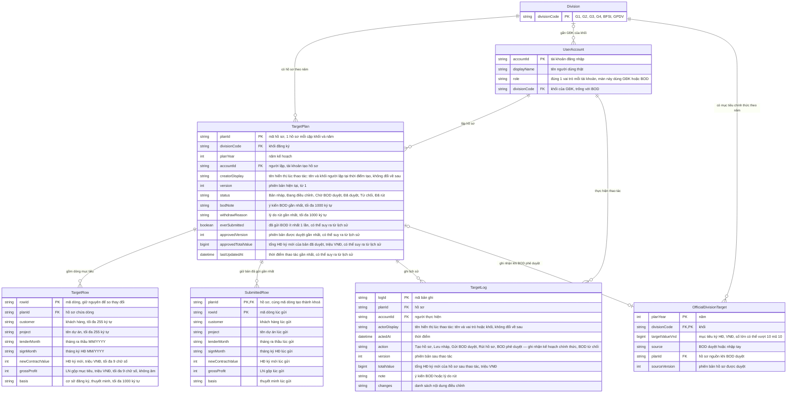

# Mục tiêu kinh doanh — Entity Relationship Diagram

> Scope: hồ sơ mục tiêu năm của khối, dòng mục tiêu, bản đã gửi gần nhất, lịch sử điều chỉnh, mục tiêu chính thức của khối (kho dùng chung) và tài khoản người dùng (đăng nhập dùng chung).

## Diagram

## Entity Reference

| Entity | Purpose | Key attributes |
|--------|---------|----------------|
| Division (Khối) | Danh mục cố định 6 khối kinh doanh | Mã khối |
| UserAccount (Tài khoản người dùng) | Tài khoản đăng nhập dùng chung module; xác định vai trò (mỗi tài khoản đúng 1 vai trò — Phase H Q-27; AM / SM / Kế toán không vào màn này) và khối của GĐK (BOD không gắn khối, nên một khối có thể có 0 hoặc nhiều tài khoản và một tài khoản có thể không thuộc khối nào). Thuộc phần đăng nhập (`phuong-an-kinh-doanh:OQ-5`), feature này chỉ đọc | Tên, vai trò (GĐK / BOD), khối |
| TargetPlan (Hồ sơ mục tiêu kinh doanh) | Hồ sơ mục tiêu năm của 1 khối; 1 cặp Khối–Năm chỉ 1 hồ sơ (BR-muc-tieu-kinh-doanh-001) | Mã hồ sơ, khối, năm, người lập (kèm tên hiển thị lúc tạo hồ sơ), phiên bản, trạng thái (6 giá trị), ý kiến BOD, lý do rút, đã từng gửi, phiên bản + tổng HĐ ký mới của bản được duyệt gần nhất |
| TargetRow (Dòng mục tiêu) | Một khách hàng / dự án dự kiến ký HĐ trong năm; tối đa 500 dòng / hồ sơ | Khách hàng, tên dự án, tháng ra thầu, tháng ký HĐ, HĐ ký mới, LN gộp, thuyết minh; % LN gộp tính khi hiển thị, không lưu |
| SubmittedRow (Bản đã gửi gần nhất) | Nội dung các dòng tại lần gửi gần nhất: mốc so "Nội dung điều chỉnh" khi gửi (BR-muc-tieu-kinh-doanh-020) và mốc xét "có thay đổi" so với bản BOD đã quyết định (BR-muc-tieu-kinh-doanh-011). Khoá là cặp (hồ sơ, mã dòng) | Như dòng mục tiêu |
| TargetLog (Bản ghi lịch sử điều chỉnh) | Mỗi lần tạo / lưu / gửi / rút / duyệt / từ chối thành công; chỉ thêm, không sửa / xoá | Thời điểm, người thực hiện (kèm tên hiển thị lúc thao tác), thao tác, phiên bản, tổng giá trị sau thao tác, ý kiến hoặc lý do rút, nội dung điều chỉnh |
| OfficialDivisionTarget (Mục tiêu ký HĐ chính thức của khối) | Mục tiêu năm của khối dùng chung cho Sổ theo dõi dự án — chính là "Mục tiêu khối" của feature `quan-ly-du-an-kinh-doanh` (kho thuộc feature đó); feature này ghi khi BOD phê duyệt, kèm nguồn để P-05 khoá nhập tay | Năm, khối, giá trị VNĐ, nguồn (BOD duyệt / nhập tay), hồ sơ + phiên bản nguồn |

## Notes & Assumptions

- Quan hệ TargetPlan — OfficialDivisionTarget là 0..1 – 0..1 theo cặp (năm, khối): khối chưa có hồ sơ được duyệt có thể có mục tiêu nhập tay (nguồn "nhập tay", không có hồ sơ nguồn); khi BOD phê duyệt thì nguồn chuyển sang "BOD duyệt" và gắn hồ sơ + phiên bản (BR-muc-tieu-kinh-doanh-015). Việc chuyển hồ sơ sang Đã duyệt và việc ghi mục tiêu chính thức cùng thành công hoặc cùng không xảy ra (BR-muc-tieu-kinh-doanh-032).
- Không lưu nội dung dòng theo từng phiên bản (ngoài phạm vi): chỉ có bản hiện tại, bản đã gửi gần nhất và tổng của bản đã duyệt gần nhất. Lịch sử truy được ai, khi nào, tổng giá trị và các thay đổi chính; không tái lập đủ nội dung từng phiên bản (lưu dòng theo phiên bản đã chốt ngoài phạm vi — reverse OQ-7).
- Các thuộc tính "đã từng gửi", "phiên bản + tổng của bản được duyệt gần nhất", "thời điểm thao tác gần nhất" của hồ sơ có thể suy ra từ lịch sử điều chỉnh; ghi trên hồ sơ chỉ để tiện hiển thị, phải luôn khớp lịch sử.
- Tên hiển thị trong "Người lập" và trong từng bản ghi lịch sử được chụp lại tại thời điểm thao tác, không đổi khi tài khoản đổi tên hoặc đổi khối về sau (BR-muc-tieu-kinh-doanh-021).
- Giá trị tiền VNĐ của mục tiêu chính thức là số lớn (có thể > 10^10), không dùng kiểu số nhỏ; tổng triệu VNĐ của hồ sơ (tới 500 dòng × 9 chữ số) cũng vượt giới hạn số nguyên thường.
- "Bản BOD đã quyết định gần nhất" (Đã duyệt / Từ chối) trùng với bản đã gửi gần nhất, vì hồ sơ chờ duyệt bị khoá sửa; sau khi rút thì bản đã gửi gần nhất là bản chưa được quyết định.
- Khách hàng là chuỗi tự do (có gợi ý, tối đa 255 ký tự như Tên dự án — Phase H Q-05), chưa liên kết danh mục khách hàng.
- Kế toán gỡ được mục tiêu nhập tay của một khối qua nút "Xoá mục tiêu" ở P-05 (feature `quan-ly-du-an-kinh-doanh`), đưa cặp (năm, khối) về "chưa có mục tiêu"; việc gỡ có xác nhận và được ghi vào nhật ký mục tiêu khối (giá trị cũ → trống). Mục tiêu nguồn "BOD duyệt" không gỡ được qua P-05 (BR-muc-tieu-kinh-doanh-015, Phase H Q-48).
- Thời điểm (actedAt, lastUpdatedAt) hiển thị theo giờ Việt Nam (Asia/Ho_Chi_Minh — NFR-muc-tieu-kinh-doanh-004, Phase H Q-30).
- Không mô hình hoá thông báo và nhật ký tra soát thao tác ghi thất bại (NFR-muc-tieu-kinh-doanh-010) — thuộc phần vận hành.
- Mọi thực thể giữ vĩnh viễn, không xoá cứng (NFR-muc-tieu-kinh-doanh-008); xoá dòng trong hồ sơ là thao tác nghiệp vụ, vẫn truy được qua lịch sử.
