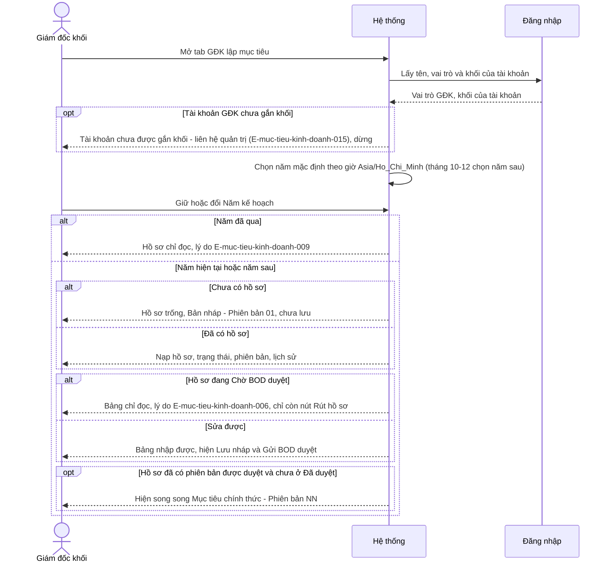
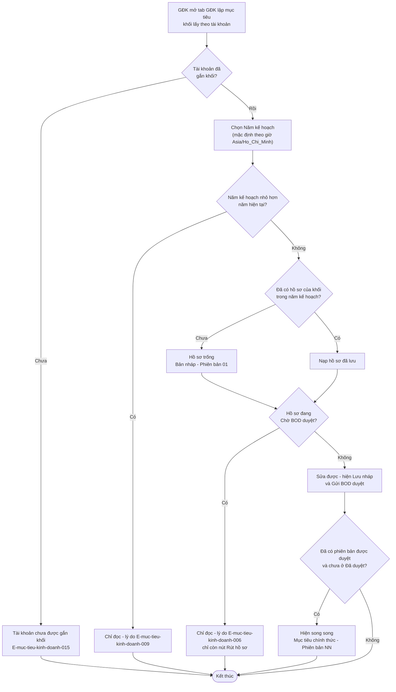
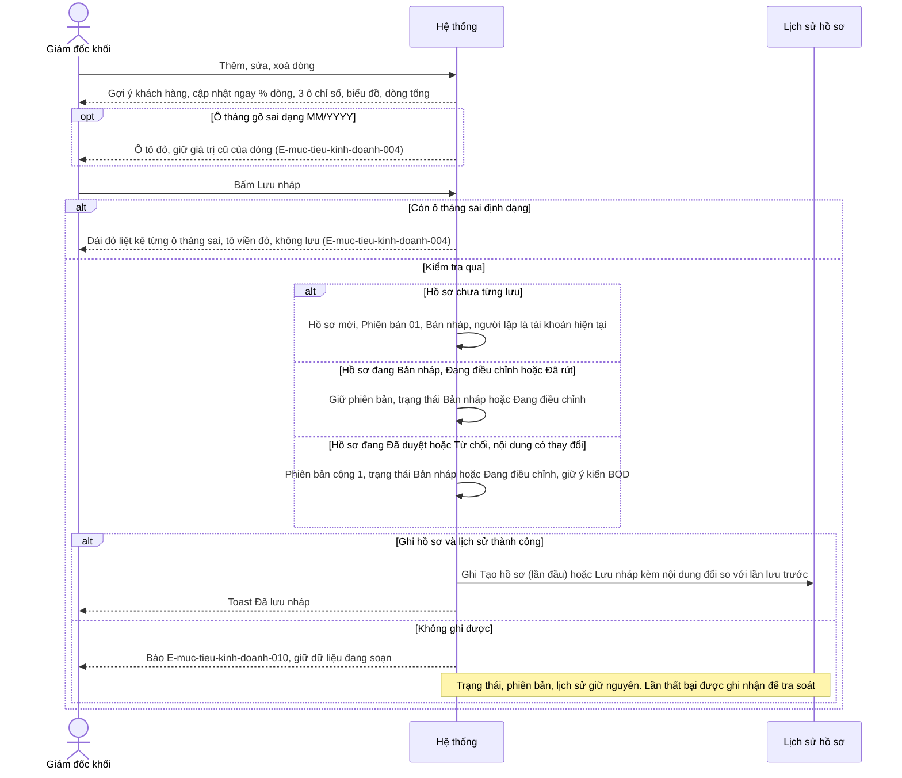
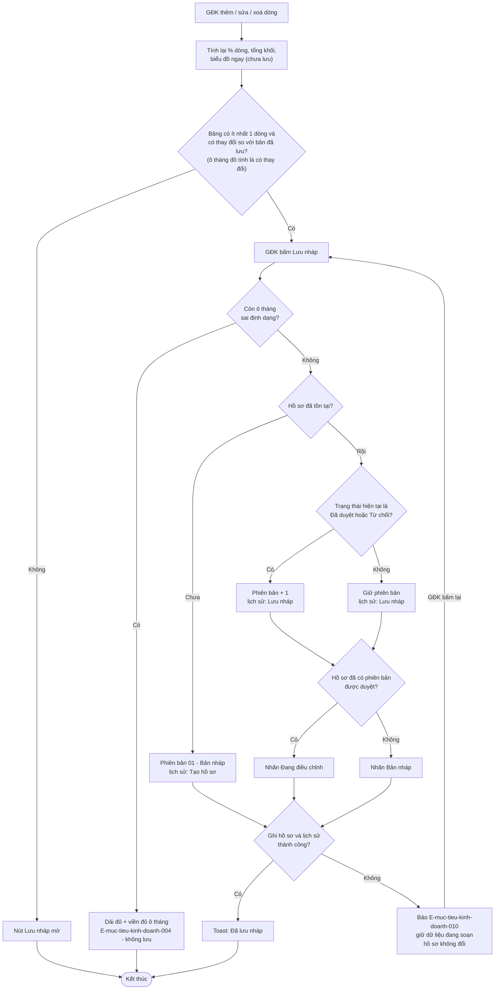
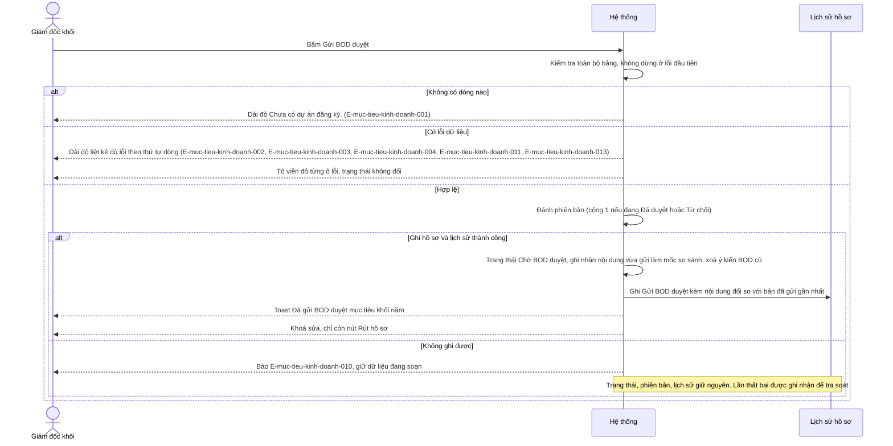
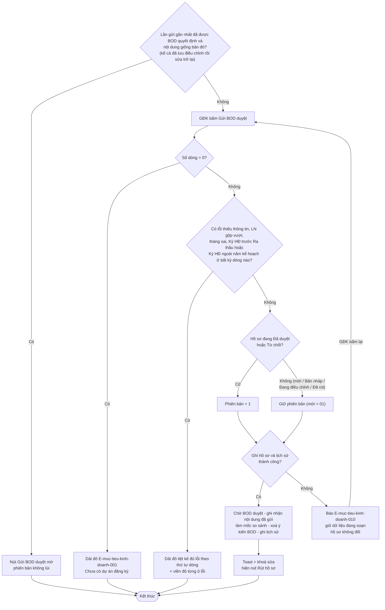
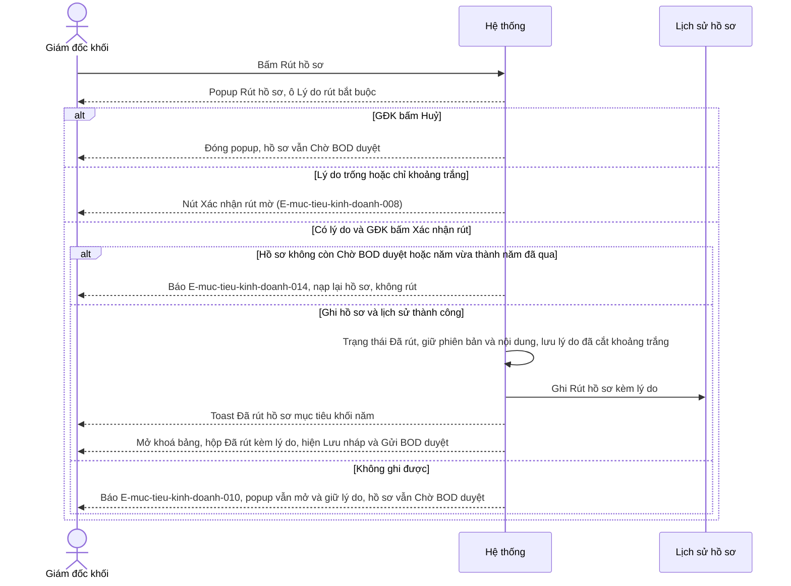
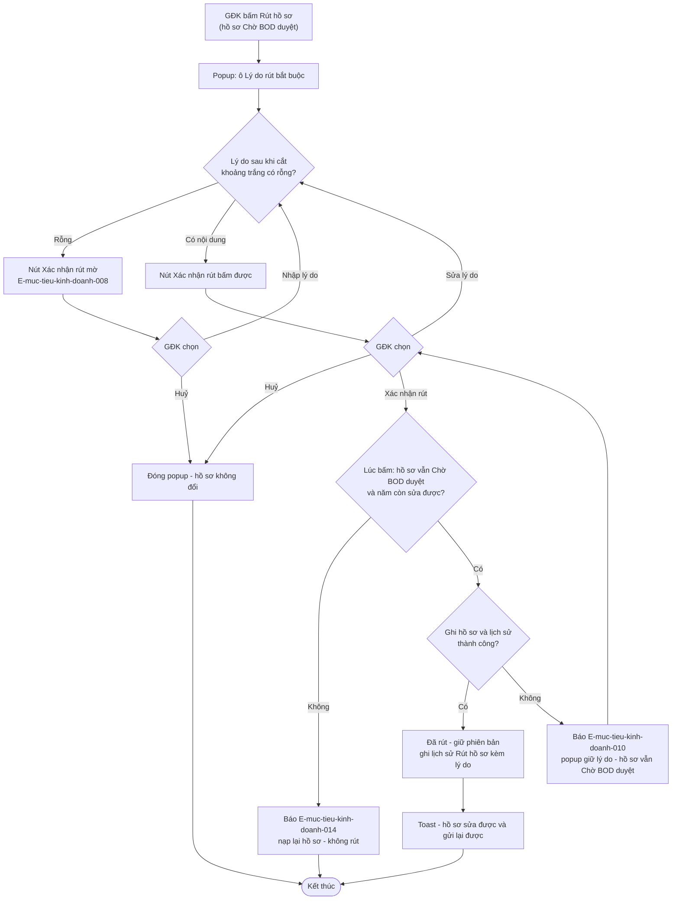
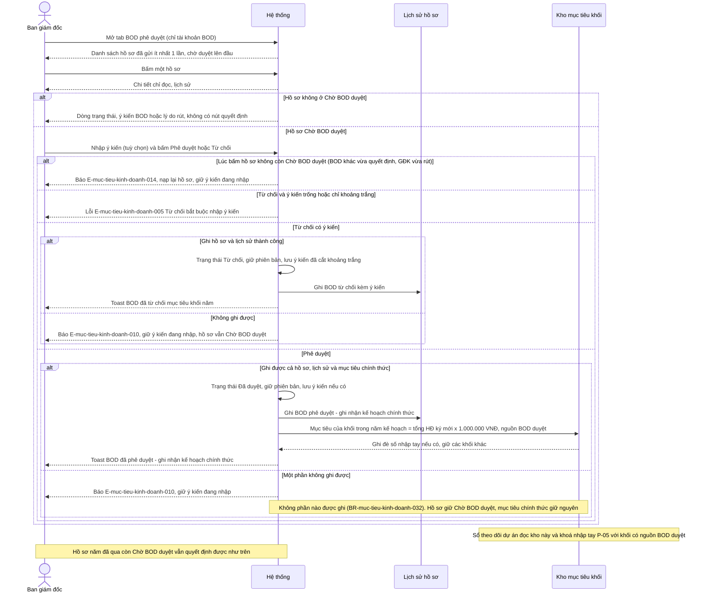
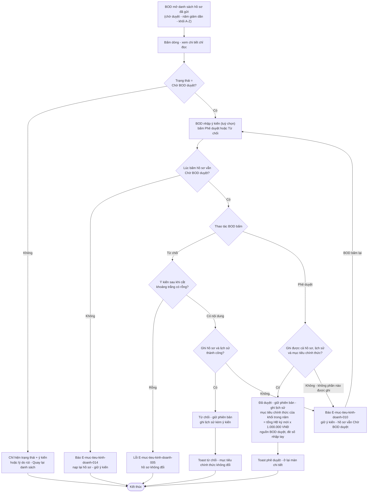

# Mục tiêu kinh doanh — Flows

## Flow: Mở hồ sơ và xác định quyền sửa
__Trigger__: GĐK mở tab "GĐK lập mục tiêu" hoặc đổi Năm kế hoạch
__Related UC__: uc-lap-ho-so-muc-tieu
__Related FR__: FR-muc-tieu-kinh-doanh-001, FR-muc-tieu-kinh-doanh-002, FR-muc-tieu-kinh-doanh-005, FR-muc-tieu-kinh-doanh-014, FR-muc-tieu-kinh-doanh-025, FR-muc-tieu-kinh-doanh-026

### Sequence — Mở hồ sơ và xác định quyền sửa

### Activity — Mở hồ sơ và xác định quyền sửa

## Flow: Lập / sửa dòng mục tiêu và Lưu nháp
__Trigger__: GĐK sửa bảng đăng ký rồi bấm "Lưu nháp"
__Related UC__: uc-lap-ho-so-muc-tieu
__Related FR__: FR-muc-tieu-kinh-doanh-009, FR-muc-tieu-kinh-doanh-010, FR-muc-tieu-kinh-doanh-011, FR-muc-tieu-kinh-doanh-012, FR-muc-tieu-kinh-doanh-015, FR-muc-tieu-kinh-doanh-016, FR-muc-tieu-kinh-doanh-027

### Sequence — Lập / sửa dòng mục tiêu và Lưu nháp

### Activity — Lập / sửa dòng mục tiêu và Lưu nháp

## Flow: Gửi BOD duyệt
__Trigger__: GĐK bấm "Gửi BOD duyệt"
__Related UC__: uc-gui-bod-duyet
__Related FR__: FR-muc-tieu-kinh-doanh-013, FR-muc-tieu-kinh-doanh-015, FR-muc-tieu-kinh-doanh-016, FR-muc-tieu-kinh-doanh-023, FR-muc-tieu-kinh-doanh-027

### Sequence — Gửi BOD duyệt

### Activity — Gửi BOD duyệt

## Flow: Rút hồ sơ đang chờ duyệt
__Trigger__: GĐK bấm "Rút hồ sơ" trên hồ sơ đang Chờ BOD duyệt
__Related UC__: uc-rut-ho-so
__Related FR__: FR-muc-tieu-kinh-doanh-016, FR-muc-tieu-kinh-doanh-023, FR-muc-tieu-kinh-doanh-024

### Sequence — Rút hồ sơ

### Activity — Rút hồ sơ

## Flow: BOD phê duyệt / từ chối và ghi nhận mục tiêu chính thức
__Trigger__: BOD mở tab "BOD phê duyệt" và mở một hồ sơ
__Related UC__: uc-bod-phe-duyet, uc-bod-tu-choi
__Related FR__: FR-muc-tieu-kinh-doanh-018, FR-muc-tieu-kinh-doanh-019, FR-muc-tieu-kinh-doanh-020, FR-muc-tieu-kinh-doanh-021, FR-muc-tieu-kinh-doanh-022, FR-muc-tieu-kinh-doanh-023

### Sequence — BOD phê duyệt / từ chối

### Activity — BOD phê duyệt / từ chối

## Notes

- Thao tác khi hồ sơ vừa bị người khác đổi trạng thái (2 BOD cùng quyết định, GĐK rút sau khi BOD đã quyết định, BOD quyết định trên hồ sơ vừa rút, thao tác của GĐK qua thời điểm sang năm mới): hệ thống kiểm lại quyền + trạng thái + năm tại lúc bấm; không thỏa thì không thực hiện, báo "Dữ liệu vừa được người khác cập nhật — đã tải lại, vui lòng xem lại." (E-muc-tieu-kinh-doanh-014) và nạp lại hồ sơ, giữ ô ý kiến / lý do đang nhập (Phase H Q-21). Đã vẽ ở Flow Rút hồ sơ và Flow BOD; với Lưu nháp / Gửi BOD duyệt (năm kế hoạch vừa trở thành năm đã qua) áp cùng quy tắc, không vẽ riêng. Không đủ quyền → E-muc-tieu-kinh-doanh-012.
- Nhánh "Không ghi được" (E-muc-tieu-kinh-doanh-010) áp cho mọi thao tác ghi: trạng thái, phiên bản, lịch sử và mục tiêu chính thức giữ nguyên, dữ liệu đang nhập được giữ để bấm lại; lần thất bại được ghi nhận để tra soát (NFR-muc-tieu-kinh-doanh-010). Phê duyệt chỉ hoàn tất khi ghi được cả hồ sơ, lịch sử và mục tiêu chính thức (BR-muc-tieu-kinh-doanh-032).
- "Đăng nhập" là hệ thống dùng chung module; mỗi tài khoản đúng 1 vai trò (Phase H Q-27); cơ chế chưa chốt (reverse OQ-8, `phuong-an-kinh-doanh:OQ-5`).
