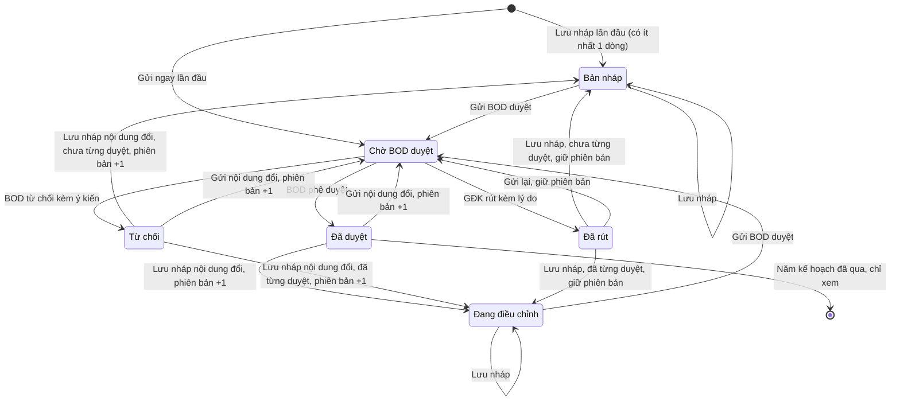

# muc-tieu-kinh-doanh — State Diagrams

> State diagram per entity của feature **muc-tieu-kinh-doanh**. Mỗi entity 1 section `## State: {Entity}`.

## State: Hồ sơ mục tiêu kinh doanh

**Related UC**: [[docs/muc-tieu-kinh-doanh/usecases/uc-lap-ho-so-muc-tieu.md]] · [[docs/muc-tieu-kinh-doanh/usecases/uc-gui-bod-duyet.md]] · [[docs/muc-tieu-kinh-doanh/usecases/uc-rut-ho-so.md]] · [[docs/muc-tieu-kinh-doanh/usecases/uc-bod-phe-duyet.md]] · [[docs/muc-tieu-kinh-doanh/usecases/uc-bod-tu-choi.md]]
**Related BR**: BR-muc-tieu-kinh-doanh-006, BR-muc-tieu-kinh-doanh-011, BR-muc-tieu-kinh-doanh-012, BR-muc-tieu-kinh-doanh-013, BR-muc-tieu-kinh-doanh-028, BR-muc-tieu-kinh-doanh-031, BR-muc-tieu-kinh-doanh-032

__Ghi chú trạng thái:__

| Trạng thái | Ý nghĩa | Vào bằng | Ra bằng |
|-----------|---------|----------|---------|
| Bản nháp | Đang soạn, hồ sơ chưa có phiên bản nào được duyệt. Nhãn xám | Lưu nháp lần đầu; Lưu nháp từ Từ chối / Đã rút khi chưa từng được duyệt | Gửi BOD duyệt; Lưu nháp (giữ nguyên) |
| Đang điều chỉnh | Đang soạn bản điều chỉnh của hồ sơ đã có phiên bản được duyệt; hiện song song "Mục tiêu chính thức — Phiên bản NN: X tr". Nhãn xanh dương nhạt | Lưu nháp từ Đã duyệt / Từ chối / Đã rút khi đã từng được duyệt | Gửi BOD duyệt; Lưu nháp (giữ nguyên) |
| Chờ BOD duyệt | Đã gửi, khoá sửa phía GĐK; BOD được quyết định; GĐK được rút. Nhãn vàng; tab BOD đếm số hồ sơ ở trạng thái này | Gửi BOD duyệt hợp lệ | BOD phê duyệt / từ chối; GĐK rút |
| Đã duyệt | BOD chấp nhận; tổng HĐ ký mới là mục tiêu chính thức của khối (nguồn BOD duyệt). Nhãn xanh lá | BOD phê duyệt | GĐK Lưu nháp hoặc Gửi nội dung đã đổi (phiên bản +1) |
| Từ chối | BOD không chấp nhận, có ý kiến bắt buộc; mục tiêu chính thức không đổi. Nhãn đỏ; GĐK thấy dải đỏ kèm ý kiến | BOD từ chối có ý kiến | GĐK Lưu nháp hoặc Gửi nội dung đã đổi (phiên bản +1) |
| Đã rút | GĐK rút trước khi BOD quyết định, có lý do bắt buộc; nội dung và phiên bản giữ nguyên; mục tiêu chính thức không đổi. Nhãn tím nhạt; GĐK thấy hộp "Đã rút: …" | GĐK xác nhận rút | GĐK Lưu nháp hoặc Gửi lại (giữ phiên bản) |

Mọi thao tác Lưu nháp / Gửi BOD duyệt / Rút chỉ thực hiện được khi hồ sơ thuộc khối của tài khoản và năm kế hoạch không nhỏ hơn năm hiện tại (BR-muc-tieu-kinh-doanh-006). Khi năm kế hoạch đã qua, hồ sơ ở bất kỳ trạng thái nào cũng chỉ còn xem phía GĐK; sơ đồ vẽ điểm kết thúc từ Đã duyệt là trường hợp thường gặp. Hồ sơ Chờ BOD duyệt thuộc năm đã qua: BOD vẫn phê duyệt / từ chối được (cùng các chuyển ChoDuyet → DaDuyet / TuChoi), GĐK không rút được (FR-muc-tieu-kinh-doanh-026, Phase H Q-46).

Thao tác ghi không thành công (E-muc-tieu-kinh-doanh-010) không tạo chuyển trạng thái nào: hồ sơ giữ trạng thái và phiên bản trước thao tác; riêng phê duyệt chỉ chuyển sang Đã duyệt khi ghi được cả mục tiêu chính thức (BR-muc-tieu-kinh-doanh-032). Thao tác trên hồ sơ vừa bị người khác đổi trạng thái (2 BOD cùng quyết định, GĐK rút sau khi BOD đã quyết định, BOD quyết định trên hồ sơ vừa rút, thao tác của GĐK khi năm kế hoạch vừa trở thành năm đã qua): hệ thống kiểm lại trạng thái tại lúc bấm, không thực hiện, không tạo chuyển trạng thái, báo E-muc-tieu-kinh-doanh-014 và nạp lại hồ sơ (Phase H Q-21).

### Invalid transitions

| From | To | Why not |
|---|---|---|
| Chờ BOD duyệt | Bản nháp / Đang điều chỉnh | Hồ sơ chờ duyệt khoá sửa; GĐK phải rút trước (BR-muc-tieu-kinh-doanh-006, BR-muc-tieu-kinh-doanh-012) |
| Đã duyệt / Từ chối | Chờ BOD duyệt (không đổi nội dung) | Nút Gửi BOD duyệt mờ khi nội dung giống bản BOD đã quyết định (BR-muc-tieu-kinh-doanh-011) |
| Bản nháp / Đang điều chỉnh (sau lưu điều chỉnh, nội dung đã sửa trở lại như bản BOD đã quyết định) | Chờ BOD duyệt | Nút Gửi BOD duyệt mờ; phiên bản giữ số mới, không lùi (BR-muc-tieu-kinh-doanh-011, Phase H Q-28) |
| Chờ BOD duyệt (năm đã qua) | Đã rút | GĐK chỉ xem hồ sơ năm đã qua (BR-muc-tieu-kinh-doanh-006, Phase H Q-46) |
| Đã rút | Đã duyệt / Từ chối | BOD chỉ quyết định hồ sơ Chờ BOD duyệt (BR-muc-tieu-kinh-doanh-013, BR-muc-tieu-kinh-doanh-028) |
| Bản nháp / Đang điều chỉnh | Đã rút | Chỉ rút được hồ sơ Chờ BOD duyệt (BR-muc-tieu-kinh-doanh-028) |
| Bất kỳ | (xoá hồ sơ) | Không có thao tác xoá hồ sơ; dữ liệu giữ vĩnh viễn (NFR-muc-tieu-kinh-doanh-008) |
