# phuong-an-kinh-doanh — Entity Relationship Diagram

> Scope: dữ liệu nghiệp vụ của PAKD một dự án — nội dung PAKD, phiên bản gửi duyệt, bản chụp lúc nộp, kế hoạch theo tháng sinh từ PAKD đã duyệt, hợp đồng ban đầu tạo từ PAKD, lịch sử và thông báo nhắc cập nhật hợp đồng. Thuộc tính khác của dự án thuộc `quan-ly-du-an-kinh-doanh`.

## Diagram

```mermaid
erDiagram
    DuAn ||--o| PhuongAnKinhDoanh : "PAKD dang ap dung"
    DuAn ||--o| PhuongAnKinhDoanh : "ban dieu chinh"
    DuAn ||--o{ PhienBanPakd : "cac lan gui duyet"
    PhuongAnKinhDoanh ||--o{ PhienBanPakd : "noi dung duoc gui duyet"
    PhienBanPakd ||--|| BanChupPakd : "ban chup luc nop"
    DuAn ||--o{ KeHoachThang : "ke hoach tu PAKD da duyet"
    DuAn ||--o| HopDong : "hop dong"
    DuAn ||--o{ LichSuDuAn : "ghi thao tac"
    DuAn ||--o{ ThongBaoNhacHopDong : "nhac cap nhat HD"
    PhuongAnKinhDoanh ||--o{ MocNghiemThu : "muc 3 Da ky"
    PhuongAnKinhDoanh ||--o{ KhoanMucChiPhi : "muc 4 Da ky"
    PhuongAnKinhDoanh ||--o{ GiaiDoanKeHoach : "muc 3 Chua ky"
    KhoanMucChiPhi ||--o{ ChiPhiThang : "gia tri theo thang"
    KhoanMucChiPhi ||--o{ TepDinhKem : "tep cua khoan muc"
    GiaiDoanKeHoach ||--o{ TepDinhKem : "tep cua giai doan"

    DuAn {
        string du_an_id PK "ma noi bo du an"
        string trang_thai "Cho duyet ma, Tu choi ma, Chua co PAKD, PAKD cho duyet, Dang thuc hien, Pending, Ket thuc, Da xoa"
        date han_lap_pakd "ngay cap ma hoac mo lai cong 30"
        number doanh_thu_du_kien "chi nhan tu PAKD da duyet"
        number chi_phi_sx_ke_hoach "chi nhan tu PAKD da duyet"
        number chi_phi_kd_ke_hoach "chi nhan tu PAKD da duyet"
        boolean da_ky_hop_dong "tu PAKD da duyet hoac P-03"
        date ngay_du_kien_ky "tu PAKD da duyet"
        date ngay_bat_dau "tu PAKD Da ky da duyet"
        date ngay_ket_thuc "ngay cuoi thang Ket thuc cua PAKD Da ky da duyet"
        number version "tang khi tao HD tu PAKD hoac luu P-03"
    }
    PhuongAnKinhDoanh {
        string phuong_an_kinh_doanh_id PK "khoa logic"
        string du_an_id FK "du an so huu"
        string vai_tro_ban "dang ap dung, dieu chinh, hoac dieu chinh da huy (luu lai)"
        string tinh_trang "Da ky hoac Chua ky"
        string so_hop_dong "Da ky"
        date ngay_ky_tren_hd "Da ky"
        date ngay_ky_thuc_te "Da ky"
        number gia_tri_hop_dong "Da ky, bat buoc khi gui"
        string thang_bat_dau "Da ky, bat buoc khi gui"
        string thang_ket_thuc "Da ky, bat buoc khi gui"
        string thang_du_kien_ky "Chua ky, bat buoc khi gui"
        number gia_tri_du_kien "Chua ky, bat buoc khi gui"
        number xac_suat "Chua ky, mac dinh 50"
        string danh_gia_rui_ro "Chua ky, bat buoc khi gui"
        string pham_vi "bat buoc khi gui"
        datetime luu_luc "lan luu cuoi"
        string luu_boi "nguoi luu cuoi"
    }
    PhienBanPakd {
        string phien_ban_id PK "khoa logic"
        string du_an_id FK "du an"
        string phuong_an_kinh_doanh_id FK "noi dung PAKD duoc gui"
        number so_phien_ban "so ban da duyet cong 1"
        date ngay_nop "ngay gui"
        string nguoi_nop "tai khoan va vai tro; ban sinh tu P-03 la nguoi luu P-03"
        string trang_thai "Cho CFO, Da duyet, Tu choi"
        date ngay_quyet_dinh "khi duyet hoac tu choi"
        string nguoi_quyet_dinh "ma vai tro CFO, hien thi"
        string tai_khoan_quyet_dinh "tai khoan nguoi quyet dinh"
        string y_kien "bat buoc khi tu choi"
        boolean la_dieu_chinh "ban dieu chinh"
        boolean sinh_tu_hop_dong "ban dieu chinh sinh khi luu P-03"
        boolean cap_nhat_theo_hd_sau_nop "noi dung doi theo HD sau khi nop"
        boolean ban_dieu_chinh_da_huy "tu choi roi bi huy, khong hien thi"
    }
    BanChupPakd {
        string ban_chup_id PK "khoa logic"
        string phien_ban_id FK "phien ban"
        datetime chup_luc "thoi diem nop"
        string noi_dung_pakd "toan bo noi dung PAKD luc nop, khong doi"
    }
    MocNghiemThu {
        string moc_id PK "khoa logic"
        string phuong_an_kinh_doanh_id FK "PAKD"
        string ten_moc "4 moc goi y"
        string thang "thang ghi nhan doanh thu"
        number phan_tram "toi da 100"
        number ty_le_thanh_toan "mac dinh 100, toi da 100"
        string thang_gui_ho_so "tuy chon"
        string dieu_kien "tuy chon"
        number so_ngay_cho "mac dinh 30"
    }
    KhoanMucChiPhi {
        string khoan_muc_id PK "khoa logic"
        string phuong_an_kinh_doanh_id FK "PAKD"
        string nhom "1 trong 6 nhom"
        string ten_khoan_muc "bat buoc neu co tien"
        string ket_qua_dau_ra "tuy chon, toi da 1000 ky tu"
    }
    ChiPhiThang {
        string khoan_muc_id FK "khoan muc"
        string thang PK "nam-thang"
        number gia_tri "VND"
    }
    GiaiDoanKeHoach {
        string giai_doan_id PK "khoa logic"
        string phuong_an_kinh_doanh_id FK "PAKD"
        string ten "giai doan"
        string tu_thang "thieu thi canh bao"
        string den_thang "truoc Tu thi canh bao"
        number dau_tu_sx "VND"
        number dau_tu_kd "VND"
        string ket_qua_dau_ra "tuy chon, toi da 1000 ky tu"
    }
    TepDinhKem {
        string tep_id PK "khoa logic"
        string khoan_muc_id FK "khoan muc, neu la tep cua khoan muc"
        string giai_doan_id FK "giai doan, neu la tep cua giai doan"
        string ten_tep "ten tep"
        number dung_luong "toi da 20 MB"
        string dinh_dang "pdf, doc, docx, xls, xlsx, jpg, png"
    }
    KeHoachThang {
        string du_an_id FK "du an"
        string thang PK "nam-thang"
        number doanh_thu "theo moc"
        number thu "theo thang thu tien"
        number chi_sx "theo khoan muc hoac giai doan"
        number chi_kd "theo khoan muc hoac giai doan"
        number khoi_luong "0 khi sinh tu PAKD"
    }
    HopDong {
        string hop_dong_id PK "khoa logic"
        string du_an_id FK "du an"
        string so_hop_dong "so HD"
        date ngay_ky "ngay ky"
        number gia_tri "VND"
        date tu_ngay "thoi han"
        date den_ngay "thoi han"
        string nguon "P-03 hoac tao tu PAKD Vn"
    }
    LichSuDuAn {
        string lich_su_id PK "khoa logic"
        string du_an_id FK "du an"
        datetime thoi_gian "luc ghi, gio Viet Nam"
        string nguoi_thuc_hien "tai khoan va vai tro"
        string thao_tac "Nop PAKD, CFO duyet PAKD, Tao hop dong tu PAKD Vn, Cap nhat PAKD theo hop dong"
        string ghi_chu "tom tat"
    }
    ThongBaoNhacHopDong {
        string thong_bao_id PK "khoa logic"
        string du_an_id FK "du an"
        string nguoi_nhan "nguoi lap PAKD hoac GDK khoi"
        datetime gui_luc "01 thang du kien ky roi moi 7 ngay"
        string noi_dung "Du an ma du kien ky HD thang - cap nhat hop dong"
    }
```

## Entity Reference

| Entity | Purpose | Key attributes |
|--------|---------|----------------|
| DuAn (Dự án — phần PAKD) | Dự án kinh doanh; chỉ nhận số liệu kế hoạch từ PAKD **đã được Kế toán duyệt** | trạng thái (đủ 8 trạng thái của `quan-ly-du-an-kinh-doanh`, gồm Chờ duyệt mã, Từ chối mã, Đã xoá), Hạn lập PAKD, doanh thu dự kiến, chi phí SX / KD kế hoạch, cờ đã ký, ngày dự kiến ký, ngày bắt đầu / kết thúc, Version |
| PhuongAnKinhDoanh (Nội dung PAKD) | Nội dung PAKD theo mẫu Excel 2 sheet; một dự án có tối đa 1 bản đang áp dụng và 1 bản điều chỉnh đang mở; bản điều chỉnh bị huỷ vẫn được lưu lại (không xoá cứng) | vai trò bản, tình trạng, thông tin HĐ / dự kiến, kỳ, phạm vi, rủi ro, xác suất, lưu lúc / bởi |
| PhienBanPakd (Phiên bản PAKD) | Mỗi lần gửi duyệt của một nội dung PAKD; mang kết quả quyết định của Kế toán (mỗi phiên bản chỉ nhận 1 quyết định) | nội dung PAKD được gửi, số V (chỉ tăng khi duyệt, không trùng), ngày / người nộp, trạng thái, ngày quyết định, người quyết định (mã vai trò hiển thị + tài khoản), ý kiến, cờ điều chỉnh, cờ sinh từ hợp đồng, dấu cập nhật theo HĐ sau khi nộp, cờ bản điều chỉnh đã huỷ |
| BanChupPakd (Bản chụp PAKD lúc nộp) | Nội dung PAKD tại thời điểm nộp, không đổi sau đó; mốc so sánh trên P-04 khi nội dung được cập nhật theo hợp đồng | phiên bản, thời điểm chụp, nội dung |
| MocNghiemThu (Mốc nghiệm thu) | Mốc ghi nhận doanh thu và thu tiền (Đã ký) | tên, tháng, %, tỷ lệ thanh toán, tháng gửi hồ sơ, điều kiện, số ngày chờ |
| KhoanMucChiPhi (Khoản mục chi phí) | Dòng chi phí kế hoạch (Đã ký) | nhóm (6 nhóm), tên, kết quả đầu ra |
| ChiPhiThang (Chi phí tháng) | Giá trị chi dự kiến của 1 khoản mục trong 1 tháng | tháng, giá trị |
| GiaiDoanKeHoach (Giai đoạn kế hoạch) | Mốc kế hoạch và mục tiêu (Chưa ký) | tên, từ, đến, đầu tư SX, KD, kết quả đầu ra |
| TepDinhKem (Tệp đính kèm) | Tệp đính kèm của một khoản mục chi phí hoặc một giai đoạn; mỗi dòng có 0–n tệp | tên tệp, dung lượng (≤ 20 MB), định dạng (BR-phuong-an-kinh-doanh-048) |
| KeHoachThang (Kế hoạch theo tháng) | Kế hoạch tháng của dự án, thay toàn bộ khi Kế toán duyệt PAKD; nguồn cho báo cáo | tháng, doanh thu, thu, chi SX, chi KD, khối lượng |
| HopDong (Hợp đồng) | Hợp đồng của dự án — ghi qua P-03, hoặc tạo ban đầu từ PAKD Đã ký khi duyệt nếu dự án chưa có | số, ngày ký, giá trị, thời hạn, nguồn |
| LichSuDuAn (Lịch sử dự án) | Nhật ký thao tác, giữ vĩnh viễn | thời gian, người, thao tác, ghi chú |
| ThongBaoNhacHopDong (Thông báo nhắc cập nhật HĐ) | Thông báo nhắc người lập PAKD và GĐK khối cập nhật hợp đồng cho PAKD Chưa ký đã duyệt (FR-phuong-an-kinh-doanh-039; kênh chờ OQ-36) | dự án, người nhận, thời điểm gửi, nội dung |

## Quan hệ

| Từ | Đến | Bản số | Ý nghĩa |
|----|-----|--------|---------|
| DuAn | PhuongAnKinhDoanh (đang áp dụng) | 1 – 0..1 | PAKD đã lưu / đã gửi / đã duyệt đang dùng |
| DuAn | PhuongAnKinhDoanh (điều chỉnh) | 1 – 0..1 | Bản điều chỉnh nháp / chờ duyệt / bị từ chối (kể cả bản sinh khi lưu P-03) |
| DuAn | PhienBanPakd | 1 – 0..n | Các lần gửi, chỉ thêm không xoá |
| PhuongAnKinhDoanh | PhienBanPakd | 1 – 0..n | Nội dung PAKD được gửi ở phiên bản đó (bản lần đầu / làm lại, hoặc bản điều chỉnh) |
| PhienBanPakd | BanChupPakd | 1 – 1 | Mỗi lần gửi có đúng 1 bản chụp |
| DuAn | KeHoachThang | 1 – 0..n | Thay toàn bộ khi Kế toán duyệt PAKD |
| DuAn | HopDong | 1 – 0..1 | Thông tin hợp đồng |
| DuAn | LichSuDuAn | 1 – 1..n | Ghi mọi thao tác |
| DuAn | ThongBaoNhacHopDong | 1 – 0..n | Các lần nhắc cập nhật hợp đồng |
| PhuongAnKinhDoanh | MocNghiemThu | 1 – 0..n | Dùng khi Đã ký |
| PhuongAnKinhDoanh | KhoanMucChiPhi | 1 – 0..n | Dùng khi Đã ký |
| PhuongAnKinhDoanh | GiaiDoanKeHoach | 1 – 0..n | Dùng khi Chưa ký |
| KhoanMucChiPhi | ChiPhiThang | 1 – 0..n | Ô tháng có giá trị khác 0 |
| KhoanMucChiPhi | TepDinhKem | 1 – 0..n | Tệp của khoản mục |
| GiaiDoanKeHoach | TepDinhKem | 1 – 0..n | Tệp của giai đoạn |

## Notes & Assumptions

- Các khoá `*_id` là khoá logic để biểu diễn quan hệ nghiệp vụ, không phải thiết kế cơ sở dữ liệu.
- Trước khi Kế toán duyệt, số liệu kế hoạch trên DuAn không lấy từ PAKD (BR-phuong-an-kinh-doanh-026); KeHoachThang chỉ thay khi duyệt.
- Bản chụp lưu mỗi lần gửi (BR-phuong-an-kinh-doanh-044); phần so sánh trên P-04 chỉ hiện khi phiên bản có dấu "cập nhật theo HĐ sau khi nộp" (FR-phuong-an-kinh-doanh-043).
- Phiên bản bị từ chối của bản điều chỉnh đã huỷ được giữ trong danh sách phiên bản nhưng không còn là phiên bản hiển thị (BR-phuong-an-kinh-doanh-042). Nội dung bản điều chỉnh bị huỷ được lưu lại (vai trò bản "điều chỉnh đã huỷ"), chưa có màn xem; tra cứu qua bộ phận vận hành (FR-phuong-an-kinh-doanh-028, Phase H — Q-29).
- Cả 2 tình trạng dùng chung 1 cấu trúc nội dung: dữ liệu của tình trạng không chọn vẫn được giữ.
- Tệp đính kèm tách thành TepDinhKem (1 dòng chi phí / giai đoạn có 0–n tệp); giới hạn dung lượng / định dạng theo BR-phuong-an-kinh-doanh-048; cơ chế lưu nội dung tệp chờ OQ-5 (bản demo chỉ lưu tên tệp).
- Phiên bản lưu cả mã vai trò (hiển thị) và tài khoản người quyết định (BR-phuong-an-kinh-doanh-031).
- ThongBaoNhacHopDong: người nhận = người lập PAKD + GĐK khối; lần đầu ngày 01 tháng dự kiến ký, lặp mỗi 7 ngày tới khi lưu HĐ (BR-phuong-an-kinh-doanh-019, Phase H — Q-54); kênh gửi chờ OQ-36.
- Mọi dữ liệu trên giữ vĩnh viễn, không xoá cứng (NFR-phuong-an-kinh-doanh-008).
