# Phương án kinh doanh (PAKD) — Flows

## Flow: F1 — Lập và gửi PAKD lần đầu / làm lại
__Trigger__: SM / GĐK mở dự án trạng thái "Chưa có PAKD" (mới cấp mã hoặc bị từ chối)
__Related UC__: [[docs/phuong-an-kinh-doanh/usecases/uc-lap-gui-pakd.md]]
__Related FR__: FR-phuong-an-kinh-doanh-002, FR-phuong-an-kinh-doanh-011, FR-phuong-an-kinh-doanh-012, FR-phuong-an-kinh-doanh-013, FR-phuong-an-kinh-doanh-014, FR-phuong-an-kinh-doanh-015, FR-phuong-an-kinh-doanh-016, FR-phuong-an-kinh-doanh-017, FR-phuong-an-kinh-doanh-019, FR-phuong-an-kinh-doanh-020, FR-phuong-an-kinh-doanh-021, FR-phuong-an-kinh-doanh-022, FR-phuong-an-kinh-doanh-023, FR-phuong-an-kinh-doanh-038 · Errors: E-phuong-an-kinh-doanh-001…E-phuong-an-kinh-doanh-010, E-phuong-an-kinh-doanh-012, E-phuong-an-kinh-doanh-013, E-phuong-an-kinh-doanh-014, E-phuong-an-kinh-doanh-016, E-phuong-an-kinh-doanh-017, E-phuong-an-kinh-doanh-018, E-phuong-an-kinh-doanh-019, E-phuong-an-kinh-doanh-020, E-phuong-an-kinh-doanh-021, E-phuong-an-kinh-doanh-022

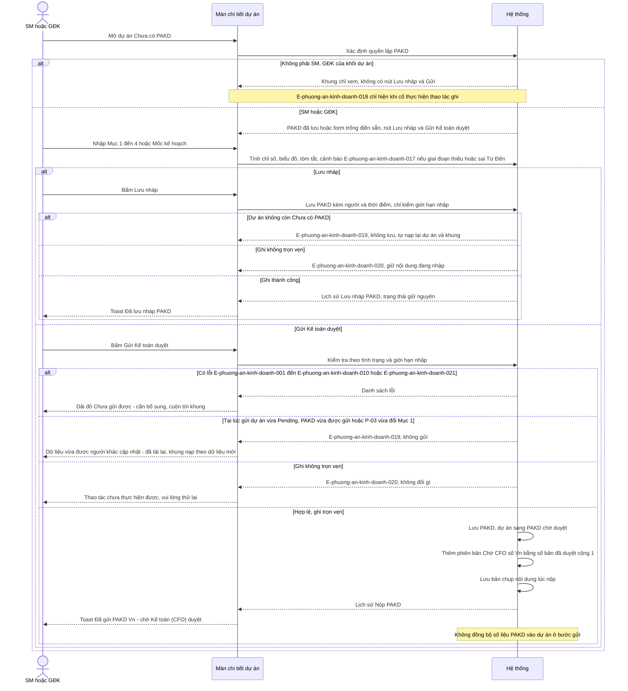

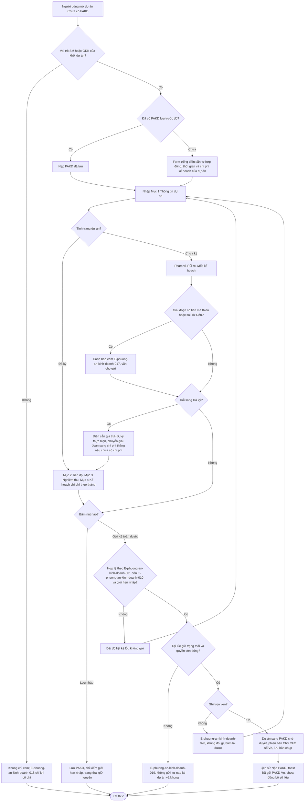

## Flow: F2 — Kế toán duyệt hoặc từ chối PAKD lần đầu
__Trigger__: Kế toán bấm link Duyệt (danh sách) hoặc nút Duyệt / Từ chối PAKD (dòng thông báo)
__Related UC__: [[docs/phuong-an-kinh-doanh/usecases/uc-duyet-pakd.md]]
__Related FR__: FR-phuong-an-kinh-doanh-029, FR-phuong-an-kinh-doanh-030, FR-phuong-an-kinh-doanh-031, FR-phuong-an-kinh-doanh-032, FR-phuong-an-kinh-doanh-035, FR-phuong-an-kinh-doanh-036, FR-phuong-an-kinh-doanh-038, FR-phuong-an-kinh-doanh-043, FR-phuong-an-kinh-doanh-045 · Errors: E-phuong-an-kinh-doanh-011, E-phuong-an-kinh-doanh-015, E-phuong-an-kinh-doanh-023, E-phuong-an-kinh-doanh-018, E-phuong-an-kinh-doanh-019, E-phuong-an-kinh-doanh-020, E-phuong-an-kinh-doanh-021

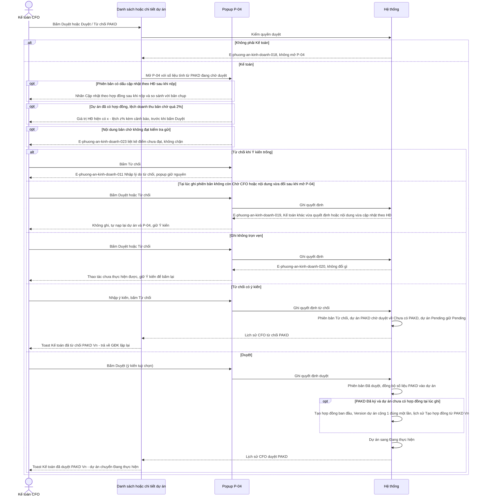

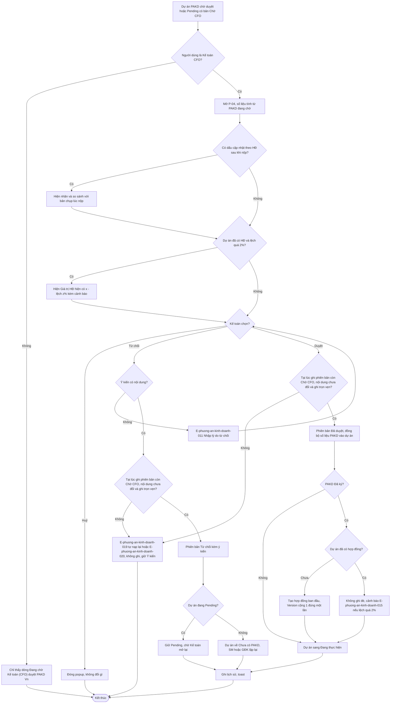

## Flow: F3 — Điều chỉnh PAKD đã duyệt
__Trigger__: SM / GĐK bấm Sửa PAKD (góc khung) hoặc Sửa PAKD / Tiếp tục sửa PAKD (dòng thông báo)
__Related UC__: [[docs/phuong-an-kinh-doanh/usecases/uc-dieu-chinh-pakd.md]]
__Related FR__: FR-phuong-an-kinh-doanh-020, FR-phuong-an-kinh-doanh-024, FR-phuong-an-kinh-doanh-025, FR-phuong-an-kinh-doanh-026, FR-phuong-an-kinh-doanh-027, FR-phuong-an-kinh-doanh-028, FR-phuong-an-kinh-doanh-033, FR-phuong-an-kinh-doanh-034, FR-phuong-an-kinh-doanh-038, FR-phuong-an-kinh-doanh-047 · Errors: E-phuong-an-kinh-doanh-001…E-phuong-an-kinh-doanh-010, E-phuong-an-kinh-doanh-018, E-phuong-an-kinh-doanh-019, E-phuong-an-kinh-doanh-020, E-phuong-an-kinh-doanh-021

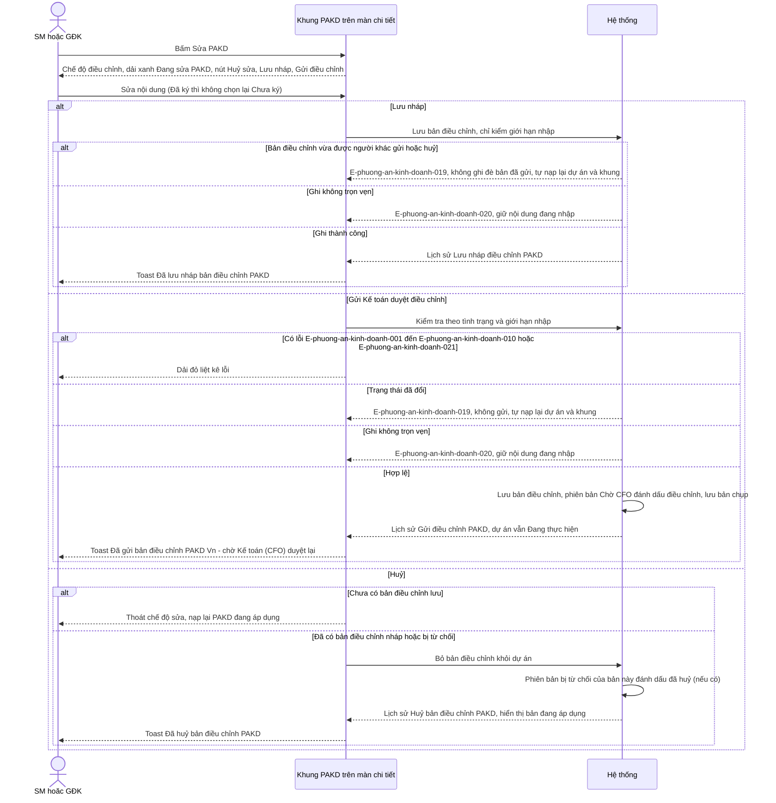

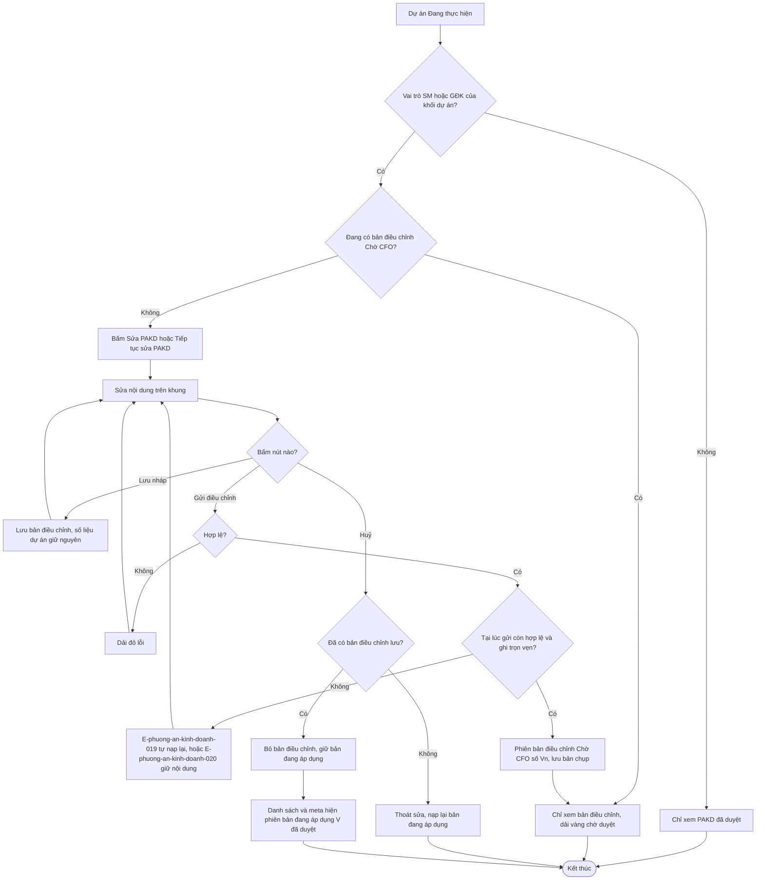

## Flow: F4 — Kế toán duyệt hoặc từ chối bản điều chỉnh
__Trigger__: Kế toán bấm link Duyệt điều chỉnh (danh sách) hoặc nút Duyệt / Từ chối điều chỉnh (dòng thông báo)
__Related UC__: [[docs/phuong-an-kinh-doanh/usecases/uc-duyet-dieu-chinh-pakd.md]]
__Related FR__: FR-phuong-an-kinh-doanh-029, FR-phuong-an-kinh-doanh-030, FR-phuong-an-kinh-doanh-031, FR-phuong-an-kinh-doanh-032, FR-phuong-an-kinh-doanh-043, FR-phuong-an-kinh-doanh-045 · Errors: E-phuong-an-kinh-doanh-011, E-phuong-an-kinh-doanh-015, E-phuong-an-kinh-doanh-023, E-phuong-an-kinh-doanh-018, E-phuong-an-kinh-doanh-019, E-phuong-an-kinh-doanh-020

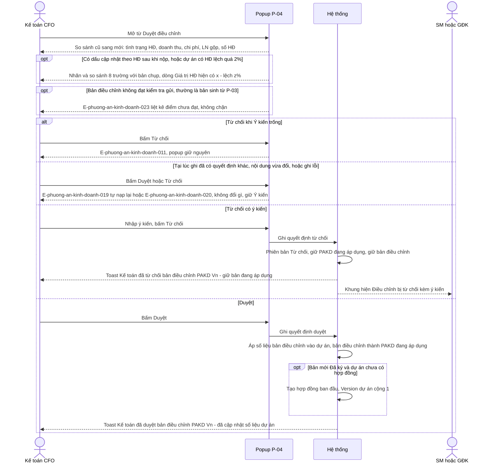

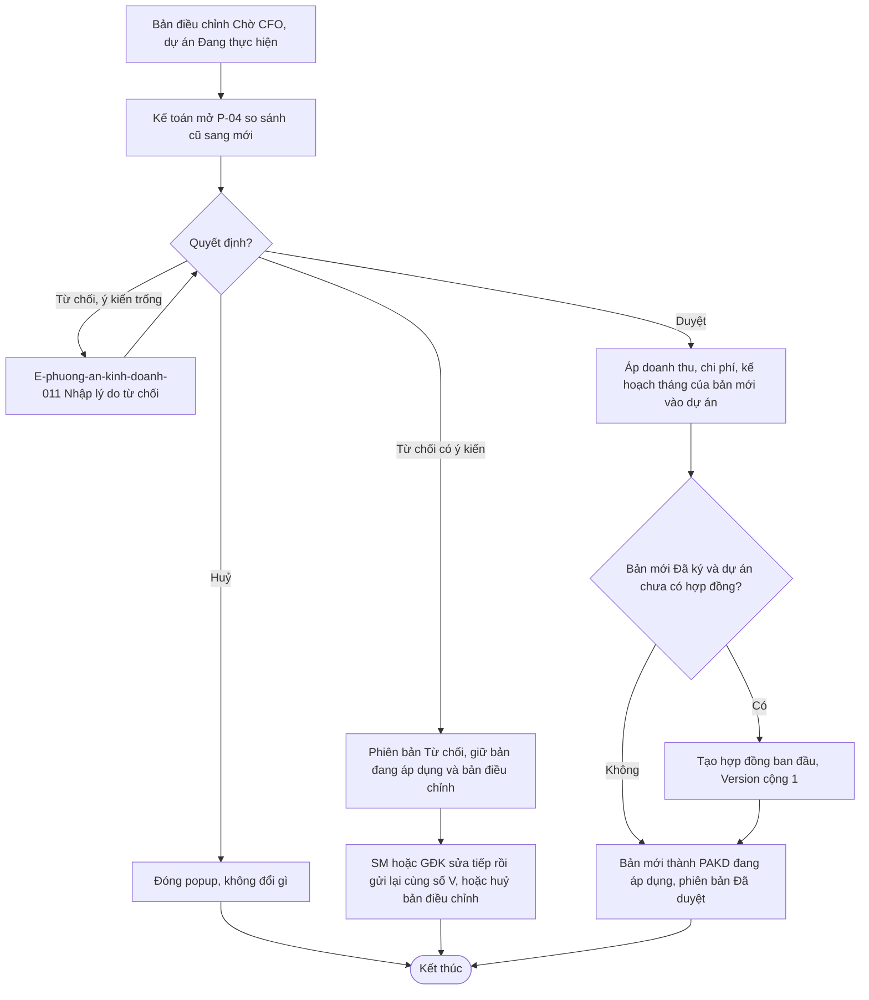

## Flow: F5 — Đồng bộ hợp đồng (P-03) xuống PAKD
__Trigger__: Người dùng lưu popup P-03 (thuộc `quan-ly-du-an-kinh-doanh`)
__Related UC__: [[docs/phuong-an-kinh-doanh/usecases/uc-dong-bo-hop-dong-vao-pakd.md]]
__Related FR__: FR-phuong-an-kinh-doanh-003, FR-phuong-an-kinh-doanh-037, FR-phuong-an-kinh-doanh-038, FR-phuong-an-kinh-doanh-041, FR-phuong-an-kinh-doanh-042, FR-phuong-an-kinh-doanh-043, FR-phuong-an-kinh-doanh-046 · Errors: E-phuong-an-kinh-doanh-018, E-phuong-an-kinh-doanh-019, E-phuong-an-kinh-doanh-020, E-phuong-an-kinh-doanh-023, E-phuong-an-kinh-doanh-024

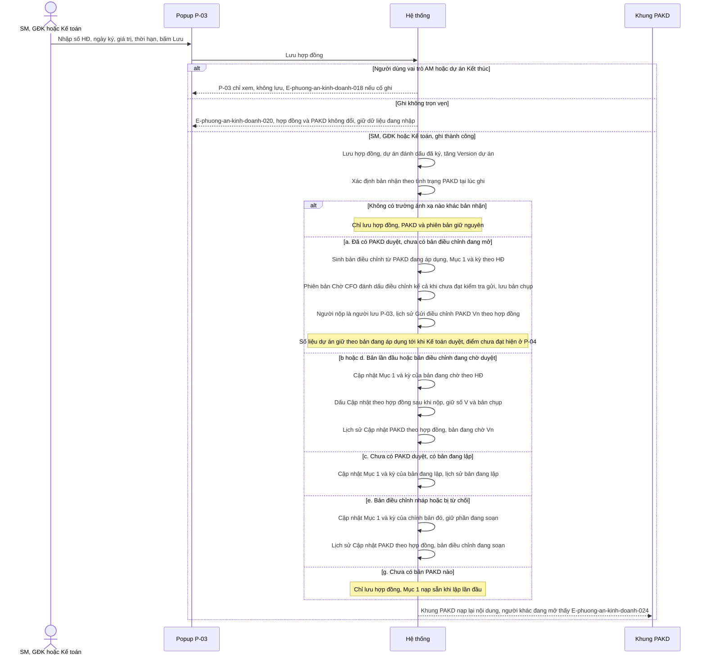

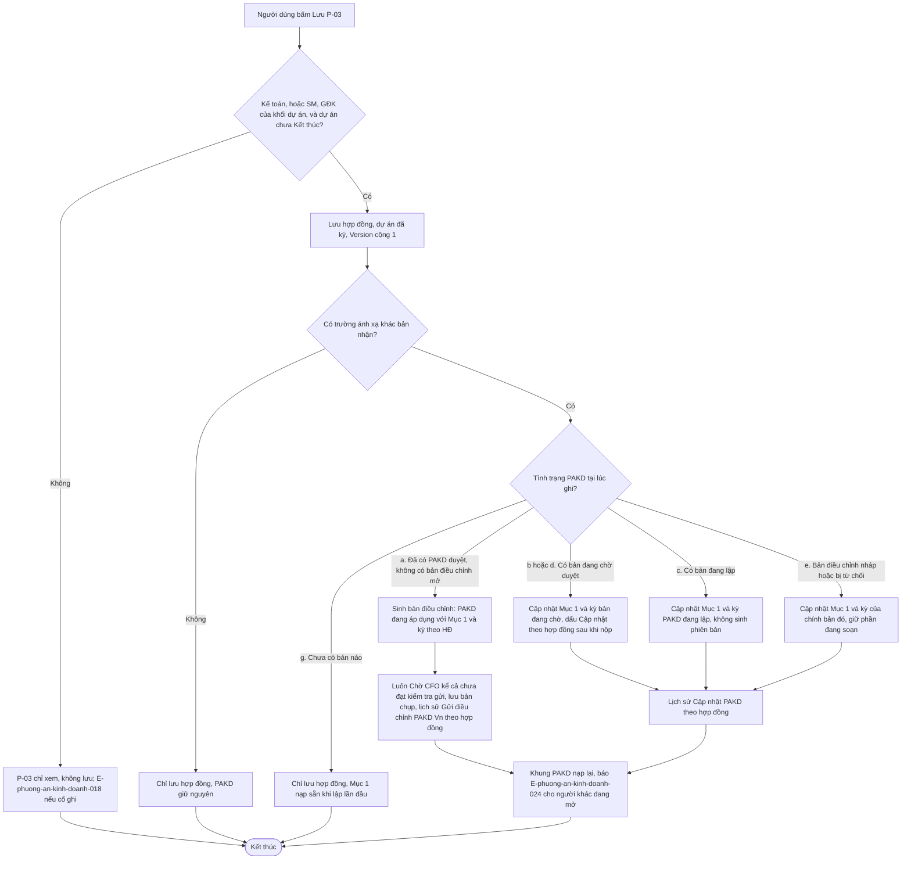

## Flow: F6 — Nhắc cập nhật hợp đồng
__Trigger__: Hằng ngày theo giờ Việt Nam, hệ thống xét các dự án có PAKD đang áp dụng (đã duyệt) tình trạng Chưa ký mà chưa có hợp đồng
__Related UC__: [[docs/phuong-an-kinh-doanh/usecases/uc-nhac-cap-nhat-hop-dong.md]]
__Related FR__: FR-phuong-an-kinh-doanh-018, FR-phuong-an-kinh-doanh-036, FR-phuong-an-kinh-doanh-039, FR-phuong-an-kinh-doanh-040 · Errors: —

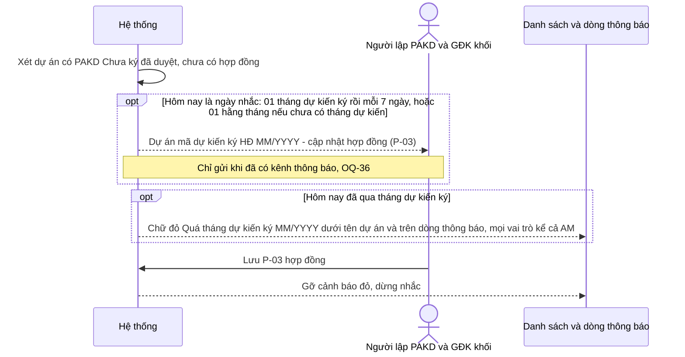

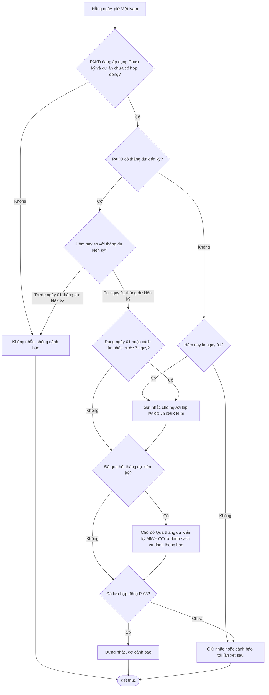

## Notes

- Thời điểm "hôm nay" ở mọi flow theo Asia/Ho_Chi_Minh, đếm ngày lịch (NFR-phuong-an-kinh-doanh-005).
- Kiểm quyền (E-phuong-an-kinh-doanh-018 — "Bạn không có quyền thực hiện thao tác này.") chạy ở mọi thao tác ghi, không chỉ ẩn nút (NFR-phuong-an-kinh-doanh-007); vai trò chỉ được xem thấy khung chỉ xem, E-phuong-an-kinh-doanh-018 chỉ hiện khi cố ghi; cơ chế tài khoản chờ OQ-5.
- Mọi thao tác ghi kiểm lại quyền và trạng thái tại lúc thực hiện (NFR-phuong-an-kinh-doanh-011, E-phuong-an-kinh-doanh-019) và ghi trọn vẹn (NFR-phuong-an-kinh-doanh-010, E-phuong-an-kinh-doanh-020); nhánh lỗi vẽ ở F1–F5, áp tương tự cho Huỷ bản điều chỉnh. E-phuong-an-kinh-doanh-019 báo "Dữ liệu vừa được người khác cập nhật — đã tải lại, vui lòng xem lại." và tự nạp lại dự án (khung nạp theo dữ liệu mới, P-04 giữ Ý kiến); E-phuong-an-kinh-doanh-020 giữ nội dung đang nhập để bấm lại (Phase H — Q-21).
- F5: 7 nhánh (a)–(g) theo BR-phuong-an-kinh-doanh-032, khớp `quan-ly-du-an-kinh-doanh` BR-quan-ly-du-an-kinh-doanh-029; chỉ đồng bộ khi có trường khác (BR-phuong-an-kinh-doanh-046). Nhánh (a): bản điều chỉnh sinh ra luôn vào "Chờ CFO" kể cả khi không đạt kiểm tra gửi, P-04 liệt kê điểm chưa đạt (E-phuong-an-kinh-doanh-023) (Phase H — Q-25); người nộp = người lưu P-03, lịch sử "Gửi điều chỉnh PAKD V{n} (theo hợp đồng)" (🔶 quyết định thay người dùng trong review — cần xác nhận). P-03 ghi sau lần Gửi lần đầu thì đi nhánh (b); P-03 ghi trước thì lần Gửi bị E-phuong-an-kinh-doanh-019.
- F2 / F4: nội dung bản đang chờ đổi trong lúc P-04 đang mở → Duyệt / Từ chối bị từ chối (E-phuong-an-kinh-doanh-019), P-04 nạp lại (FR-phuong-an-kinh-doanh-043, Phase H — Q-32).
- Khung PAKD tự nạp lại khi dữ liệu dự án đổi; nạp lại do người khác thì hiện E-phuong-an-kinh-doanh-024 (FR-phuong-an-kinh-doanh-003, Phase H — Q-38).
- Dự án Kết thúc khi còn bản điều chỉnh nháp / bị từ chối: hộp xác nhận Kết thúc báo trước "Dự án còn bản điều chỉnh PAKD chưa gửi — bản này sẽ bị huỷ."; bản điều chỉnh tự huỷ (nội dung được lưu lại), lịch sử "Huỷ bản điều chỉnh PAKD (Kết thúc dự án)" (FR-phuong-an-kinh-doanh-047, Phase H — Q-23, Q-29).
- F6: tác vụ hằng ngày xong trước 06:00, tự bù ngày lỡ, không nhắc trùng (NFR-phuong-an-kinh-doanh-012); người nhận, lịch nhắc và nội dung theo FR-phuong-an-kinh-doanh-039 / BR-phuong-an-kinh-doanh-019 (Phase H — Q-54); kênh gửi chờ OQ-36.
- F6: cảnh báo đỏ chỉ bật khi đã qua hết tháng dự kiến ký (BR-phuong-an-kinh-doanh-043), hiện cả với AM (Phase H — Q-53); có hợp đồng thì cả nhắc lẫn cảnh báo dừng.
