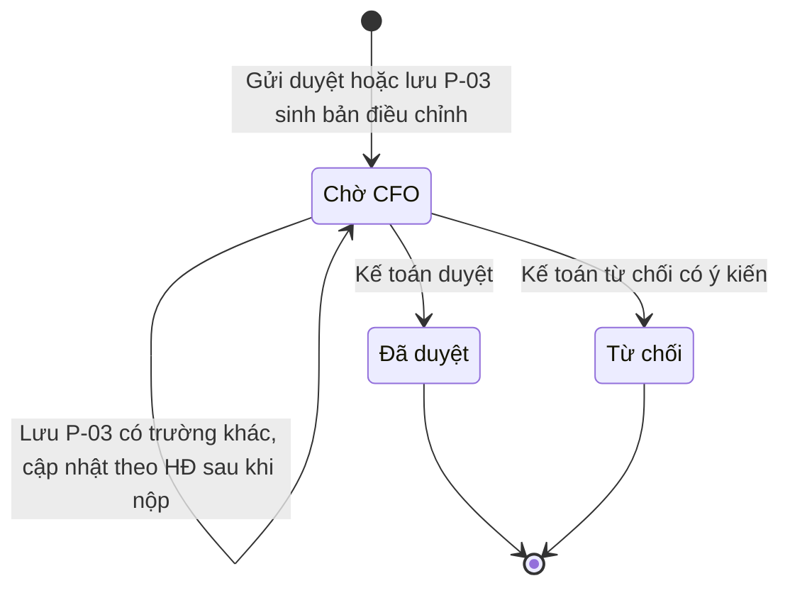
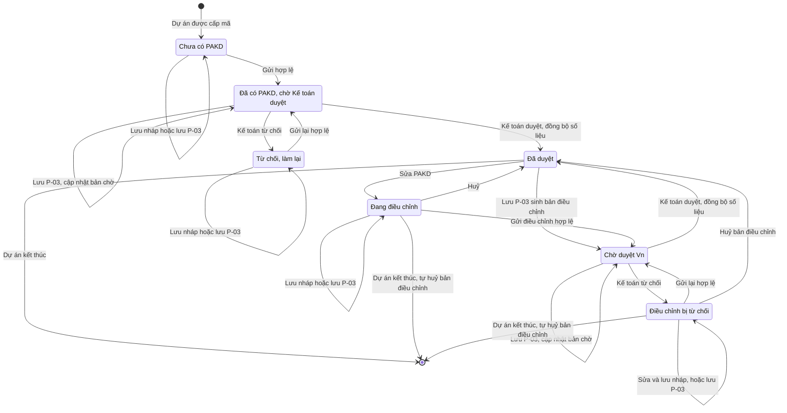
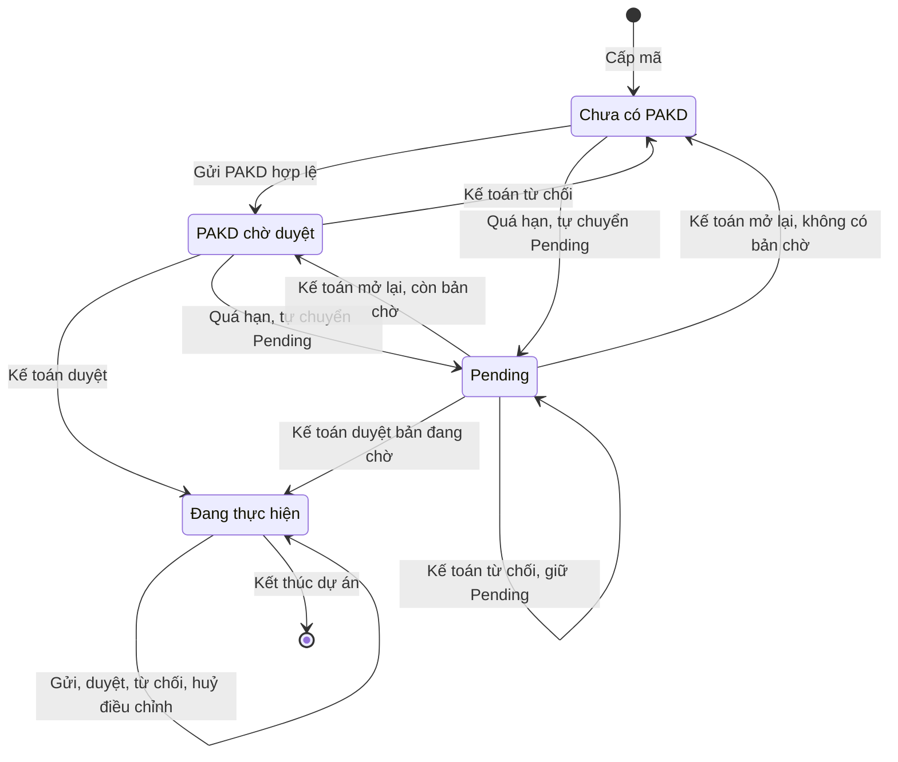

# phuong-an-kinh-doanh — State Diagrams

> State diagram per entity của feature **phuong-an-kinh-doanh**. Trạng thái **dự án** do feature `quan-ly-du-an-kinh-doanh` sở hữu; ở đây chỉ vẽ phần chuyển trạng thái dự án do PAKD kích hoạt.

## State: Phiên bản PAKD

**Related UC**: [[docs/phuong-an-kinh-doanh/usecases/uc-lap-gui-pakd.md]] · [[docs/phuong-an-kinh-doanh/usecases/uc-duyet-pakd.md]] · [[docs/phuong-an-kinh-doanh/usecases/uc-duyet-dieu-chinh-pakd.md]] · [[docs/phuong-an-kinh-doanh/usecases/uc-dong-bo-hop-dong-vao-pakd.md]]
**Related BR**: BR-phuong-an-kinh-doanh-025, BR-phuong-an-kinh-doanh-032, BR-phuong-an-kinh-doanh-042, BR-phuong-an-kinh-doanh-044, BR-phuong-an-kinh-doanh-046

**Ghi chú trạng thái:**

| Trạng thái | Ý nghĩa | Vào bằng | Ra bằng |
|-----------|---------|----------|---------|
| Chờ CFO | Phiên bản đã gửi, chờ Kế toán (CFO); số V = số bản đã duyệt + 1, không trùng kể cả khi gửi đồng thời; có bản chụp lúc nộp; có thể là bản lần đầu, bản điều chỉnh do SM / GĐK gửi, hoặc bản điều chỉnh sinh khi lưu P-03 — bản này luôn vào Chờ CFO kể cả khi không đạt kiểm tra gửi, P-04 liệt kê điểm chưa đạt (FR-phuong-an-kinh-doanh-041, Phase H — Q-25); chỉ nhận đúng 1 quyết định (NFR-phuong-an-kinh-doanh-011) | Gửi Kế toán duyệt / Gửi điều chỉnh (FR-phuong-an-kinh-doanh-023, FR-phuong-an-kinh-doanh-027); lưu P-03 khi đã có PAKD được duyệt và chưa có bản điều chỉnh đang mở (FR-phuong-an-kinh-doanh-041) | Kế toán Duyệt / Từ chối |
| Chờ CFO — cập nhật theo HĐ sau khi nộp (chuyển vào chính nó) | Bản lần đầu hoặc bản điều chỉnh đang chờ được cập nhật Mục 1 và kỳ theo hợp đồng; phiên bản mang dấu "Cập nhật theo hợp đồng sau khi nộp", giữ số và bản chụp; chỉ khi có ít nhất 1 trường ánh xạ khác (BR-phuong-an-kinh-doanh-046); nhánh bản điều chỉnh đang chờ áp như bản lần đầu. Nội dung đổi trong lúc P-04 đang mở thì quyết định bị từ chối, P-04 nạp lại (FR-phuong-an-kinh-doanh-043) (Đã chốt Phase H — Q-24, Q-32) | Lưu P-03 (FR-phuong-an-kinh-doanh-042, nhánh (b) / (d)) | — |
| Đã duyệt | Kế toán đồng ý; số liệu PAKD được đồng bộ vào dự án tại thời điểm này | Duyệt (FR-phuong-an-kinh-doanh-031) | — (cuối) |
| Từ chối | Kế toán không đồng ý, ý kiến bắt buộc. Gửi lại tạo phiên bản MỚI cùng số V. Nếu là bản điều chỉnh và bị huỷ sau đó → đánh dấu đã huỷ, không còn là phiên bản hiển thị (BR-phuong-an-kinh-doanh-042) | Từ chối có ý kiến (FR-phuong-an-kinh-doanh-032) | — (cuối) |

### Invalid transitions

| From | To | Why not |
|---|---|---|
| Đã duyệt | Chờ CFO | Phiên bản đã quyết định không mở lại; thay đổi tiếp phải qua bản điều chỉnh (phiên bản mới) |
| Từ chối | Chờ CFO | Gửi lại tạo phiên bản mới cùng số, không sửa trạng thái phiên bản cũ |
| Từ chối | Đã duyệt | Kế toán chỉ quyết định phiên bản mới nhất đang "Chờ CFO" |
| Chờ CFO | Từ chối (không ý kiến) | Ý kiến bắt buộc khi từ chối (E-phuong-an-kinh-doanh-011) |
| Đã duyệt / Từ chối | Quyết định lần hai | Mỗi phiên bản "Chờ CFO" chỉ nhận 1 quyết định; Kế toán thứ hai quyết định đồng thời bị từ chối (E-phuong-an-kinh-doanh-019) |

## State: Trạng thái PAKD trên khung (vòng đời PAKD của dự án)

**Related UC**: [[docs/phuong-an-kinh-doanh/usecases/uc-xem-pakd.md]] · [[docs/phuong-an-kinh-doanh/usecases/uc-dieu-chinh-pakd.md]]
**Related BR**: BR-phuong-an-kinh-doanh-003, BR-phuong-an-kinh-doanh-026, BR-phuong-an-kinh-doanh-029, BR-phuong-an-kinh-doanh-032, BR-phuong-an-kinh-doanh-037, BR-phuong-an-kinh-doanh-046

> Nhãn suy ra từ trạng thái dự án + phiên bản mới nhất + bản điều chỉnh (FR-phuong-an-kinh-doanh-005), không phải trường lưu riêng.

**Ghi chú trạng thái:**

| Trạng thái | Ý nghĩa | Vào bằng | Ra bằng |
|-----------|---------|----------|---------|
| Chưa có PAKD | Chưa có phiên bản nào (kể cả đã lưu nháp); SM / GĐK nhập được; lưu P-03 cập nhật bản đang lập (FR-phuong-an-kinh-doanh-037); dự án chưa có số liệu từ PAKD | Dự án được cấp mã | Gửi hợp lệ |
| Đã có PAKD · chờ Kế toán duyệt | Phiên bản lần đầu "Chờ CFO"; không ai sửa; lưu P-03 cập nhật Mục 1 bản chờ + dấu "Cập nhật theo hợp đồng sau khi nộp" (FR-phuong-an-kinh-doanh-042); dự án chưa có số liệu từ PAKD | Gửi / gửi lại | Kế toán Duyệt / Từ chối |
| Từ chối — làm lại | Phiên bản mới nhất "Từ chối", dự án "Chưa có PAKD"; Thời gian còn lại đếm tiếp (BR-phuong-an-kinh-doanh-005); gửi lại giữ số V | Kế toán từ chối lần đầu (dự án không Pending) | Gửi lại |
| Đã duyệt | PAKD đang áp dụng; số liệu dự án khớp bản này | Kế toán duyệt / Huỷ / Huỷ bản điều chỉnh | Sửa PAKD / lưu P-03 có trường khác (nhánh (a)) / dự án kết thúc |
| Đang điều chỉnh | SM / GĐK đang mở sửa hoặc có bản điều chỉnh nháp; số liệu dự án vẫn theo bản đã duyệt; lưu P-03 cập nhật Mục 1 và kỳ của bản nháp, giữ phần đang soạn (FR-phuong-an-kinh-doanh-046) | Sửa PAKD | Huỷ / Gửi điều chỉnh / dự án kết thúc → hộp xác nhận Kết thúc báo trước "Dự án còn bản điều chỉnh PAKD chưa gửi — bản này sẽ bị huỷ.", bản điều chỉnh tự huỷ (nội dung được lưu lại), lịch sử "Huỷ bản điều chỉnh PAKD (Kết thúc dự án)" (FR-phuong-an-kinh-doanh-047) (Đã chốt Phase H — Q-23, Q-29) |
| Chờ duyệt V{n} | Bản điều chỉnh "Chờ CFO" (SM / GĐK gửi hoặc sinh khi lưu P-03); chỉ xem; lưu P-03 có trường khác cập nhật Mục 1 + dấu "Cập nhật theo hợp đồng sau khi nộp" (FR-phuong-an-kinh-doanh-042 (d)); dự án không kết thúc được | Gửi điều chỉnh / lưu P-03 khi đã có PAKD được duyệt | Kế toán Duyệt / Từ chối |
| Điều chỉnh bị từ chối | Bản điều chỉnh mới nhất "Từ chối", bản cũ vẫn áp dụng; lưu P-03 cập nhật Mục 1 và kỳ của chính bản này (FR-phuong-an-kinh-doanh-046) | Kế toán từ chối điều chỉnh | Gửi lại / Huỷ bản điều chỉnh (sau đó hiển thị bản đang áp dụng — BR-phuong-an-kinh-doanh-042) / dự án kết thúc → tự huỷ (FR-phuong-an-kinh-doanh-047) |

> Lưu P-03 đi theo tình trạng PAKD tại lúc ghi, 7 nhánh (a)–(g) của BR-phuong-an-kinh-doanh-032 (khớp `quan-ly-du-an-kinh-doanh` BR-quan-ly-du-an-kinh-doanh-029), chỉ khi có trường khác (BR-phuong-an-kinh-doanh-046); dự án Kết thúc thì P-03 chỉ xem. Mỗi dự án có tối đa 1 bản điều chỉnh đang mở.

### Invalid transitions

| From | To | Why not |
|---|---|---|
| Chờ duyệt V{n} | Đang điều chỉnh | Có bản điều chỉnh chờ duyệt thì không ai sửa được PAKD (BR-phuong-an-kinh-doanh-037); Lưu nháp đè lên bản đã gửi bị từ chối (E-phuong-an-kinh-doanh-019, dự án tự nạp lại) |
| Đã duyệt | Đang điều chỉnh (qua P-03, bản sinh ra không đạt kiểm tra gửi) | Bản điều chỉnh do P-03 sinh ra luôn vào Chờ CFO, không thành bản nháp (FR-phuong-an-kinh-doanh-041, Phase H — Q-25) |
| Đã duyệt | Chờ duyệt V{n} (bản thứ hai qua P-03) | Đã có bản điều chỉnh đang mở thì lưu P-03 cập nhật bản đó, không sinh bản thứ hai (BR-phuong-an-kinh-doanh-038) |
| Đã có PAKD · chờ Kế toán duyệt | Chưa có PAKD (qua sửa) | PAKD chờ duyệt chỉ xem; chỉ Kế toán từ chối mới trả về |
| Đang điều chỉnh | Đã duyệt (qua lưu nháp) | Bản điều chỉnh chỉ áp dụng khi Kế toán duyệt |

## State: Trạng thái dự án — phần do PAKD kích hoạt

**Related UC**: [[docs/phuong-an-kinh-doanh/usecases/uc-lap-gui-pakd.md]] · [[docs/phuong-an-kinh-doanh/usecases/uc-duyet-pakd.md]]
**Related BR**: BR-phuong-an-kinh-doanh-028, BR-phuong-an-kinh-doanh-029

> Trích phần liên quan PAKD từ vòng đời dự án của `quan-ly-du-an-kinh-doanh`. Các chuyển "Quá hạn, tự chuyển Pending", "Kế toán mở lại" và "Kết thúc dự án" thuộc feature đó, vẽ lại để thấy đủ vòng đời.

| Hành động PAKD | Trạng thái dự án trước | Trạng thái dự án sau |
|----------------|------------------------|----------------------|
| Gửi Kế toán duyệt (lần đầu / làm lại) | Chưa có PAKD | PAKD chờ duyệt |
| Kế toán duyệt (lần đầu) | PAKD chờ duyệt hoặc Pending | Đang thực hiện |
| Kế toán từ chối (lần đầu) | PAKD chờ duyệt | Chưa có PAKD |
| Kế toán từ chối (lần đầu) | Pending | Pending (không đổi, không ghi lịch sử thừa) |
| Gửi / duyệt / từ chối / huỷ bản điều chỉnh; lưu P-03 sinh / cập nhật bản điều chỉnh | Đang thực hiện | Đang thực hiện (không đổi) |
| Kết thúc dự án khi còn bản điều chỉnh nháp / bị từ chối (feature `quan-ly-du-an-kinh-doanh`) | Đang thực hiện | Kết thúc; hộp xác nhận báo trước "Dự án còn bản điều chỉnh PAKD chưa gửi — bản này sẽ bị huỷ."; bản điều chỉnh tự huỷ, lịch sử "Huỷ bản điều chỉnh PAKD (Kết thúc dự án)" (FR-phuong-an-kinh-doanh-047) (Đã chốt Phase H — Q-23) |
| Gửi PAKD đúng lúc tác vụ chuyển Pending | Pending | Pending (lần gửi bị từ chối — E-phuong-an-kinh-doanh-019) |

### Invalid transitions

| From | To | Why not |
|---|---|---|
| Pending | Chưa có PAKD (do Kế toán từ chối) | Từ chối khi Pending giữ Pending; muốn lập lại phải Kế toán mở lại dự án (BR-phuong-an-kinh-doanh-028) |
| Đang thực hiện | PAKD chờ duyệt | Bản điều chỉnh chờ duyệt không đổi trạng thái dự án (BR-phuong-an-kinh-doanh-029) |
