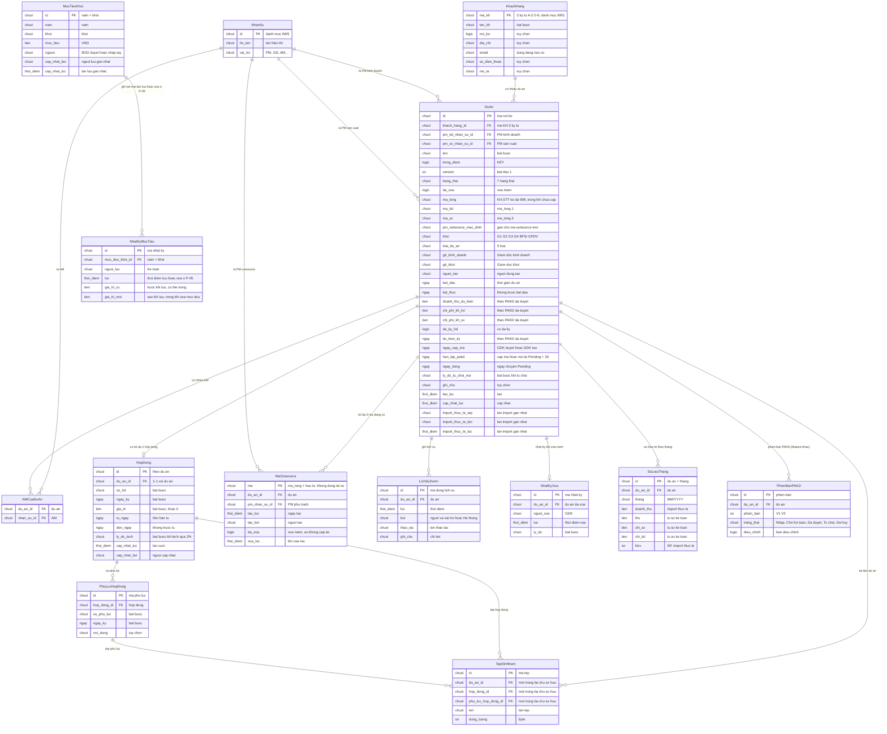

# Quản lý dự án kinh doanh — Entity Relationship Diagram

> Scope: thực thể nghiệp vụ của màn Danh sách dự án (MH-02) và vòng đời dự án, trừ nội dung PAKD. Khoá trong sơ đồ là khoá **logic** để đọc quan hệ, không phải thiết kế cơ sở dữ liệu. Kiểu dữ liệu ghi gọn nghiệp vụ.

## Diagram

## Entity Reference

| Entity | Purpose | Key attributes |
|--------|---------|----------------|
| DuAn — Dự án | Một dự án kinh doanh từ lúc xin mở mã đến kết thúc; xoá là xoá mềm | trạng thái (7), cờ đã xoá, mã tổng / KD / SX, khách hàng, PM, khối, loại, hạn lập PAKD, ngày cấp mã, ngày đóng, lý do từ chối mã, version; số liệu kế hoạch (doanh thu / chi phí / ngày dự kiến ký) chỉ đồng bộ khi PAKD được Kế toán duyệt |
| KhachHang — Khách hàng | Danh mục khách hàng dùng chung của IMIS; P-01 thêm mới lưu đủ trường | mã KH (3 ký tự, không trùng), tên, nội bộ, địa chỉ, email, SĐT, mô tả |
| NhanSu — Nhân sự | Danh mục nhân sự dùng chung của IMIS, lọc theo vai trò khi chọn PM / Giám đốc / AM | họ tên, vai trò |
| AMCuaDuAn | Một dự án có nhiều AM | dự án, nhân sự |
| MucTieuKhoi — Mục tiêu khối | Mục tiêu giá trị HĐ ký theo năm × khối; từ BOD duyệt (MH-01) hoặc Kế toán nhập tay cho khối chưa có số BOD | năm, khối, mục tiêu, nguồn, người / thời điểm cập nhật |
| NhatKyMucTieu — Nhật ký mục tiêu khối | Vết mỗi lần Kế toán lưu hoặc xoá mục tiêu ở P-05 (không cần màn xem — Phase H Q-48) | người thao tác, thời điểm, năm × khối, giá trị cũ → mới (xoá: → trống) |
| HopDong — Hợp đồng | Thông tin ký hợp đồng (P-03) hoặc tạo ban đầu từ PAKD Đã ký được duyệt | số, ngày ký, giá trị, thời hạn, lý do lệch (bắt buộc khi lệch > 2%), người / thời điểm cập nhật |
| PhuLucHopDong — Phụ lục | Phụ lục điều chỉnh hợp đồng | số phụ lục, ngày ký, nội dung, tệp |
| TepDinhKem — Tệp đính kèm | Tệp của dự án / hợp đồng / phụ lục (mỗi tệp thuộc đúng một chủ sở hữu) | tên, dung lượng |
| MaOutsource — Mã outsource | Mã con kèm PM riêng; tối đa 2 mã đang có; mã đầu tiên `.3`, mã sau = hậu tố lớn nhất từng cấp + 1; mã xoá được đánh dấu đã xoá, số không cấp lại | mã, PM, người / ngày tạo, đã xoá, thời điểm xoá |
| LichSuDuAn — Lịch sử | Nhật ký thao tác trên dự án (tab Lịch sử), giữ vĩnh viễn | thời điểm, người (kèm vai trò) hoặc "Hệ thống", thao tác, ghi chú |
| NhatKyXoa — Nhật ký xoá | Bản ghi khi GĐK xoá mềm dự án | người xoá, thời điểm, lý do |
| SoLieuThang — Số liệu tháng thực tế | Số thực tế theo tháng của dự án: Doanh thu / KLCV do Kế toán import ở màn chi tiết; Thu / Chi SX / Chi KD từ Import sổ kế toán | tháng, doanh thu, thu, chi SX, chi KD, KLCV |
| PhienBanPAKD — Phiên bản PAKD | Tham chiếu: quyết định trạng thái dự án; đặc tả ở feature `phuong-an-kinh-doanh` | phiên bản, trạng thái (Nháp, Chờ Kế toán, Đã duyệt, Từ chối, Đã huỷ), bản điều chỉnh |

## Notes & Assumptions

- Dự án không gắn khoá với Mục tiêu khối: Sổ theo dõi so khớp logic theo khối của dự án + năm (năm ký / năm dự kiến ký) với mục tiêu cùng khối, cùng năm.
- Mã outsource bị xoá vẫn được giữ (đã xoá + thời điểm xoá) để không cấp lại số hậu tố và để sổ kế toán còn ghép được chi phí cũ.
- Ngoài PM kinh doanh / sản xuất, dự án còn tham chiếu Giám đốc kinh doanh, Giám đốc khối, PM outsource mặc định (cũng thuộc danh mục nhân sự) — không vẽ thêm quan hệ để sơ đồ gọn.
- Dự án đã xoá mềm vẫn còn trong dữ liệu (cờ `da_xoa`), kèm 1 bản ghi nhật ký xoá; không tính vào danh sách, Sổ theo dõi, Xuất Excel.
- Số liệu tháng **kế hoạch** thuộc PAKD được duyệt (feature `phuong-an-kinh-doanh` / `bao-cao-hieu-qua-du-an`) — không mô hình ở đây.
- Mã tổng / `.1` / `.2` và mã outsource được Import sổ kế toán dùng để ghép dòng sổ vào dự án (feature `bao-cao-hieu-qua-du-an`, reverse OQ-13).
- Không mô hình: nội dung PAKD, giai đoạn KH01–KH05 (đã loại bỏ).
