# quan-ly-du-an-kinh-doanh — Flows

> Hành vi mục tiêu. "Hệ thống" = phần mềm quản lý dự án (lưu trữ chính thức chưa chốt — reverse OQ-5). Mã lỗi `E-quan-ly-du-an-kinh-doanh-NNN` tra ở Mục 6 của spec.

## Flow: F1 — Xem Sổ theo dõi & danh sách, lọc, xuất Excel

**Related FR**: FR-quan-ly-du-an-kinh-doanh-001 → -010, -046, -047 · **Related UC**: uc-xem-so-theo-doi-du-an

### Sequence — F1

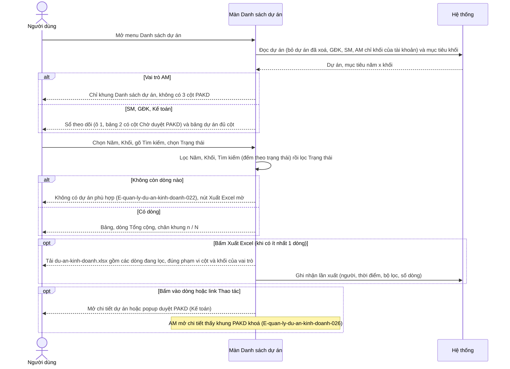
```mermaid
sequenceDiagram
    actor U as Người dùng
    participant UI as Màn Danh sách dự án
    participant HT as Hệ thống
    U->>UI: Mở menu Danh sách dự án
    UI->>HT: Đọc dự án (bỏ dự án đã xoá, GĐK, SM, AM chỉ khối của tài khoản) và mục tiêu khối
    HT-->>UI: Dự án, mục tiêu năm x khối
    alt Vai trò AM
        UI-->>U: Chỉ khung Danh sách dự án, không có 3 cột PAKD
    else SM, GĐK, Kế toán
        UI-->>U: Sổ theo dõi (ô 1, bảng 2 có cột Chờ duyệt PAKD) và bảng dự án đủ cột
    end
    U->>UI: Chọn Năm, Khối, gõ Tìm kiếm, chọn Trạng thái
    UI->>UI: Lọc Năm, Khối, Tìm kiếm (đếm theo trạng thái) rồi lọc Trạng thái
    alt Không còn dòng nào
        UI-->>U: Không có dự án phù hợp (E-quan-ly-du-an-kinh-doanh-022), nút Xuất Excel mờ
    else Có dòng
        UI-->>U: Bảng, dòng Tổng cộng, chân khung n / N
    end
    opt Bấm Xuất Excel (khi có ít nhất 1 dòng)
        UI-->>U: Tải du-an-kinh-doanh.xlsx gồm các dòng đang lọc, đúng phạm vi cột và khối của vai trò
        UI->>HT: Ghi nhận lần xuất (người, thời điểm, bộ lọc, số dòng)
    end
    opt Bấm vào dòng hoặc link Thao tác
        UI-->>U: Mở chi tiết dự án hoặc popup duyệt PAKD (Kế toán)
        Note over UI: AM mở chi tiết thấy khung PAKD khoá (E-quan-ly-du-an-kinh-doanh-026)
    end
```

### Activity — F1

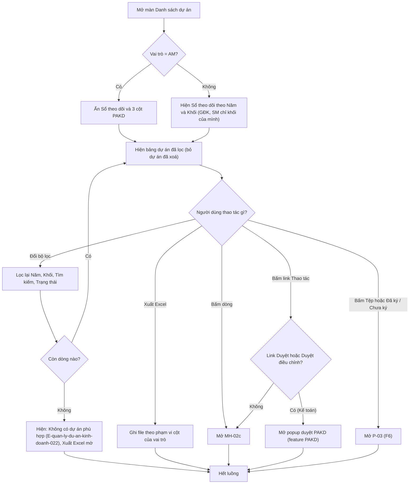
```mermaid
flowchart TD
    A["Mở màn Danh sách dự án"] --> R{"Vai trò = AM?"}
    R -->|"Có"| R1["Ẩn Sổ theo dõi và 3 cột PAKD"]
    R -->|"Không"| R2["Hiện Sổ theo dõi theo Năm và Khối (GĐK, SM chỉ khối của mình)"]
    R1 --> C["Hiện bảng dự án đã lọc (bỏ dự án đã xoá)"]
    R2 --> C
    C --> D{"Người dùng thao tác gì?"}
    D -->|"Đổi bộ lọc"| E["Lọc lại Năm, Khối, Tìm kiếm, Trạng thái"]
    E --> F{"Còn dòng nào?"}
    F -->|"Không"| G["Hiện: Không có dự án phù hợp (E-quan-ly-du-an-kinh-doanh-022), Xuất Excel mờ"]
    F -->|"Có"| C
    D -->|"Xuất Excel"| H["Ghi file theo phạm vi cột của vai trò"]
    D -->|"Bấm dòng"| I["Mở MH-02c"]
    D -->|"Bấm link Thao tác"| J{"Link Duyệt hoặc Duyệt điều chỉnh?"}
    J -->|"Có (Kế toán)"| K["Mở popup duyệt PAKD (feature PAKD)"]
    J -->|"Không"| I
    D -->|"Bấm Tệp hoặc Đã ký / Chưa ký"| L["Mở P-03 (F6)"]
    G --> End["Hết luồng"]
    H --> End
    I --> End
    K --> End
    L --> End
```

## Flow: F2 — Kế toán đặt mục tiêu khối nhập tay (P-05)

**Related FR**: FR-quan-ly-du-an-kinh-doanh-004 · **Related BR**: BR-quan-ly-du-an-kinh-doanh-022 · **Related UC**: uc-dat-muc-tieu-khoi

### Sequence — F2

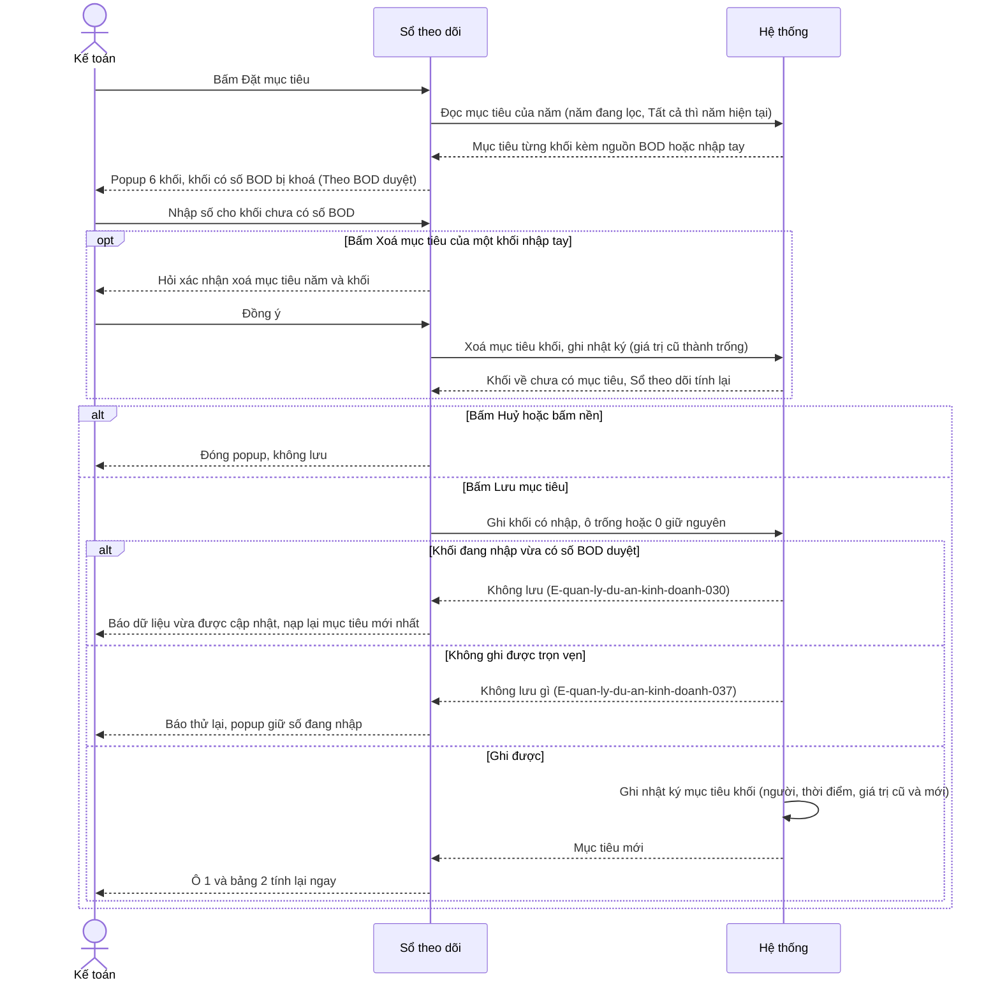
```mermaid
sequenceDiagram
    actor K as Kế toán
    participant UI as Sổ theo dõi
    participant HT as Hệ thống
    K->>UI: Bấm Đặt mục tiêu
    UI->>HT: Đọc mục tiêu của năm (năm đang lọc, Tất cả thì năm hiện tại)
    HT-->>UI: Mục tiêu từng khối kèm nguồn BOD hoặc nhập tay
    UI-->>K: Popup 6 khối, khối có số BOD bị khoá (Theo BOD duyệt)
    K->>UI: Nhập số cho khối chưa có số BOD
    opt Bấm Xoá mục tiêu của một khối nhập tay
        UI-->>K: Hỏi xác nhận xoá mục tiêu năm và khối
        K->>UI: Đồng ý
        UI->>HT: Xoá mục tiêu khối, ghi nhật ký (giá trị cũ thành trống)
        HT-->>UI: Khối về chưa có mục tiêu, Sổ theo dõi tính lại
    end
    alt Bấm Huỷ hoặc bấm nền
        UI-->>K: Đóng popup, không lưu
    else Bấm Lưu mục tiêu
        UI->>HT: Ghi khối có nhập, ô trống hoặc 0 giữ nguyên
        alt Khối đang nhập vừa có số BOD duyệt
            HT-->>UI: Không lưu (E-quan-ly-du-an-kinh-doanh-030)
            UI-->>K: Báo dữ liệu vừa được cập nhật, nạp lại mục tiêu mới nhất
        else Không ghi được trọn vẹn
            HT-->>UI: Không lưu gì (E-quan-ly-du-an-kinh-doanh-037)
            UI-->>K: Báo thử lại, popup giữ số đang nhập
        else Ghi được
            HT->>HT: Ghi nhật ký mục tiêu khối (người, thời điểm, giá trị cũ và mới)
            HT-->>UI: Mục tiêu mới
            UI-->>K: Ô 1 và bảng 2 tính lại ngay
        end
    end
```

### Activity — F2

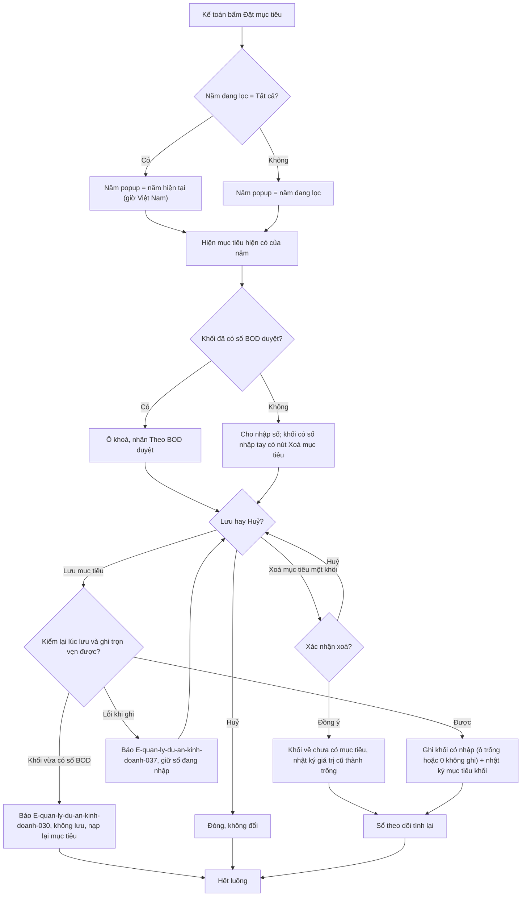
```mermaid
flowchart TD
    A["Kế toán bấm Đặt mục tiêu"] --> B{"Năm đang lọc = Tất cả?"}
    B -->|"Có"| C["Năm popup = năm hiện tại (giờ Việt Nam)"]
    B -->|"Không"| D["Năm popup = năm đang lọc"]
    C --> E["Hiện mục tiêu hiện có của năm"]
    D --> E
    E --> F{"Khối đã có số BOD duyệt?"}
    F -->|"Có"| G["Ô khoá, nhãn Theo BOD duyệt"]
    F -->|"Không"| H["Cho nhập số; khối có số nhập tay có nút Xoá mục tiêu"]
    G --> I{"Lưu hay Huỷ?"}
    H --> I
    I -->|"Huỷ"| J["Đóng, không đổi"]
    I -->|"Xoá mục tiêu một khối"| XM{"Xác nhận xoá?"}
    XM -->|"Huỷ"| I
    XM -->|"Đồng ý"| XM1["Khối về chưa có mục tiêu, nhật ký giá trị cũ thành trống"]
    XM1 --> L
    I -->|"Lưu mục tiêu"| X{"Kiểm lại lúc lưu và ghi trọn vẹn được?"}
    X -->|"Khối vừa có số BOD"| X1["Báo E-quan-ly-du-an-kinh-doanh-030, không lưu, nạp lại mục tiêu"]
    X -->|"Lỗi khi ghi"| X2["Báo E-quan-ly-du-an-kinh-doanh-037, giữ số đang nhập"]
    X2 --> I
    X -->|"Được"| K["Ghi khối có nhập (ô trống hoặc 0 không ghi) + nhật ký mục tiêu khối"]
    K --> L["Sổ theo dõi tính lại"]
    X1 --> End
    J --> End["Hết luồng"]
    L --> End
```

## Flow: F3 — Tạo dự án (AM / SM gửi yêu cầu mở mã — GĐK tạo & cấp mã)

**Related FR**: FR-quan-ly-du-an-kinh-doanh-011 → -018 · **Related UC**: uc-tao-du-an, uc-them-khach-hang

### Sequence — F3

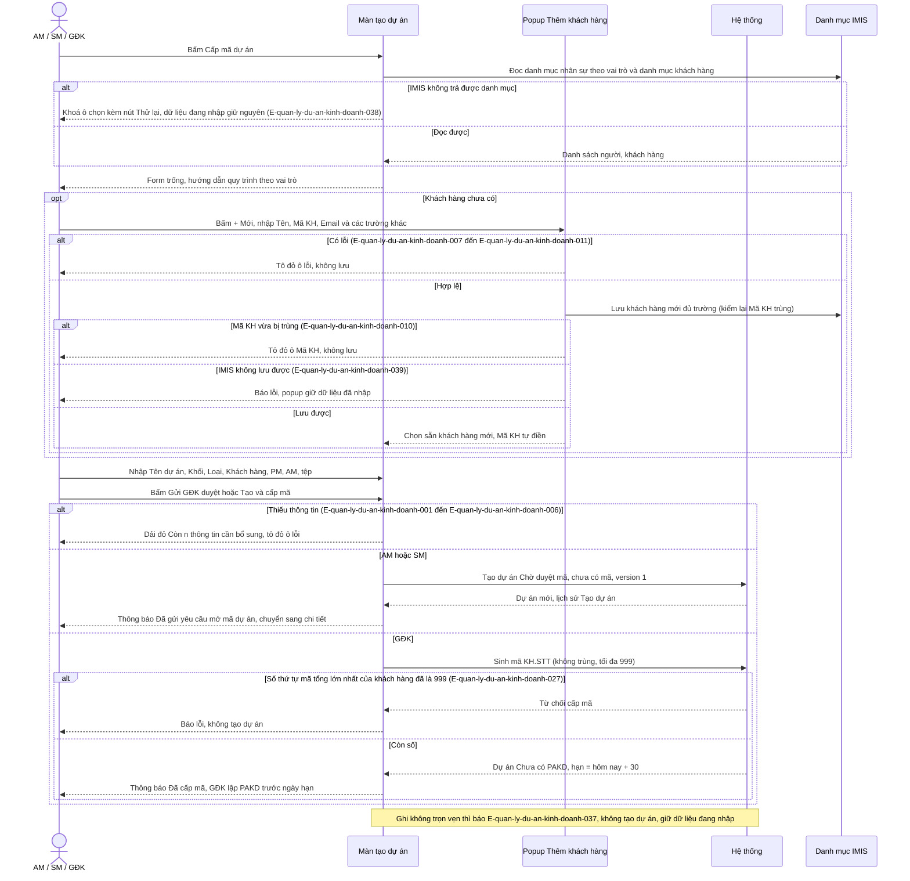
```mermaid
sequenceDiagram
    actor U as AM / SM / GĐK
    participant UI as Màn tạo dự án
    participant P1 as Popup Thêm khách hàng
    participant HT as Hệ thống
    participant IM as Danh mục IMIS
    U->>UI: Bấm Cấp mã dự án
    UI->>IM: Đọc danh mục nhân sự theo vai trò và danh mục khách hàng
    alt IMIS không trả được danh mục
        UI-->>U: Khoá ô chọn kèm nút Thử lại, dữ liệu đang nhập giữ nguyên (E-quan-ly-du-an-kinh-doanh-038)
    else Đọc được
        IM-->>UI: Danh sách người, khách hàng
    end
    UI-->>U: Form trống, hướng dẫn quy trình theo vai trò
    opt Khách hàng chưa có
        U->>P1: Bấm + Mới, nhập Tên, Mã KH, Email và các trường khác
        alt Có lỗi (E-quan-ly-du-an-kinh-doanh-007 đến E-quan-ly-du-an-kinh-doanh-011)
            P1-->>U: Tô đỏ ô lỗi, không lưu
        else Hợp lệ
            P1->>IM: Lưu khách hàng mới đủ trường (kiểm lại Mã KH trùng)
            alt Mã KH vừa bị trùng (E-quan-ly-du-an-kinh-doanh-010)
                P1-->>U: Tô đỏ ô Mã KH, không lưu
            else IMIS không lưu được (E-quan-ly-du-an-kinh-doanh-039)
                P1-->>U: Báo lỗi, popup giữ dữ liệu đã nhập
            else Lưu được
                P1-->>UI: Chọn sẵn khách hàng mới, Mã KH tự điền
            end
        end
    end
    U->>UI: Nhập Tên dự án, Khối, Loại, Khách hàng, PM, AM, tệp
    U->>UI: Bấm Gửi GĐK duyệt hoặc Tạo và cấp mã
    alt Thiếu thông tin (E-quan-ly-du-an-kinh-doanh-001 đến E-quan-ly-du-an-kinh-doanh-006)
        UI-->>U: Dải đỏ Còn n thông tin cần bổ sung, tô đỏ ô lỗi
    else AM hoặc SM
        UI->>HT: Tạo dự án Chờ duyệt mã, chưa có mã, version 1
        HT-->>UI: Dự án mới, lịch sử Tạo dự án
        UI-->>U: Thông báo Đã gửi yêu cầu mở mã dự án, chuyển sang chi tiết
    else GĐK
        UI->>HT: Sinh mã KH.STT (không trùng, tối đa 999)
        alt Số thứ tự mã tổng lớn nhất của khách hàng đã là 999 (E-quan-ly-du-an-kinh-doanh-027)
            HT-->>UI: Từ chối cấp mã
            UI-->>U: Báo lỗi, không tạo dự án
        else Còn số
            HT-->>UI: Dự án Chưa có PAKD, hạn = hôm nay + 30
            UI-->>U: Thông báo Đã cấp mã, GĐK lập PAKD trước ngày hạn
        end
    end
    Note over UI,HT: Ghi không trọn vẹn thì báo E-quan-ly-du-an-kinh-doanh-037, không tạo dự án, giữ dữ liệu đang nhập
```

### Activity — F3

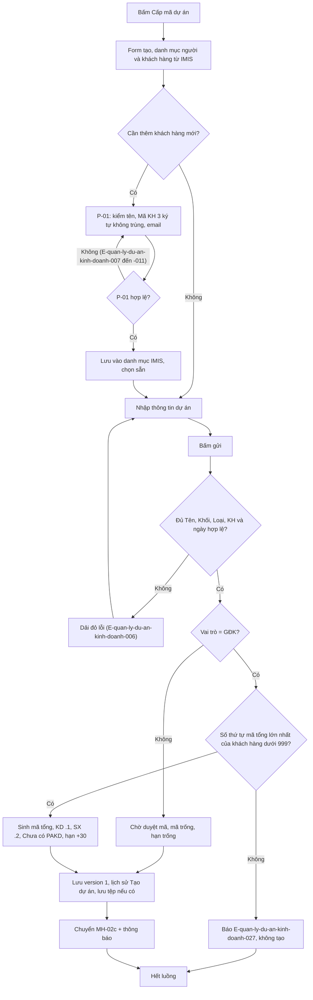
```mermaid
flowchart TD
    A["Bấm Cấp mã dự án"] --> B["Form tạo, danh mục người và khách hàng từ IMIS"]
    B --> C{"Cần thêm khách hàng mới?"}
    C -->|"Có"| D["P-01: kiểm tên, Mã KH 3 ký tự không trùng, email"]
    D --> E{"P-01 hợp lệ?"}
    E -->|"Không (E-quan-ly-du-an-kinh-doanh-007 đến -011)"| D
    E -->|"Có"| F["Lưu vào danh mục IMIS, chọn sẵn"]
    C -->|"Không"| G["Nhập thông tin dự án"]
    F --> G
    G --> H["Bấm gửi"]
    H --> I{"Đủ Tên, Khối, Loại, KH và ngày hợp lệ?"}
    I -->|"Không"| J["Dải đỏ lỗi (E-quan-ly-du-an-kinh-doanh-006)"]
    J --> G
    I -->|"Có"| K{"Vai trò = GĐK?"}
    K -->|"Không"| L["Chờ duyệt mã, mã trống, hạn trống"]
    K -->|"Có"| M{"Số thứ tự mã tổng lớn nhất của khách hàng dưới 999?"}
    M -->|"Không"| N["Báo E-quan-ly-du-an-kinh-doanh-027, không tạo"]
    M -->|"Có"| O["Sinh mã tổng, KD .1, SX .2, Chưa có PAKD, hạn +30"]
    L --> P["Lưu version 1, lịch sử Tạo dự án, lưu tệp nếu có"]
    O --> P
    P --> Q["Chuyển MH-02c + thông báo"]
    N --> End["Hết luồng"]
    Q --> End
```

## Flow: F4 — GĐK duyệt / từ chối mã, người tạo / SM gửi lại

**Related FR**: FR-quan-ly-du-an-kinh-doanh-015, -028, -041, -042 · **Related UC**: uc-duyet-ma-du-an, uc-tu-choi-ma-du-an, uc-gui-lai-yeu-cau-mo-ma

Dải xám cho vai trò không có quyền (E-quan-ly-du-an-kinh-doanh-023) chỉ còn "Đang chờ {ai làm gì}.", bỏ vế "Đổi “Vai trò” ở góc trên…" — mỗi tài khoản một vai trò (Phase H Q-27). Chỉ GĐK của khối dự án duyệt / từ chối mã (BR-quan-ly-du-an-kinh-doanh-053). Gửi lại chỉ do người tạo dự án hoặc SM của dự án (FR-quan-ly-du-an-kinh-doanh-042 — Phase H Q-40).

### Sequence — F4

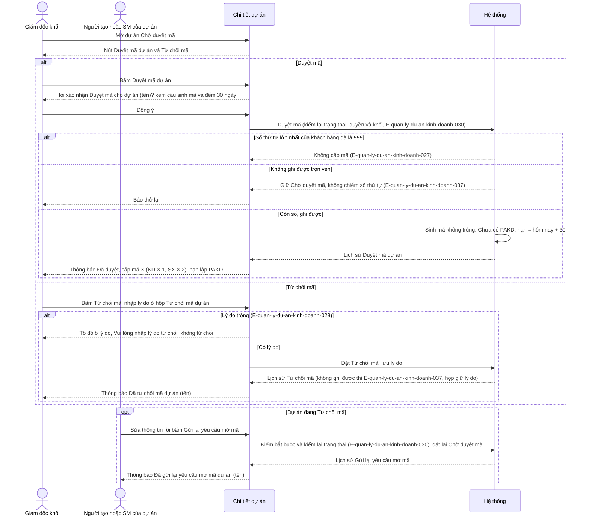
```mermaid
sequenceDiagram
    actor G as Giám đốc khối
    actor A as Người tạo hoặc SM của dự án
    participant UI as Chi tiết dự án
    participant HT as Hệ thống
    G->>UI: Mở dự án Chờ duyệt mã
    UI-->>G: Nút Duyệt mã dự án và Từ chối mã
    alt Duyệt mã
        G->>UI: Bấm Duyệt mã dự án
        UI-->>G: Hỏi xác nhận Duyệt mã cho dự án (tên)? kèm câu sinh mã và đếm 30 ngày
        G->>UI: Đồng ý
        UI->>HT: Duyệt mã (kiểm lại trạng thái, quyền và khối, E-quan-ly-du-an-kinh-doanh-030)
        alt Số thứ tự lớn nhất của khách hàng đã là 999
            HT-->>UI: Không cấp mã (E-quan-ly-du-an-kinh-doanh-027)
        else Không ghi được trọn vẹn
            HT-->>UI: Giữ Chờ duyệt mã, không chiếm số thứ tự (E-quan-ly-du-an-kinh-doanh-037)
            UI-->>G: Báo thử lại
        else Còn số, ghi được
            HT->>HT: Sinh mã không trùng, Chưa có PAKD, hạn = hôm nay + 30
            HT-->>UI: Lịch sử Duyệt mã dự án
            UI-->>G: Thông báo Đã duyệt, cấp mã X (KD X.1, SX X.2), hạn lập PAKD
        end
    else Từ chối mã
        G->>UI: Bấm Từ chối mã, nhập lý do ở hộp Từ chối mã dự án
        alt Lý do trống (E-quan-ly-du-an-kinh-doanh-028)
            UI-->>G: Tô đỏ ô lý do, Vui lòng nhập lý do từ chối, không từ chối
        else Có lý do
            UI->>HT: Đặt Từ chối mã, lưu lý do
            HT-->>UI: Lịch sử Từ chối mã (không ghi được thì E-quan-ly-du-an-kinh-doanh-037, hộp giữ lý do)
            UI-->>G: Thông báo Đã từ chối mã dự án (tên)
        end
    end
    opt Dự án đang Từ chối mã
        A->>UI: Sửa thông tin rồi bấm Gửi lại yêu cầu mở mã
        UI->>HT: Kiểm bắt buộc và kiểm lại trạng thái (E-quan-ly-du-an-kinh-doanh-030), đặt lại Chờ duyệt mã
        HT-->>UI: Lịch sử Gửi lại yêu cầu mở mã
        UI-->>A: Thông báo Đã gửi lại yêu cầu mở mã dự án (tên)
    end
```

### Activity — F4

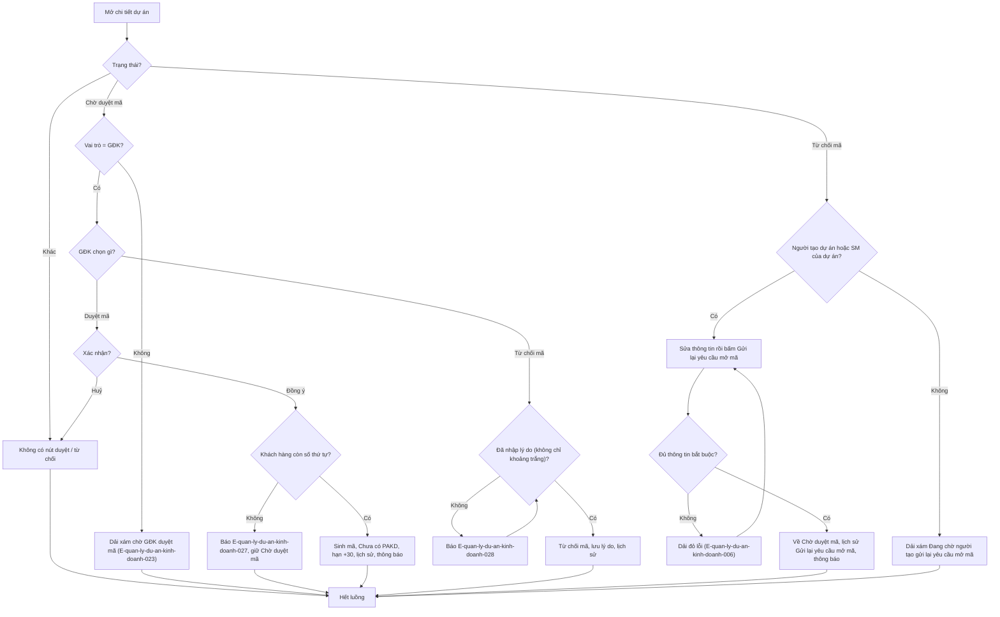
```mermaid
flowchart TD
    A["Mở chi tiết dự án"] --> B{"Trạng thái?"}
    B -->|"Chờ duyệt mã"| C{"Vai trò = GĐK?"}
    B -->|"Từ chối mã"| R{"Người tạo dự án hoặc SM của dự án?"}
    B -->|"Khác"| Z["Không có nút duyệt / từ chối"]
    C -->|"Không"| D["Dải xám chờ GĐK duyệt mã (E-quan-ly-du-an-kinh-doanh-023)"]
    R -->|"Không"| R2["Dải xám Đang chờ người tạo gửi lại yêu cầu mở mã"]
    C -->|"Có"| E{"GĐK chọn gì?"}
    E -->|"Duyệt mã"| F{"Xác nhận?"}
    F -->|"Huỷ"| Z
    F -->|"Đồng ý"| G{"Khách hàng còn số thứ tự?"}
    G -->|"Không"| H["Báo E-quan-ly-du-an-kinh-doanh-027, giữ Chờ duyệt mã"]
    G -->|"Có"| I["Sinh mã, Chưa có PAKD, hạn +30, lịch sử, thông báo"]
    E -->|"Từ chối mã"| J{"Đã nhập lý do (không chỉ khoảng trắng)?"}
    J -->|"Không"| K["Báo E-quan-ly-du-an-kinh-doanh-028"]
    K --> J
    J -->|"Có"| L["Từ chối mã, lưu lý do, lịch sử"]
    R -->|"Có"| S["Sửa thông tin rồi bấm Gửi lại yêu cầu mở mã"]
    S --> T{"Đủ thông tin bắt buộc?"}
    T -->|"Không"| U["Dải đỏ lỗi (E-quan-ly-du-an-kinh-doanh-006)"]
    U --> S
    T -->|"Có"| V["Về Chờ duyệt mã, lịch sử Gửi lại yêu cầu mở mã, thông báo"]
    Z --> End["Hết luồng"]
    D --> End
    H --> End
    I --> End
    L --> End
    V --> End
    R2 --> End
```

## Flow: F5 — Sửa thông tin cơ bản trực tiếp (Update PM)

**Related FR**: FR-quan-ly-du-an-kinh-doanh-029, -030 · **Related BR**: BR-quan-ly-du-an-kinh-doanh-032, -048 · **Related UC**: uc-sua-thong-tin-co-ban

### Sequence — F5

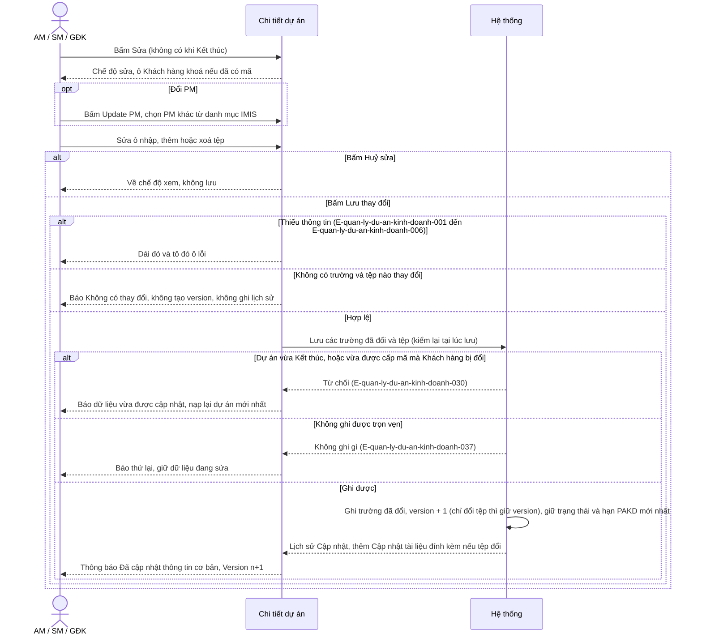
```mermaid
sequenceDiagram
    actor U as AM / SM / GĐK
    participant UI as Chi tiết dự án
    participant HT as Hệ thống
    U->>UI: Bấm Sửa (không có khi Kết thúc)
    UI-->>U: Chế độ sửa, ô Khách hàng khoá nếu đã có mã
    opt Đổi PM
        U->>UI: Bấm Update PM, chọn PM khác từ danh mục IMIS
    end
    U->>UI: Sửa ô nhập, thêm hoặc xoá tệp
    alt Bấm Huỷ sửa
        UI-->>U: Về chế độ xem, không lưu
    else Bấm Lưu thay đổi
        alt Thiếu thông tin (E-quan-ly-du-an-kinh-doanh-001 đến E-quan-ly-du-an-kinh-doanh-006)
            UI-->>U: Dải đỏ và tô đỏ ô lỗi
        else Không có trường và tệp nào thay đổi
            UI-->>U: Báo Không có thay đổi, không tạo version, không ghi lịch sử
        else Hợp lệ
            UI->>HT: Lưu các trường đã đổi và tệp (kiểm lại tại lúc lưu)
            alt Dự án vừa Kết thúc, hoặc vừa được cấp mã mà Khách hàng bị đổi
                HT-->>UI: Từ chối (E-quan-ly-du-an-kinh-doanh-030)
                UI-->>U: Báo dữ liệu vừa được cập nhật, nạp lại dự án mới nhất
            else Không ghi được trọn vẹn
                HT-->>UI: Không ghi gì (E-quan-ly-du-an-kinh-doanh-037)
                UI-->>U: Báo thử lại, giữ dữ liệu đang sửa
            else Ghi được
                HT->>HT: Ghi trường đã đổi, version + 1 (chỉ đổi tệp thì giữ version), giữ trạng thái và hạn PAKD mới nhất
                HT-->>UI: Lịch sử Cập nhật, thêm Cập nhật tài liệu đính kèm nếu tệp đổi
                UI-->>U: Thông báo Đã cập nhật thông tin cơ bản, Version n+1
            end
        end
    end
```

### Activity — F5

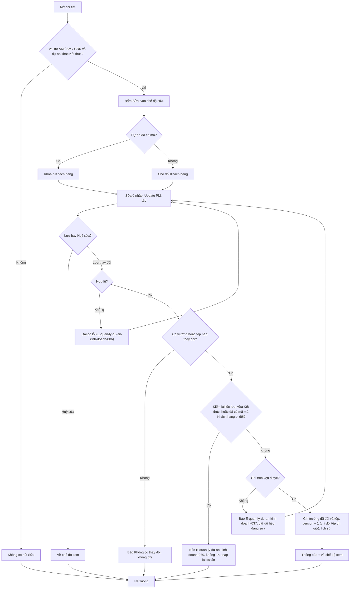
```mermaid
flowchart TD
    A["Mở chi tiết"] --> B{"Vai trò AM / SM / GĐK và dự án khác Kết thúc?"}
    B -->|"Không"| C["Không có nút Sửa"]
    B -->|"Có"| D["Bấm Sửa, vào chế độ sửa"]
    D --> E{"Dự án đã có mã?"}
    E -->|"Có"| F["Khoá ô Khách hàng"]
    E -->|"Không"| G["Cho đổi Khách hàng"]
    F --> H["Sửa ô nhập, Update PM, tệp"]
    G --> H
    H --> I{"Lưu hay Huỷ sửa?"}
    I -->|"Huỷ sửa"| J["Về chế độ xem"]
    I -->|"Lưu thay đổi"| K{"Hợp lệ?"}
    K -->|"Không"| L["Dải đỏ lỗi (E-quan-ly-du-an-kinh-doanh-006)"]
    L --> H
    K -->|"Có"| K0{"Có trường hoặc tệp nào thay đổi?"}
    K0 -->|"Không"| K1["Báo Không có thay đổi, không ghi"]
    K0 -->|"Có"| K2{"Kiểm lại lúc lưu: vừa Kết thúc, hoặc đã có mã mà Khách hàng bị đổi?"}
    K2 -->|"Có"| L2["Báo E-quan-ly-du-an-kinh-doanh-030, không lưu, nạp lại dự án"]
    K2 -->|"Không"| W{"Ghi trọn vẹn được?"}
    W -->|"Không"| L3["Báo E-quan-ly-du-an-kinh-doanh-037, giữ dữ liệu đang sửa"]
    L3 --> H
    W -->|"Có"| M["Ghi trường đã đổi và tệp, version + 1 (chỉ đổi tệp thì giữ), lịch sử"]
    M --> N["Thông báo + về chế độ xem"]
    C --> End["Hết luồng"]
    J --> End
    N --> End
    L2 --> End
    K1 --> End
```

## Flow: F6 — Cập nhật ký hợp đồng (P-03)

**Related FR**: FR-quan-ly-du-an-kinh-doanh-010, -025, -031 → -033, -048 · **Related BR**: BR-quan-ly-du-an-kinh-doanh-028, -029, -046, -049 · **Related UC**: uc-cap-nhat-ky-hop-dong

### Sequence — F6

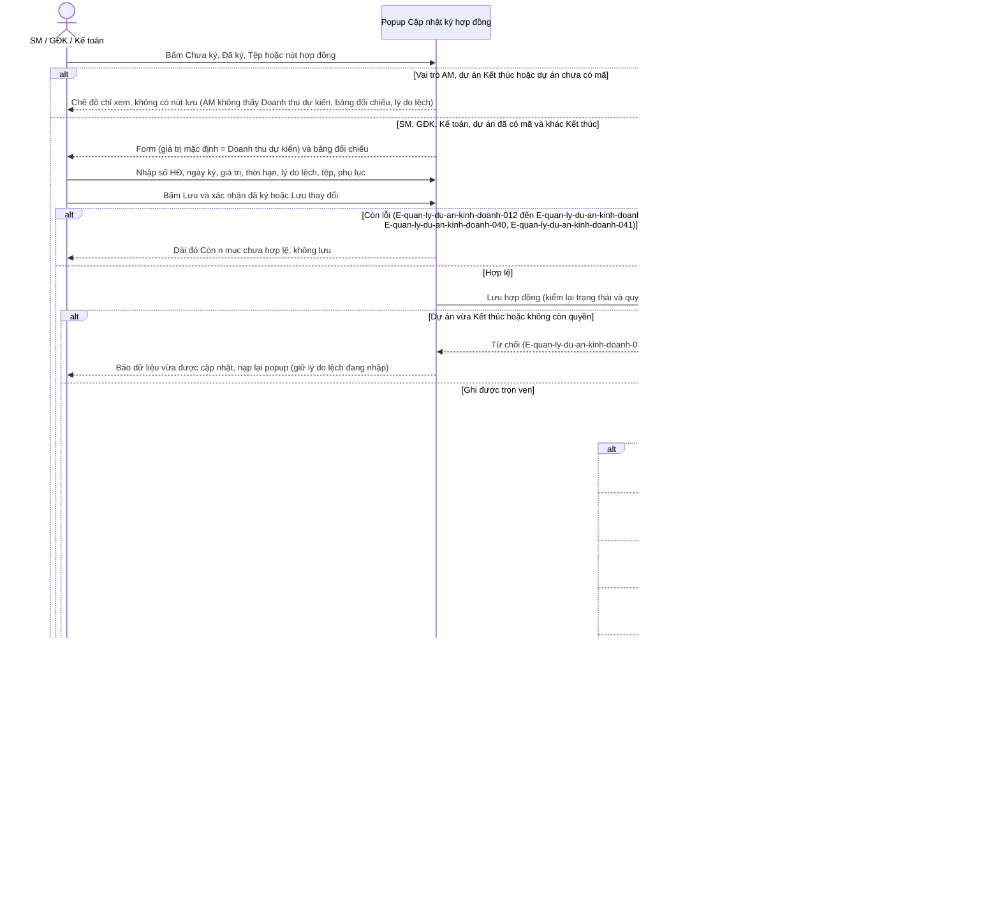
```mermaid
sequenceDiagram
    actor U as SM / GĐK / Kế toán
    participant UI as Popup Cập nhật ký hợp đồng
    participant HT as Hệ thống
    participant PK as Feature PAKD
    U->>UI: Bấm Chưa ký, Đã ký, Tệp hoặc nút hợp đồng
    alt Vai trò AM, dự án Kết thúc hoặc dự án chưa có mã
        UI-->>U: Chế độ chỉ xem, không có nút lưu (AM không thấy Doanh thu dự kiến, bảng đối chiếu, lý do lệch)
    else SM, GĐK, Kế toán, dự án đã có mã và khác Kết thúc
        UI-->>U: Form (giá trị mặc định = Doanh thu dự kiến) và bảng đối chiếu
        U->>UI: Nhập số HĐ, ngày ký, giá trị, thời hạn, lý do lệch, tệp, phụ lục
        U->>UI: Bấm Lưu và xác nhận đã ký hoặc Lưu thay đổi
        alt Còn lỗi (E-quan-ly-du-an-kinh-doanh-012 đến E-quan-ly-du-an-kinh-doanh-019, E-quan-ly-du-an-kinh-doanh-040, E-quan-ly-du-an-kinh-doanh-041)
            UI-->>U: Dải đỏ Còn n mục chưa hợp lệ, không lưu
        else Hợp lệ
            UI->>HT: Lưu hợp đồng (kiểm lại trạng thái và quyền)
            alt Dự án vừa Kết thúc hoặc không còn quyền
                HT-->>UI: Từ chối (E-quan-ly-du-an-kinh-doanh-030)
                UI-->>U: Báo dữ liệu vừa được cập nhật, nạp lại popup (giữ lý do lệch đang nhập)
            else Ghi được trọn vẹn
                HT->>HT: Đã ký, lưu HĐ, version + 1
                alt Đã có PAKD được duyệt, chưa có bản điều chỉnh đang mở
                    HT->>PK: Sinh bản điều chỉnh theo hợp đồng, chờ Kế toán duyệt
                else Bản lập hoặc bản điều chỉnh đang chờ Kế toán duyệt
                    HT->>PK: Cập nhật Mục 1 bản đang chờ, gắn nhãn ở P-04
                else Bản điều chỉnh nháp hoặc bị từ chối
                    HT->>PK: Cập nhật Mục 1 của chính bản đó, giữ phần đang soạn
                else Có bản đang lập, chưa có bản duyệt
                    HT->>PK: Ghi vào bản PAKD đang lập
                else Chưa có bản PAKD nào
                    HT->>HT: Chỉ lưu HĐ, nạp sẵn vào Mục 1 khi lập PAKD lần đầu
                end
                HT-->>UI: Lịch sử Ký hợp đồng hoặc Cập nhật hợp đồng
                UI-->>U: Thông báo Đã xác nhận ký hoặc Đã cập nhật hợp đồng
            else Không ghi được trọn vẹn
                HT-->>UI: Không ghi gì, kể cả phần PAKD (E-quan-ly-du-an-kinh-doanh-037)
                UI-->>U: Báo thử lại, popup giữ dữ liệu đang nhập
            end
        end
    end
```

### Activity — F6

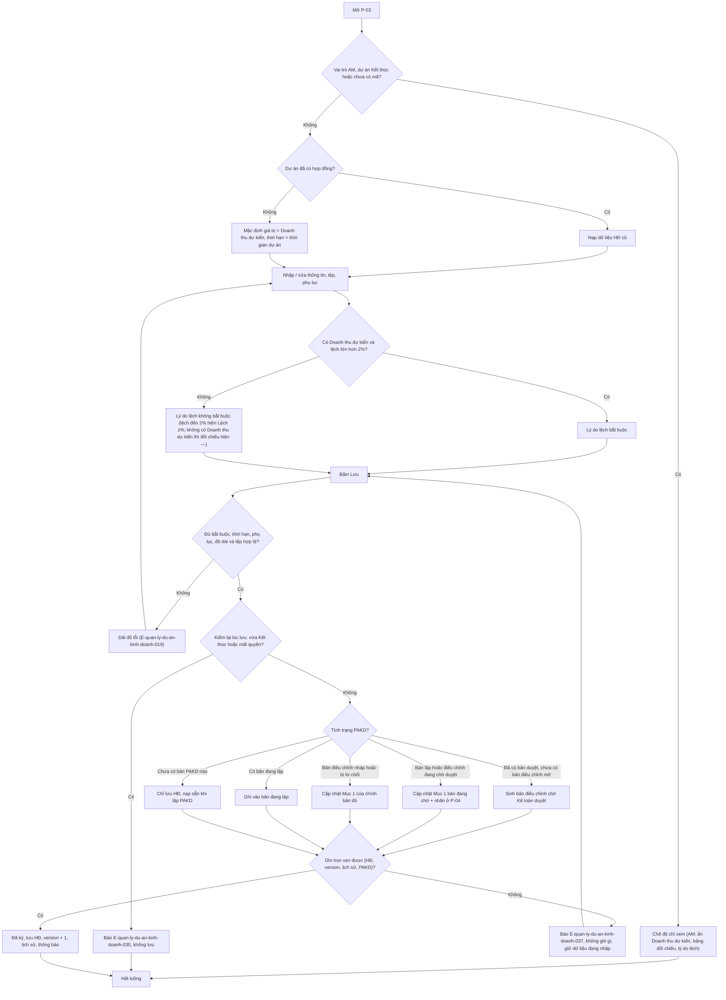
```mermaid
flowchart TD
    A["Mở P-03"] --> V{"Vai trò AM, dự án Kết thúc hoặc chưa có mã?"}
    V -->|"Có"| W["Chế độ chỉ xem (AM: ẩn Doanh thu dự kiến, bảng đối chiếu, lý do lệch)"]
    V -->|"Không"| B{"Dự án đã có hợp đồng?"}
    B -->|"Có"| C["Nạp dữ liệu HĐ cũ"]
    B -->|"Không"| D["Mặc định giá trị = Doanh thu dự kiến, thời hạn = thời gian dự án"]
    C --> E["Nhập / sửa thông tin, tệp, phụ lục"]
    D --> E
    E --> F{"Có Doanh thu dự kiến và lệch lớn hơn 2%?"}
    F -->|"Có"| G["Lý do lệch bắt buộc"]
    F -->|"Không"| H["Lý do lệch không bắt buộc (lệch đến 2% hiện Lệch z%; không có Doanh thu dự kiến thì đối chiếu hiện —)"]
    G --> I["Bấm Lưu"]
    H --> I
    I --> J{"Đủ bắt buộc, thời hạn, phụ lục, độ dài và tệp hợp lệ?"}
    J -->|"Không"| K["Dải đỏ lỗi (E-quan-ly-du-an-kinh-doanh-019)"]
    K --> E
    J -->|"Có"| X{"Kiểm lại lúc lưu: vừa Kết thúc hoặc mất quyền?"}
    X -->|"Có"| X1["Báo E-quan-ly-du-an-kinh-doanh-030, không lưu"]
    X -->|"Không"| M{"Tình trạng PAKD?"}
    M -->|"Đã có bản duyệt, chưa có bản điều chỉnh mở"| N["Sinh bản điều chỉnh chờ Kế toán duyệt"]
    M -->|"Bản lập hoặc điều chỉnh đang chờ duyệt"| O["Cập nhật Mục 1 bản đang chờ + nhãn ở P-04"]
    M -->|"Bản điều chỉnh nháp hoặc bị từ chối"| O2["Cập nhật Mục 1 của chính bản đó"]
    M -->|"Có bản đang lập"| P["Ghi vào bản đang lập"]
    M -->|"Chưa có bản PAKD nào"| P2["Chỉ lưu HĐ, nạp sẵn khi lập PAKD"]
    N --> S{"Ghi trọn vẹn được (HĐ, version, lịch sử, PAKD)?"}
    O --> S
    O2 --> S
    P --> S
    P2 --> S
    S -->|"Không"| S1["Báo E-quan-ly-du-an-kinh-doanh-037, không ghi gì, giữ dữ liệu đang nhập"]
    S1 --> I
    S -->|"Có"| L["Đã ký, lưu HĐ, version + 1, lịch sử, thông báo"]
    W --> End["Hết luồng"]
    X1 --> End
    L --> End
```

## Flow: F7 — Quản lý mã outsource

**Related FR**: FR-quan-ly-du-an-kinh-doanh-021 → -023 · **Related BR**: BR-quan-ly-du-an-kinh-doanh-008 · **Related UC**: uc-quan-ly-ma-outsource

### Sequence — F7

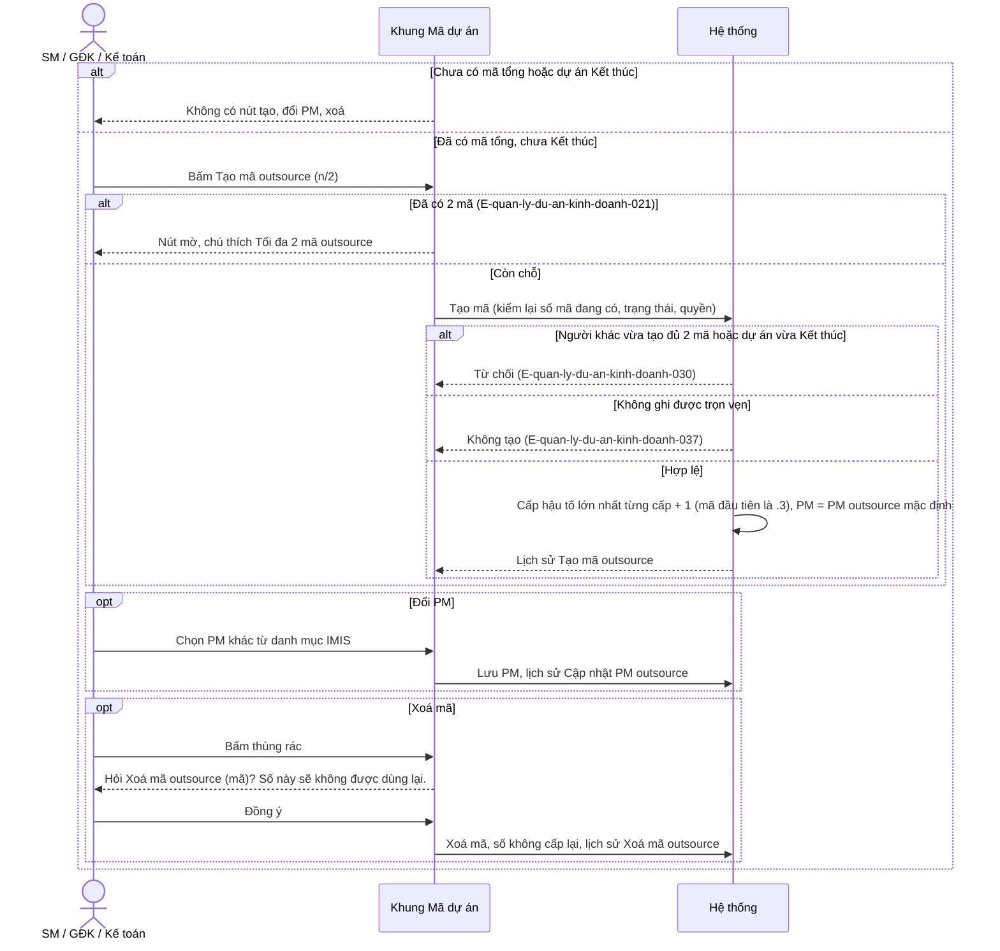
```mermaid
sequenceDiagram
    actor U as SM / GĐK / Kế toán
    participant UI as Khung Mã dự án
    participant HT as Hệ thống
    alt Chưa có mã tổng hoặc dự án Kết thúc
        UI-->>U: Không có nút tạo, đổi PM, xoá
    else Đã có mã tổng, chưa Kết thúc
        U->>UI: Bấm Tạo mã outsource (n/2)
        alt Đã có 2 mã (E-quan-ly-du-an-kinh-doanh-021)
            UI-->>U: Nút mờ, chú thích Tối đa 2 mã outsource
        else Còn chỗ
            UI->>HT: Tạo mã (kiểm lại số mã đang có, trạng thái, quyền)
            alt Người khác vừa tạo đủ 2 mã hoặc dự án vừa Kết thúc
                HT-->>UI: Từ chối (E-quan-ly-du-an-kinh-doanh-030)
            else Không ghi được trọn vẹn
                HT-->>UI: Không tạo (E-quan-ly-du-an-kinh-doanh-037)
            else Hợp lệ
                HT->>HT: Cấp hậu tố lớn nhất từng cấp + 1 (mã đầu tiên là .3), PM = PM outsource mặc định
                HT-->>UI: Lịch sử Tạo mã outsource
            end
        end
        opt Đổi PM
            U->>UI: Chọn PM khác từ danh mục IMIS
            UI->>HT: Lưu PM, lịch sử Cập nhật PM outsource
        end
        opt Xoá mã
            U->>UI: Bấm thùng rác
            UI-->>U: Hỏi Xoá mã outsource (mã)? Số này sẽ không được dùng lại.
            U->>UI: Đồng ý
            UI->>HT: Xoá mã, số không cấp lại, lịch sử Xoá mã outsource
        end
    end
```

### Activity — F7

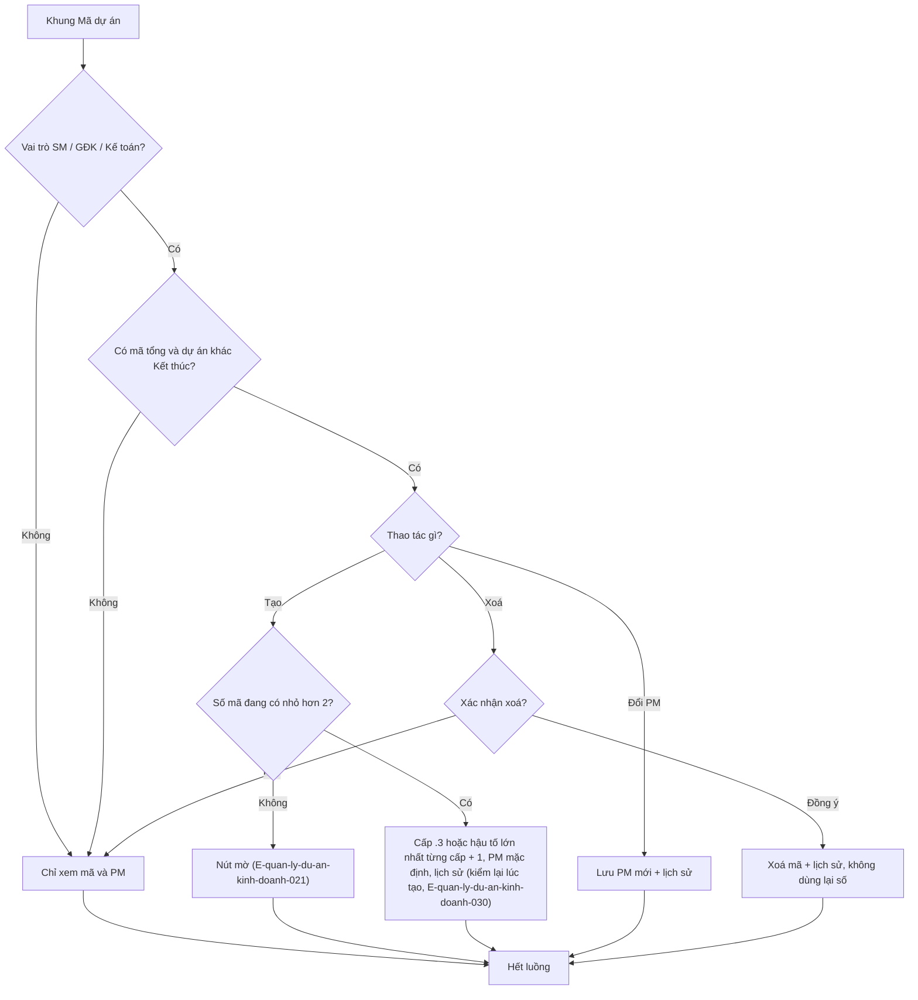
```mermaid
flowchart TD
    A["Khung Mã dự án"] --> B{"Vai trò SM / GĐK / Kế toán?"}
    B -->|"Không"| C["Chỉ xem mã và PM"]
    B -->|"Có"| D{"Có mã tổng và dự án khác Kết thúc?"}
    D -->|"Không"| C
    D -->|"Có"| E{"Thao tác gì?"}
    E -->|"Tạo"| F{"Số mã đang có nhỏ hơn 2?"}
    F -->|"Không"| G["Nút mờ (E-quan-ly-du-an-kinh-doanh-021)"]
    F -->|"Có"| H["Cấp .3 hoặc hậu tố lớn nhất từng cấp + 1, PM mặc định, lịch sử (kiểm lại lúc tạo, E-quan-ly-du-an-kinh-doanh-030)"]
    E -->|"Đổi PM"| I["Lưu PM mới + lịch sử"]
    E -->|"Xoá"| J{"Xác nhận xoá?"}
    J -->|"Huỷ"| C
    J -->|"Đồng ý"| K["Xoá mã + lịch sử, không dùng lại số"]
    C --> End["Hết luồng"]
    G --> End
    H --> End
    I --> End
    K --> End
```

## Flow: F8 — Đính kèm / xoá tài liệu dự án

**Related FR**: FR-quan-ly-du-an-kinh-doanh-018, -025 · **Related BR**: BR-quan-ly-du-an-kinh-doanh-037, -039, -051 · **Related UC**: uc-dinh-kem-tai-lieu

### Sequence — F8

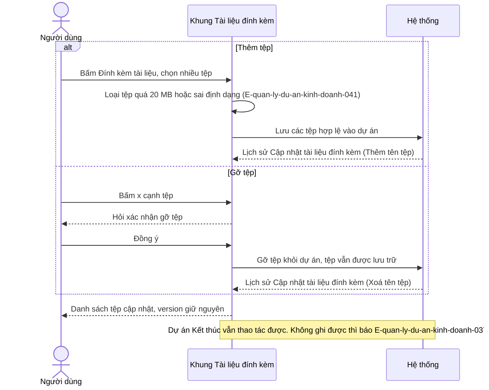
```mermaid
sequenceDiagram
    actor U as Người dùng
    participant UI as Khung Tài liệu đính kèm
    participant HT as Hệ thống
    alt Thêm tệp
        U->>UI: Bấm Đính kèm tài liệu, chọn nhiều tệp
        UI->>UI: Loại tệp quá 20 MB hoặc sai định dạng (E-quan-ly-du-an-kinh-doanh-041)
        UI->>HT: Lưu các tệp hợp lệ vào dự án
        HT-->>UI: Lịch sử Cập nhật tài liệu đính kèm (Thêm tên tệp)
    else Gỡ tệp
        U->>UI: Bấm x cạnh tệp
        UI-->>U: Hỏi xác nhận gỡ tệp
        U->>UI: Đồng ý
        UI->>HT: Gỡ tệp khỏi dự án, tệp vẫn được lưu trữ
        HT-->>UI: Lịch sử Cập nhật tài liệu đính kèm (Xoá tên tệp)
    end
    UI-->>U: Danh sách tệp cập nhật, version giữ nguyên
    Note over UI,HT: Dự án Kết thúc vẫn thao tác được. Không ghi được thì báo E-quan-ly-du-an-kinh-doanh-037
```

### Activity — F8

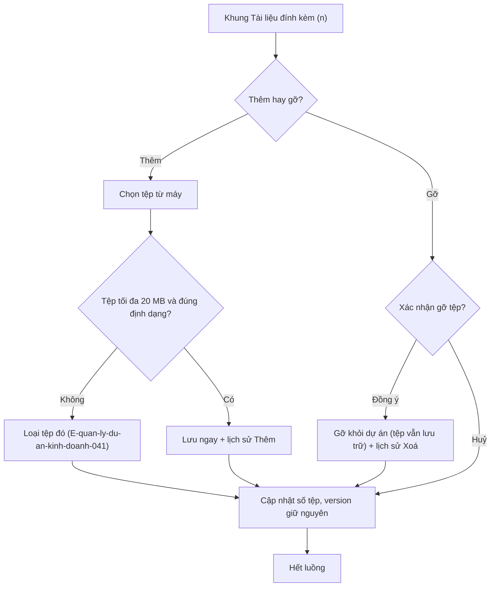
```mermaid
flowchart TD
    A["Khung Tài liệu đính kèm (n)"] --> B{"Thêm hay gỡ?"}
    B -->|"Thêm"| C["Chọn tệp từ máy"]
    C --> C1{"Tệp tối đa 20 MB và đúng định dạng?"}
    C1 -->|"Không"| C2["Loại tệp đó (E-quan-ly-du-an-kinh-doanh-041)"]
    C1 -->|"Có"| D["Lưu ngay + lịch sử Thêm"]
    B -->|"Gỡ"| E{"Xác nhận gỡ tệp?"}
    E -->|"Đồng ý"| F["Gỡ khỏi dự án (tệp vẫn lưu trữ) + lịch sử Xoá"]
    E -->|"Huỷ"| G["Cập nhật số tệp, version giữ nguyên"]
    D --> G
    F --> G
    C2 --> G
    G --> End["Hết luồng"]
```

## Flow: F9 — GĐK xoá mềm dự án

**Related FR**: FR-quan-ly-du-an-kinh-doanh-034 · **Related BR**: BR-quan-ly-du-an-kinh-doanh-010, -043 · **Related UC**: uc-xoa-du-an

### Sequence — F9

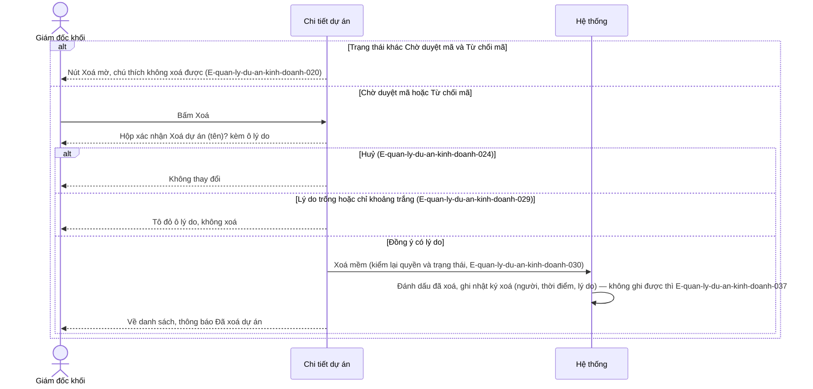
```mermaid
sequenceDiagram
    actor G as Giám đốc khối
    participant UI as Chi tiết dự án
    participant HT as Hệ thống
    alt Trạng thái khác Chờ duyệt mã và Từ chối mã
        UI-->>G: Nút Xoá mờ, chú thích không xoá được (E-quan-ly-du-an-kinh-doanh-020)
    else Chờ duyệt mã hoặc Từ chối mã
        G->>UI: Bấm Xoá
        UI-->>G: Hộp xác nhận Xoá dự án (tên)? kèm ô lý do
        alt Huỷ (E-quan-ly-du-an-kinh-doanh-024)
            UI-->>G: Không thay đổi
        else Lý do trống hoặc chỉ khoảng trắng (E-quan-ly-du-an-kinh-doanh-029)
            UI-->>G: Tô đỏ ô lý do, không xoá
        else Đồng ý có lý do
            UI->>HT: Xoá mềm (kiểm lại quyền và trạng thái, E-quan-ly-du-an-kinh-doanh-030)
            HT->>HT: Đánh dấu đã xoá, ghi nhật ký xoá (người, thời điểm, lý do) — không ghi được thì E-quan-ly-du-an-kinh-doanh-037
            UI-->>G: Về danh sách, thông báo Đã xoá dự án
        end
    end
```

### Activity — F9

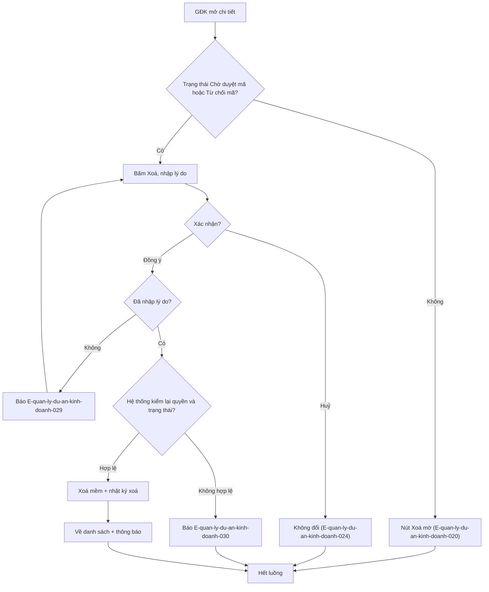
```mermaid
flowchart TD
    A["GĐK mở chi tiết"] --> B{"Trạng thái Chờ duyệt mã hoặc Từ chối mã?"}
    B -->|"Không"| C["Nút Xoá mờ (E-quan-ly-du-an-kinh-doanh-020)"]
    B -->|"Có"| D["Bấm Xoá, nhập lý do"]
    D --> E{"Xác nhận?"}
    E -->|"Huỷ"| F["Không đổi (E-quan-ly-du-an-kinh-doanh-024)"]
    E -->|"Đồng ý"| G{"Đã nhập lý do?"}
    G -->|"Không"| H["Báo E-quan-ly-du-an-kinh-doanh-029"]
    H --> D
    G -->|"Có"| I{"Hệ thống kiểm lại quyền và trạng thái?"}
    I -->|"Không hợp lệ"| J["Báo E-quan-ly-du-an-kinh-doanh-030"]
    I -->|"Hợp lệ"| K["Xoá mềm + nhật ký xoá"]
    K --> L["Về danh sách + thông báo"]
    C --> End["Hết luồng"]
    F --> End
    J --> End
    L --> End
```

## Flow: F10 — Kết thúc dự án & Kế toán mở lại dự án Kết thúc

**Related FR**: FR-quan-ly-du-an-kinh-doanh-035, -043 · **Related BR**: BR-quan-ly-du-an-kinh-doanh-013, -044 · **Related UC**: uc-ket-thuc-du-an, uc-mo-lai-du-an-ket-thuc

### Sequence — F10

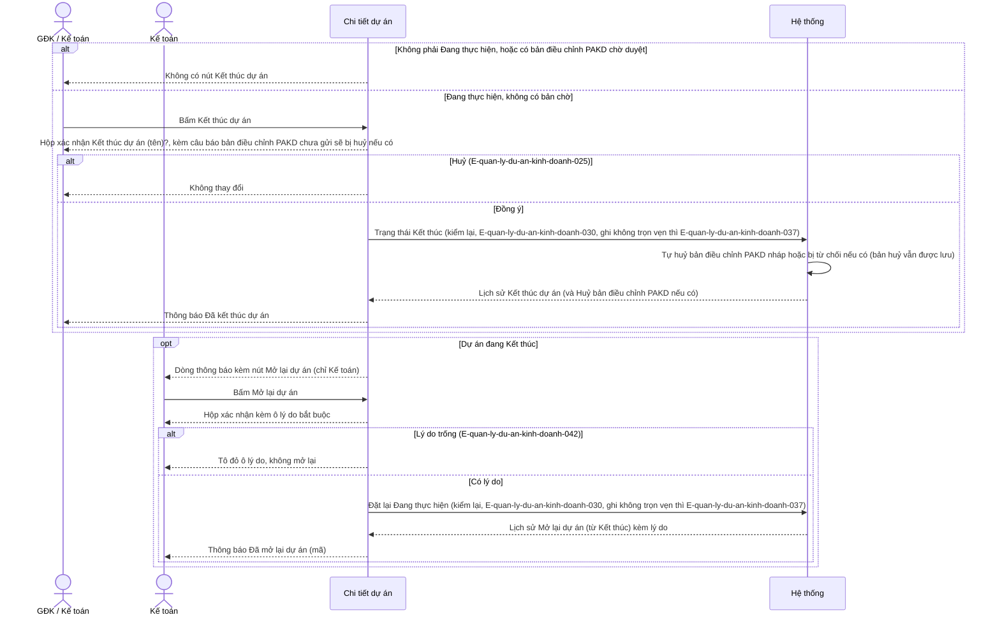
```mermaid
sequenceDiagram
    actor U as GĐK / Kế toán
    actor K as Kế toán
    participant UI as Chi tiết dự án
    participant HT as Hệ thống
    alt Không phải Đang thực hiện, hoặc có bản điều chỉnh PAKD chờ duyệt
        UI-->>U: Không có nút Kết thúc dự án
    else Đang thực hiện, không có bản chờ
        U->>UI: Bấm Kết thúc dự án
        UI-->>U: Hộp xác nhận Kết thúc dự án (tên)?, kèm câu báo bản điều chỉnh PAKD chưa gửi sẽ bị huỷ nếu có
        alt Huỷ (E-quan-ly-du-an-kinh-doanh-025)
            UI-->>U: Không thay đổi
        else Đồng ý
            UI->>HT: Trạng thái Kết thúc (kiểm lại, E-quan-ly-du-an-kinh-doanh-030, ghi không trọn vẹn thì E-quan-ly-du-an-kinh-doanh-037)
            HT->>HT: Tự huỷ bản điều chỉnh PAKD nháp hoặc bị từ chối nếu có (bản huỷ vẫn được lưu)
            HT-->>UI: Lịch sử Kết thúc dự án (và Huỷ bản điều chỉnh PAKD nếu có)
            UI-->>U: Thông báo Đã kết thúc dự án
        end
    end
    opt Dự án đang Kết thúc
        UI-->>K: Dòng thông báo kèm nút Mở lại dự án (chỉ Kế toán)
        K->>UI: Bấm Mở lại dự án
        UI-->>K: Hộp xác nhận kèm ô lý do bắt buộc
        alt Lý do trống (E-quan-ly-du-an-kinh-doanh-042)
            UI-->>K: Tô đỏ ô lý do, không mở lại
        else Có lý do
            UI->>HT: Đặt lại Đang thực hiện (kiểm lại, E-quan-ly-du-an-kinh-doanh-030, ghi không trọn vẹn thì E-quan-ly-du-an-kinh-doanh-037)
            HT-->>UI: Lịch sử Mở lại dự án (từ Kết thúc) kèm lý do
            UI-->>K: Thông báo Đã mở lại dự án (mã)
        end
    end
```

### Activity — F10

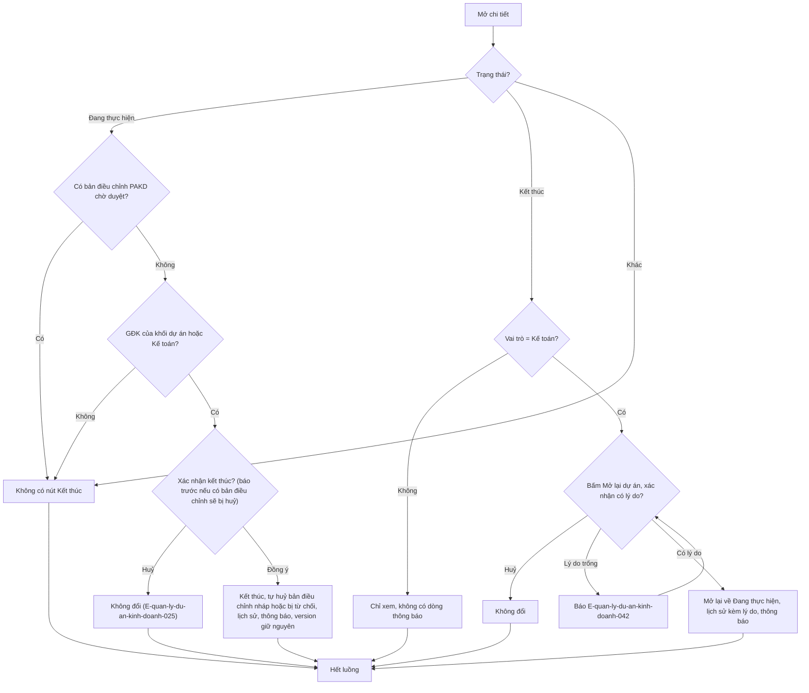
```mermaid
flowchart TD
    A["Mở chi tiết"] --> B{"Trạng thái?"}
    B -->|"Đang thực hiện"| C{"Có bản điều chỉnh PAKD chờ duyệt?"}
    C -->|"Có"| Z["Không có nút Kết thúc"]
    C -->|"Không"| D{"GĐK của khối dự án hoặc Kế toán?"}
    D -->|"Không"| Z
    D -->|"Có"| E{"Xác nhận kết thúc? (báo trước nếu có bản điều chỉnh sẽ bị huỷ)"}
    E -->|"Huỷ"| F["Không đổi (E-quan-ly-du-an-kinh-doanh-025)"]
    E -->|"Đồng ý"| G["Kết thúc, tự huỷ bản điều chỉnh nháp hoặc bị từ chối, lịch sử, thông báo, version giữ nguyên"]
    B -->|"Kết thúc"| H{"Vai trò = Kế toán?"}
    H -->|"Không"| I["Chỉ xem, không có dòng thông báo"]
    H -->|"Có"| J0{"Bấm Mở lại dự án, xác nhận có lý do?"}
    J0 -->|"Huỷ"| J2["Không đổi"]
    J2 --> End
    J0 -->|"Lý do trống"| J1["Báo E-quan-ly-du-an-kinh-doanh-042"]
    J1 --> J0
    J0 -->|"Có lý do"| J["Mở lại về Đang thực hiện, lịch sử kèm lý do, thông báo"]
    B -->|"Khác"| Z
    Z --> End["Hết luồng"]
    F --> End
    G --> End
    I --> End
    J --> End
```

## Flow: F11 — Tác vụ hằng ngày chuyển Pending & Kế toán mở lại dự án Pending

**Related FR**: FR-quan-ly-du-an-kinh-doanh-036, -037 · **Related BR**: BR-quan-ly-du-an-kinh-doanh-005, -011, -012 · **Related NFR**: NFR-quan-ly-du-an-kinh-doanh-015 · **Related UC**: uc-tu-dong-chuyen-pending, uc-mo-lai-du-an-pending

Dải xám cho vai trò khác (E-quan-ly-du-an-kinh-doanh-023) chỉ còn "Đang chờ {ai làm gì}.", bỏ vế "Đổi “Vai trò” ở góc trên…" — mỗi tài khoản một vai trò (Phase H Q-27).

### Sequence — F11

```mermaid
sequenceDiagram
    participant HT as Hệ thống (tác vụ hằng ngày)
    actor K as Kế toán
    actor O as Vai trò khác
    participant UI as Chi tiết dự án
    HT->>HT: Đầu ngày giờ Việt Nam (xong trước 06:00), quét Chưa có PAKD và PAKD chờ duyệt chưa có bản duyệt, hạn nhỏ hơn hôm nay, kể cả các ngày bị lỡ
    alt Có dự án quá hạn
        HT->>HT: Kiểm lại từng dự án, chuyển Pending, ngày đóng = hạn + 1, lịch sử bởi Hệ thống, không ghi trùng
    else Không có
        HT->>HT: Không đổi
    else Tác vụ lỗi
        HT->>HT: Cảnh báo bộ phận vận hành, lần chạy sau tự bù
    end
    O->>UI: Mở dự án Pending
    UI-->>O: Dải xám Đang chờ Kế toán (CFO) mở lại dự án Pending
    K->>UI: Mở dự án Pending
    UI-->>K: Giải thích, nút Mở lại dự án (và Duyệt / Từ chối PAKD nếu có bản chờ)
    K->>UI: Bấm Mở lại dự án
    UI->>HT: Mở lại (kiểm lại trạng thái, E-quan-ly-du-an-kinh-doanh-030, ghi không trọn vẹn thì E-quan-ly-du-an-kinh-doanh-037)
    alt Bản PAKD mới nhất đang chờ Kế toán
        HT->>HT: Trạng thái PAKD chờ duyệt
    else Khác
        HT->>HT: Trạng thái Chưa có PAKD
    end
    HT->>HT: Hạn mới = hôm nay + 30, xoá ngày đóng, lịch sử Mở lại dự án
    UI-->>K: Thông báo Đã mở lại dự án X, hạn lập PAKD
```

### Activity — F11

```mermaid
flowchart TD
    A["Tác vụ đầu ngày, xong trước 06:00 giờ Việt Nam, bù cả ngày lỡ"] --> B{"Chưa có PAKD hoặc PAKD chờ duyệt?"}
    B -->|"Không"| Z["Bỏ qua"]
    B -->|"Có"| C{"Đã có bản PAKD Đã duyệt?"}
    C -->|"Có"| Z
    C -->|"Không"| D{"Có hạn và hạn nhỏ hơn hôm nay?"}
    D -->|"Không"| Z
    D -->|"Có"| E["Pending, ngày đóng = hạn + 1, lịch sử Tự động chuyển Pending (không ghi trùng)"]
    E --> F{"Kế toán bấm Mở lại dự án?"}
    F -->|"Chưa"| G["Giữ Pending"]
    F -->|"Có"| H{"Bản mới nhất đang chờ Kế toán?"}
    H -->|"Có"| I["PAKD chờ duyệt"]
    H -->|"Không"| J["Chưa có PAKD"]
    I --> K["Hạn mới = hôm nay + 30, lịch sử, thông báo"]
    J --> K
    Z --> End["Hết luồng"]
    G --> End
    K --> End
```

## Flow: F12 — Trạng thái dự án theo PAKD (điểm nối feature PAKD)

**Related FR**: FR-quan-ly-du-an-kinh-doanh-038 · **Related BR**: BR-quan-ly-du-an-kinh-doanh-035 · Nội dung PAKD, kiểm tra khi gửi, popup duyệt, phiên bản thuộc feature `phuong-an-kinh-doanh`.

### Sequence — F12

```mermaid
sequenceDiagram
    actor S as SM / GĐK
    actor K as Kế toán
    participant HT as Hệ thống
    S->>HT: Gửi PAKD (lần đầu hoặc làm lại) từ khung PAKD
    HT->>HT: Dự án PAKD chờ duyệt, chưa đồng bộ số liệu PAKD
    K->>HT: Quyết định bản PAKD (popup duyệt)
    alt Duyệt, dự án PAKD chờ duyệt hoặc Pending
        alt Ghi được trọn vẹn
            HT->>HT: Đang thực hiện (từ Pending thì xoá ngày đóng), đồng bộ doanh thu, chi phí, kế hoạch tháng
            HT->>HT: PAKD Đã ký và dự án chưa có hợp đồng thì tạo hợp đồng ban đầu, version + 1, lịch sử Tạo hợp đồng từ PAKD
        else Không ghi được
            HT-->>K: Báo E-quan-ly-du-an-kinh-doanh-037, PAKD và dự án giữ nguyên
        end
    else Từ chối, dự án PAKD chờ duyệt
        HT->>HT: Chưa có PAKD, giữ hạn gốc
    else Từ chối, dự án Pending
        HT->>HT: Giữ Pending, không ghi lịch sử thừa
    end
    S->>HT: Gửi bản điều chỉnh (dự án Đang thực hiện)
    K->>HT: Duyệt hoặc từ chối bản điều chỉnh
    HT->>HT: Trạng thái dự án giữ Đang thực hiện
```

### Activity — F12

```mermaid
flowchart TD
    A["Dự án Chưa có PAKD"] --> B["SM / GĐK gửi PAKD"]
    B --> C["PAKD chờ duyệt (chưa đồng bộ số liệu)"]
    C --> D{"Kế toán quyết định?"}
    D -->|"Từ chối"| A
    D -->|"Duyệt"| R{"Ghi trọn vẹn được?"}
    R -->|"Không"| R1["Báo E-quan-ly-du-an-kinh-doanh-037, giữ nguyên trạng thái và PAKD"]
    R -->|"Có"| E["Đang thực hiện, đồng bộ số liệu PAKD, tạo HĐ ban đầu nếu PAKD Đã ký và chưa có HĐ"]
    C -->|"Quá hạn (F11)"| P["Dự án Pending có bản PAKD đang chờ"]
    P --> Q{"Kế toán quyết định?"}
    Q -->|"Duyệt"| R
    Q -->|"Từ chối"| P2["Giữ Pending"]
    E --> F{"Gửi bản điều chỉnh?"}
    F -->|"Có"| G{"Kế toán duyệt điều chỉnh?"}
    G -->|"Duyệt"| E
    G -->|"Từ chối"| E
    F -->|"Không"| H["Giữ Đang thực hiện"]
    H --> End["Hết luồng"]
    P2 --> End
    R1 --> End
```

## Flow: F13 — Số liệu theo tháng & Kế toán import thực tế Doanh thu / KLCV

**Related FR**: FR-quan-ly-du-an-kinh-doanh-044, -045 · **Related BR**: BR-quan-ly-du-an-kinh-doanh-014, -047 · **Related NFR**: NFR-quan-ly-du-an-kinh-doanh-014 · **Related UC**: uc-import-so-lieu-thuc-te

Khối Số liệu theo tháng hiện từ khi dự án có mã ("Chưa có PAKD" trở đi) với mọi vai trò xem được dự án (FR-quan-ly-du-an-kinh-doanh-044 — Phase H Q-44); chỉ Kế toán có nút Import thực tế — sơ đồ vẽ phần Kế toán.

### Sequence — F13

```mermaid
sequenceDiagram
    actor K as Kế toán
    participant UI as Khối Số liệu theo tháng
    participant PI as Popup Import thực tế
    participant HT as Hệ thống
    K->>UI: Mở chi tiết dự án
    UI-->>K: Tab Thực tế: DT, Thu, Chi SX, Chi KD, KLCV theo tháng
    alt Dự án Kết thúc
        UI-->>K: Không có nút Import thực tế
    else Dự án khác Kết thúc (kể cả Pending)
        K->>UI: Bấm Import thực tế
        UI-->>PI: Mở popup 3 bước
        K->>PI: Tải file mẫu, điền, chọn file
        PI->>PI: Kiểm dung lượng và số dòng (tối đa 20 MB, 50.000 dòng), đọc file, kiểm tiêu đề, tháng, số, chỉ tiêu
        alt Có lỗi (E-quan-ly-du-an-kinh-doanh-031 đến E-quan-ly-du-an-kinh-doanh-035, E-quan-ly-du-an-kinh-doanh-044)
            PI-->>K: Danh sách lỗi, nút Import khoá
        else Hợp lệ (có thể kèm cảnh báo E-quan-ly-du-an-kinh-doanh-036, gồm bỏ qua dòng Thu và Chi)
            PI-->>K: Xem trước, số tháng mới và cập nhật
            K->>PI: Bấm Import thực tế
            PI->>HT: Gộp theo tháng: ghi Doanh thu và KLCV thực tế của các tháng trong tệp, tháng khác giữ nguyên, giữ Thu và Chi
            alt Dự án vừa Kết thúc hoặc không còn quyền
                HT-->>PI: Từ chối (E-quan-ly-du-an-kinh-doanh-030)
            else Không ghi được trọn vẹn
                HT-->>PI: Không ghi tháng nào (E-quan-ly-du-an-kinh-doanh-037), giữ tệp đã chọn
            else Ghi được mọi tháng
                HT-->>UI: Số liệu mới, thông tin lần import, lịch sử Import thực tế Doanh thu / KLCV, version giữ nguyên
                UI-->>K: Bảng cập nhật, thông báo Đã import thực tế n tháng
            end
        end
    end
    opt Bấm số Thu hoặc Chi thực tế
        UI-->>K: Mở chi tiết sổ kế toán (feature báo cáo)
    end
```

### Activity — F13

```mermaid
flowchart TD
    A["Khối Số liệu theo tháng - tab Thực tế"] --> B{"Vai trò = Kế toán và dự án khác Kết thúc?"}
    B -->|"Không"| C["Không có nút Import thực tế"]
    B -->|"Có"| D["Bấm Import thực tế"]
    D --> E["Tải file mẫu, chọn file đã điền"]
    E --> F{"Tệp tối đa 20 MB, 50.000 dòng và đọc được?"}
    F -->|"Không"| G["Báo E-quan-ly-du-an-kinh-doanh-044 hoặc E-quan-ly-du-an-kinh-doanh-031"]
    G --> E
    F -->|"Có"| H{"Cấu trúc, tháng, số, chỉ tiêu hợp lệ?"}
    H -->|"Không"| I["Báo E-quan-ly-du-an-kinh-doanh-032 đến -035, khoá Import"]
    I --> E
    H -->|"Có"| J["Xem trước + cảnh báo nếu có, bỏ qua dòng Thu và Chi (E-quan-ly-du-an-kinh-doanh-036)"]
    J --> K{"Bấm Import hay Huỷ?"}
    K -->|"Huỷ"| L["Đóng, không đổi"]
    K -->|"Import"| N{"Kiểm lại lúc ghi và ghi trọn vẹn được?"}
    N -->|"Không còn hợp lệ"| N1["Báo E-quan-ly-du-an-kinh-doanh-030"]
    N -->|"Lỗi khi ghi"| N2["Báo E-quan-ly-du-an-kinh-doanh-037, không ghi tháng nào"]
    N2 --> J
    N -->|"Được"| M["Gộp theo tháng: ghi DT và KLCV thực tế các tháng trong tệp, giữ Thu và Chi, lịch sử, thông báo, version giữ nguyên"]
    C --> End["Hết luồng"]
    L --> End
    M --> End
    N1 --> End
```
