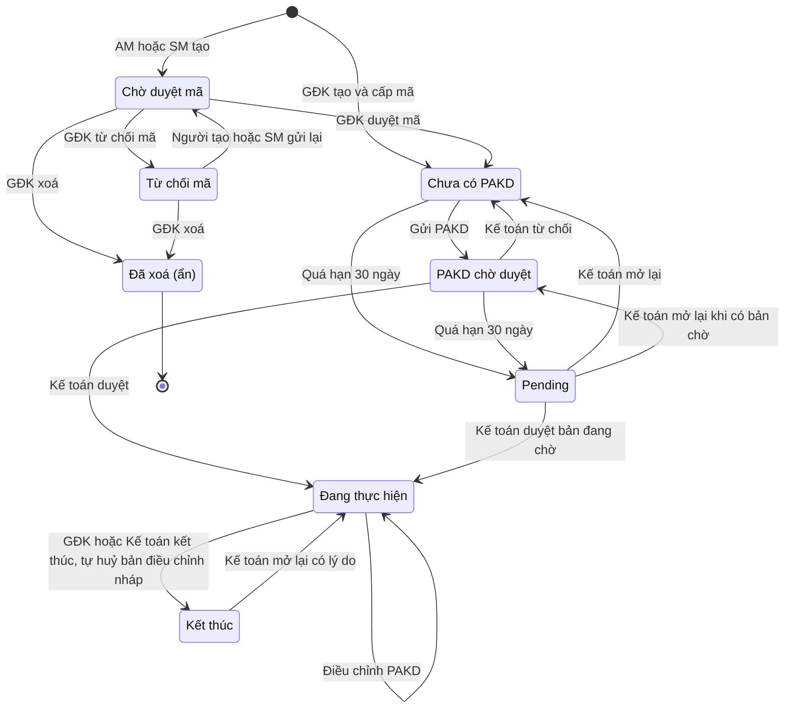
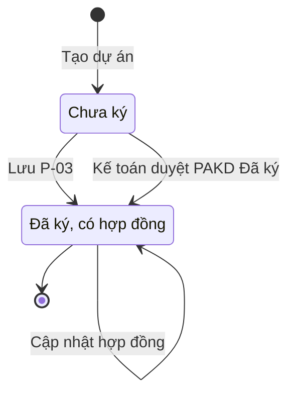
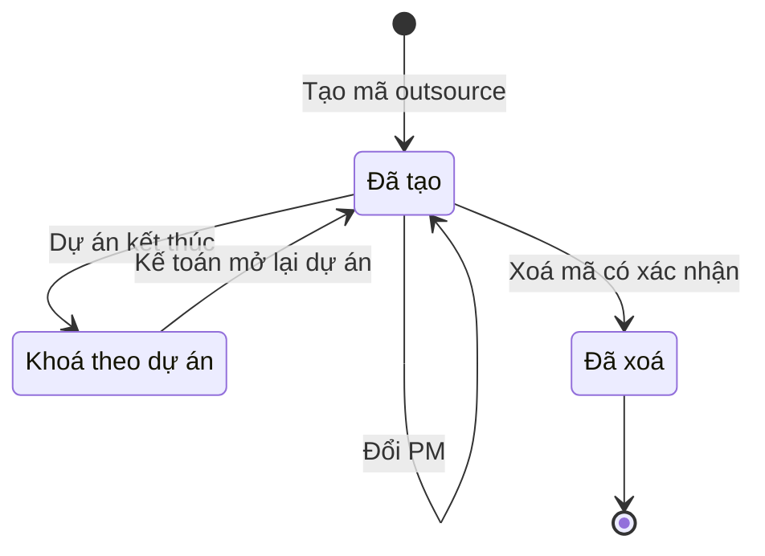

# quan-ly-du-an-kinh-doanh — State Diagrams

> State diagram per entity của feature **quan-ly-du-an-kinh-doanh** (hành vi mục tiêu). Nhãn chuyển trên sơ đồ để ngắn; điều kiện đầy đủ ở bảng dưới mỗi sơ đồ.

## State: Dự án

**Related UC**: [[docs/quan-ly-du-an-kinh-doanh/usecases/uc-tao-du-an.md]], [[docs/quan-ly-du-an-kinh-doanh/usecases/uc-duyet-ma-du-an.md]], [[docs/quan-ly-du-an-kinh-doanh/usecases/uc-tu-choi-ma-du-an.md]], [[docs/quan-ly-du-an-kinh-doanh/usecases/uc-xoa-du-an.md]], [[docs/quan-ly-du-an-kinh-doanh/usecases/uc-ket-thuc-du-an.md]], [[docs/quan-ly-du-an-kinh-doanh/usecases/uc-mo-lai-du-an-ket-thuc.md]], [[docs/quan-ly-du-an-kinh-doanh/usecases/uc-tu-dong-chuyen-pending.md]], [[docs/quan-ly-du-an-kinh-doanh/usecases/uc-mo-lai-du-an-pending.md]]
**Related BR**: BR-quan-ly-du-an-kinh-doanh-001, -003, -004, -009, -010, -011, -012, -013, -035, -042, -043, -044

| Trạng thái | Ý nghĩa | Vào bằng | Ra bằng |
|-----------|---------|----------|---------|
| Chờ duyệt mã | Yêu cầu mở mã của AM / SM, chưa có mã, chưa đếm hạn; P-03 chỉ xem | AM / SM tạo dự án; người tạo dự án hoặc SM của dự án gửi lại sau khi bị từ chối ("Gửi lại yêu cầu mở mã") | GĐK duyệt mã (xác nhận) → Chưa có PAKD; GĐK từ chối mã (có lý do) → Từ chối mã; GĐK xoá (có lý do) → Đã xoá |
| Từ chối mã | GĐK đã từ chối yêu cầu, lý do lưu trên dự án và lịch sử; chưa có mã, không đếm hạn, không tự Pending | GĐK từ chối mã | Người tạo dự án hoặc SM của dự án sửa rồi gửi lại → Chờ duyệt mã; GĐK xoá → Đã xoá |
| Chưa có PAKD | Đã có mã, đang trong hạn 30 ngày (hoặc PAKD bị từ chối, phải làm lại theo hạn gốc) | GĐK tạo; GĐK duyệt mã; Kế toán từ chối bản lập từ "PAKD chờ duyệt"; Kế toán mở lại Pending (không có bản chờ) | Gửi PAKD → PAKD chờ duyệt; tác vụ hằng ngày thấy quá hạn → Pending |
| PAKD chờ duyệt | Đã gửi PAKD, chờ Kế toán; số liệu PAKD chưa đồng bộ vào dự án | Gửi PAKD (feature PAKD); Kế toán mở lại Pending khi bản mới nhất đang chờ | Kế toán duyệt → Đang thực hiện; từ chối → Chưa có PAKD; quá hạn → Pending |
| Đang thực hiện | PAKD đã được Kế toán duyệt, số liệu đã đồng bộ | Kế toán duyệt bản lập / làm lại (từ "PAKD chờ duyệt" hoặc "Pending"); Kế toán mở lại dự án Kết thúc | GĐK / Kế toán kết thúc (khi không có bản điều chỉnh chờ duyệt) → Kết thúc; còn bản điều chỉnh PAKD nháp / bị từ chối thì hộp xác nhận báo trước "Dự án còn bản điều chỉnh PAKD chưa gửi — bản này sẽ bị huỷ.", đồng ý thì tự huỷ bản đó (vẫn được lưu lại), ghi lịch sử "Huỷ bản điều chỉnh PAKD (Kết thúc dự án)" (Phase H Q-23, Q-29). Gửi / duyệt / từ chối bản điều chỉnh không đổi trạng thái |
| Kết thúc | Đã kết thúc; không sửa thông tin cơ bản, không thao tác mã outsource; P-03 chỉ xem, không Import thực tế; vẫn đính kèm / gỡ tài liệu dự án; dòng thông báo chỉ hiện với Kế toán (nút "Mở lại dự án") | GĐK / Kế toán kết thúc dự án (xác nhận) | Kế toán mở lại (xác nhận + lý do bắt buộc) → Đang thực hiện (Phase H Q-41) |
| Pending | Quá hạn lập PAKD mà chưa có bản PAKD được duyệt; ngày đóng = hạn + 1 ngày (NFR-quan-ly-du-an-kinh-doanh-015); P-03, đính kèm, import thực tế làm bình thường | Tác vụ hằng ngày (hạn nhỏ hơn hôm nay, giờ Việt Nam) | Kế toán mở lại → Chưa có PAKD / PAKD chờ duyệt (hạn mới +30); Kế toán duyệt bản đang chờ → Đang thực hiện (xoá ngày đóng). Kế toán **từ chối** bản đang chờ → **giữ Pending** |
| Đã xoá (ẩn) | Xoá mềm: không hiện ở danh sách / Sổ theo dõi / Excel, dữ liệu và nhật ký xoá được giữ | GĐK xoá từ Chờ duyệt mã / Từ chối mã | Không (không có khôi phục) |

### Invalid transitions

| From | To | Why not |
|---|---|---|
| Chưa có PAKD / PAKD chờ duyệt / Đang thực hiện / Pending / Kết thúc | Đã xoá | Chỉ xoá được yêu cầu chưa được duyệt mã (BR-quan-ly-du-an-kinh-doanh-010) |
| Từ chối mã | Chưa có PAKD | GĐK chỉ duyệt mã từ "Chờ duyệt mã"; phải gửi lại trước (BR-quan-ly-du-an-kinh-doanh-042) |
| Chờ duyệt mã / Từ chối mã | Pending | Chưa có mã nên chưa có hạn lập PAKD |
| Đang thực hiện | Pending | Đã có bản PAKD được duyệt (BR-quan-ly-du-an-kinh-doanh-011) |
| Pending | Chưa có PAKD (do Kế toán từ chối PAKD) | Đã chốt giữ Pending; muốn lập lại thì Kế toán mở lại (`phuong-an-kinh-doanh:OQ-15`) |
| Đang thực hiện (có bản điều chỉnh chờ duyệt) | Kết thúc | Phải xử lý bản điều chỉnh trước (BR-quan-ly-du-an-kinh-doanh-013) |
| Đã xoá | bất kỳ | Khôi phục ngoài phạm vi (reverse OQ-24) |

## State: Hợp đồng của dự án

**Related UC**: [[docs/quan-ly-du-an-kinh-doanh/usecases/uc-cap-nhat-ky-hop-dong.md]]
**Related BR**: BR-quan-ly-du-an-kinh-doanh-020, -028, -029, -040, -046, -049

| Trạng thái | Ý nghĩa | Vào bằng | Ra bằng |
|-----------|---------|----------|---------|
| Chưa ký | Nhãn "Chưa ký", nút "Cập nhật ký hợp đồng", cột HĐ đã ký để trống | Tạo dự án | SM / GĐK / Kế toán lưu P-03; Kế toán duyệt PAKD có tình trạng Đã ký khi dự án chưa có HĐ (tạo HĐ ban đầu, version +1, lịch sử "Tạo hợp đồng từ PAKD V{n}") |
| (Đã ký, chưa có chi tiết) | Nhánh hiển thị dự phòng: nhãn "Đã ký", "Chưa có thông tin chi tiết hợp đồng", nút "Bổ sung thông tin HĐ". Không vẽ trên sơ đồ | Không có đường vào trong luồng mục tiêu (mọi cách đặt "Đã ký" đều kèm hợp đồng) — chỉ áp cho dữ liệu chuyển đổi từ bản demo / dữ liệu cũ | Lưu P-03 |
| Đã ký, có hợp đồng | "Số … · ký …", "Thời hạn … → …", nút "Xem / cập nhật hợp đồng" | Lưu P-03; PAKD Đã ký được duyệt (dự án chưa có HĐ) | P-03 không có thao tác bỏ ký. Cập nhật HĐ đưa thông tin sang PAKD theo BR-quan-ly-du-an-kinh-doanh-029 (a)–(g): đã có PAKD được duyệt → sinh bản điều chỉnh chờ duyệt; đã có bản điều chỉnh đang mở → cập nhật Mục 1 của bản đó; chưa có PAKD → chỉ lưu HĐ (không đổi trạng thái HĐ) |

> Đã chốt (Phase H Q-26): không có chuyển "Đã ký, có hợp đồng → Chưa ký" — dự án đã ký thì PAKD không chọn được "Chưa ký" (bản demo đặt lại cờ, giữ dữ liệu HĐ cũ — đã bỏ).

### Invalid transitions

| From | To | Why not |
|---|---|---|
| Đã ký, có hợp đồng | Chưa ký (qua P-03) | P-03 không có thao tác bỏ ký (BR-quan-ly-du-an-kinh-doanh-029) |
| Đã ký, có hợp đồng | Ghi đè bởi PAKD được duyệt | Dự án đã có HĐ thì PAKD không ghi đè, chỉ cảnh báo nếu lệch quá 2% (`phuong-an-kinh-doanh:OQ-20`) |
| bất kỳ | Lưu bởi AM | AM chỉ xem P-03 (BR-quan-ly-du-an-kinh-doanh-049) |
| bất kỳ | Lưu khi dự án "Kết thúc" | P-03 chỉ xem với mọi vai trò khi dự án Kết thúc (BR-quan-ly-du-an-kinh-doanh-029 (f)) |
| Chưa ký | Lưu khi dự án chưa có mã ("Chờ duyệt mã" / "Từ chối mã") | P-03 chỉ xem; hợp đồng nhập sau khi được cấp mã (BR-quan-ly-du-an-kinh-doanh-049 — Phase H Q-39) |
| Đã ký, có hợp đồng | Chưa ký (qua PAKD được duyệt) | Dự án đã ký thì lựa chọn "Chưa ký" bị khoá ở mọi dạng PAKD; cờ không quay về "Chưa ký" (BR-quan-ly-du-an-kinh-doanh-029 — Phase H Q-26) |

## State: Mã outsource

**Related UC**: [[docs/quan-ly-du-an-kinh-doanh/usecases/uc-quan-ly-ma-outsource.md]]
**Related BR**: BR-quan-ly-du-an-kinh-doanh-008, -038

### Điều kiện tạo mã (cấp dự án)

| Tình trạng dự án | Nút "Tạo mã outsource ({n}/2)" | Ghi chú |
|------------------|--------------------------------|---------|
| Chưa có mã tổng ("Chờ duyệt mã" / "Từ chối mã") | Không hiện; khung ghi "Tạo sau khi được cấp mã" | — |
| Có mã tổng, dưới 2 mã đang có, dự án khác "Kết thúc" | Bấm được với SM / GĐK / Kế toán | Mã đầu tiên `{mã tổng}.3`, mã tiếp theo = hậu tố lớn nhất từng cấp + 1; kiểm lại tại lúc tạo (E-quan-ly-du-an-kinh-doanh-030) |
| Có mã tổng, đã có 2 mã đang có | Mờ, chú thích "Tối đa 2 mã outsource" (E-quan-ly-du-an-kinh-doanh-021) | Xoá bớt một mã thì tạo tiếp được với số mới, không dùng lại số đã xoá |
| Dự án "Kết thúc" | Không hiện | Kế toán mở lại dự án thì tạo tiếp được |

> Đã chốt (Phase H Q-49): đã dùng `.3` và `.4` mà một mã đã xoá (còn 1 mã) thì tạo tiếp được `.5` — giới hạn là 2 mã đang có.

### Vòng đời từng mã

| Trạng thái | Ý nghĩa | Vào bằng | Ra bằng |
|-----------|---------|----------|---------|
| Đã tạo | Mã + PM riêng, hiện ở khung Mã dự án; SM / GĐK / Kế toán đổi PM, xoá được | Tạo mã (số mới, không dùng lại số đã xoá) | Đổi PM; xoá (có xác nhận) → Đã xoá; dự án Kết thúc → Khoá theo dự án |
| Khoá theo dự án | Dự án "Kết thúc": mã vẫn hiển thị, không đổi PM / xoá | Dự án kết thúc | Kế toán mở lại dự án → Đã tạo |
| Đã xoá | Mã không còn trên dự án nhưng vẫn được lưu (đã xoá + thời điểm xoá); số hậu tố không được cấp lại; lịch sử "Xoá mã outsource" | Xoá mã | — |

### Invalid transitions

| From | To | Why not |
|---|---|---|
| Đã xoá | Đã tạo (cùng số) | Không dùng lại số đã xoá (reverse OQ-13) |
| (chưa có) | Đã tạo khi dự án "Kết thúc" hoặc chưa có mã tổng | Không tạo mã outsource khi dự án Kết thúc / chưa được cấp mã (reverse OQ-13) |
| Khoá theo dự án | Đã xoá | Không thao tác mã outsource khi dự án Kết thúc (reverse OQ-13) |
| bất kỳ | thao tác bởi AM | Chỉ SM / GĐK / Kế toán (reverse OQ-13) |
