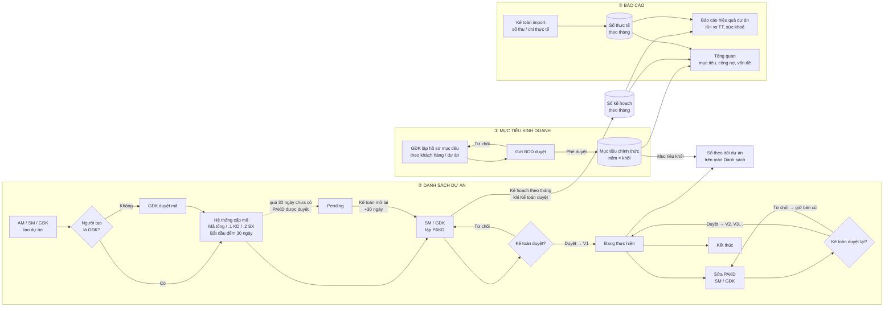
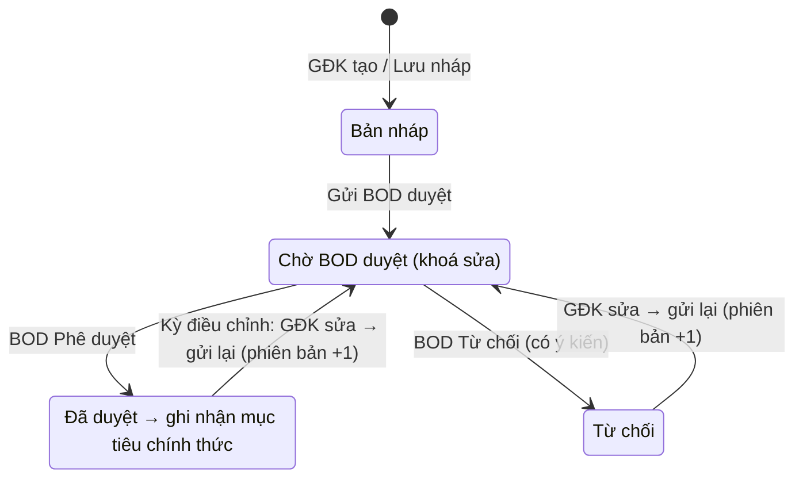
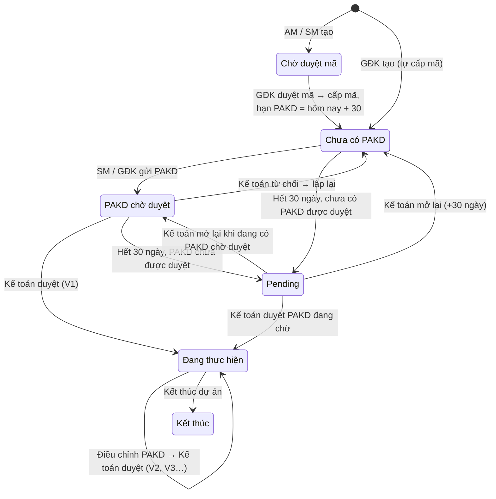
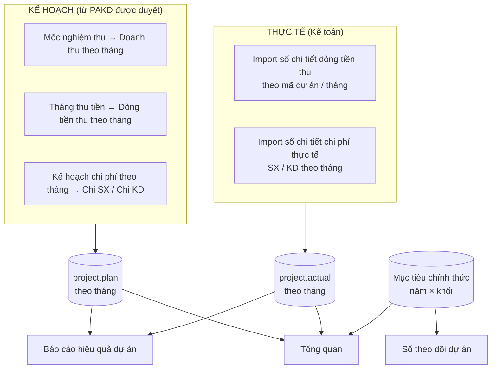

# Luồng nghiệp vụ: Mục tiêu kinh doanh → Danh sách dự án → Báo cáo hiệu quả dự án

**Module:** Quản trị dự án & Tài chính (IMIS – Timesheet)
**Phiên bản tài liệu:** 1.1, ngày 03/10/2026 (cập nhật: sửa dự án trực tiếp trên màn chi tiết, quyền xem / lập PAKD chỉ SM / GĐK, quy tắc xoá dự án, nút thao tác trên đầu trang)
**Đơn vị tiền:** VNĐ. Riêng màn Mục tiêu kinh doanh và màn Tổng quan dùng triệu đồng.

Tài liệu mô tả luồng đang chạy trên hệ thống demo:

1. Đặt mục tiêu năm.
2. Tạo dự án, duyệt mã, lập PAKD, Kế toán duyệt, triển khai, điều chỉnh.
3. Kế toán nhập số thực tế.
4. Báo cáo hiệu quả và tổng quan.

---

## Mục lục

1. [Vai trò và phân quyền](#1-vai-trò-và-phân-quyền)
2. [Sơ đồ luồng tổng thể](#2-sơ-đồ-luồng-tổng-thể)
3. [Màn Mục tiêu kinh doanh](#3-màn-mục-tiêu-kinh-doanh)
4. [Màn Danh sách dự án và Sổ theo dõi dự án](#4-màn-danh-sách-dự-án-và-sổ-theo-dõi-dự-án)
5. [Vòng đời và trạng thái dự án](#5-vòng-đời-và-trạng-thái-dự-án)
6. [Bước 1: Tạo dự án (yêu cầu mở mã)](#6-bước-1--tạo-dự-án-yêu-cầu-mở-mã)
7. [Bước 2: Giám đốc khối duyệt mã](#7-bước-2--giám-đốc-khối-duyệt-mã)
8. [Bước 3: Lập Phương án kinh doanh (PAKD)](#8-bước-3--lập-phương-án-kinh-doanh-pakd)
9. [Bước 4: Kế toán duyệt PAKD, quá hạn Pending](#9-bước-4--kế-toán-duyệt-pakd--quá-hạn-pending)
10. [Bước 5: Sửa dự án và điều chỉnh PAKD (V2, V3…)](#10-bước-5--sửa-dự-án--điều-chỉnh-pakd-v2-v3)
11. [Hợp đồng, tài liệu, mã outsource](#11-hợp-đồng-tài-liệu-mã-outsource)
12. [Dòng dữ liệu sang báo cáo](#12-dòng-dữ-liệu-sang-báo-cáo)
13. [Màn Báo cáo hiệu quả dự án](#13-màn-báo-cáo-hiệu-quả-dự-án)
14. [Màn Tổng quan](#14-màn-tổng-quan-dashboard)
15. [Lịch sử, phiên bản, thông báo](#15-lịch-sử-phiên-bản-thông-báo)
16. [Điểm cần xác nhận và giới hạn hiện tại](#16-điểm-cần-xác-nhận--giới-hạn-hiện-tại)

---

## 1. Vai trò và phân quyền

| Vai trò | Ký hiệu | Mô tả |
|---|---|---|
| Account Manager | **AM** | Người phụ trách khách hàng, khởi tạo dự án |
| Giám đốc kinh doanh | **SM** | Khởi tạo dự án, lập và điều chỉnh PAKD |
| Giám đốc khối | **GĐK** | Duyệt mã dự án, lập và điều chỉnh PAKD, lập mục tiêu khối |
| Kế toán | **CFO** | Duyệt PAKD, mở lại dự án Pending, nhập sổ kế toán (số thực tế) |
| Ban giám đốc | **BOD** | Phê duyệt mục tiêu kinh doanh năm của các khối |
| Hệ thống | — | Sinh mã, đếm hạn 30 ngày, tự chuyển Pending, tính toán, đồng bộ |

### 1.1. Ma trận quyền

| Thao tác | AM | SM | GĐK | CFO | BOD |
|---|:-:|:-:|:-:|:-:|:-:|
| Lập / sửa hồ sơ mục tiêu kinh doanh của khối | | | ✔ | | |
| Phê duyệt / từ chối mục tiêu kinh doanh | | | | | ✔ |
| Tạo dự án (Cấp mã dự án) | ✔ | ✔ | ✔ (tự cấp mã) | | |
| Duyệt mã dự án | | | ✔ | | |
| **Xem PAKD** của dự án | | ✔ | ✔ | ✔ (để duyệt) | |
| Lập PAKD lần đầu (trong 30 ngày) | | ✔ | ✔ | | |
| Duyệt / từ chối PAKD | | | | ✔ | |
| Sửa thông tin cơ bản (nút **Sửa**, sửa trực tiếp trên màn chi tiết) | ✔ | ✔ | ✔ | | |
| Đổi PM (nút **Update PM**) | ✔ | ✔ | ✔ | | |
| Sửa PAKD đã duyệt (nút **Sửa PAKD** trên khung PAKD) | | ✔ | ✔ | | |
| Mở lại dự án Pending | | | | ✔ | |
| Cập nhật ký hợp đồng, đính kèm tài liệu | ✔ | ✔ | ✔ | ✔ | |
| Tạo / sửa mã outsource | ✔ | ✔ | ✔ | ✔ | |
| Kết thúc dự án | ✔ | ✔ | ✔ | ✔ | |
| Xoá dự án (**chỉ khi GĐK chưa duyệt** — trạng thái Chờ duyệt mã) | ✔ | ✔ | ✔ | ✔ | |
| Import sổ kế toán (thu, chi thực tế) | | | | ✔ | |

> Bản demo chọn vai trò bằng ô **"Vai trò"** ở góc trên mỗi màn. Bản chính thức sẽ lấy vai trò theo tài khoản đăng nhập.

---

## 2. Sơ đồ luồng tổng thể



---

## 3. Màn Mục tiêu kinh doanh

**Menu:** Quản trị dự án & Tài chính → **Mục tiêu kinh doanh**. Đây là màn mặc định khi vào hệ thống.

### 3.1. Mục đích

Giám đốc khối đăng ký mục tiêu **giá trị hợp đồng ký mới** và **lợi nhuận gộp** của khối cho năm kế hoạch, chi tiết theo khách hàng / dự án. BOD phê duyệt. Mục tiêu được duyệt trở thành **mục tiêu chính thức** của khối và được dùng làm chuẩn so sánh ở:

- Sổ theo dõi dự án, trên màn Danh sách dự án.
- Màn Tổng quan, ô "Kế hoạch năm".

### 3.2. Hai tab

| Tab | Người dùng | Nội dung |
|---|---|---|
| **GĐK lập mục tiêu** | GĐK | Khối, người lập, năm kế hoạch, trạng thái hồ sơ (phiên bản), tổng giá trị mục tiêu, LN gộp mục tiêu, % LN gộp; biểu đồ giá trị mục tiêu và LN gộp (theo khách hàng / theo thời gian ký HĐ); bảng đăng ký |
| **BOD phê duyệt** | BOD | Danh sách hồ sơ; mở hồ sơ ở chế độ chỉ xem, nhập ý kiến, **Từ chối** (bắt buộc ý kiến) hoặc **Phê duyệt** |

**Các cột của bảng đăng ký:** Khách hàng · Dự án · Ra thầu (MM/YYYY) · Ký HĐ (MM/YYYY) · HĐ ký mới (triệu) · LN gộp (triệu) · % LN gộp · Thuyết minh / cơ sở · Xoá dòng. Có nút **Thêm dòng**.

### 3.3. Kỳ lập và kỳ điều chỉnh

| Thời điểm | Trạng thái |
|---|---|
| 01/12/N → 31/12/N | **Mở** lập mục tiêu năm N+1 |
| Tháng 3, 6, 9, 12 của năm N | **Mở** điều chỉnh mục tiêu năm N (theo quý) |
| Các tháng khác | **Khoá**, chỉ xem |

### 3.4. Trạng thái hồ sơ mục tiêu



- Sửa hồ sơ đã gửi, đã duyệt hoặc bị từ chối thì tạo **phiên bản mới** (Phiên bản 01, 02…).
- Hệ thống lưu lịch sử mọi lần lưu / gửi / duyệt / từ chối, kèm danh sách nội dung đã điều chỉnh. Ví dụ: "Sửa Dự án A1: ký HĐ 02/2027 → 03/2027; HĐ ký mới 18.000 → 20.000".

### 3.5. Đầu ra

Khi BOD phê duyệt:

> **Mục tiêu chính thức [năm][khối] = Σ HĐ ký mới của hồ sơ** (quy đổi triệu → VNĐ)

Giá trị này ghi vào bảng mục tiêu dùng chung, và Sổ theo dõi dự án lấy từ đây. Trên Sổ theo dõi vẫn có nút **"Đặt mục tiêu"** để nhập tay khi chưa có hồ sơ được duyệt.

---

## 4. Màn Danh sách dự án và Sổ theo dõi dự án

**Menu:** Quản trị dự án & Tài chính → **Danh sách dự án**. Tiêu đề màn: "Sổ theo dõi dự án".

### 4.1. Sổ theo dõi dự án (phần đầu màn)

**Ô tổng "Giá trị hợp đồng dự kiến ký năm X":**

| Chỉ tiêu | Công thức |
|---|---|
| Giá trị | Σ giá trị HĐ dự kiến của các dự án ký / dự kiến ký trong năm |
| Mục tiêu năm | Σ mục tiêu chính thức các khối (mục 3.5) |
| Còn thiếu | Mục tiêu − Giá trị |
| Đạt | Giá trị / Mục tiêu × 100% (thanh tiến độ) |

**Bảng "Theo khối so với mục tiêu năm X":**

| Cột | Công thức |
|---|---|
| Giá trị mục tiêu (Z) | Mục tiêu chính thức của khối |
| Giá trị đã ký (AA) | Σ giá trị HĐ của dự án **đã ký**, ngày ký trong năm |
| Giá trị chưa ký (AB) | Σ giá trị HĐ dự kiến của dự án **chưa ký**, dự kiến ký trong năm, chưa Kết thúc / Pending |
| Còn thiếu so với mục tiêu | Z − AA − AB. Âm thì hiển thị "Vượt …" màu xanh |
| % Đạt | (AA + AB) / Z |
| Biểu đồ | Thanh xếp chồng: Đã ký (xanh đậm) + Chưa ký (xanh nhạt), vạch đen = mục tiêu |

### 4.2. Danh sách dự án

- **Bộ lọc** (trong khung danh sách):
  - **Năm**: năm ký HĐ, nếu chưa ký thì năm dự kiến ký, nếu chưa có thì năm tạo.
  - **Khối.**
  - **Tìm kiếm**: mã, tên dự án, khách hàng, PM.
  - **Trạng thái.**
  - **Xuất Excel.**
- **Các cột:** TT · Mã dự án · Tên dự án (nhãn KEY) · Khách hàng · Khối · Loại dự án · Thời điểm dự kiến ký HĐ · Giá trị HĐ dự kiến · PM kinh doanh · PM sản xuất · Trạng thái · Hạn lập PAKD · Phiên bản PAKD · Thao tác.
- **Cột "Hạn lập PAKD":** Còn n ngày / Hết hạn hôm nay / Quá hạn n ngày / Làm lại Vn / Nộp / Duyệt / Pending.
- **Nút Thao tác theo vai trò:**

| Trạng thái | Vai trò | Nút |
|---|---|---|
| Chờ duyệt mã | GĐK | Duyệt mã (mở chi tiết) |
| Chưa có PAKD | SM / GĐK | Lập PAKD (AM / CFO: Xem) |
| PAKD chờ duyệt | CFO | Duyệt (mở cửa sổ duyệt) |
| Đang thực hiện + có bản điều chỉnh chờ duyệt | CFO | Duyệt điều chỉnh |
| Pending | CFO | Mở lại |
| Khác | — | Xem / Cập nhật |

- Nút **"Cấp mã dự án"** (góc trên) chỉ hiện với AM / SM / GĐK.

---

## 5. Vòng đời và trạng thái dự án



| Trạng thái | Ý nghĩa | Màu nhãn |
|---|---|---|
| Chờ duyệt mã | Yêu cầu do AM / SM tạo, chờ GĐK duyệt | Xám |
| Chưa có PAKD | Đã có mã, đang trong hạn 30 ngày lập PAKD | Đỏ nhạt |
| PAKD chờ duyệt | Đã gửi PAKD, chờ Kế toán | Vàng |
| Đang thực hiện | PAKD đã được Kế toán duyệt | Xanh |
| Kết thúc | Đã đóng dự án bình thường | Xám đậm |
| **Pending** | Quá 30 ngày mà PAKD chưa có hoặc chưa được duyệt | Cam |

**Đầu trang màn chi tiết:**
- **← Quay lại** luôn bên trái. Các nút tác vụ luôn bên phải. Không có breadcrumb và tiêu đề.
- Các nút tác vụ theo bước:
  - **Duyệt mã dự án** (GĐK).
  - **Lưu nháp · Gửi Kế toán duyệt** (SM / GĐK khi lập PAKD; không còn nút "Lập PAKD").
  - **Huỷ sửa · Lưu nháp · Gửi Kế toán duyệt điều chỉnh** (SM / GĐK khi sửa PAKD).
  - **Sửa**, **Xoá**.
- **Dòng thông báo bước hiện tại** nằm trong khung đầu trang, nêu rõ bước đang chờ ai. Các nút Duyệt / Từ chối PAKD · Sửa PAKD · Duyệt / Từ chối điều chỉnh · Mở lại dự án · Kết thúc dự án nằm trên dòng này. Vai trò không có quyền chỉ thấy dòng "Đang chờ …".

---

## 6. Bước 1: Tạo dự án (yêu cầu mở mã)

**Ai làm:** AM / SM / GĐK, bấm **"Cấp mã dự án"** trên màn Danh sách.

### 6.1. Bố cục màn tạo (giống màn xem chi tiết)

1. **Đầu trang**:
   - Bên trái: **← Quay lại**. Không có breadcrumb và tiêu đề.
   - Bên phải: Vai trò · Huỷ · nút gửi. Nút gửi ghi **"Gửi GĐK duyệt"** với AM / SM, ghi **"Tạo & cấp mã"** với GĐK.
2. **Hướng dẫn quy trình**, dải xanh nhạt.
3. **Khối Mã dự án**, bảng nhãn | giá trị:

| Cột trái | Cột phải |
|---|---|
| Mã dự án: *Tự sinh sau khi GĐK duyệt* | **Tên dự án \*** + nút **KEY** (dự án trọng điểm) |
| Mã kinh doanh: *tự sinh* | PM kinh doanh (chọn) |
| Mã sản xuất: *tự sinh* | PM sản xuất (chọn) |
| Mã outsource: *tạo sau khi có mã* | PM outsource (chọn, gán mặc định cho mã outsource) |

4. **Thông tin chi tiết dự án**:

| Cột trái | Cột phải |
|---|---|
| Khối \* | Giám đốc kinh doanh |
| Loại dự án \* | Giám đốc khối |
| Tên khách hàng \* (+ **Mới**) | AM (chọn nhiều) |
| Mã khách hàng (tự điền theo khách hàng) | Người tạo (tự động) |
| Thời gian (từ → đến) | Ghi chú |

5. **Hợp đồng & tài liệu** (nằm dưới Thông tin chi tiết dự án, chia 2 cột): trạng thái "Chưa ký", đính kèm tài liệu ngay khi tạo.
6. **Lập PAKD**: ghi chú "mở sau khi GĐK duyệt, có 30 ngày".

### 6.2. Popup "Thêm khách hàng" (nút + Mới)

| Trường | Ràng buộc |
|---|---|
| Tên khách hàng \* | Bắt buộc |
| Nội bộ | Ô tích |
| Mã KH \* | **Đúng 3 ký tự chữ / số**, viết liền, không dấu, tự in hoa, **không trùng** mã đã có |
| Địa chỉ, Email, Số điện thoại, Mô tả | Tuỳ chọn; email phải đúng định dạng nếu có nhập |

Lưu xong, khách hàng mới được chọn sẵn và Mã KH tự điền.

### 6.3. Kiểm tra khi gửi

- Bắt buộc: Tên dự án, Khối, Loại dự án, Khách hàng.
- Ngày kết thúc phải sau ngày bắt đầu.
- Thiếu thông tin thì hiện dòng đỏ liệt kê các mục còn thiếu và tô đỏ từng ô.

### 6.4. Quy tắc sinh mã

| Mã | Quy tắc | Ví dụ |
|---|---|---|
| Mã dự án (mã tổng) | `[Mã KH].[số thứ tự 3 chữ số tiếp theo của khách hàng]` | 022.688 |
| Mã kinh doanh | Mã tổng + `.1` | 022.688.1 |
| Mã sản xuất | Mã tổng + `.2` | 022.688.2 |
| Mã outsource (tối đa 2) | Mã tổng + `.3`, `.4` | 022.688.3 |

- **Mã tổng không gắn PM.** PM gắn với mã KD, mã SX và mã outsource.

### 6.5. Kết quả

| Người tạo | Trạng thái sau khi gửi | Hạn PAKD |
|---|---|---|
| AM / SM | **Chờ duyệt mã** | Chưa đếm |
| GĐK | **Chưa có PAKD**, mã cấp ngay | Hôm nay + 30 ngày |

---

## 7. Bước 2: Giám đốc khối duyệt mã

- **Ai làm:** GĐK, trên thanh thao tác có nút **"Duyệt mã dự án"**.
- **Kết quả:**
  - Hệ thống cấp mã tổng, mã KD, mã SX.
  - Ghi **ngày cấp mã**, trạng thái chuyển **Chưa có PAKD**.
  - **Hạn lập PAKD = ngày duyệt + 30 ngày.**
  - Thông báo: "Đã duyệt — hệ thống cấp mã 022.688 (KD 022.688.1 · SX 022.688.2), hạn lập PAKD dd/mm/yyyy".
- GĐK tự tạo dự án thì bỏ qua bước này.

---

## 8. Bước 3: Lập Phương án kinh doanh (PAKD)

- **Ai làm:** **SM / GĐK**, trong **30 ngày** kể từ ngày GĐK duyệt. **AM không xem được PAKD**: khung PAKD thay bằng dòng 🔒. Kế toán xem để duyệt.
- **Nút:** **Lưu nháp** và **Gửi Kế toán duyệt** nằm **trên đầu trang** màn chi tiết, không nằm ở chân khung PAKD.
- **Ở đâu:** khung **"Lập phương án kinh doanh (PAKD)"** trên màn chi tiết. Khung chỉ hiện sau khi dự án có mã.

### 8.1. Hàng thông tin đầu khung

Người lập · Hạn lập PAKD · Thời gian còn lại · **Trạng thái PAKD**.

| Trạng thái PAKD hiển thị | Khi nào |
|---|---|
| **Chưa có PAKD** | Chưa gửi lần nào (kể cả đã lưu nháp) |
| **Đã có PAKD · chờ Kế toán duyệt** | Đã gửi, chờ Kế toán |
| **Đã duyệt** | Kế toán đã duyệt |
| **Từ chối — làm lại** | Kế toán từ chối, quay về lập lại |
| **Đang điều chỉnh** | SM / GĐK đang sửa PAKD đã duyệt |
| **Chờ duyệt V2 (V3…)** | Đã gửi bản điều chỉnh, chờ Kế toán |
| **Điều chỉnh bị từ chối** | Bản điều chỉnh bị từ chối, bản cũ vẫn áp dụng |

### 8.2. Hai tình trạng PAKD (theo 2 sheet của mẫu Excel)

#### a) Chưa ký hợp đồng (sheet "Lập PAKD (2)")

| Mục | Trường |
|---|---|
| 1. Thông tin dự án | Tình trạng = Chưa ký · Thời điểm dự kiến ký\* · Giá trị HĐ dự kiến\* · Xác suất thành công (%) · Phạm vi công việc\* · Đánh giá rủi ro\* |
| 3. Mốc kế hoạch & mục tiêu | TT · Giai đoạn · Từ · Đến · Tổng mức đầu tư (Sản xuất / Kinh doanh / Tổng) · Kết quả đầu ra · File đính kèm |
| Tổng quan | Doanh thu KH · Lợi nhuận · Biên LN · biểu đồ **cột** dòng tiền chi theo tháng (SX / KD) · tóm tắt chi phí theo tháng (%/Tổng SX, %/Tổng KD, %/Tổng mức đầu tư) |

Chi phí mỗi giai đoạn được **chia đều cho các tháng Từ → Đến**.

#### b) Đã ký hợp đồng (sheet "Lập PAKD")

| Mục | Trường |
|---|---|
| 1. Thông tin dự án | Tình trạng = Đã ký · Số HĐ · Ngày ký trên HĐ · Ngày ký thực tế · Giá trị HĐ\* |
| 2. Tiến độ & phạm vi | Bắt đầu (tháng)\* · Kết thúc (tháng)\* · Số tháng (tự tính) · Phạm vi công việc\* |
| 3. Nghiệm thu, ghi nhận DT & thu tiền | Mốc · Thời điểm · % giá trị HĐ · Giá trị (tự tính) · Tỷ lệ được thanh toán (%) · Giá trị thu đợt này (tự tính) · Thời gian gửi hồ sơ · Điều kiện nghiệm thu · Thời gian chờ (ngày) · Tháng thu tiền (tự tính). Có 4 mốc gợi ý sẵn |
| 4. Kế hoạch chi phí theo tháng | Lưới **khoản mục × tháng** (xem 8.3) |
| Tổng quan | Doanh thu KH · Lợi nhuận · Biên LN (khung tối thiểu 20%) · biểu đồ **Luỹ kế dòng tiền** (cột Thu / Chi + đường LKDT) · tóm tắt chi phí theo 6 nhóm (% doanh thu) |

### 8.3. Kế hoạch chi phí theo tháng (dự án Đã ký)

- **Cột tháng** = kỳ thực hiện ở mục 2 (Bắt đầu → Kết thúc), ví dụ T1/26 … T12/26. Chưa nhập kỳ thì tạm 12 tháng của năm hiện tại.
- **Chia hai khối:**
  - **A. Chi phí sản xuất**, gồm các nhóm Sản xuất, Dự phòng SX, Thưởng SX. Có dòng **Cộng chi phí sản xuất** theo tháng.
  - **B. Chi phí kinh doanh**, gồm các nhóm Kinh doanh, Dự phòng KD, Thưởng KD. Có dòng **Cộng chi phí kinh doanh** theo tháng.
- **Mỗi dòng:** Nhóm · Khoản mục · giá trị từng tháng · **Tổng** · Kết quả đầu ra · File · nút **÷ chia đều** (nhập tổng, hệ thống chia đều cho các tháng trong kỳ) · xoá.
- **Cuối bảng:** **TỔNG CHI PHÍ** theo tháng · **Luỹ kế chi phí**.
- **Khoản mục mẫu:**
  - Sản xuất: Chi phí lương · Thuê ngoài / mua sắm · Dự phòng · Thưởng.
  - Kinh doanh: Chi phí lương · Tiếp khách, công tác · Dự phòng · Thưởng.
- Số liệu nằm ngoài kỳ thực hiện thì cột tháng đó **tô vàng** kèm cảnh báo.

### 8.4. Công thức

| Chỉ tiêu | Công thức |
|---|---|
| Giá trị mốc | Giá trị HĐ × % mốc |
| Giá trị thu đợt | Giá trị mốc × Tỷ lệ được thanh toán |
| Tháng thu tiền | (Thời gian gửi hồ sơ, hoặc Thời điểm mốc) + làm tròn(Thời gian chờ / 30) tháng |
| Doanh thu KH | Đã ký: Giá trị HĐ · Chưa ký: Giá trị HĐ dự kiến |
| Chi phí | Đã ký: Σ kế hoạch chi phí theo tháng · Chưa ký: Σ tổng mức đầu tư các giai đoạn |
| Lợi nhuận | Doanh thu − Chi phí |
| Biên LN | Lợi nhuận / Doanh thu. **Khung tối thiểu 20%**: đạt thì ▲ Đạt, dưới thì ! Dưới khung |
| LKDT tháng t | Dòng thu(t) − Dòng chi(t) + LKDT(t−1) |
| Cảnh báo lệch HĐ | \|Giá trị HĐ − Doanh thu PAKD\| / Doanh thu > **2%** |

### 8.5. Kiểm tra khi gửi Kế toán duyệt

| Tình trạng | Bắt buộc |
|---|---|
| Chung | Phạm vi công việc |
| Đã ký | Giá trị HĐ · Bắt đầu / Kết thúc (kết thúc sau bắt đầu) · **Tổng % các mốc = 100%** · ít nhất 1 khoản chi phí có giá trị · dòng chi phí có tiền phải có tên khoản mục |
| Chưa ký | Thời điểm dự kiến ký · Giá trị HĐ dự kiến · Đánh giá rủi ro · ít nhất 1 mốc kế hoạch có tổng mức đầu tư |

**Nút:** **Lưu nháp** (không đổi trạng thái) · **Gửi Kế toán duyệt**. Sau khi gửi, dự án chuyển **PAKD chờ duyệt**.

### 8.6. Khi gửi PAKD, hệ thống đồng bộ vào dự án

- Doanh thu dự kiến, Chi phí SX / KD kế hoạch.
- Tình trạng đã ký / chưa ký, thời điểm dự kiến ký.
- Thời gian thực hiện.
- **Kế hoạch theo tháng** (doanh thu, tiền thu, chi SX, chi KD), là nguồn cho báo cáo.
- Thông tin hợp đồng, nếu PAKD ở tình trạng Đã ký.

---

## 9. Bước 4: Kế toán duyệt PAKD, quá hạn Pending

### 9.1. Kế toán duyệt

- **Ai làm:** Kế toán (CFO), bấm **"Duyệt / Từ chối PAKD"**. Cửa sổ duyệt hiện: dự án, người nộp, ngày nộp, doanh thu, chi phí, LN gộp, biên, số tháng kế hoạch, ô ý kiến.

| Quyết định | Kết quả |
|---|---|
| **Duyệt** | PAKD thành **V1 · Đã duyệt**, dự án **Đang thực hiện** |
| **Từ chối** (bắt buộc ý kiến) | Dự án về **Chưa có PAKD**; SM / GĐK sửa và gửi lại (vẫn tính V1 khi được duyệt) |

> **Số phiên bản chỉ tăng khi Kế toán duyệt:** V = số bản đã duyệt + 1.

### 9.2. Quá hạn thì chuyển Pending

- **Quy tắc:** hết **30 ngày** kể từ ngày GĐK duyệt mã mà dự án vẫn **chưa có PAKD được Kế toán duyệt** thì hệ thống **tự chuyển "Pending"**. Áp dụng cả khi chưa gửi PAKD lẫn khi đã gửi nhưng Kế toán chưa duyệt. Lịch sử ghi "Tự động chuyển Pending".
- **Xử lý (Kế toán):**
  - **Mở lại dự án**: thêm 30 ngày mới. Trạng thái về Chưa có PAKD, hoặc PAKD chờ duyệt nếu đang có bản chờ.
  - Nếu đang có PAKD chờ, có thể **Duyệt / Từ chối** ngay.
- Dự án Pending hiện trên màn Tổng quan như **vấn đề mức Cao**.

---

## 10. Bước 5: Sửa dự án và điều chỉnh PAKD (V2, V3…)

**Không dùng popup.** Mọi chỉnh sửa làm **trực tiếp trên màn chi tiết**.

### 10.1. Sửa thông tin cơ bản (AM / SM / GĐK)

- Bấm **Sửa** trên đầu trang: các khối Mã dự án, Thông tin chi tiết dự án, Hợp đồng & tài liệu chuyển thành ô nhập ngay tại chỗ.
- Đầu trang đổi thành **Huỷ sửa · Lưu thay đổi**.
- **Đổi PM:** dòng PM kinh doanh / PM sản xuất / PM outsource hiện tên PM hiện tại và nút **"Update PM"**. Bấm vào thì hiện ô chọn PM khác, nút **×** để huỷ đổi.
- Bấm **Lưu thay đổi**: tăng version dự án (v1 → v2…), ghi lịch sử. **Không cần Kế toán duyệt.**

### 10.2. Sửa PAKD đã duyệt (SM / GĐK)

- Bấm **Sửa PAKD** ở góc khung PAKD (hoặc trên dòng thông báo bước hiện tại). Khung PAKD chuyển sang chế độ điều chỉnh ngay trên màn.
- Chỉ áp dụng khi dự án **Đang thực hiện** (PAKD đã duyệt). Vai trò khác chỉ xem.
- Có thể **đổi tình trạng Chưa ký → Đã ký**. Hệ thống điền sẵn:
  - Giá trị HĐ, lấy từ giá trị dự kiến.
  - Kỳ thực hiện, lấy từ các mốc kế hoạch.
  - Kế hoạch chi phí theo tháng, chuyển từ tổng mức đầu tư từng giai đoạn.

  Người dùng nhập tiếp số HĐ, ngày ký, mốc nghiệm thu, chi phí theo tháng. Dự án đã ký thì không chuyển ngược về Chưa ký.
- **Nút** (trên đầu trang): Huỷ sửa · Lưu nháp · **Gửi Kế toán duyệt điều chỉnh**.

```mermaid
sequenceDiagram
    actor SM as SM / GĐK
    participant HT as Hệ thống
    actor KT as Kế toán (CFO)
    SM->>HT: Sửa PAKD (trên khung PAKD) → sửa nội dung
    SM->>HT: Gửi Kế toán duyệt điều chỉnh
    HT-->>HT: Lưu bản điều chỉnh (bản cũ V1 vẫn áp dụng)
    HT-->>SM: Trạng thái PAKD: "Chờ duyệt V2"
    KT->>HT: Duyệt / Từ chối điều chỉnh (so sánh cũ → mới)
    alt Duyệt
        HT-->>HT: Áp số liệu mới vào dự án (DT, CP, HĐ, kế hoạch tháng)
        HT-->>KT: PAKD "V2, đã duyệt"
    else Từ chối
        HT-->>HT: Giữ V1; bản điều chỉnh trả về SM / GĐK sửa tiếp hoặc huỷ
    end
```

- **Trong lúc chờ duyệt:** dự án vẫn "Đang thực hiện", **số liệu dự án giữ theo bản đã duyệt**.
- **Cửa sổ duyệt điều chỉnh** hiện so sánh **cũ → mới**: tình trạng HĐ, doanh thu, chi phí, LN gộp (biên %), số HĐ / ngày ký.
- **Mỗi lần Kế toán duyệt** sinh phiên bản tiếp theo: V2, V3… Bị từ chối rồi gửi lại thì vẫn giữ số phiên bản đó.

---

## 11. Hợp đồng, tài liệu, mã outsource

### 11.1. Cập nhật ký hợp đồng

**Ở đâu:** khung **"Hợp đồng & tài liệu"**, nút **"Cập nhật ký hợp đồng"** / **"Xem / cập nhật hợp đồng"** (mở popup). Khối "Thông tin hợp đồng" ở cuối màn chi tiết **đã bỏ**: xem đầy đủ thông tin HĐ và phụ lục trong popup này.

**Trường:** Số HĐ\* · Ngày ký\* · Giá trị HĐ\* · Thời hạn thực hiện (từ – đến)\* · Lý do lệch so với giá trị đã khai báo (bắt buộc nếu lệch) · Tệp tài liệu · Phụ lục (số, ngày ký, nội dung, file).

**Khi lưu:**
- Dự án chuyển **Đã ký**, version +1, ghi lịch sử.
- **Tự động đồng bộ xuống mục "1. Thông tin dự án" của PAKD**:
  - Tình trạng → Đã ký.
  - Số HĐ.
  - Ngày ký trên HĐ và Ngày ký thực tế.
  - Giá trị HĐ.
  - Bắt đầu / Kết thúc thực hiện, lấy từ thời hạn HĐ.
  - Nếu PAKD đang Chưa ký thì chi phí giai đoạn chuyển sang kế hoạch theo tháng.

  Áp dụng cho cả bản đang áp dụng và bản điều chỉnh đang soạn.

### 11.2. Tài liệu đính kèm

Đính kèm ngay khi tạo, ở màn chi tiết hoặc khi sửa dự án (báo giá, biên bản, hồ sơ cơ hội…). Mỗi lần thêm / xoá đều ghi lịch sử.

### 11.3. Mã outsource

- Tạo sau khi dự án có mã, **tối đa 2 mã** (`.3`, `.4`), bằng nút **"+ Tạo mã outsource (n/2)"** ở khối Mã dự án.
- **PM outsource** chọn từ lúc tạo dự án và gán mặc định cho mã outsource mới. Đổi được PM riêng cho từng mã, hoặc xoá mã.

---

## 12. Dòng dữ liệu sang báo cáo



| Chỉ tiêu | Kế hoạch | Thực tế |
|---|---|---|
| Doanh thu | Giá trị mốc nghiệm thu tại tháng của mốc | Kế toán ghi nhận |
| Dòng tiền thu | Giá trị thu đợt tại tháng thu tiền | Sổ chi tiết dòng tiền thu |
| Chi phí SX / KD | Kế hoạch chi phí theo tháng (Đã ký) / chia đều giai đoạn (Chưa ký) | Sổ chi tiết chi phí |
| Khối lượng công việc | Theo kế hoạch tháng | Theo số thực tế |
| **Tháng chốt số** | — | Tháng mới nhất có số thực tế |

---

## 13. Màn Báo cáo hiệu quả dự án

**Menu:** Quản trị dự án & Tài chính → **Báo cáo hiệu quả dự án**.

### 13.1. Tab "Tổng quan cả khối / công ty"

- **Bộ lọc** (nằm trong khung biểu đồ): Kỳ báo cáo (Từ tháng → Đến tháng) · Phạm vi (Toàn công ty / từng khối) · **Chốt số đến**. Kế hoạch chỉ tính tới tháng chốt để so cùng kỳ với thực tế.
- **5 ô số:** Biên lợi nhuận gộp · Doanh thu · Chi phí · Dòng tiền thu · Khối lượng công việc.
  - Số to là thực tế, bên dưới là kế hoạch và % hoàn thành.
  - Dưới kế hoạch thì đỏ, trên kế hoạch thì xanh. **Riêng Chi phí đảo chiều**, vì vượt kế hoạch là xấu.
- **Biểu đồ cột** "Kế hoạch – Thực tế" của chỉ tiêu đang chọn, theo tháng hoặc theo dự án.
- **Bảng dự án:** KH / TT / Chênh lệch từng chỉ tiêu và cột **Sức khoẻ**; lọc theo mức sức khoẻ.

### 13.2. Quy tắc "Sức khoẻ dự án"

| Mức | Điều kiện |
|---|---|
| **Tốt** | Doanh thu ≥ 95% KH **và** Chi phí ≤ 100% KH **và** Dòng tiền thu ≥ 95% KH |
| **Cần chú ý** | Doanh thu ≤ 85% KH **hoặc** Chi phí ≥ 130% KH **hoặc** Dòng tiền thu ≤ 65% KH |
| **Theo dõi** | Các trường hợp còn lại |
| **Chưa phát sinh** | Chưa có số thực tế trong kỳ |

### 13.3. Tab "Tổng quan dự án"

- Chọn dự án và chỉ tiêu.
- **5 ô:** Tổng KH cả vòng đời · Luỹ kế KH đến kỳ chốt · Luỹ kế TT đến kỳ chốt · Còn lại theo KH · Mức thực hiện luỹ kế.
- Bảng số liệu từng tháng kèm luỹ kế.

### 13.4. Truy vết sổ kế toán

- Bấm vào con số **Dòng tiền thu / Chi phí thực tế** để mở danh sách các dòng sổ kế toán tạo nên số đó.
- Kế toán bấm **"Import sổ kế toán"** để nhập file dòng tiền thu / chi phí thực tế. Dữ liệu các tháng có trong file thay thế dữ liệu cũ, số thực tế của dự án liên quan được tính lại.

---

## 14. Màn Tổng quan (Dashboard)

**Menu:** Quản trị dự án & Tài chính → **Tổng quan**. Lọc theo **Năm**, đơn vị triệu đồng.

| Khối | Nội dung và cách tính |
|---|---|
| Mục tiêu đã xác lập / Kế hoạch năm | **Kế hoạch năm** = Σ HĐ ký mới ở màn Mục tiêu kinh doanh (hồ sơ chưa bị từ chối), hoặc mục tiêu khối nếu chưa có hồ sơ · **Đã xác lập** = Σ giá trị HĐ dự kiến của dự án đã lập PAKD, ký trong năm · **Hoàn thành (đã ký)** = Σ giá trị HĐ đã ký · 2 vòng tròn % · bảng theo khối |
| Công nợ phải thu | Công nợ = DT ghi nhận luỹ kế − tiền đã thu luỹ kế (tiền thu trừ vào DT cũ nhất trước). Hạn thanh toán = cuối tháng ghi nhận DT + 30 ngày. Chia quá hạn 1-30 / 31-60 / > 60 ngày |
| Vấn đề tồn đọng | Tổng số vấn đề, chia mức Cao / Trung bình / Thấp, theo loại; bấm để lọc bảng vấn đề |
| Doanh thu, chi phí, lợi nhuận | 4 ô (so kế hoạch cùng kỳ) · biểu đồ cột KH / TT, chọn chỉ tiêu, xem theo tháng hoặc theo khối |
| Công nợ theo khối / theo khách hàng | Thanh trong hạn / quá hạn, xếp lớn → nhỏ |
| Dòng tiền theo khối qua các tháng | Cột Thu / Chi và đường dòng tiền ròng; bảng khối, bấm để xem riêng từng khối |
| Top 5 dự án hiệu quả / dòng tiền xấu | Theo lợi nhuận thực tế / dòng tiền ròng thấp nhất |
| Top 10 dự án / khách hàng công nợ cao | Công nợ, quá hạn, % quá hạn |
| Các vấn đề cần xử lý | Mức cao trước, cùng mức xếp theo số ngày quá hạn; đổi trạng thái Chưa xử lý / Đang xử lý / Đã xử lý |

**Quy tắc tự phát hiện vấn đề:**

| Mức | Vấn đề |
|---|---|
| **Cao** | Dự án Pending · Công nợ quá hạn > 60 ngày · Chi phí ≥ 130% KH · Dòng tiền thu ≤ 65% KH |
| **Trung bình** | Công nợ quá hạn 31-60 ngày · Chi phí ≥ 110% KH · Doanh thu ≤ 85% KH · Còn ≤ 7 ngày đến hạn PAKD · PAKD bị từ chối · PAKD chờ duyệt quá 5 ngày · Quá thời điểm dự kiến ký mà chưa ký HĐ · Dự án lỗ |
| **Thấp** | Biên LN thực tế < 20% · PAKD chờ duyệt ≤ 5 ngày · Chờ duyệt mã quá 3 ngày |

---

## 15. Lịch sử, phiên bản, thông báo

| Đối tượng | Đánh số | Khi nào tăng |
|---|---|---|
| Version dự án (v1, v2…) | Thanh thông tin màn chi tiết | Sửa thông tin cơ bản · cập nhật hợp đồng · import số liệu |
| Phiên bản PAKD (V1, V2…) | Cột "Phiên bản PAKD", nhãn trạng thái | **Chỉ khi Kế toán duyệt** |
| Phiên bản hồ sơ mục tiêu | Tab GĐK lập mục tiêu | Sửa hồ sơ đã gửi / đã duyệt / bị từ chối |

- **Tab "Lịch sử"** của dự án ghi mọi thao tác kèm thời gian, người làm, nội dung:
  - Tạo dự án, duyệt mã.
  - Lưu nháp, nộp, duyệt, từ chối PAKD; gửi, duyệt, huỷ điều chỉnh.
  - Tự động chuyển Pending, mở lại.
  - Ký / cập nhật HĐ, đính kèm tài liệu.
  - Tạo / xoá mã outsource, đổi PM.
  - Kết thúc dự án.
- Mỗi thao tác hiện thông báo ngắn ở góc phải màn hình.

---

## 16. Điểm cần xác nhận và giới hạn hiện tại

| # | Nội dung | Hiện tại | Cần xác nhận |
|---|---|---|---|
| 1 | Quyền sửa PAKD đã duyệt | SM **và** GĐK | Có giới hạn chỉ GĐK không? |
| 2 | Đồng bộ hợp đồng → PAKD | Ghi thẳng vào PAKD đã duyệt, **không** cần Kế toán duyệt lại | Có cần tạo bản điều chỉnh chờ duyệt không? |
| 3 | Kế hoạch chi phí theo tháng | Chỉ dự án **Đã ký**; Chưa ký nhập theo giai đoạn | Chưa ký có cần nhập theo tháng không? |
| 4 | Pending | Hệ thống tự chuyển khi hết 30 ngày; chỉ Kế toán mở lại | Ai khác được mở lại? |
| 5 | Biên LN tối thiểu, ngưỡng lệch HĐ | 20% · 2% | Cấu hình theo khối / loại dự án? |
| 6 | Hạn thanh toán công nợ | Cuối tháng ghi nhận DT + 30 ngày | Lấy theo điều khoản HĐ? |
| 7 | Vấn đề tồn đọng | Hệ thống tự phát hiện theo quy tắc; trạng thái xử lý chưa lưu | Có màn nhập / theo dõi vấn đề riêng? |
| 8 | Lưu trữ | Bản demo lưu tạm trong trình duyệt (tải lại trang là về dữ liệu mẫu) | Kết nối cơ sở dữ liệu / API |
| 9 | Phân quyền | Chọn vai trò bằng ô "Vai trò" | Lấy theo tài khoản đăng nhập |
| 10 | Xem PAKD | AM không xem; Kế toán vẫn xem để duyệt | Có giữ quyền xem cho Kế toán? |
| 11 | Xoá dự án | Chỉ khi Chờ duyệt mã; vai trò nào cũng xoá được | Giới hạn chỉ người tạo / GĐK? |
