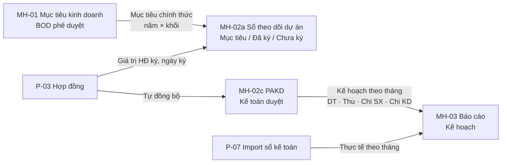

# Mô tả màn hình: Module Quản trị dự án & Tài chính

**Hệ thống:** IMIS – Timesheet
**Phạm vi:** 3 màn hình
- **MH-01** Mục tiêu kinh doanh
- **MH-02** Danh sách dự án, gồm màn tạo, màn chi tiết và các popup
- **MH-03** Báo cáo hiệu quả dự án

**Phiên bản tài liệu:** 1.1, ngày 03/10/2026, mô tả theo bản demo đang chạy
**Tài liệu liên quan:** `Luong_nghiep_vu_Muc_tieu_Du_an_Bao_cao.md` (luồng nghiệp vụ tổng thể)

---

## Lịch sử cập nhật

### Phiên bản 1.1 (03/10/2026)

| # | Màn | Nội dung chỉnh sửa | Mục |
|---|---|---|---|
| 1 | MH-02c | **Bỏ popup "Sửa dự án"**. Bấm **Sửa** thì sửa trực tiếp trên màn chi tiết. Nút **Update PM** để đổi PM | 2.7 |
| 2 | MH-02c | **Sửa PAKD** ngay trên khung PAKD (SM / GĐK), không qua popup | 2.6.3, 2.7 |
| 3 | MH-02 | **AM không xem được PAKD**: khung PAKD thay bằng dòng 🔒. Lập / sửa PAKD chỉ còn **SM / GĐK**. Kế toán vẫn xem để duyệt | 2.6, 2.13 |
| 4 | MH-02c | **Chỉ xoá dự án khi GĐK chưa duyệt** (trạng thái "Chờ duyệt mã"). Đã duyệt thì nút Xoá mờ | 2.5.2 |
| 5 | MH-02c | Khối **"Hợp đồng & tài liệu"** chuyển xuống **dưới** "Thông tin chi tiết dự án", chia 2 cột | 2.5.6 |
| 6 | MH-02c | **Bỏ khối "Thông tin hợp đồng"** (cùng bảng Phụ lục) dưới PAKD. Xem / sửa hợp đồng qua nút **Xem / cập nhật hợp đồng** (P-03) | 2.5.6, 2.8 |
| 7 | MH-02c | Nút **Duyệt mã dự án** (GĐK) lên **đầu trang**, ngay trước nút Sửa | 2.5.2 |
| 8 | MH-02c | **Bỏ nút "Lập PAKD"**. Khi lập PAKD, 2 nút **Lưu nháp** và **Gửi Kế toán duyệt** nằm trên **đầu trang**. Khi sửa PAKD: **Huỷ sửa · Lưu nháp · Gửi Kế toán duyệt điều chỉnh** cũng lên đầu trang. Chân khung PAKD không còn nút | 2.5.2, 2.6.11 |
| 9 | MH-02c | **Dòng thông báo bước hiện tại** chuyển vào **khung đầu trang**, dưới dòng Version / Trạng thái | 2.5.4 |
| 10 | MH-02c | Đầu trang **bỏ tên dự án, Mã dự án, Khối** (đã có ở khối Mã dự án / Thông tin chi tiết) | 2.5.2 |
| 11 | MH-02b, MH-02c | **Bỏ breadcrumb và tiêu đề**. Đầu trang chỉ còn **← Quay lại** bên trái, các nút tác vụ bên phải | 2.3.2, 2.5.2 |
| 12 | MH-02b | Thêm nút **← Quay lại** cho màn tạo dự án | 2.3.2 |
| 13 | Chung | **Nút Quay lại luôn căn trái, nút tác vụ** (Lưu, Sửa, Xoá, Duyệt…) **luôn căn phải**, kể cả khi màn hẹp làm nút xuống dòng | 0.1, 0.3 |
| 14 | MH-01 | Tab BOD phê duyệt: **Quay lại danh sách** bên trái chân khung, **Từ chối / Phê duyệt** bên phải | 1.10 |

### Phiên bản 1.0 (02/10/2026)

Bản mô tả đầu tiên của 3 màn.

---

## Mục lục

- [Lịch sử cập nhật](#lịch-sử-cập-nhật)
0. [Quy ước chung](#0-quy-ước-chung)
1. [MH-01: Mục tiêu kinh doanh](#mh-01-mục-tiêu-kinh-doanh)
2. [MH-02: Danh sách dự án](#mh-02-danh-sách-dự-án)
3. [MH-03: Báo cáo hiệu quả dự án](#mh-03-báo-cáo-hiệu-quả-dự-án)
4. [Liên kết dữ liệu giữa 3 màn](#4-liên-kết-dữ-liệu-giữa-3-màn)
5. [Điểm cần xác nhận](#5-điểm-cần-xác-nhận)

---

## 0. Quy ước chung

### 0.1. Bố cục chuẩn của một màn

**Màn danh sách / báo cáo** (không có nút Quay lại):

```
┌──────────────────────────────────────────────────────────────────────────┐
│ Quản trị dự án & Tài chính › <Tên màn>                    (breadcrumb)   │
│ <TIÊU ĐỀ MÀN>                          [Vai trò ▾] [Nút phụ] [Nút chính] │
│ Meta: Nhãn 1: giá trị · Nhãn 2: giá trị · …                               │
├──────────────────────────────────────────────────────────────────────────┤
│ [Tab 1] [Tab 2]                                     (tab dạng thẻ hồ sơ) │
├──────────────────────────────────────────────────────────────────────────┤
│ ┌ Khung (Panel) ─ tiêu đề + icon ──────────────── [nút của khung] ┐     │
│ │ Nội dung: bảng / lưới thông tin / biểu đồ                       │     │
│ └ Chân khung: ghi chú, nút Lưu / Gửi ─────────────────────────────┘     │
└──────────────────────────────────────────────────────────────────────────┘
                                         ┌───────────────────────────────┐
                                         │ ✔ Thông báo (toast) góc phải  │
                                         └───────────────────────────────┘
```

**Màn tạo / chi tiết** (có nút Quay lại): không có breadcrumb và tiêu đề.

```
┌──────────────────────────────────────────────────────────────────────────┐
│ [← Quay lại]                    [Vai trò ▾] [Nút phụ] [Nút chính] [Xoá]  │
│ Meta: Version · Trạng thái · …                                            │
│ ⓘ Dòng thông báo bước hiện tại (nếu có) ……………………… [nút của bước]       │
└──────────────────────────────────────────────────────────────────────────┘
```

> **Quy tắc vị trí nút:** nút **Quay lại luôn căn trái**. Các nút tác vụ (Lưu, Sửa, Xoá, Duyệt, Gửi…) **luôn căn phải**, kể cả khi màn hẹp làm hàng nút xuống dòng dưới.

### 0.2. Kiểu trường

| Ký hiệu | Kiểu | Cách nhập / hiển thị |
|---|---|---|
| **Text** | Văn bản 1 dòng | Ô nhập tự do |
| **Textarea** | Văn bản nhiều dòng | Ô nhập 3 dòng |
| **Số** | Số tiền / số lượng | Tự định dạng nghìn `1,000,000`, chỉ nhận chữ số |
| **%** | Tỷ lệ | Số thập phân, tối đa 100 |
| **Tháng** | MM/YYYY | Gõ `2/2027`, `02/2027` hoặc `022027`, hệ thống tự chuẩn hoá về `02/2027`. Sai định dạng thì ô tô đỏ |
| **Ngày** | dd/mm/yyyy | Bộ chọn ngày |
| **Chọn** | Danh sách thả xuống | Một giá trị |
| **Chọn nhiều** | Thả xuống + thẻ (chip) | Mỗi lựa chọn thành 1 thẻ, có nút × để bỏ |
| **Ô tích** | Checkbox | Có / Không |
| **File** | Tệp đính kèm | Chọn nhiều tệp; hiện tên, dung lượng, nút xoá |
| **Tự động** | Hệ thống điền / tính | Không sửa được, nền xám nhạt |

- Dấu **\*** đánh dấu trường bắt buộc.
- Khi bấm Lưu / Gửi mà thiếu thông tin:
  - Hiện **dải đỏ** liệt kê các mục còn thiếu.
  - **Tô viền đỏ** từng ô lỗi, kèm dòng chữ đỏ dưới ô.

### 0.3. Nút và màu

| Loại nút | Màu | Dùng cho |
|---|---|---|
| Chính (primary) | Nền xanh `#1f5fa8`, chữ trắng | Gửi duyệt, Duyệt, Lưu thay đổi, Cấp mã, Sửa |
| Phụ (default) | Nền trắng, viền xám | Huỷ, Quay lại, Lưu nháp, Xuất Excel, Kết thúc |
| Nguy hiểm (danger) | Nền đỏ | Từ chối, Xoá |
| Liên kết (link) | Chữ xanh gạch chân | Thao tác trên dòng bảng: Xem, Lập PAKD, Cập nhật |
| Liên kết cần xử lý | Chữ **đỏ đậm** gạch chân | Việc đang chờ người dùng hiện tại: Duyệt, Duyệt điều chỉnh |

- **Vị trí:** Quay lại / Quay lại danh sách nằm **bên trái**. Mọi nút tác vụ nằm **bên phải**.
- Nút ở góc khung (Panel) cũng luôn căn phải.

### 0.4. Đơn vị và định dạng

- **MH-01** dùng **triệu VNĐ**. **MH-02 và MH-03** dùng **VNĐ**. Khối lượng công việc dùng **SP**.
- Số có dấu phẩy ngăn nghìn. Phần trăm lấy 1 chữ số thập phân.
- Ô trống hiển thị **"—"**. Ô chưa phát sinh hiển thị **"–"**.

### 0.5. Vai trò

| Mã | Tên hiển thị trong ô "Vai trò" | Màn sử dụng |
|---|---|---|
| AM | AM (tạo yêu cầu cấp mã) | MH-02 |
| GĐK | GĐK (duyệt mã, lập PAKD) | MH-01 (tab GĐK), MH-02 |
| SM | Giám đốc kinh doanh (SM) | MH-02 |
| CFO | Kế toán (CFO) | MH-02, MH-03 |
| BOD | Ban giám đốc | MH-01 (tab BOD) |

> Bản demo chưa có đăng nhập.
> - MH-02 có ô **"Vai trò"** ở thanh tiêu đề để chuyển vai trò, mặc định **Kế toán (CFO)**.
> - MH-01 tách vai trò theo **tab**.
> - Bản chính thức lấy vai trò theo tài khoản.

### 0.6. Danh mục dùng chung

| Danh mục | Giá trị |
|---|---|
| Khối | G1 · G2 · G3 · G4 · BFSI · GPDV |
| Loại dự án | Fixed Cost · Time & Material · ODC · Cho thuê lao động · Nội bộ |
| Trạng thái dự án | Chờ duyệt mã · Chưa có PAKD · PAKD chờ duyệt · Đang thực hiện · Kết thúc · Pending |
| Nhóm chi phí PAKD | Sản xuất · Kinh doanh · Dự phòng sản xuất · Dự phòng kinh doanh · Thưởng sản xuất · Thưởng kinh doanh |
| Hạn lập PAKD | 30 ngày kể từ ngày cấp mã |
| Biên LN tối thiểu | 20% |
| Ngưỡng lệch HĐ so với PAKD | 2% |
| Số mã outsource tối đa | 2 |

---

## MH-01: Mục tiêu kinh doanh

### 1.1. Thông tin chung

| Mục | Nội dung |
|---|---|
| Menu | Quản trị dự án & Tài chính → **Mục tiêu kinh doanh** (màn mặc định khi mở hệ thống) |
| Breadcrumb | Quản trị dự án & Tài chính › Mục tiêu kinh doanh |
| Người dùng | Giám đốc khối (lập hồ sơ), BOD (phê duyệt) |
| Mục đích | GĐK đăng ký mục tiêu **giá trị HĐ ký mới** và **lợi nhuận gộp** năm kế hoạch của khối, chi tiết theo khách hàng / dự án. BOD phê duyệt, sau đó hệ thống ghi nhận thành **mục tiêu chính thức** của khối |
| Đơn vị | Triệu VNĐ |
| Tab | **GĐK lập mục tiêu** · **BOD phê duyệt (n)**, với n = số hồ sơ đang chờ BOD duyệt |

### 1.2. Bố cục tab "GĐK lập mục tiêu"

```
┌ Mục tiêu kinh doanh ─────────────────────────────────────────────────────────┐
│ [GĐK lập mục tiêu] [BOD phê duyệt (1)]                                       │
├──────────────────────────────────────────────────────────────────────────────┤
│ Khối [G1 ▾]  Năm kế hoạch [2027 ▾]  🔒 Đã khoá — kỳ lập … ☑ Chế độ thử        │
├ ① Mục tiêu kinh doanh ───────────────────────────────────────────────────────┤
│ Khối đăng ký │ Người lập │ Năm kế hoạch │ Trạng thái hồ sơ                    │
│ G1           │ GĐK G1    │ 2027         │ [Bản nháp — Phiên bản 01]           │
├──────────────┬───────────────────────────────────────────────────────────────┤
│ ② Tổng giá   │ ③ Tổng mục tiêu khối        Thời gian [Theo KH|Theo thời gian]│
│   trị mục    │  ┌ Biểu đồ cột ──────────┐  ┌ Chi tiết theo khách hàng ┐       │
│   tiêu       │  │ ▇▅ ▇▅ ▇▅ ▇▅           │  │ KH │ GT │ LN │ %        │       │
│ ② LN gộp     │  └───────────────────────┘  │ TỔNG KHỐI               │       │
│ ② % LN gộp   │                             └─────────────────────────┘       │
├──────────────┴───────────────────────────────────────────────────────────────┤
│ ④ Đăng ký mục tiêu theo khách hàng / dự án                    [+ Thêm dòng]  │
│ STT│Khách hàng│Tên dự án│Ra thầu│Ký HĐ│HĐ ký mới│LN gộp│%LN│Thuyết minh│Xoá  │
│ … TỔNG MỤC TIÊU KHỐI                                                         │
│ GĐK lập hồ sơ → BOD phê duyệt → Ghi nhận …      [Lưu nháp] [Gửi BOD duyệt]   │
├──────────────────────────────────────────────────────────────────────────────┤
│ ⑤ Lịch sử điều chỉnh (n)                                                     │
└──────────────────────────────────────────────────────────────────────────────┘
```

### 1.3. Thanh chọn hồ sơ

| Trường | Kiểu | Giá trị / Quy tắc |
|---|---|---|
| Khối | Chọn | 6 khối. Đổi khối thì nạp hồ sơ của khối + năm tương ứng; chưa có thì tạo hồ sơ trống |
| Năm kế hoạch | Chọn | Năm hiện tại và năm sau. **Mặc định:** quý 4 (tháng 10–12) chọn năm sau, các quý khác chọn năm hiện tại |
| Nhãn kỳ lập | Tự động | Xanh 🔓 "Đang mở kỳ lập / điều chỉnh …" hoặc xám 🔒 "Đã khoá — kỳ … tiếp theo …" (xem 1.9) |
| Chế độ thử: bỏ qua khoá kỳ | Ô tích | Chỉ hiện khi kỳ đang khoá; mặc định **đã tích** để thử chức năng. Bỏ tích thì áp dụng khoá kỳ thật |

### 1.4. Khung ① "Mục tiêu kinh doanh" (thông tin hồ sơ)

| Trường | Kiểu | Nguồn |
|---|---|---|
| Khối đăng ký | Tự động | Theo thanh chọn |
| Người lập | Tự động | "GĐK <khối>" |
| Năm kế hoạch | Tự động | Theo thanh chọn |
| Trạng thái hồ sơ | Nhãn màu | `<Trạng thái> — Phiên bản NN`. Bản nháp: xám · Chờ BOD duyệt: vàng · Đã duyệt: xanh lá · Từ chối: đỏ |

**Dòng thông báo trong khung:**
- **Chờ BOD duyệt** (chữ cam): "Hồ sơ đang chờ BOD duyệt — không sửa được cho tới khi BOD phê duyệt hoặc từ chối."
- **Từ chối** (dải đỏ): "BOD từ chối: "<ý kiến>" — điều chỉnh và gửi lại (phiên bản mới)."

### 1.5. Ô số ② và khung ③ "Tổng mục tiêu khối"

| Ô | Công thức | Ghi chú |
|---|---|---|
| Tổng giá trị mục tiêu | Σ HĐ ký mới các dòng | triệu VNĐ · HĐ ký mới |
| Lợi nhuận gộp mục tiêu | Σ LN gộp các dòng | triệu VNĐ |
| % Lợi nhuận gộp | LN gộp / Giá trị mục tiêu | Xanh nếu ≥ 20% |

**Biểu đồ cột nhóm**, 1 trục, triệu VNĐ:
- 2 cột mỗi nhóm: **Giá trị mục tiêu** (xanh `#1f5fa8`) · **LN gộp** (cam `#e0883a`).
- Nút gạt **Thời gian**:
  - **Theo khách hàng**: mỗi nhóm là 1 khách hàng.
  - **Theo thời gian ký HĐ**: mỗi nhóm là 1 tháng ký MM/YYYY, xếp tăng dần.
- Rê chuột vào nhóm hiện hộp: tên nhóm, Giá trị mục tiêu, LN gộp (% LN gộp).
- Chưa có dòng nào thì hiện "Chưa có dữ liệu đăng ký."

**Bảng "Chi tiết mục tiêu theo khách hàng":** Khách hàng · Giá trị mục tiêu · LN gộp · % LN gộp. Dòng cuối là **TỔNG KHỐI**.

### 1.6. Khung ④ "Đăng ký mục tiêu theo khách hàng / dự án"

**Tiêu đề cột:** 2 tầng.
- Nhóm **Thời điểm dự kiến**: Ra thầu, Ký HĐ.
- Nhóm **Chỉ tiêu đăng ký (triệu VNĐ)**: HĐ ký mới, LN gộp mục tiêu, % LN gộp mục tiêu.

| # | Cột | Kiểu | Bắt buộc khi gửi | Quy tắc |
|---|---|---|:-:|---|
| 1 | STT | Tự động | | Số thứ tự |
| 2 | Khách hàng | Text + gợi ý | ✔ | Gợi ý từ khách hàng của các dự án và các hồ sơ mục tiêu khác; vẫn nhập được tên mới |
| 3 | Tên dự án | Text | ✔ | |
| 4 | Ra thầu | Tháng | | MM/YYYY |
| 5 | Ký HĐ | Tháng | ✔ | MM/YYYY |
| 6 | HĐ ký mới | Số | ✔ (> 0) | triệu VNĐ |
| 7 | LN gộp mục tiêu | Số | | Không được lớn hơn HĐ ký mới |
| 8 | % LN gộp mục tiêu | Tự động | | LN gộp / HĐ ký mới |
| 9 | Cơ sở đăng ký / Thuyết minh kế hoạch | Text | | |
| 10 | Xoá | Nút × | | Xoá cả dòng. Khi khoá sửa thì nút mờ, kèm lý do |

- **Dòng tổng:** TỔNG MỤC TIÊU KHỐI, gồm Σ HĐ ký mới, Σ LN gộp, % LN gộp.
- **Nút "+ Thêm dòng":** có ở góc khung và dưới bảng. Thêm 1 dòng trống. Khi khoá sửa thì nút mờ, kèm lý do:
  - "Hồ sơ đang chờ BOD duyệt — không sửa được", hoặc
  - "Ngoài kỳ lập / điều chỉnh mục tiêu — đã khoá".
- Bảng trống thì hiện "Chưa có dự án đăng ký. Bấm "+ Thêm dòng"."

**Chân khung:**
- Bên trái là ghi chú quy trình: "GĐK lập hồ sơ → BOD phê duyệt → Ghi nhận kế hoạch chính thức".
- Ở giữa là dòng lỗi đỏ, nếu có.
- Bên phải là các nút:

| Nút | Loại | Điều kiện hiện | Xử lý |
|---|---|---|---|
| Lưu nháp | Phụ | Được sửa. Mờ khi chưa có thay đổi so với bản đã lưu | Lưu không kiểm tra, trạng thái **Bản nháp**, ghi lịch sử "Lưu nháp" / "Tạo hồ sơ" |
| Gửi BOD duyệt | Chính | Được sửa | Kiểm tra (1.7) rồi chuyển **Chờ BOD duyệt**, ghi lịch sử kèm nội dung đã điều chỉnh |

### 1.7. Kiểm tra khi "Gửi BOD duyệt"

Hệ thống kiểm tra theo thứ tự và dừng ở lỗi đầu tiên:

| Điều kiện | Thông báo |
|---|---|
| Không có dòng nào | "Chưa có dự án đăng ký." |
| Dòng thiếu Khách hàng / Tên dự án / Ký HĐ / HĐ ký mới | "Dòng n: nhập đủ Khách hàng, Tên dự án, Ký HĐ và HĐ ký mới." |
| LN gộp > HĐ ký mới | "Dòng n: LN gộp không được lớn hơn giá trị HĐ ký mới." |

### 1.8. Khung ⑤ "Lịch sử điều chỉnh (n)"

| Cột | Nội dung |
|---|---|
| Thời gian | dd/mm/yyyy hh:mm, mới nhất lên đầu |
| Người thực hiện | Ví dụ "namnv (GĐK G1)", "namnv (BOD)" |
| Thao tác | Tạo hồ sơ · Lưu nháp · Gửi BOD duyệt · BOD phê duyệt — ghi nhận kế hoạch chính thức · BOD từ chối |
| Phiên bản | 01, 02… |
| Nội dung điều chỉnh / Ý kiến | Danh sách thay đổi so với bản đã gửi gần nhất. Ví dụ: "Thêm Dự án X — KH A: 5,000 tr"; "Sửa Dự án A1: ký HĐ 02/2027 → 03/2027; HĐ ký mới 18,000 → 20,000"; "Xoá Dự án B2 — KH B". Kèm ý kiến BOD in nghiêng |

### 1.9. Quy tắc kỳ lập, phiên bản, trạng thái

**Kỳ lập / điều chỉnh** (theo ngày hiện tại):

| Thời điểm | Năm kế hoạch được mở | Nhãn |
|---|---|---|
| Tháng 12/N | N+1 | "Đang mở kỳ lập mục tiêu năm N+1 (01/12/N – 31/12/N)" |
| Tháng 3, 6, 9, 12 của năm N | N | "Đang mở kỳ điều chỉnh quý q năm N" |
| Các tháng khác | — | "Đã khoá — kỳ lập mục tiêu năm … mở từ 01/12/…" hoặc "Đã khoá — kỳ điều chỉnh tiếp theo: tháng …" |

**Được sửa** khi kỳ đang mở (hoặc bật chế độ thử) **và** hồ sơ không ở trạng thái Chờ BOD duyệt.

**Phiên bản:** sửa và lưu một hồ sơ đã ở trạng thái Chờ BOD duyệt / Đã duyệt / Từ chối thì **phiên bản +1**. Sửa bản nháp thì giữ phiên bản.

**Chuyển trạng thái:**

| Từ | Thao tác | Sang |
|---|---|---|
| (mới) / Bản nháp | Lưu nháp | Bản nháp |
| Bản nháp / Từ chối / Đã duyệt | Gửi BOD duyệt | Chờ BOD duyệt |
| Chờ BOD duyệt | BOD Phê duyệt | Đã duyệt → **ghi mục tiêu chính thức của khối = Σ HĐ ký mới × 1.000.000 (VNĐ)** |
| Chờ BOD duyệt | BOD Từ chối | Từ chối |

### 1.10. Tab "BOD phê duyệt"

#### a) Danh sách hồ sơ

Khung **"Hồ sơ mục tiêu kinh doanh"**. Chân khung ghi: "Bấm vào một hồ sơ để xem và phê duyệt. ĐVT: triệu VNĐ".

| Cột | Nội dung |
|---|---|
| Khối | In đậm |
| Năm kế hoạch | |
| Người lập | |
| Trạng thái hồ sơ | Nhãn màu + phiên bản |
| Số dự án | Số dòng đăng ký |
| Tổng giá trị mục tiêu · LN gộp · % LN gộp | Tính từ các dòng |
| Cập nhật | Thời gian thao tác gần nhất |
| (thao tác) | **Duyệt** (đỏ đậm) với hồ sơ Chờ BOD duyệt, còn lại là **Xem** |

- **Sắp xếp:** hồ sơ Chờ BOD duyệt lên đầu, sau đó năm giảm dần, sau đó khối A → Z.
- Bấm vào dòng để mở chi tiết.

#### b) Chi tiết hồ sơ (chỉ xem)

Các khung: **Mục tiêu kinh doanh** (thông tin hồ sơ) → **Ô số + Tổng mục tiêu khối** → **Bảng đăng ký** (chỉ đọc, không có cột Xoá) → **Ý kiến BOD** → **Lịch sử điều chỉnh**.

**Khung "Ý kiến BOD — bắt buộc nếu từ chối":**

| Thành phần | Khi hồ sơ Chờ BOD duyệt | Khi hồ sơ ở trạng thái khác |
|---|---|---|
| Ô ý kiến | Textarea 3 dòng, "Nhập ý kiến của BOD…" | Dòng chữ "Hồ sơ đang ở trạng thái <TT> — ý kiến BOD: "…"" |
| Nút Quay lại danh sách (**bên trái** chân khung) | ✔ | ✔ |
| Nút Từ chối (đỏ, **bên phải**) | ✔. Bắt buộc ý kiến, không nhận chuỗi rỗng / chỉ khoảng trắng | — |
| Nút Phê duyệt (chính, **bên phải**) | ✔. Ý kiến không bắt buộc | — |

Lỗi khi từ chối không có ý kiến: "Từ chối bắt buộc nhập ý kiến (không chấp nhận nội dung trống hoặc chỉ có khoảng trắng)."

### 1.11. Thông báo (toast)

| Thao tác | Nội dung |
|---|---|
| Lưu nháp | Đã lưu nháp |
| Gửi BOD duyệt | Đã gửi BOD duyệt mục tiêu G1 năm 2027 |
| Phê duyệt | BOD đã phê duyệt mục tiêu G1 năm 2027 — ghi nhận kế hoạch chính thức |
| Từ chối | BOD đã từ chối mục tiêu G1 năm 2027 |

### 1.12. Phân quyền

| Chức năng | GĐK | BOD |
|---|:-:|:-:|
| Xem / lập / sửa hồ sơ khối, Lưu nháp, Gửi BOD duyệt | ✔ | |
| Xem danh sách hồ sơ, Phê duyệt, Từ chối | | ✔ |

---

## MH-02: Danh sách dự án

### 2.1. Thông tin chung

| Mục | Nội dung |
|---|---|
| Menu | Quản trị dự án & Tài chính → **Danh sách dự án** |
| Người dùng | AM, SM (Giám đốc kinh doanh), GĐK, Kế toán (CFO) |
| Mục đích | Theo dõi giá trị hợp đồng so với mục tiêu năm, quản lý vòng đời dự án: tạo, duyệt mã, PAKD, Kế toán duyệt, triển khai, điều chỉnh, kết thúc |
| Đơn vị | VNĐ |

**Các màn con:**

| Mã | Màn / Popup | Mở từ |
|---|---|---|
| MH-02a | Danh sách dự án (Sổ theo dõi dự án) | Menu |
| MH-02b | Yêu cầu mở mã dự án (tạo dự án) | Nút **Cấp mã dự án** |
| MH-02c | Chi tiết dự án | Bấm vào dòng dự án / link thao tác |
| P-01 | Popup Thêm khách hàng | Nút **+ Mới** cạnh Tên khách hàng |
| (bỏ) | ~~Popup Sửa dự án~~ → **sửa trực tiếp trên MH-02c** (2.7) | Nút **Sửa** / **Sửa PAKD** trên MH-02c |
| P-03 | Popup Cập nhật ký hợp đồng | Nút HĐ trên MH-02c / cột "Trạng thái", "Tệp" trên MH-02a |
| P-04 | Popup Duyệt PAKD | Link **Duyệt** / **Duyệt điều chỉnh** (MH-02a), nút **Duyệt / Từ chối PAKD** (MH-02c) |
| P-05 | Popup Đặt mục tiêu khối | Nút **Đặt mục tiêu** trên Sổ theo dõi |

---

### 2.2. MH-02a: Danh sách dự án

#### 2.2.1. Bố cục

```
┌ Quản trị dự án & Tài chính › Danh sách dự án ────────────────────────────────┐
│ SỔ THEO DÕI DỰ ÁN                         [👤 Vai trò: Kế toán (CFO) ▾] [+ Cấp mã dự án] │
├────────────────────────┬─────────────────────────────────────────────────────┤
│ ① Giá trị HĐ dự kiến   │ ② Theo khối so với mục tiêu năm 2026  ■Đã ký □Chưa ký │Mục tiêu [Đặt mục tiêu] │
│    ký năm 2026         │ Khối │ So với mục tiêu │ GT mục tiêu │ Đã ký │ Chưa ký │ Còn thiếu │ %Đạt │
│      125,000,000,000   │ G1   │ ███▒▒▒▒│        │ …                                │
│ Mục tiêu năm  …        │ …                                                   │
│ Còn thiếu     …        │                                                     │
│ Đạt           …%  ▓▓▓░ │                                                     │
├────────────────────────┴─────────────────────────────────────────────────────┤
│ ③ Danh sách dự án   Năm[2026▾] Khối[Tất cả▾] [🔍 Tìm…] [Tất cả trạng thái▾] [Xuất Excel] │
│ TT│Mã DA│Tên DA│KH│Khối│Loại│Dự kiến ký│GT dự kiến│PM KD│PM SX│TT│Hạn PAKD│Phiên bản│Thao tác│ Thông tin HĐ đã ký (6 cột) │
│ … Tổng cộng (n dự án)                                                        │
│ n / N dự án · Đang xem với vai trò … · Bấm vào dòng để xem chi tiết …         │
└──────────────────────────────────────────────────────────────────────────────┘
```

#### 2.2.2. Thanh tiêu đề

| Thành phần | Mô tả |
|---|---|
| Tiêu đề | **Sổ theo dõi dự án** |
| Vai trò | Chọn: AM / GĐK / SM / Kế toán (CFO). Mặc định CFO |
| Cấp mã dự án | Nút chính. **Chỉ hiện với AM / SM / GĐK**. Mở MH-02b. Chú thích khi rê chuột: GĐK "GĐK tạo → mã được cấp ngay"; AM / SM "AM / SM tạo → chờ GĐK duyệt mã" |

#### 2.2.3. Khung ① "Giá trị hợp đồng dự kiến ký năm X"

Lọc theo **Năm** và **Khối** của khung ③. Năm = "Tất cả" thì tiêu đề thành "(tất cả các năm)", nhãn thành "Mục tiêu luỹ kế".

| Dòng | Công thức | Hiển thị |
|---|---|---|
| Giá trị (số to) | Σ Giá trị HĐ dự kiến của dự án ký / dự kiến ký trong năm | VNĐ |
| Mục tiêu năm | Σ mục tiêu chính thức các khối (từ MH-01 hoặc P-05) | |
| Còn thiếu | Mục tiêu − Giá trị | Đỏ nếu > 0; "Vượt …" xanh nếu âm |
| Đạt | Giá trị / Mục tiêu | Thanh tiến độ; xanh khi ≥ 100% |

#### 2.2.4. Khung ② "Theo khối so với mục tiêu năm X"

| Cột | Công thức / Hiển thị |
|---|---|
| Khối | 6 khối |
| So với mục tiêu | Thanh xếp chồng: Đã ký (xanh đậm) + Chưa ký (xanh nhạt), vạch đen = mục tiêu. Rê chuột hiện số |
| Giá trị mục tiêu (Z) | Mục tiêu chính thức của khối |
| Giá trị đã ký (AA) | Σ giá trị HĐ ký của dự án **đã ký**, ngày ký trong năm |
| Giá trị chưa ký (AB) | Σ giá trị HĐ dự kiến của dự án **chưa ký**, dự kiến ký trong năm, chưa Kết thúc / Pending |
| Giá trị còn thiếu so với mục tiêu | Z − AA − AB. Âm thì hiện "Vượt …" xanh |
| % Đạt | (AA + AB) / Z |

- **Nút "Đặt mục tiêu"** mở P-05.
- **Chân khung** ghi chú công thức.

#### 2.2.5. Khung ③ "Danh sách dự án": bộ lọc

| Bộ lọc | Kiểu | Quy tắc |
|---|---|---|
| Năm | Chọn | "Tất cả" + các năm có dự án hoặc có mục tiêu. Mặc định năm hiện tại. **Năm của dự án** = năm ký HĐ, nếu chưa ký thì năm dự kiến ký, nếu chưa có thì năm tạo |
| Khối | Chọn | Tất cả + 6 khối |
| Tìm kiếm | Text | Tìm trong Mã dự án, Tên dự án, Mã / Tên khách hàng, PM KD, PM SX (không phân biệt hoa thường) |
| Trạng thái | Chọn | "Tất cả trạng thái" + 6 trạng thái kèm **số đếm** (đếm theo các bộ lọc còn lại) |
| Xuất Excel | Nút phụ | Xuất các dòng đang lọc ra file `du-an-kinh-doanh.xlsx` (sheet *DuAn*), gồm toàn bộ cột trừ "Thao tác" |

#### 2.2.6. Khung ③: các cột

Bảng rộng, cuộn ngang. **Bấm vào dòng** để mở MH-02c.

| # | Cột | Nội dung / Quy tắc hiển thị |
|---|---|---|
| 1 | TT | Số thứ tự |
| 2 | Mã dự án | Mã tổng, font mono. Chưa có thì hiện "Chờ cấp mã" (xám) |
| 3 | Tên dự án | In đậm, kèm nhãn ⭐ **KEY** nếu là dự án trọng điểm |
| 4 | Tên khách hàng | |
| 5 | Khối | |
| 6 | Loại dự án | |
| 7 | Thời điểm dự kiến ký HĐ | dd/mm/yyyy |
| 8 | Giá trị hợp đồng dự kiến | VNĐ = Doanh thu dự kiến (lấy từ PAKD khi nộp) |
| 9 | PM Kinh doanh | |
| 10 | PM sản xuất | |
| 11 | Trạng thái | Nhãn màu (2.8) |
| 12 | Hạn lập PAKD | Xem bảng dưới |
| 13 | Phiên bản PAKD | `V1, chờ CFO` / `V1, đã duyệt` / `V2, từ chối` (đỏ) / "—" |
| 14 | Thao tác | Link theo trạng thái + vai trò (2.2.7) |
| | **Nhóm "Thông tin hợp đồng đã ký"** | |
| 15 | Giá trị hợp đồng ký | Đã ký thì lấy giá trị HĐ (hoặc giá trị dự kiến nếu chưa nhập HĐ). Chưa ký thì "—" |
| 16 | Số hợp đồng | |
| 17 | Ngày ký | Ngày ký HĐ, hoặc ngày dự kiến ký nếu đã ký mà chưa có ngày |
| 18 | Ngày hết hạn | Đến ngày của thời hạn HĐ, hoặc ngày kết thúc dự án |
| 19 | Tệp | 📎 "n tệp", bấm mở P-03 |
| 20 | Trạng thái | Link **Đã ký** (xanh lá) / **Chưa ký** (xanh dương), bấm mở P-03 |

**Cột "Hạn lập PAKD":**

| Tình huống | Hiển thị |
|---|---|
| Chờ duyệt mã | — |
| Pending | **Pending** + ngày |
| Chưa có PAKD, bị Kế toán từ chối | **Làm lại V(n+1)** (cam) + "Vn bị từ chối dd/mm/yyyy" |
| Chưa có PAKD, chưa có hạn | Chưa đặt hạn |
| Chưa có PAKD, còn hạn | **Còn n ngày**, chữ cam khi ≤ 3 ngày |
| Chưa có PAKD, đúng hạn / quá hạn | **Hết hạn hôm nay** / **Quá hạn n ngày** (đỏ) |
| PAKD chờ duyệt | Nộp (V1) / Nộp vN + ngày nộp |
| Đã duyệt | Duyệt + ngày duyệt |

**Dòng tổng:** "Tổng cộng (n dự án)", gồm Σ Giá trị HĐ dự kiến và Σ Giá trị HĐ ký.

**Chân khung:** "n / N dự án · Đang xem với vai trò … · Bấm vào dòng để xem chi tiết, bấm "Đã ký / Chưa ký" để cập nhật hợp đồng".

#### 2.2.7. Link "Thao tác" theo trạng thái và vai trò

| Trạng thái | Vai trò | Link | Bấm vào |
|---|---|---|---|
| Chờ duyệt mã | GĐK | **Duyệt mã** | Mở MH-02c |
| Chờ duyệt mã | Khác | Xem | Mở MH-02c |
| Chưa có PAKD | SM / GĐK | Lập PAKD | Mở MH-02c |
| Chưa có PAKD | AM / CFO | Xem | Mở MH-02c |
| PAKD chờ duyệt | CFO | **Duyệt** (đỏ) | Mở P-04 ngay trên danh sách |
| PAKD chờ duyệt | Khác | Xem | Mở MH-02c |
| Đang thực hiện, có bản điều chỉnh chờ duyệt | CFO | **Duyệt điều chỉnh** (đỏ) | Mở P-04 |
| Đang thực hiện | Khác | Cập nhật | Mở MH-02c |
| Pending | CFO | Mở lại | Mở MH-02c |
| Pending | Khác | Xem | Mở MH-02c |
| Kết thúc | — | (không có) | |

---

### 2.3. MH-02b: Yêu cầu mở mã dự án (tạo dự án)

**Mở từ:** nút "Cấp mã dự án" (AM / SM / GĐK). Bố cục **giống màn chi tiết** (MH-02c), các ô nhập ngay tại chỗ.

#### 2.3.1. Bố cục

```
┌──────────────────────────────────────────────────────────────────────────────┐
│ [← Quay lại]                         [Vai trò ▾] [× Huỷ] [➤ Gửi GĐK duyệt]   │
│ Version: Mới · Trạng thái: Đang soạn · Người tạo: namnv                      │
├──────────────────────────────────────────────────────────────────────────────┤
│ ⓘ Hướng dẫn quy trình: AM / SM gửi yêu cầu → GĐK duyệt → … → Pending.       │
├ # Mã dự án ──────────────────────────────────────────────────────────────────┤
│ Mã dự án      │ Tự sinh sau khi GĐK duyệt │ Tên dự án *  │ [__________] [⭐KEY]│
│ Mã kinh doanh │ Tự sinh …                 │ PM kinh doanh│ [— Chọn — ▾]        │
│ Mã sản xuất   │ Tự sinh …                 │ PM sản xuất  │ [— Chọn — ▾]        │
│ Mã outsource  │ Tạo sau khi được cấp mã   │ PM outsource │ [— Chọn — ▾]        │
├ Thông tin chi tiết dự án ─────────────────────────┬ Hợp đồng & tài liệu ─────┤
│ Khối *        │[▾]       │ Giám đốc kinh doanh│[▾] │ HỢP ĐỒNG  [Chưa ký]      │
│ Loại dự án *  │[▾]       │ Giám đốc khối      │[▾] │ TÀI LIỆU ĐÍNH KÈM (n)    │
│ Tên KH *      │[▾][+Mới] │ AM                 │[▾] │ [📎 Đính kèm tài liệu]   │
│ Mã khách hàng │ (tự điền)│ Người tạo          │ …  │                          │
│ Thời gian     │[ngày→ngày]│ Ghi chú           │[_] │                          │
├ Lập phương án kinh doanh (PAKD) ─────────────────────────────────────────────┤
│ ⓘ Phần nhập PAKD mở sau khi GĐK duyệt — có 30 ngày …                         │
└────────────────────────────────────────────────────── [× Huỷ] [➤ Gửi GĐK duyệt] ┘
```

#### 2.3.2. Thanh tiêu đề

| Thành phần | Vị trí | Mô tả |
|---|---|---|
| **← Quay lại** | Trái | Về danh sách, không lưu |
| Vai trò | Phải | Đổi vai trò ngay khi đang tạo. Nút gửi đổi theo vai trò |
| Huỷ | Phải | Về danh sách, không lưu |
| Nút gửi | Phải | AM / SM: **Gửi GĐK duyệt**. GĐK: **Tạo & cấp mã** |
| Meta | Dòng dưới | Version "Mới" · Trạng thái "Đang soạn" · Người tạo |

> Đầu trang **không có breadcrumb và tiêu đề**, chỉ có nút Quay lại bên trái và các nút tác vụ bên phải.

- **Dải hướng dẫn** (xanh nhạt):
  - AM / SM: "AM / SM gửi yêu cầu → Giám đốc khối duyệt → hệ thống cấp Mã dự án / Mã KD / Mã SX → SM / GĐK lập PAKD trong 30 ngày → Kế toán (CFO) duyệt; quá hạn chưa được duyệt → dự án Pending."
  - GĐK: "Giám đốc khối tạo → hệ thống cấp mã ngay (bỏ bước duyệt mã) → …"
- **Dải lỗi** (đỏ, sau khi bấm gửi): "Còn n thông tin cần bổ sung: Nhập tên dự án · Chọn khối · …"

#### 2.3.3. Khung "Mã dự án"

| Bên trái | Kiểu | Bên phải | Kiểu | Quy tắc |
|---|---|---|---|---|
| Mã dự án | Tự động | **Tên dự án \*** | Text + nút **KEY** | Con trỏ đặt sẵn vào ô. Nút KEY bật / tắt "dự án trọng điểm" (nền vàng khi bật) |
| Mã kinh doanh | Tự động | PM kinh doanh | Chọn | Danh sách PM KD đã có |
| Mã sản xuất | Tự động | PM sản xuất | Chọn | Danh sách PM SX đã có |
| Mã outsource | Ghi chú | PM outsource | Chọn | Gán mặc định cho mã outsource khi được tạo |

Các ô mã hiện *"Tự sinh sau khi GĐK duyệt"*, còn mã outsource hiện *"Tạo sau khi được cấp mã (tối đa 2 mã)"*.

#### 2.3.4. Khung "Thông tin chi tiết dự án"

| Trường | Kiểu | Bắt buộc | Quy tắc / Nguồn |
|---|---|:-:|---|
| Khối | Chọn | ✔ | 6 khối. Lỗi: "Chọn khối" |
| Loại dự án | Chọn | ✔ | 5 loại. Lỗi: "Chọn loại dự án" |
| Tên khách hàng | Chọn + link **+ Mới** | ✔ | Danh sách khách hàng đã có. **+ Mới** mở P-01. Lỗi: "Chọn khách hàng" |
| Mã khách hàng | Tự động | | Theo khách hàng đã chọn. Chưa chọn thì hiện "Theo khách hàng" |
| Thời gian | Ngày → Ngày | | Lỗi nếu ngày kết thúc trước ngày bắt đầu: "Ngày kết thúc phải sau ngày bắt đầu" |
| Giám đốc kinh doanh | Chọn | | |
| Giám đốc khối | Chọn | | |
| AM | Chọn nhiều | | Mỗi AM là 1 thẻ có nút × |
| Người tạo | Tự động | | Tài khoản đang tạo |
| Ghi chú | Text | | |

> Danh sách người (PM, GĐ, AM) và khách hàng **tạm lấy từ các dự án đã có** vì chưa có danh mục nhân sự / khách hàng riêng.

#### 2.3.5. Khung "Hợp đồng & tài liệu" và "Lập PAKD"

- **Hợp đồng:** nhãn "Chưa ký", ghi chú "Cập nhật ký hợp đồng trên màn chi tiết sau khi dự án được cấp mã."
- **Tài liệu đính kèm (n):** nút **Đính kèm tài liệu**, chọn nhiều tệp, có nút xoá từng tệp.
- **Lập PAKD:** chỉ ghi chú.
  - AM / SM: "mở sau khi Giám đốc khối duyệt — có 30 ngày kể từ ngày duyệt…"
  - GĐK: "mở ngay sau khi tạo — có 30 ngày kể từ ngày cấp mã…"
- Cuối màn lặp lại 2 nút **Huỷ** và nút gửi.

#### 2.3.6. Kết quả khi gửi

| Người tạo | Trạng thái | Mã | Hạn PAKD | Thông báo |
|---|---|---|---|---|
| AM / SM | Chờ duyệt mã | Chưa cấp | Chưa đếm | Đã gửi yêu cầu mở mã dự án — chờ GĐK duyệt |
| GĐK | Chưa có PAKD | Cấp ngay | Hôm nay + 30 ngày | Đã cấp mã 022.688 — GĐK lập PAKD trước dd/mm/yyyy |

Gửi xong, hệ thống chuyển sang **MH-02c** của dự án vừa tạo. Tệp đính kèm được lưu và ghi lịch sử.

**Quy tắc sinh mã:**

| Mã | Quy tắc | Ví dụ |
|---|---|---|
| Mã dự án | `[Mã KH].[số thứ tự tiếp theo 3 chữ số của khách hàng]` | 022.688 |
| Mã kinh doanh | Mã dự án + `.1` | 022.688.1 |
| Mã sản xuất | Mã dự án + `.2` | 022.688.2 |
| Mã outsource | Mã dự án + `.3`, `.4` | 022.688.3 |

### 2.4. P-01: Popup "Thêm khách hàng"

```
┌ Thêm khách hàng ───────────────────────────────────── × ┐
│ Tên khách hàng *  [____________________]   Nội bộ [☐]   │
│ Mã KH *           [___]        Địa chỉ  [___________]   │
│ Email             [________]   Số điện thoại [_______]  │
│ Mô tả             [_________________________________]   │
│                                        [Huỷ] [💾 Lưu]   │
└──────────────────────────────────────────────────────────┘
```

| Trường | Kiểu | Bắt buộc | Quy tắc / Thông báo lỗi |
|---|---|:-:|---|
| Tên khách hàng | Text | ✔ | "Nhập tên khách hàng" |
| Nội bộ | Ô tích | | |
| Mã KH | Text, tối đa 3 ký tự | ✔ | Tự in hoa, tự bỏ khoảng trắng. Phải **đúng 3 ký tự chữ / số**: "Mã KH gồm đúng 3 ký tự chữ / số, viết liền, không dấu". **Không trùng**: "Mã khách hàng đã tồn tại" |
| Địa chỉ | Text | | |
| Email | Text | | Có nhập thì phải đúng định dạng: "Email không hợp lệ" |
| Số điện thoại | Text | | |
| Mô tả | Textarea | | |

- **Phím tắt:** Enter = Lưu (trừ khi đang ở ô Mô tả). Esc = Đóng.
- **Lưu:** khách hàng mới được **chọn sẵn** ở ô Tên khách hàng, Mã KH tự điền.

---

### 2.5. MH-02c: Chi tiết dự án

#### 2.5.1. Bố cục

```
┌──────────────────────────────────────────────────────────────────────────────┐
│ [← Quay lại]      [Vai trò ▾] [nút theo bước*] [✎ Sửa] [🗑 Xoá]              │
│ Version v3 · Trạng thái [Chưa có PAKD] · PAKD — · Cập nhật …                 │
│ ⓘ Dự án cần lập PAKD. Hạn lập: 01/11/2026 (còn 29 ngày) — nhập PAKD bên dưới │
│   rồi bấm Gửi Kế toán duyệt ở góc phải.                 [nút của bước, nếu có] │
└──────────────────────────────────────────────────────────────────────────────┘
┌ # Mã dự án ──────────────────────────────────────── [+ Tạo mã outsource (0/2)] ┐
│ Mã dự án      │ 022.688    │ Tên dự án     │ <tên> ⭐KEY                       │
│ Mã kinh doanh │ 022.688.1  │ PM kinh doanh │ …                                 │
│ Mã sản xuất   │ 022.688.2  │ PM sản xuất   │ …                                 │
│ Mã outsource  │ 022.688.3  │ PM outsource  │ [— Chọn PM — ▾] 🗑                 │
├──────────────────────────────────────────────────────────────────────────────┤
│ [Thông tin dự án] [Lịch sử (n)]                                              │
├ Thông tin chi tiết dự án ────────────────────────────────────────────────────┤
│ Khối │ … │ Giám đốc kinh doanh │ …                                           │
│ …  (5 hàng × 2 cột)                                                          │
├ Hợp đồng & tài liệu ─────────────────────────────────────────────────────────┤
│ HỢP ĐỒNG                              │ TÀI LIỆU ĐÍNH KÈM (n)                │
│ [Chưa ký] Chưa có thông tin ký HĐ     │ [📎 Đính kèm tài liệu]               │
│ [Cập nhật ký hợp đồng]                │ tệp 1 · tệp 2 …                      │
├ Lập phương án kinh doanh (PAKD) ─────────────────────────────────────────────┤
│ (xem 2.6; AM thấy dòng 🔒)                                                    │
└──────────────────────────────────────────────────────────────────────────────┘
```

> \* **Nút theo bước** trên đầu trang (xem 2.5.2): **Duyệt mã dự án** (GĐK, Chờ duyệt mã) · **Lưu nháp + Gửi Kế toán duyệt** (SM / GĐK đang lập PAKD) · **Huỷ sửa + Lưu nháp + Gửi Kế toán duyệt điều chỉnh** (SM / GĐK đang sửa PAKD).
>
> - Khối **"Hợp đồng & tài liệu"** nằm **ngay dưới** "Thông tin chi tiết dự án", rộng hết màn và chia 2 cột Hợp đồng | Tài liệu đính kèm. Áp dụng cho cả màn chi tiết và màn tạo.
> - **Không còn** khối "Thông tin hợp đồng" ở cuối màn.

#### 2.5.2. Thanh tiêu đề

Đầu trang **không có breadcrumb, tiêu đề, tên dự án, Mã dự án, Khối** (đã có ở khối Mã dự án và Thông tin chi tiết dự án).

| Thành phần | Vị trí | Mô tả |
|---|---|---|
| **← Quay lại** | Trái | Về MH-02a. Ẩn khi đang sửa thông tin dự án (khi đó bên trái hiện chữ "Sửa dự án") |
| Vai trò | Phải | Đổi vai trò để thao tác thử |
| **Duyệt mã dự án** | Phải, trước nút Sửa | Nút chính. **Chỉ GĐK khi dự án "Chờ duyệt mã"**. Bấm thì cấp Mã dự án / Mã KD / Mã SX, hạn PAKD = hôm nay + 30 ngày |
| **Lưu nháp · Gửi Kế toán duyệt** | Phải, trước nút Sửa | **SM / GĐK khi dự án "Chưa có PAKD"** (đang lập / lập lại PAKD). Thay cho nút "Lập PAKD" trước đây. Gửi mà thiếu thông tin thì màn tự cuộn xuống khung PAKD để hiện danh sách lỗi |
| **Huỷ sửa · Lưu nháp · Gửi Kế toán duyệt điều chỉnh** | Phải, trước nút Sửa | **SM / GĐK khi đang sửa PAKD đã duyệt**. "Huỷ sửa" thành "Huỷ bản điều chỉnh" khi đã có bản điều chỉnh lưu nháp |
| **Sửa** | Phải | Nút chính. **Chỉ AM / SM / GĐK**. Chuyển màn sang **chế độ sửa trực tiếp** (2.7), không mở popup |
| Huỷ sửa · Lưu thay đổi | Phải | Thay cho các nút trên khi đang sửa thông tin dự án |
| Xoá | Phải, cuối cùng | Nút đỏ. **Chỉ xoá được khi Giám đốc khối chưa duyệt (trạng thái "Chờ duyệt mã")**. Hỏi xác nhận "Xoá dự án "<tên>"?" rồi xoá và về danh sách. Đã duyệt / đã cấp mã thì nút mờ, chú thích "Dự án đã được Giám đốc khối duyệt — không xoá được" |
| Meta | Dòng dưới | Version (vN) · Trạng thái (nhãn màu) · PAKD (phiên bản; ẩn với AM) · Cập nhật (thời gian) |
| Dòng thông báo bước hiện tại | Cuối khung đầu trang | Xem 2.5.4 |

#### 2.5.3. Khung "Mã dự án"

| Trái | Phải |
|---|---|
| Mã dự án: mã tổng to, xanh. Chưa có thì hiện "Chờ GĐK duyệt" | Tên dự án + KEY |
| Mã kinh doanh | PM kinh doanh |
| Mã sản xuất | PM sản xuất |
| Mã outsource 1, 2: mỗi mã 1 dòng. Chưa có thì hiện "Chưa có (tối đa 2 mã)" / "Tạo sau khi được cấp mã" | PM outsource: **chọn PM riêng cho từng mã** + nút 🗑 xoá mã. Chưa có mã thì hiện PM outsource mặc định |

- **Nút "+ Tạo mã outsource (n/2)":** chỉ hiện khi đã có mã tổng, mờ khi đủ 2 mã.
  - Mã mới = mã tổng + `.3` / `.4`.
  - PM mặc định = PM outsource của dự án.
- **Mã tổng không gắn PM.**
- Mọi thao tác tạo / đổi PM / xoá mã outsource đều ghi lịch sử.

#### 2.5.4. Dòng thông báo bước hiện tại (trong khung đầu trang)

Dòng này nằm **trong khung đầu trang**, ngay dưới dòng Version / Trạng thái. Ẩn khi đang sửa thông tin dự án hoặc khi không có thông báo (ví dụ dự án Kết thúc).
- **Vai trò có quyền:** dải xanh nhạt gồm nội dung + nút (nếu có).
- **Vai trò không có quyền:** dải xám "Đang chờ <ai làm gì>. Đổi "Vai trò" ở góc trên nếu bạn là người thực hiện bước này."

| Trạng thái | Vai trò | Nội dung | Nút |
|---|---|---|---|
| Chờ duyệt mã | GĐK | "Yêu cầu mở mã dự án đang chờ Giám đốc khối duyệt — bấm **Duyệt mã dự án** ở góc phải…" | — (nút nằm bên phải đầu trang, cạnh nút Sửa) |
| Chờ duyệt mã | Khác | Đang chờ Giám đốc khối duyệt mã dự án | — |
| Chưa có PAKD | SM / GĐK | "Dự án cần lập phương án kinh doanh (PAKD). Hạn lập: dd/mm/yyyy (còn n ngày / quá hạn n ngày) — nhập PAKD bên dưới rồi bấm **Gửi Kế toán duyệt** ở góc phải." Nếu bị từ chối: "PAKD Vn bị từ chối (lý do) — cần lập lại…" | — (Lưu nháp / Gửi Kế toán duyệt nằm bên phải đầu trang; **không còn nút "Lập PAKD"**) |
| Chưa có PAKD | AM / CFO | Đang chờ SM / Giám đốc khối lập PAKD (hạn …) | — |
| PAKD chờ duyệt | CFO | PAKD Vn đang chờ Kế toán (CFO) duyệt | **Duyệt / Từ chối PAKD** (P-04) |
| Đang thực hiện, có bản điều chỉnh chờ duyệt | CFO | Bản điều chỉnh PAKD Vn đang chờ Kế toán duyệt lại | **Duyệt / Từ chối điều chỉnh** (P-04) |
| Đang thực hiện | SM / GĐK | Có thể sửa PAKD (cập nhật đã ký HĐ, thông tin HĐ, chi phí), Kế toán duyệt lại. Nếu đang có bản điều chỉnh: "đang soạn" / "bị Kế toán từ chối" | **Sửa PAKD** / **Tiếp tục sửa PAKD** (mở chế độ sửa ngay trên khung PAKD) · **Kết thúc dự án** |
| Đang thực hiện | AM / CFO | — | **Kết thúc dự án** |
| Pending | CFO | "Dự án Pending: quá 30 ngày (hạn …) chưa có PAKD được duyệt. Kế toán mở lại để có thêm 30 ngày" | **Duyệt / Từ chối PAKD** (nếu có bản chờ) · **Mở lại dự án** |
| Pending | Khác | Đang chờ Kế toán mở lại dự án Pending | — |

- **Kết thúc dự án:** hỏi xác nhận, chuyển trạng thái Kết thúc.
- **Mở lại dự án:** hạn mới = hôm nay + 30 ngày. Trạng thái về Chưa có PAKD, hoặc PAKD chờ duyệt nếu đang có bản chờ.

#### 2.5.5. Tab "Thông tin dự án": khung "Thông tin chi tiết dự án"

Lưới 2 cột kiểu bảng nhãn | giá trị, chỉ xem:

| Trái | Phải |
|---|---|
| Khối | Giám đốc kinh doanh |
| Loại dự án | Giám đốc khối |
| Tên khách hàng | AM (nhiều người, ngăn bằng dấu phẩy) |
| Mã khách hàng | Người tạo |
| Thời gian (dd/mm/yyyy → dd/mm/yyyy) | Ghi chú |

#### 2.5.6. Khung "Hợp đồng & tài liệu" (dưới Thông tin chi tiết dự án)

| Cột | Thành phần | Mô tả |
|---|---|---|
| **Hợp đồng** | Nhãn | **Đã ký** (xanh lá) / **Chưa ký** (xám) |
| | Dòng mô tả | Có HĐ: "Số <số HĐ> · ký dd/mm/yyyy" + "Thời hạn … → …". Chưa có: "Chưa có thông tin ký hợp đồng" |
| | Nút | **Cập nhật ký hợp đồng** (chưa ký) / **Bổ sung thông tin HĐ** (đã ký, chưa nhập chi tiết) / **Xem / cập nhật hợp đồng** (đã có HĐ). Mở P-03, nơi xem đầy đủ số HĐ, giá trị, chênh lệch, lý do lệch, tệp và phụ lục |
| **Tài liệu đính kèm (n)** | Nút "Đính kèm tài liệu" | Chọn nhiều tệp. Lưu ngay, ghi lịch sử "Thêm <tên tệp>" |
| | Danh sách tệp | Tên, dung lượng, mở xem, nút xoá. Xoá ghi lịch sử "Xoá <tên tệp>" |

> Khối **"Thông tin hợp đồng"** (bảng số HĐ, giá trị, chênh lệch, phụ lục) ở cuối màn **đã bỏ**. Thông tin này xem và sửa trong popup P-03.

#### 2.5.7. Tab "Lịch sử (n)"

**Bảng "Lịch sử thay đổi"**, mới nhất lên đầu: STT · Thời gian · Người thực hiện · Thao tác · Ghi chú.

**Ghi nhận:**
- Tạo dự án, duyệt mã.
- Lưu nháp / nộp / duyệt / từ chối PAKD; gửi / duyệt / huỷ điều chỉnh.
- Tự động chuyển Pending, mở lại.
- Ký / cập nhật HĐ, đính kèm / xoá tài liệu.
- Tạo / xoá mã outsource, đổi PM.
- Sửa thông tin cơ bản, kết thúc dự án.

---

### 2.6. Khung "Lập phương án kinh doanh (PAKD)"

**Hiện trên MH-02c** khi dự án đã có mã (khác "Chờ duyệt mã"). **Chỉ SM / GĐK (lập, sửa) và Kế toán (duyệt) xem được.** Vai trò **AM không xem được PAKD**: thay khung PAKD bằng dòng 🔒 "PAKD của dự án chỉ hiển thị với Giám đốc kinh doanh (SM), Giám đốc khối và Kế toán duyệt."; thanh tiêu đề cũng ẩn mục "PAKD".

#### 2.6.1. Bố cục

```
┌ Lập phương án kinh doanh (PAKD) ─────────────────────────────────────────────┐
│ Người lập │ Hạn lập PAKD │ Thời gian còn lại │ Trạng thái PAKD [Chưa có PAKD] │
│ (dải thông báo điều chỉnh / dải lỗi)                                         │
│ [Doanh thu kế hoạch] [Lợi nhuận] [Biên lợi nhuận ▲ Đạt]                       │
│ ┌ Biểu đồ dòng tiền ─────────────┐ ┌ Tóm tắt chi phí ─────────┐               │
│ └────────────────────────────────┘ └──────────────────────────┘               │
│ 1. Thông tin dự án                                                           │
│ 2. Tiến độ và phạm vi (Đã ký)                                                │
│ 3. Nghiệm thu… (Đã ký) / 3. Mốc kế hoạch và mục tiêu (Chưa ký)               │
│ 4. Kế hoạch chi phí theo tháng (Đã ký)                                       │
│ Kế hoạch cập nhật thông tin hợp đồng sau khi lập PAKD                        │
│ <ghi chú quy trình> · Lưu lần cuối …        [Lưu nháp] [➤ Gửi Kế toán duyệt] │
└──────────────────────────────────────────────────────────────────────────────┘
```

#### 2.6.2. Hàng thông tin đầu khung

| Trường | Nội dung |
|---|---|
| Người lập | Người lưu PAKD gần nhất / người nộp / tài khoản hiện tại |
| Hạn lập PAKD | dd/mm/yyyy |
| Thời gian còn lại | Còn n ngày / Hết hạn hôm nay / Quá hạn n ngày, đỏ khi ≤ 3 ngày. Đã nộp thì hiện "Đã nộp" |
| Trạng thái PAKD | Nhãn màu theo bảng dưới |

| Trạng thái PAKD | Khi nào |
|---|---|
| **Chưa có PAKD** | Chưa gửi lần nào (kể cả đã lưu nháp) |
| **Đã có PAKD · chờ Kế toán duyệt** | Đã gửi lần đầu, chờ Kế toán |
| **Đã duyệt** | Kế toán đã duyệt |
| **Từ chối — làm lại** | Kế toán từ chối bản lập lần đầu |
| **Đang điều chỉnh** | SM / GĐK đang sửa PAKD đã duyệt |
| **Chờ duyệt V2 (V3…)** | Đã gửi bản điều chỉnh |
| **Điều chỉnh bị từ chối** | Bản điều chỉnh bị từ chối, bản cũ vẫn áp dụng |

#### 2.6.3. Quyền sửa khung PAKD

| Tình huống | Ai sửa được |
|---|---|
| Chưa có PAKD (lần đầu / làm lại sau từ chối) | SM / GĐK, ngay trên MH-02c |
| PAKD chờ duyệt / Pending | Không ai, chỉ xem |
| Đang thực hiện | **SM / GĐK**: bấm **Sửa PAKD** (góc khung PAKD hoặc dòng thông báo bước hiện tại) để sửa ngay trên khung; nút Lưu nháp / Gửi duyệt điều chỉnh nằm trên đầu trang. Vai trò khác chỉ xem |

#### 2.6.4. Chỉ số, biểu đồ, tóm tắt

| Ô | Công thức | Hiển thị |
|---|---|---|
| Doanh thu kế hoạch | Đã ký: Giá trị HĐ · Chưa ký: Giá trị HĐ dự kiến | Ghi chú "theo hợp đồng đã ký" / "theo giá trị dự kiến" |
| Lợi nhuận | Doanh thu − Tổng chi phí | Đỏ nếu âm |
| Biên lợi nhuận | Lợi nhuận / Doanh thu | ≥ 20% thì **▲ Đạt** (xanh); dưới thì **! Dưới khung** (đỏ) |

**Biểu đồ:**
- Đã ký: **Luỹ kế dòng tiền**. Cột Dòng thu / Dòng chi, đường LKDT = Dòng thu − Dòng chi + số dư kỳ trước.
- Chưa ký: **Dòng tiền chi theo tháng**. Cột Sản xuất / Kinh doanh.
- Rê chuột hiện số từng tháng.

**Tóm tắt chi phí:**
- Đã ký: bảng 6 nhóm chi phí, gồm Số tiền và % doanh thu. Dòng cuối là TỔNG CHI PHÍ.
- Chưa ký: bảng theo tháng, gồm Sản xuất, %/Tổng SX, Kinh doanh, %/Tổng KD, %/Tổng mức đầu tư.

#### 2.6.5. Mục 1: Thông tin dự án

| Trường | Kiểu | Bắt buộc | Hiện khi |
|---|---|:-:|---|
| Tình trạng dự án | Chọn: Đã ký / Chưa ký | ✔ | Luôn hiện. Đang điều chỉnh mà bản đã duyệt là Đã ký thì **không chọn lại được Chưa ký** |
| Số hợp đồng | Text, ví dụ "HĐ-022/688/2026" | | Đã ký |
| Ngày ký trên hợp đồng | Ngày | | Đã ký |
| Ngày ký thực tế | Ngày | | Đã ký |
| Giá trị hợp đồng (VNĐ) | Số | ✔ | Đã ký |
| Thời điểm dự kiến ký | Tháng | ✔ | Chưa ký |
| Giá trị hợp đồng dự kiến (VNĐ) | Số | ✔ | Chưa ký |
| Xác suất thành công (%) | %, mặc định 50 | | Chưa ký |
| Phạm vi công việc | Textarea | ✔ | Chưa ký (với Đã ký nằm ở mục 2) |
| Đánh giá rủi ro | Textarea | ✔ | Chưa ký |

- **Đổi Chưa ký → Đã ký**, hệ thống điền sẵn:
  - Giá trị HĐ = giá trị dự kiến.
  - Bắt đầu / Kết thúc = từ mốc đầu đến mốc cuối của "Mốc kế hoạch".
  - Kế hoạch chi phí theo tháng = chia đều tổng mức đầu tư từng giai đoạn.
- **Đồng bộ từ hợp đồng:** lưu P-03 thì mục 1 tự cập nhật Tình trạng = Đã ký, Số HĐ, Ngày ký, Ngày ký thực tế, Giá trị HĐ, Bắt đầu / Kết thúc (theo thời hạn HĐ).

#### 2.6.6. Mục 2: Tiến độ và phạm vi (theo hợp đồng), chỉ khi Đã ký

| Trường | Kiểu | Bắt buộc | Quy tắc |
|---|---|:-:|---|
| Bắt đầu thực hiện (tháng) | Tháng | ✔ | |
| Kết thúc dự kiến (tháng) | Tháng | ✔ | Phải sau Bắt đầu |
| Số tháng thực hiện | Tự động | | Số tháng từ Bắt đầu đến Kết thúc |
| Phạm vi công việc | Textarea | ✔ | |

#### 2.6.7. Mục 3 (Đã ký): Nghiệm thu, ghi nhận doanh thu và thu tiền

Gợi ý sẵn 4 mốc: Tạm ứng khi có hợp đồng · Nghiệm thu giai đoạn 1 · Nghiệm thu giai đoạn 2 · Quyết toán, bảo hành.

| Cột | Kiểu | Quy tắc |
|---|---|---|
| STT | Tự động | |
| Mốc | Text | |
| Thời điểm | Tháng | Tháng ghi nhận doanh thu |
| % | % | % giá trị HĐ |
| Giá trị | Tự động | Giá trị HĐ × % |
| Tỷ lệ được thanh toán (%) | %, mặc định 100 | |
| Giá trị thu đợt này | Tự động | Giá trị × Tỷ lệ thanh toán |
| Thời gian gửi hồ sơ | Tháng | |
| Điều kiện nghiệm thu | Text | |
| Thời gian chờ (ngày) | Số, mặc định 30 | |
| Tháng thu tiền | Tự động | (Thời gian gửi hồ sơ, hoặc Thời điểm) + làm tròn(Thời gian chờ / 30) tháng |
| (xoá) | Nút × | |

- **Dòng TỔNG:** Σ %, chữ **đỏ nếu khác 100%**. Kèm Σ Giá trị và Σ Giá trị thu.
- **Nút "+ Thêm dòng".**

#### 2.6.8. Mục 4 (Đã ký): Kế hoạch chi phí theo tháng

```
Kỳ kế hoạch: 01/2026 – 12/2026 (12 tháng) · ĐVT: VNĐ
┌──────────────┬──────────────────┬──────┬──────┬───┬──────┬───────┬─────────┬──────┬────┐
│ Nhóm chi phí │ Khoản mục chi phí│ T1/26│ T2/26│ … │T12/26│ Tổng  │ KQ đầu ra│ File │ ÷ ×│
├──────────────┴──────────────────┴──────┴──────┴───┴──────┴───────┴─────────┴──────┴────┤
│ A. CHI PHÍ SẢN XUẤT                                                                    │
│ Sản xuất ▾   │ Chi phí lương    │  …   │  …   │   │      │       │         │      │    │
│ + Thêm khoản mục                                                                       │
│ Cộng chi phí sản xuất            │  Σ   │  Σ   │   │      │  Σ    │                        │
│ B. CHI PHÍ KINH DOANH  (tương tự)                                                      │
├────────────────────────────────────────────────────────────────────────────────────────┤
│ TỔNG CHI PHÍ                     │  Σ   │  Σ   │   │      │  Σ    │                        │
│ Luỹ kế chi phí                   │  …   │  …   │   │      │                                │
└────────────────────────────────────────────────────────────────────────────────────────┘
```

| Thành phần | Quy tắc |
|---|---|
| Cột tháng | Từ **Bắt đầu → Kết thúc** ở mục 2, nhãn T{tháng}/{năm}. Chưa nhập kỳ thì tạm 12 tháng của năm hiện tại, kèm cảnh báo cam |
| Cột cố định khi cuộn ngang | Nhóm chi phí, Khoản mục chi phí |
| Khối A. Chi phí sản xuất | Nhóm chọn được: Sản xuất / Dự phòng sản xuất / Thưởng sản xuất |
| Khối B. Chi phí kinh doanh | Nhóm chọn được: Kinh doanh / Dự phòng kinh doanh / Thưởng kinh doanh |
| Khoản mục mẫu | SX: Chi phí lương · Thuê ngoài / mua sắm · Dự phòng · Thưởng. KD: Chi phí lương · Tiếp khách, công tác · Dự phòng · Thưởng |
| Ô tháng | Số (VNĐ), để trống = 0 |
| Tổng (dòng) | Σ các tháng của khoản mục |
| Kết quả đầu ra · File đính kèm | Text · File |
| Nút **÷ chia đều** | Mở hộp "Chia đều cho n tháng (từ – đến)": nhập Tổng giá trị, bấm **Chia đều**. Mỗi tháng làm tròn xuống nghìn đồng, phần dư dồn vào tháng cuối |
| Nút × | Xoá khoản mục |
| + Thêm khoản mục | Thêm dòng mới vào khối A hoặc B |
| Cộng chi phí SX / KD | Σ theo tháng của từng khối |
| TỔNG CHI PHÍ · Luỹ kế chi phí | Σ cả 2 khối theo tháng · cộng dồn |
| Ngoài kỳ | Tháng có số mà nằm ngoài kỳ thì cột **tô vàng**, kèm cảnh báo "Có chi phí ngoài kỳ thực hiện (…)" |

#### 2.6.9. Mục 3 (Chưa ký): Mốc kế hoạch và mục tiêu

| Cột | Kiểu | Quy tắc |
|---|---|---|
| TT | Tự động | |
| Giai đoạn | Text | |
| Từ · Đến | Tháng | |
| Tổng mức đầu tư (VNĐ): Sản xuất · Kinh doanh | Số | |
| Tổng mức đầu tư: Tổng | Tự động | SX + KD |
| Kết quả đầu ra | Text | |
| File đính kèm | File | |
| (xoá) | Nút × | |

- **Dòng TỔNG:** Σ SX, Σ KD, Σ Tổng.
- **Nút "+ Thêm dòng".**
- Chi phí mỗi giai đoạn được **chia đều cho các tháng Từ → Đến** để vẽ biểu đồ và lập kế hoạch tháng.

#### 2.6.10. Mục "Kế hoạch cập nhật thông tin hợp đồng sau khi lập PAKD"

| Tình trạng | Nội dung hiển thị |
|---|---|
| Đã ký | "Đối chiếu: giá trị hợp đồng X so với doanh thu PAKD Y. Cảnh báo nếu lệch quá 2%". Lệch > 2% thì có ⚠ "đang lệch z%" |
| Chưa ký, có tháng dự kiến ký | "Nhắc cập nhật thông tin hợp đồng từ 01/<tháng trước tháng dự kiến ký>. Cảnh báo nếu quá tháng dự kiến ký" |
| Chưa ký, chưa có tháng | "PAKD tạm: cập nhật thông tin hợp đồng ngay khi có…" |

#### 2.6.11. Nút thao tác (trên đầu trang) và chân khung

Các nút lưu / gửi PAKD **nằm bên phải đầu trang** MH-02c (2.5.2), **không nằm ở chân khung PAKD**.

| Tình huống | Nút trên đầu trang |
|---|---|
| Lập lần đầu / làm lại (SM / GĐK, "Chưa có PAKD") | **Lưu nháp** · **Gửi Kế toán duyệt** |
| Đang điều chỉnh (SM / GĐK) | **Huỷ sửa** / **Huỷ bản điều chỉnh** · **Lưu nháp** · **Gửi Kế toán duyệt điều chỉnh** |
| Khác / vai trò không có quyền | Không có nút |

- **Chân khung PAKD** chỉ còn dòng hướng dẫn (ví dụ "SM / GĐK nhập PAKD trong 30 ngày kể từ ngày GĐK duyệt → Gửi Kế toán (CFO) duyệt…") và "Lưu lần cuối dd/mm/yyyy bởi …".
- Nút **Sửa PAKD** ở góc khung PAKD (SM / GĐK, dự án Đang thực hiện) vẫn giữ để mở chế độ điều chỉnh.

**Dải thông báo khi điều chỉnh:**
- **Đang sửa** (xanh): "Đang sửa PAKD. Cập nhật Tình trạng dự án → Đã ký khi đã ký hợp đồng, rồi nhập tiếp…"
- **Chờ duyệt** (vàng): "Đang hiển thị bản điều chỉnh Vn chờ Kế toán duyệt. Số liệu dự án vẫn theo bản đã duyệt V(n−1)…"
- **Bị từ chối** (đỏ): "Bản điều chỉnh Vn bị Kế toán từ chối: <lý do>. Sửa lại và gửi duyệt, hoặc huỷ bản điều chỉnh…"

#### 2.6.12. Kiểm tra khi gửi

Hiện dải đỏ "Chưa gửi được — cần bổ sung:" kèm danh sách:

| Tình trạng | Thông báo |
|---|---|
| Chung | Nhập Phạm vi công việc |
| Đã ký | Nhập Giá trị hợp đồng · Nhập Bắt đầu / Kết thúc thực hiện (tháng) · Kết thúc phải sau Bắt đầu · Tổng % các mốc nghiệm thu phải bằng 100% (hiện n%) · Lập kế hoạch chi phí: nhập giá trị cho ít nhất một khoản mục / tháng · Nhập tên khoản mục cho các dòng chi phí có giá trị |
| Chưa ký | Nhập Thời điểm dự kiến ký · Nhập Giá trị hợp đồng dự kiến · Nhập Đánh giá rủi ro · Nhập ít nhất một mốc kế hoạch có tổng mức đầu tư |

#### 2.6.13. Kết quả

| Thao tác | Kết quả |
|---|---|
| Lưu nháp | Lưu bản nháp, không đổi trạng thái |
| Gửi Kế toán duyệt | Dự án → **PAKD chờ duyệt**. Đồng bộ vào dự án: doanh thu dự kiến, chi phí SX / KD kế hoạch, tình trạng ký, thời gian, kế hoạch theo tháng |
| Gửi Kế toán duyệt điều chỉnh | Dự án **vẫn Đang thực hiện**, số liệu giữ theo bản đã duyệt. PAKD hiện **Chờ duyệt V(n+1)** |
| Huỷ bản điều chỉnh | Bỏ bản nháp điều chỉnh, giữ bản đang áp dụng |

---

### 2.7. Sửa dự án trực tiếp trên màn chi tiết (không dùng popup)

**Sửa thông tin cơ bản** (AM / SM / GĐK): bấm **Sửa** trên thanh tiêu đề MH-02c. Màn chi tiết chuyển sang chế độ sửa ngay tại chỗ.

```
┌ Sửa dự án                          [Vai trò ▾] [× Huỷ sửa] [💾 Lưu thay đổi] ┐
│ Version · Trạng thái · PAKD · Cập nhật                                       │
├──────────────────────────────────────────────────────────────────────────────┤
│ ✎ Đang sửa thông tin dự án. Sửa trực tiếp các ô bên dưới … tạo Version vN+1. │
├ # Mã dự án ──────────────────────────────────────────────────────────────────┤
│ Mã dự án │ 022.688   │ Tên dự án *   │ [__________] [⭐KEY]                    │
│ Mã KD    │ 022.688.1 │ PM kinh doanh │ Trần Minh Đức          [👤 Update PM]   │
│ Mã SX    │ 022.688.2 │ PM sản xuất   │ Vũ Thị Lan             [👤 Update PM]   │
├ Thông tin chi tiết dự án (ô nhập) ───────────────────────────────────────────┤
├ Hợp đồng & tài liệu (đính kèm / xoá tệp) ────────────────────────────────────┤
│                                                      [× Huỷ] [💾 Lưu thay đổi] │
├ Phương án kinh doanh (PAKD) (giữ nguyên, theo quyền xem) ────────────────────┤
└──────────────────────────────────────────────────────────────────────────────┘
```

- **Các khối chuyển sang ô nhập:** Mã dự án, Thông tin chi tiết dự án, Hợp đồng & tài liệu. Ô nhập và kiểm tra giống MH-02b (2.3).
- **Khi đang sửa thì ẩn:** nút Quay lại, dòng thông báo bước hiện tại, tab Lịch sử. Bên trái đầu trang hiện chữ "Sửa dự án".
- Mã đã cấp chỉ xem. Mã outsource hiện "<mã> — tạo / sửa ở khối Mã dự án sau khi lưu".
- **Đổi PM:**
  - Dòng PM kinh doanh / PM sản xuất / PM outsource hiện **tên PM hiện tại + nút "Update PM"**.
  - Bấm Update PM thì hiện ô chọn PM khác, kèm nút **×** "Huỷ đổi PM" để trả về PM cũ.
- **Nút:** **Huỷ sửa** / **Lưu thay đổi**, có trên thanh tiêu đề và cuối khối Hợp đồng & tài liệu.
  - Lưu thì version dự án +1, ghi lịch sử, tệp đính kèm thay đổi cũng được ghi.
  - **Không cần Kế toán duyệt.**
  - Thông báo: "Đã cập nhật thông tin cơ bản — Version n".
  - Sau khi lưu, màn trở về chế độ xem.
- Đổi vai trò sang CFO trong lúc sửa thì tự thoát chế độ sửa.

**Sửa PAKD** (SM / GĐK, dự án Đang thực hiện):
- Bấm **Sửa PAKD** ở góc khung PAKD, hoặc trên dòng thông báo bước hiện tại.
- Khung PAKD (2.6) chuyển sang chế độ điều chỉnh **ngay trên màn**, rồi cuộn tới khung.
- Các nút **Huỷ sửa · Lưu nháp · Gửi Kế toán duyệt điều chỉnh** hiện bên phải đầu trang.
- Gửi điều chỉnh thì PAKD hiện **Chờ duyệt V(n+1)**.

### 2.8. P-03: Popup "Cập nhật ký hợp đồng"

- **Tiêu đề:** "Cập nhật ký hợp đồng".
- **Dòng phụ:** "<Mã> — <Tên> · Giá trị đã khai báo (Doanh thu dự kiến): X VNĐ".

| Trường | Kiểu | Bắt buộc | Mặc định / Lỗi |
|---|---|:-:|---|
| Số hợp đồng | Text | ✔ | "Nhập số hợp đồng" |
| Ngày ký | Ngày | ✔ | "Chọn ngày ký" |
| Giá trị hợp đồng | Số | ✔ | Mặc định = Doanh thu dự kiến. Lỗi: "Nhập giá trị hợp đồng" |
| Thời hạn thực hiện (Từ – Đến) | Ngày → Ngày | ✔ | Mặc định = thời gian dự án. "Chọn thời hạn thực hiện" / "Ngày kết thúc phải sau ngày bắt đầu" |
| Lý do lệch so với giá trị đã khai báo | Textarea | ✔ khi giá trị HĐ ≠ giá trị đã khai báo | "Giá trị hợp đồng khác giá trị đã khai báo — bắt buộc nhập lý do" |
| Tệp tài liệu | File | | Hợp đồng và tài liệu đính kèm |
| Phụ lục điều chỉnh | Bảng: Số phụ lục\* · Ngày ký\* · Nội dung điều chỉnh · File phụ lục · Xoá | | "Phụ lục dòng n: nhập Số phụ lục và Ngày ký". Có nút "+ Thêm phụ lục" |

- **Nút:** Huỷ · **Lưu**.
- **Khi lưu:**
  - Dự án → Đã ký, version +1, ghi lịch sử.
  - **Tự đồng bộ vào mục 1 của PAKD**, cả bản đang áp dụng lẫn bản điều chỉnh đang soạn.
  - Thông báo: "Đã xác nhận ký hợp đồng <số> — <mã>" / "Đã cập nhật hợp đồng …".

### 2.9. P-04: Popup "Duyệt PAKD"

- **Tiêu đề:** "<Vai trò> duyệt PAKD — Vn" hoặc "… duyệt bản điều chỉnh PAKD — Vn".

| Thông tin | Lập lần đầu | Bản điều chỉnh (so sánh **cũ → mới**) |
|---|---|---|
| Dự án | Mã — Tên | Mã — Tên |
| Người nộp / ngày nộp | ✔ | ✔ |
| Tình trạng hợp đồng | — | Đã ký / Chưa ký → … |
| Doanh thu (VNĐ) | Doanh thu PAKD | ~~cũ~~ → **mới** |
| Chi phí kế hoạch (VNĐ) | ✔ | ~~cũ~~ → **mới** |
| LN gộp kế hoạch (VNĐ) | Số (biên %) | ~~cũ~~ → **mới** (biên %) |
| Kế hoạch theo tháng | n tháng / "Chưa import" (đỏ) | — |
| Số HĐ / ngày ký | — | Khi bản mới là Đã ký |
| Ý kiến | Textarea, **bắt buộc khi Từ chối** ("Nhập lý do từ chối") | như bên trái |

- **Nút:** Huỷ · **Từ chối** (đỏ) · **Duyệt** (chính).

**Kết quả:**

| Quyết định | Lập lần đầu | Bản điều chỉnh |
|---|---|---|
| Duyệt | PAKD Vn Đã duyệt, dự án **Đang thực hiện**. Thông báo "Kế toán đã duyệt PAKD Vn — dự án chuyển "Đang thực hiện"" | Áp số liệu mới vào dự án (DT, CP, HĐ, kế hoạch tháng), PAKD **Vn, đã duyệt** |
| Từ chối | Dự án về **Chưa có PAKD**, lập lại. "… trả về GĐK lập lại" | Giữ bản đang áp dụng; bản điều chỉnh trả về SM / GĐK sửa tiếp. "… giữ bản đang áp dụng" |

> **Số phiên bản chỉ tăng khi Kế toán duyệt:** Vn = số bản đã duyệt + 1.

### 2.10. P-05: Popup "Mục tiêu giá trị HĐ ký năm X"

| Cột | Kiểu |
|---|---|
| Khối (6 khối) | Nhãn |
| Mục tiêu (VNĐ) | Số |
| Tổng | Tự động |

- **Nút:** Huỷ · Lưu.
- Dùng để **nhập tay** mục tiêu khi chưa có hồ sơ được BOD duyệt ở MH-01. Khi BOD duyệt, mục tiêu của khối được ghi đè bằng số của hồ sơ.

### 2.11. Trạng thái dự án và màu nhãn

| Trạng thái | Màu | Ý nghĩa |
|---|---|---|
| Chờ duyệt mã | Xám | AM / SM đã gửi, chờ GĐK duyệt |
| Chưa có PAKD | Đỏ nhạt | Đã có mã, đang trong hạn 30 ngày lập PAKD |
| PAKD chờ duyệt | Vàng | Đã gửi PAKD, chờ Kế toán |
| Đang thực hiện | Xanh dương | PAKD đã được Kế toán duyệt |
| Kết thúc | Xanh lá | Đã kết thúc |
| Pending | Cam | Quá 30 ngày chưa có PAKD được duyệt. **Hệ thống tự chuyển**, ghi lịch sử "Tự động chuyển Pending" |

### 2.12. Thông báo (toast)

| Thao tác | Nội dung |
|---|---|
| Gửi yêu cầu mở mã (AM / SM) | Đã gửi yêu cầu mở mã dự án — chờ GĐK duyệt |
| GĐK tạo | Đã cấp mã 022.688 — GĐK lập PAKD trước dd/mm/yyyy |
| GĐK duyệt mã | Đã duyệt — hệ thống cấp mã 022.688 (KD 022.688.1 · SX 022.688.2), hạn lập PAKD dd/mm/yyyy |
| Lưu nháp PAKD / Gửi PAKD | Đã lưu nháp PAKD / Đã gửi PAKD Vn — chờ Kế toán (CFO) duyệt |
| Gửi điều chỉnh | Đã gửi bản điều chỉnh PAKD Vn — chờ Kế toán (CFO) duyệt lại |
| Huỷ điều chỉnh | Đã huỷ bản điều chỉnh PAKD |
| Kế toán duyệt / từ chối | Xem 2.9 |
| Mở lại Pending | Đã mở lại dự án <mã> — hạn lập PAKD dd/mm/yyyy |
| Sửa thông tin cơ bản | Đã cập nhật thông tin cơ bản — Version n |
| Cập nhật HĐ | Đã xác nhận ký hợp đồng … / Đã cập nhật hợp đồng … |
| Kết thúc / Xoá | Đã kết thúc dự án / Đã xoá dự án |

### 2.13. Phân quyền MH-02

| Chức năng | AM | SM | GĐK | CFO |
|---|:-:|:-:|:-:|:-:|
| Xem danh sách, chi tiết, xuất Excel | ✔ | ✔ | ✔ | ✔ |
| Cấp mã dự án (tạo) | ✔ | ✔ | ✔ (cấp mã ngay) | |
| Duyệt mã dự án | | | ✔ | |
| **Xem PAKD** | | ✔ | ✔ | ✔ (duyệt) |
| Lập PAKD lần đầu / làm lại | | ✔ | ✔ | |
| Duyệt / từ chối PAKD và bản điều chỉnh | | | | ✔ |
| Sửa thông tin cơ bản, Update PM | ✔ | ✔ | ✔ | |
| Sửa PAKD đã duyệt (điều chỉnh) | | ✔ | ✔ | |
| Mở lại dự án Pending | | | | ✔ |
| Cập nhật hợp đồng, đính kèm tài liệu, mã outsource | ✔ | ✔ | ✔ | ✔ |
| Kết thúc dự án | ✔ | ✔ | ✔ | ✔ |
| Đặt mục tiêu khối (P-05) | ✔ | ✔ | ✔ | ✔ |
| Xoá dự án (chỉ khi **Chờ duyệt mã**) | ✔ | ✔ | ✔ | ✔ |

> Dòng "Đặt mục tiêu" và quyền theo vai trò của dòng "Xoá dự án" là hành vi bản demo hiện tại, **cần xác nhận** lại (mục 5).

---

## MH-03: Báo cáo hiệu quả dự án

### 3.1. Thông tin chung

| Mục | Nội dung |
|---|---|
| Menu | Quản trị dự án & Tài chính → **Báo cáo hiệu quả dự án** |
| Người dùng | Ban lãnh đạo, GĐK, Kế toán (import sổ) |
| Mục đích | So sánh **Kế hoạch** (từ PAKD được duyệt) với **Thực tế** (sổ kế toán) theo 4 chỉ tiêu, đánh giá sức khoẻ dự án |
| Đơn vị | VNĐ; Khối lượng công việc tính bằng SP |
| Tab | **Tổng quan cả khối / công ty** · **Tổng quan dự án** |

**Thanh tiêu đề:**
- Tiêu đề **Báo cáo hiệu quả dự án**.
- Nút **Import sổ kế toán** (chính), mở P-07.
- Meta: **Chốt số đến** (tháng mới nhất có số thực tế, hoặc "chưa có số thực tế") · **Số dự án**.

**4 chỉ tiêu:**

| Chỉ tiêu | Kế hoạch | Thực tế | Tốt khi |
|---|---|---|---|
| Doanh thu | DT theo mốc nghiệm thu | Kế toán ghi nhận | TT ≥ KH |
| Chi phí | Chi SX + Chi KD kế hoạch | Chi SX + Chi KD thực tế | **TT ≤ KH (đảo chiều)** |
| Dòng tiền thu | Giá trị thu tại tháng thu tiền | Sổ dòng tiền thu | TT ≥ KH |
| Khối lượng công việc | Theo kế hoạch tháng | Theo số thực tế | TT ≥ KH |

> **Kỳ so sánh** = [Từ tháng, min(Đến tháng, Chốt số đến)]. Kế hoạch chỉ cộng tới tháng chốt số để so **cùng kỳ** với thực tế.

### 3.2. Tab "Tổng quan cả khối / công ty"

#### 3.2.1. Bố cục

```
┌ BÁO CÁO HIỆU QUẢ DỰ ÁN                                   [⬆ Import sổ kế toán] ┐
│ Chốt số đến: 09/2026 · Số dự án: 15                                          │
├ [Tổng quan cả khối / công ty] [Tổng quan dự án] ─────────────────────────────┤
│ [Biên LN gộp] [Doanh thu] [Chi phí] [Dòng tiền thu] [KLCV]   (5 ô số)        │
├ Biểu đồ kế hoạch – thực tế ──────────────────────────────────────────────────┤
│ ⚲ Điều kiện lọc  Từ tháng [01/2026]  Đến tháng [09/2026]  Phạm vi xem [Toàn công ty ▾] │
│ ■KH ■TT  [Doanh thu|Chi phí|Dòng tiền thu|KLCV]  [Theo tháng|Theo dự án]       │
│ ▇▆ ▇▆ ▇▆ ▇▆ …                                                               │
├ Chi tiết theo dự án ─────────── Sức khoẻ: [Tất cả|Tốt|Cần chú ý|Theo dõi|Chưa phát sinh] ┤
│ Mã DA │Start│End│Sức khoẻ│ DT: KH│TT│CL% │ CP: … │ DTT: … │ KLCV: … │          │
│ Tổng cộng (n dự án)                                                          │
├ Định nghĩa về mức sức khoẻ ──────────────────────────────────────────────────┤
└──────────────────────────────────────────────────────────────────────────────┘
```

#### 3.2.2. Năm ô số

| Ô | Số to | Dòng dưới | Nhãn % / màu |
|---|---|---|---|
| Biên lợi nhuận gộp | (DT − CP) / DT thực tế | "Kế hoạch x% · (DT − CP) / DT" | Biên TT / Biên KH − 1. Xanh nếu ≥ 0, đỏ nếu âm |
| Doanh thu (VNĐ) | Σ thực tế | Kế hoạch … | % hoàn thành = TT / KH. Xanh nếu ≥ KH |
| Chi phí (VNĐ) | Σ thực tế | Kế hoạch … | % = TT / KH. **Xanh nếu ≤ KH**, đỏ nếu vượt |
| Dòng tiền thu (VNĐ) | Σ thực tế | Kế hoạch … | Xanh nếu ≥ KH |
| Khối lượng công việc (SP) | Σ thực tế | Kế hoạch … | Xanh nếu ≥ KH |

- **Bấm vào số** Chi phí / Dòng tiền thu để mở P-06, gồm các dòng sổ kế toán của toàn phạm vi đang xem.

#### 3.2.3. Khung "Biểu đồ kế hoạch – thực tế"

| Thành phần | Kiểu | Quy tắc |
|---|---|---|
| Từ tháng | Tháng | Mặc định tháng 01 của năm chốt số. Không lớn hơn Đến tháng |
| Đến tháng | Tháng | Mặc định tháng chốt số. Không nhỏ hơn Từ tháng |
| Phạm vi xem | Chọn | Toàn công ty / Khối G1 … GPDV. Áp dụng cho cả 5 ô số và bảng dưới |
| Chỉ tiêu | Nút gạt | Doanh thu · Chi phí · Dòng tiền thu · Khối lượng công việc |
| Trục | Nút gạt | **Theo tháng** (mỗi nhóm 1 tháng) · **Theo dự án** (mỗi nhóm 1 mã dự án, bỏ dự án không có số) |
| Biểu đồ | Cột nhóm | Kế hoạch (xanh `#2a78d6`) · Thực tế (cam `#eb6834`). Tháng sau chốt số chỉ có cột KH. Rê chuột hiện KH, TT ("chưa chốt số" nếu chưa có), % hoàn thành |

#### 3.2.4. Khung "Chi tiết theo dự án"

**Bộ lọc Sức khoẻ** (góc khung): Tất cả (n) · Tốt (n) · Cần chú ý (n) · Theo dõi (n) · Chưa phát sinh (n).

| Cột | Nội dung |
|---|---|
| Mã dự án | Mã tổng (đậm) + dòng nhỏ "Khối · Tên dự án". Cột này cố định khi cuộn ngang |
| Start · End | Ngày bắt đầu / kết thúc dự án |
| Sức khoẻ | Nhãn màu (3.2.5) |
| Mỗi chỉ tiêu (4 nhóm × 3 cột) | **Kế hoạch** · **Thực tế** · **Chênh lệch (%)** = (TT − KH) / KH |

- **Màu chênh lệch:** xanh khi tốt, đỏ khi xấu, xám khi bằng 0 / chưa phát sinh. Riêng Chi phí đảo chiều. Rê chuột hiện chênh lệch tuyệt đối.
- **Thực tế Chi phí / Dòng tiền thu:** bấm được, mở P-06 của dự án đó.
- **Bấm vào dòng:** chuyển sang tab "Tổng quan dự án" của dự án đó.
- **Dòng tổng:** "Tổng cộng (n dự án)", Σ từng cột. Số thực tế bấm được.
- **Chân khung:** "Bấm vào 1 dòng để xem Tổng quan dự án · Bấm vào con số thực tế của Chi phí / Dòng tiền thu để xem chi tiết sổ kế toán · ĐVT: VNĐ (KLCV: SP)".
- Không có dự án thì hiện "Không có dự án nào ở mức này."

#### 3.2.5. Khung "Định nghĩa về mức sức khoẻ"

| Mức | Màu | Điều kiện (so với kế hoạch cùng kỳ) |
|---|---|---|
| **Tốt** | Xanh lá | Doanh thu ≥ 95% KH, Chi phí ≤ 100% KH, Dòng tiền thu ≥ 95% KH |
| **Cần chú ý** | Đỏ | Doanh thu ≤ 85% KH, **hoặc** Chi phí ≥ 130% KH, **hoặc** Dòng tiền thu ≤ 65% KH |
| **Theo dõi** | Vàng | Các trường hợp còn lại (ví dụ DT 85–95%, CP 100–130%, DTT 65–95%) |
| **Chưa phát sinh** | Xám | Chưa có số thực tế trong kỳ báo cáo |

- **Thứ tự xét:** Chưa phát sinh → Cần chú ý → Tốt → Theo dõi.
- Chỉ tiêu có KH = 0 thì bỏ qua khi xét.
- Chân khung: "Khối lượng công việc chưa tham gia xếp mức (chờ chốt ngưỡng)."

### 3.3. Tab "Tổng quan dự án"

#### 3.3.1. Bố cục

```
┌ Điều kiện lọc ─ Dự án [Khối G1 › 022.061 — … ▾]  Chỉ tiêu [DT|CP|DTT|KLCV] ┐
├ Thông tin dự án ──────────────────────────────────────────────────────────┤
│ Khối │ G1      │ Tên dự án │ …            │ Start │ dd/mm/yyyy             │
│ Mã dự án │ 022.061 │ Chỉ tiêu │ Doanh thu (VNĐ) │ End │ dd/mm/yyyy        │
├───────────────────────────────────────────────────────────────────────────┤
│ [Tổng KH vòng đời] [Luỹ kế KH] [Luỹ kế TT] [Còn lại theo KH] [Mức thực hiện] │
├ <Chỉ tiêu> theo tháng ─────────────────────────────── ■KH ■TT ĐVT ────────┤
├ Số liệu từng tháng của dự án đang chọn ───────────────────────────────────┤
│ Tháng │ KH │ TT │ Chênh lệch │ +/- % │ LK KH │ LK TT │ % luỹ kế            │
└───────────────────────────────────────────────────────────────────────────┘
```

#### 3.3.2. Điều kiện lọc và thông tin dự án

| Trường | Kiểu | Quy tắc |
|---|---|---|
| Dự án | Chọn, nhóm theo khối | "<Mã> — <Tên>". Mặc định dự án đầu tiên có số thực tế, hoặc dự án được bấm từ tab 1 |
| Chỉ tiêu | Nút gạt | 4 chỉ tiêu |
| Thông tin dự án | Chỉ xem | Khối · Tên dự án · Start · Mã dự án · Chỉ tiêu (đơn vị) · End |

#### 3.3.3. Năm ô số

Kỳ vòng đời dự án là từ tháng đầu đến tháng cuối có số KH hoặc TT.

| Ô | Công thức | Ghi chú |
|---|---|---|
| Tổng KH cả vòng đời dự án | Σ KH tất cả các tháng | "MM/YYYY → MM/YYYY" |
| Luỹ kế KH đến kỳ chốt | Σ KH các tháng ≤ chốt số | "Đến MM/YYYY" |
| Luỹ kế TT đến kỳ chốt | Σ TT các tháng ≤ chốt số | Bấm được (Chi phí / Dòng tiền thu), mở P-06 |
| Còn lại theo kế hoạch | Tổng KH − Luỹ kế KH | |
| Mức thực hiện luỹ kế | Luỹ kế TT / Luỹ kế KH | Nhãn **Đạt** / **Chưa đạt**. Riêng Chi phí: **Đạt** / **Vượt KH** |

#### 3.3.4. Biểu đồ và bảng số liệu từng tháng

- **Biểu đồ "<Chỉ tiêu> theo tháng":** cột KH / TT theo tháng, giống 3.2.3.
- **Bảng "Số liệu từng tháng của dự án đang chọn":**

| Cột | Công thức |
|---|---|
| Tháng | MM/YYYY. Tháng chốt số có nhãn xanh **Chốt số** |
| Kế hoạch | |
| Thực tế | Bấm được, mở P-06 của tháng đó |
| Chênh lệch | TT − KH |
| +/- % | TT / KH − 1 |
| Luỹ kế kế hoạch | Cộng dồn KH |
| Luỹ kế thực tế | Cộng dồn TT. Bấm được, mở P-06 từ tháng đầu tới tháng đó |
| % luỹ kế | LK TT / LK KH |

- **Màu:** xanh khi tốt, đỏ khi xấu (Chi phí đảo chiều).
- **Tháng sau kỳ chốt số:** dòng nền xám, cột thực tế "–".
- **Dòng "Tổng cộng":** Tổng KH · Σ TT · "Luỹ kế đến MM/YYYY: ±chênh lệch" · LK KH · LK TT · % luỹ kế.

### 3.4. P-06: Popup chi tiết sổ kế toán

**Mở khi** bấm vào số **thực tế** của Dòng tiền thu hoặc Chi phí.

| Thành phần | Mô tả |
|---|---|
| Tiêu đề | **BÁO CÁO DÒNG TIỀN THU TRONG KỲ** hoặc **CHI THỰC TẾ** |
| Dòng phụ | Tên phạm vi / dự án · Kỳ (từ – đến) · "ĐVT: VNĐ · Nguồn: sổ kế toán import" |
| Tìm kiếm | Dòng tiền thu: diễn giải, đối tượng, mã công trình. Chi: mã dự án, ghi chú |
| Ẩn dòng bằng 0 | Ô tích, chỉ có ở sổ Chi |
| Tổng | "n dòng · Tổng X" |
| Export XLSX | Xuất các dòng đang xem, đúng mẫu cột của kế toán |
| Cảnh báo lệch | Tổng các dòng ≠ con số vừa bấm thì hiện cảnh báo vàng |

**Cột sổ Dòng tiền thu:** Ngày hạch toán · Diễn giải · Số tiền · Tên đối tượng · Mã công trình · Tên công trình · Mã đơn vị · Tên đơn vị.

**Cột sổ Chi thực tế:** Mã dự án (Mã tổng / Mã SX / Mã PAKD) · Tháng · Chi sản xuất (đ) · Chi kinh doanh (đ) · Ghi chú.

Hệ thống lọc dòng theo **các mã của dự án** (Mã tổng / Mã KD / Mã SX) và kỳ đang xem.

### 3.5. P-07: Popup "Import sổ kế toán"

| Bước | Nội dung |
|---|---|
| **1. Tải file mẫu** | Nút **Mẫu dòng tiền thu** · **Mẫu chi thực tế**, kèm danh sách cột |
| **2. Chọn file của kế toán** | Kéo thả hoặc bấm chọn file `.xlsx`, `.xls`, `.csv`. Hệ thống **tự nhận loại sổ** theo dòng tiêu đề |
| Xem trước | Tên file, loại sổ, các tháng có trong file; chip **n lỗi** (đỏ) / **n cảnh báo** (vàng); bảng tổng hợp theo dự án (Dự án · Số dòng · Số tiền thu, hoặc Chi SX / Chi KD) và dòng "Không gắn / chưa khớp dự án" |
| Nút | **Chọn lại** · **Huỷ** · **Import sổ** (mờ khi có lỗi hoặc chưa có dữ liệu) |

**Kiểm tra:**

| Mức | Nội dung |
|---|---|
| Lỗi | Chỉ hỗ trợ file .xlsx, .xls, .csv · Không đọc được file · File không có dòng dữ liệu nào · Ngày hạch toán "…" không hợp lệ (dùng dd/mm/yyyy) · Số tiền "…" không phải số · Thiếu Mã dự án · Tháng "…" không hợp lệ (dùng MM/yyyy) · Chi sản xuất / Chi kinh doanh không phải số |
| Cảnh báo | n dòng không có mã công trình, được lưu vào sổ nhưng không tính vào dự án nào (ví dụ hoàn ứng, chi phí chung) · n dòng có mã chưa khớp dự án nào: … |

**Khi Import:**
- Dữ liệu **các tháng có trong file thay thế dữ liệu cũ** cùng loại sổ.
- Thu / Chi thực tế của dự án được tính lại bằng tổng các dòng khớp mã.
- **Chốt số đến** tự cập nhật.
- Thông báo kết quả ở góc phải.

### 3.6. Phân quyền MH-03

| Chức năng | Lãnh đạo / GĐK / SM / AM | Kế toán |
|---|:-:|:-:|
| Xem báo cáo, lọc, xem chi tiết sổ, xuất XLSX | ✔ | ✔ |
| Import sổ kế toán | | ✔ |

> Bản demo đang hiện nút Import cho mọi người dùng. Bản chính thức cần giới hạn cho Kế toán.

---

## 4. Liên kết dữ liệu giữa 3 màn



| Từ | Dữ liệu | Đến |
|---|---|---|
| MH-01 (BOD Phê duyệt) | Mục tiêu chính thức = Σ HĐ ký mới × 1.000.000 | MH-02a: Mục tiêu năm, Giá trị mục tiêu (Z) |
| P-05 (Đặt mục tiêu) | Mục tiêu khối nhập tay | MH-02a |
| PAKD gửi / được duyệt | Doanh thu dự kiến, chi phí KH, kế hoạch theo tháng | MH-02a (Giá trị HĐ dự kiến), MH-03 (Kế hoạch) |
| P-03 Hợp đồng | Giá trị HĐ ký, số HĐ, ngày ký, thời hạn | MH-02a (nhóm HĐ đã ký, Đã ký AA), mục 1 PAKD |
| P-07 Import sổ | Thu / Chi thực tế theo tháng | MH-03 (Thực tế, Chốt số đến) |

---

## 5. Điểm cần xác nhận

| # | Màn | Nội dung | Hiện tại | Cần xác nhận |
|---|---|---|---|---|
| 1 | MH-01 | Chế độ thử bỏ qua khoá kỳ | Có ô tích, mặc định bật | Bỏ ở bản chính thức? |
| 2 | MH-01 | Người dùng tab BOD | Ai mở tab cũng thấy | Giới hạn theo tài khoản BOD |
| 3 | MH-02 | Quyền **Xoá dự án** | **Chỉ xoá khi Chờ duyệt mã** (đã chốt); vai trò nào cũng xoá được | Giới hạn chỉ người tạo / GĐK? |
| 4 | MH-02 | Quyền **Đặt mục tiêu** (P-05) | Mọi vai trò | Chỉ BOD / Kế toán? |
| 5 | MH-02 | Quyền sửa PAKD đã duyệt | SM và GĐK | Có giới hạn chỉ GĐK? |
| 6 | MH-02 | Đồng bộ HĐ → PAKD | Ghi thẳng, không cần Kế toán duyệt lại | Có cần tạo bản điều chỉnh chờ duyệt? |
| 7 | MH-02 | Danh mục người / khách hàng | Lấy từ dự án đã có | Kết nối danh mục nhân sự / khách hàng |
| 8 | MH-02 | Kế hoạch chi phí theo tháng | Chỉ dự án Đã ký | Dự án Chưa ký có cần nhập theo tháng? |
| 9 | MH-03 | Quyền Import sổ kế toán | Mọi người dùng | Chỉ Kế toán |
| 10 | MH-03 | Khối lượng công việc trong xếp mức sức khoẻ | Chưa tính | Chốt ngưỡng |
| 11 | Chung | Lưu trữ | Lưu tạm trong trình duyệt | Kết nối cơ sở dữ liệu / API |
| 12 | MH-02 | Kế toán xem PAKD | Kế toán vẫn xem được PAKD để duyệt; AM không xem | Có giữ quyền xem cho Kế toán? |
