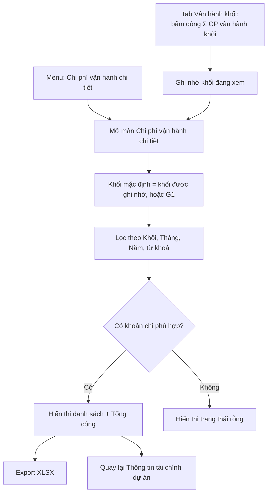

# TÀI LIỆU SRS - CHỨC NĂNG "CHI PHÍ VẬN HÀNH CHI TIẾT CỦA KHỐI"

## Version control

| Tên version | Ngày cập nhật | PIC | Mô tả |
| :--- | :--- | :--- | :--- |
| **v01 (hiện tại)** | **2026-09-28** | **AI Agent** | - Khởi tạo tài liệu SRS màn Chi phí vận hành chi tiết. - Mô tả danh sách khoản chi, bộ lọc Khối / Tháng / Năm / tìm kiếm, điều hướng từ tab Vận hành khối. |

---

## 1. Luồng trạng thái và Nghiệp vụ (Business Flow)

**Mô tả:** Màn *Chi phí vận hành chi tiết* (tiêu đề "Chi Phí Kinh Doanh - Vận Hành Khối") liệt kê **từng khoản chi phí vận hành chung** của một khối: thuê văn phòng, điện nước, tiếp khách, công cụ dụng cụ… Mỗi khoản gồm Diễn giải, Số tiền, Mã đơn vị và Tháng phát sinh. Màn này là phần **giải trình chi tiết** cho dòng "Σ Chi phí vận hành khối" ở tab Vận hành khối của màn *Thông tin tài chính dự án*. Tổng chi phí vận hành khối sau đó được phân bổ về các dự án. Đơn vị: VNĐ.

Màn được mở theo 2 cách:
1. Từ menu **Project Management → Chi phí vận hành chi tiết**.
2. Bấm dòng **"Σ Chi phí vận hành khối"** ở tab Vận hành khối. Màn mở với đúng khối đang xem.

**Sơ đồ luồng:**

---

## 2. User Stories & Acceptance Criteria (AC)

**Epic:** Quản lý tài chính dự án theo khối

### User Story 1: Xem chi tiết chi phí vận hành của khối — Là GĐ khối / Kế toán, tôi muốn xem từng khoản chi phí vận hành của khối để biết tổng chi phí vận hành gồm những gì.
*   **Acceptance Criteria:**
    *   **AC1.1:** Hiển thị danh sách khoản chi của khối đang chọn, gồm Diễn giải, Số tiền, Mã đơn vị, Tháng.
    *   **AC1.2:** Hiển thị tổng cộng số tiền và số khoản chi của danh sách đang hiển thị.
    *   **AC1.3:** Khi mở từ tab Vận hành khối, màn hiển thị ngay khối người dùng đang xem ở tab đó.

### User Story 2: Lọc khoản chi — Là GĐ khối / Kế toán, tôi muốn lọc theo khối, tháng, năm và tìm theo từ khoá để tìm nhanh khoản chi cần kiểm tra.
*   **Acceptance Criteria:**
    *   **AC2.1:** Cho phép lọc theo Khối.
    *   **AC2.2:** Cho phép lọc theo Năm. Chỉ hiển thị khoản chi phát sinh trong năm đã chọn.
    *   **AC2.3:** Cho phép lọc theo Tháng, hoặc chọn "Tất cả tháng" để xem cả năm.
    *   **AC2.4:** Cho phép tìm kiếm theo diễn giải, mã đơn vị hoặc tháng.
    *   **AC2.5:** Tổng cộng tính lại theo đúng kết quả lọc.

### User Story 3: Xuất dữ liệu và quay lại — Là Kế toán, tôi muốn xuất danh sách khoản chi ra Excel và quay lại màn tài chính để tiếp tục làm việc.
*   **Acceptance Criteria:**
    *   **AC3.1:** Cho phép xuất danh sách đang hiển thị ra file XLSX.
    *   **AC3.2:** Cho phép quay lại màn Thông tin tài chính dự án.

---

## 3. Quy tắc nghiệp vụ (Business Rules)

*   **BR1 (Khối mặc định):** Khi mở từ dòng Σ ở tab Vận hành khối, khối mặc định là khối đang xem ở tab đó. Nếu mở từ menu hoặc khối không hợp lệ thì mặc định G1.
*   **BR2 (Kỳ của khoản chi):** Mỗi khoản chi gắn với 1 kỳ dạng Tháng/Năm (MM/YYYY). Một khoản chi chỉ thuộc đúng 1 kỳ.
*   **BR3 (Lọc năm):** Chỉ hiển thị khoản chi có Năm của kỳ = Năm đã chọn.
*   **BR4 (Lọc tháng):** Nếu chọn tháng cụ thể, chỉ hiển thị khoản chi có Tháng của kỳ = tháng đã chọn. "Tất cả tháng" không lọc theo tháng.
*   **BR5 (Tìm kiếm):** So khớp không phân biệt hoa thường, trên chuỗi ghép Diễn giải + Mã đơn vị + Tháng.
*   **BR6 (Tổng cộng):** Tổng cộng = Σ Số tiền của các khoản đang hiển thị sau khi áp dụng mọi bộ lọc.
*   **BR7 (Liên hệ với tab Vận hành khối):** Tổng chi phí vận hành khối của tháng *m* (tab Vận hành khối, đơn vị triệu VNĐ) = Σ Số tiền các khoản chi của khối trong tháng *m* (VNĐ) ÷ 1.000.000. *(Ghi chú hiện trạng: bản prototype đang nhập hai nơi độc lập. Cần nối để dòng Σ tự tổng từ màn chi tiết.)*
*   **BR8 (Mã đơn vị):** Mã đơn vị của khoản chi là mã khối phát sinh chi phí (G1, G2, G3, G4, BFSI, GPDV). Khối "Giải pháp - Dịch vụ" hiển thị nhãn rút gọn "GPDV".

---

## 4. Đặc tả trường dữ liệu (Data Dictionary)

### 4.1. Bảng `fin_block_overhead_item` — Khoản chi phí vận hành của khối
| Tên trường | Loại data | Bắt buộc? | Mô tả |
| :--- | :--- | :--- | :--- |
| `id` | String (PK) | Có | Khóa chính, tự sinh. |
| `khoi_code` | String (FK) | Có | Khối sở hữu khoản chi. Liên kết danh mục khối. |
| `description` | String | Có | Diễn giải khoản chi. |
| `amount` | Number | Có | Số tiền (VNĐ), > 0. |
| `unit_code` | String (FK) | Có | Mã đơn vị phát sinh chi phí. |
| `period_month` | Number | Có | Tháng phát sinh (1–12). |
| `period_year` | Number | Có | Năm phát sinh. |
| `created_by` | String (FK) | Có | Người tạo. |
| `created_at` | DateTime | Có | Thời điểm tạo. |
| `updated_at` | DateTime | Không | Thời điểm cập nhật gần nhất. |

> Index gợi ý: (`khoi_code`, `period_year`, `period_month`).

---

## 5. Mô tả các hiệu ứng tương tác (Interaction Details)

*   **Breadcrumb:** Quản lý dự án › Thông tin tài chính › **Chi phí vận hành chi tiết**.
*   **Nút "Quay lại tài chính dự án":** Góc trên phải, icon mũi tên trái.
*   **Tiêu đề bảng:** "Chi phí vận hành — Khối {khối}". Dòng phụ hiển thị kỳ đang lọc: "Tháng MM năm YYYY" hoặc "Kỳ năm YYYY" khi chọn "Tất cả tháng".
*   **Bảng:** Có đường kẻ dọc giữa các cột. Số thứ tự màu xám nhạt. Số tiền canh phải, font mono, phân cách hàng nghìn vi-VN. Mã đơn vị và Tháng canh giữa.
*   **Dòng Tổng cộng:** Nền xám nhạt, viền trên đậm. Hiển thị "Tổng cộng (N khoản)", số tiền tổng màu chàm.
*   **Hover dòng:** Đổi nền xám nhạt.
*   **Trạng thái rỗng:** Dòng thông báo canh giữa khi không có khoản phù hợp.
*   **Menu:** Mục "Chi phí vận hành chi tiết" được highlight khi đang ở màn này.

---

## 6. Quy tắc Validate Dữ liệu (Validation Rules)

| Màn hình / Form | Trường dữ liệu | Bắt buộc | Kiểu dữ liệu | Rule Validate / Giới hạn |
| :--- | :--- | :--- | :--- | :--- |
| Bộ lọc | Khối | Có | Enum | Chọn từ danh mục khối. |
| Bộ lọc | Tháng | Có | Enum | "Tất cả tháng" hoặc 1–12. Mặc định "Tất cả tháng". |
| Bộ lọc | Năm | Có | Int | 2025, 2026, 2027. Mặc định 2026. |
| Bộ lọc | Tìm kiếm | Không | String | Max 100 ký tự. Trim khoảng trắng. Lọc ngay khi gõ. |
| Form thêm/sửa khoản chi *(phạm vi mở rộng)* | Diễn giải | Có | String | Max 255 ký tự. |
| Form thêm/sửa khoản chi *(phạm vi mở rộng)* | Số tiền | Có | Int | > 0, chỉ chấp nhận chữ số. Đơn vị VNĐ. |
| Form thêm/sửa khoản chi *(phạm vi mở rộng)* | Mã đơn vị | Có | Enum | Chọn từ danh mục khối / đơn vị. |
| Form thêm/sửa khoản chi *(phạm vi mở rộng)* | Tháng / Năm | Có | Date (MM/YYYY) | Tháng 1–12, năm hợp lệ. |

---

## 7. Các trường hợp ngoại lệ & Thông báo lỗi (Edge Cases & Exception Handling)

| Ngữ cảnh / Hành động | Kịch bản ngoại lệ (Edge Case) | Thông báo lỗi hiển thị ra UI (Error Message) | Loại hiển thị (UI Type) |
| :--- | :--- | :--- | :--- |
| Lọc / tìm kiếm | Không có khoản chi phù hợp | "Không có khoản chi phí phù hợp." | Empty state trong bảng |
| Mở từ dòng Σ | Khối được truyền sang không tồn tại | Tự chọn khối G1, không báo lỗi | — |
| Export XLSX | Danh sách rỗng | "Không có dữ liệu để xuất." | Toast |
| Export XLSX | Xuất thành công | "📥 Đã xuất chi tiết chi phí vận hành ra file XLSX." | Toast |
| Tải dữ liệu | Mất kết nối khi gọi API | "Lỗi kết nối. Vui lòng kiểm tra lại mạng và thử lại." | Toast (Red) |

---

## 8. Mapping Giao diện & Design System (UI/UX Component Mapping)

| Tính năng / UI Element | Component Design System (Gợi ý) | Ghi chú thêm |
| :--- | :--- | :--- |
| Breadcrumb | `Breadcrumb` | 3 cấp. |
| Nút quay lại | `Button` | Icon `ArrowLeftOutlined`, điều hướng về "Thông tin tài chính dự án". |
| Chọn Khối | `Select` | Nhãn rút gọn "GPDV" cho khối Giải pháp - Dịch vụ. |
| Chọn Tháng | `Select` | Option đầu "Tất cả tháng", sau đó "Tháng 01" … "Tháng 12". |
| Chọn Năm | `Select` | 2025–2027. |
| Tìm kiếm | `Input.Search` | `allowClear`, lọc realtime. |
| Bảng khoản chi | `Table` | `bordered`, cột #, Diễn giải, Số tiền (`align="right"`), Mã đơn vị, Tháng (`align="center"`). |
| Dòng tổng cộng | `Table.Summary` | Số tiền tổng màu chàm. |
| Export XLSX | `Button` | Icon `FileExcelOutlined`, xuất theo dữ liệu đã lọc. |
| Trạng thái rỗng | `Empty` | Text "Không có khoản chi phí phù hợp." |
