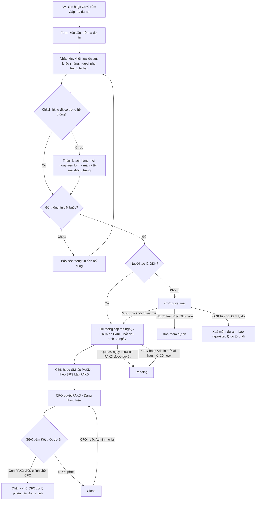
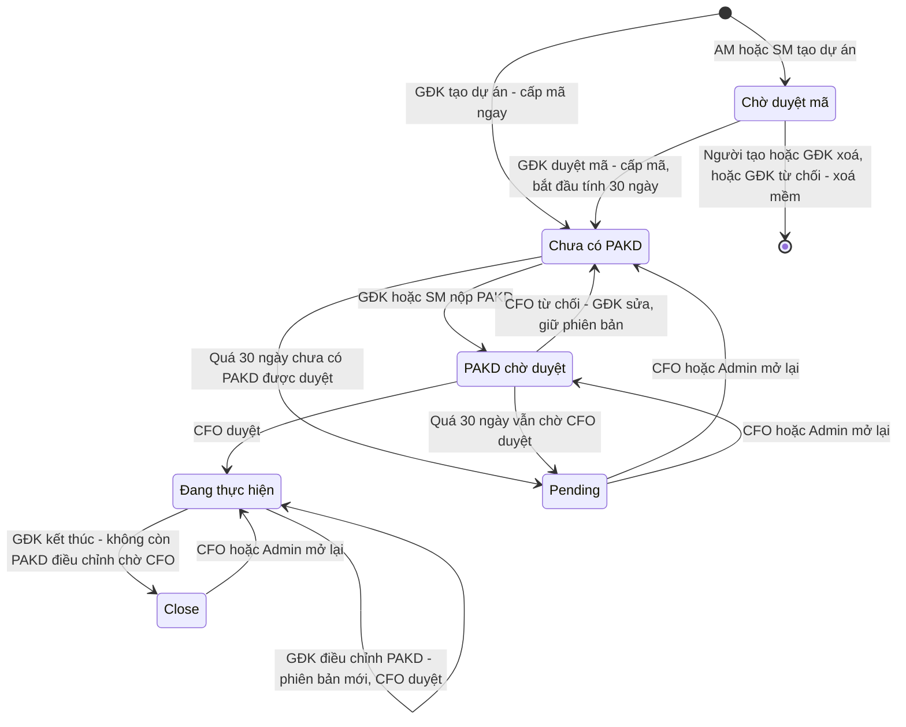
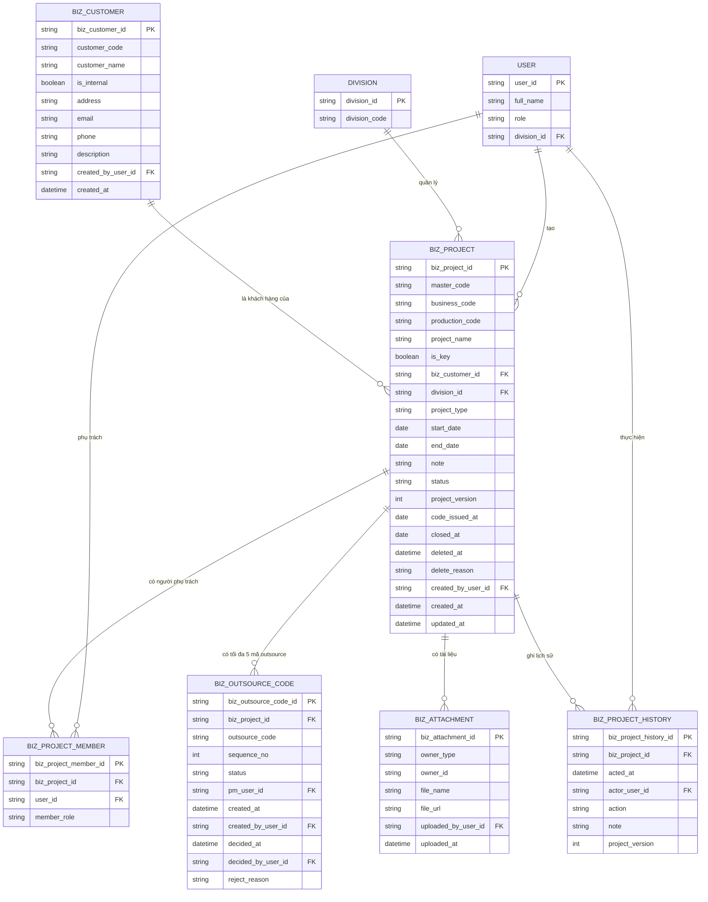
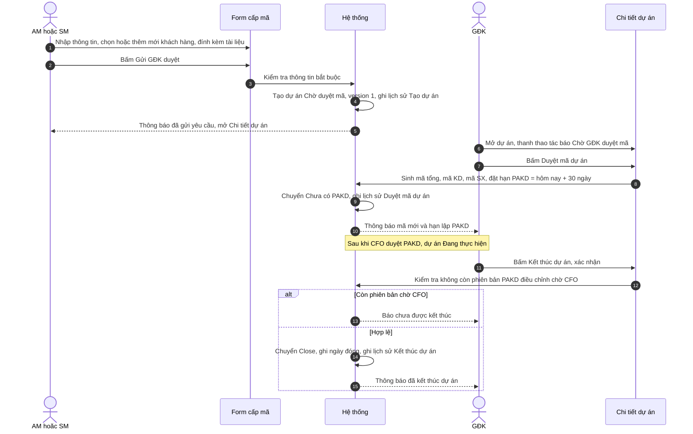

# TÀI LIỆU SRS - CHỨC NĂNG "CHI TIẾT DỰ ÁN VÀ FORM CẤP MÃ DỰ ÁN"

## Version control

| Tên version | Ngày cập nhật | PIC | Mô tả |
| :--- | :--- | :--- | :--- |
| v01 | 2026-10-02 | AI Agent | - Khởi tạo tài liệu SRS màn Chi tiết dự án và Form cấp mã / sửa dự án, theo prototype commit d8a9358 và các quyết định đã chốt. - Mục 1: mô tả, bố cục, ma trận quyền, 4 sơ đồ. - Mục 2: User Story và AC. - Mục 3: Business Rules. - Mục 4: Data Dictionary 6 bảng; mục 5: Interaction Details. - Đồng bộ quy tắc mọi hợp đồng phải được CFO duyệt (ma trận quyền, BR9, BR18, BR19, AC11.1). - Chốt Checkpoint A: GĐK từ chối yêu cầu mở mã; xoá mềm; đổi khối / khách hàng giữ nguyên mã; mã outsource sinh từ mã SX, tối đa 5, cần GĐK duyệt khi Admin tạo, không dùng lại số. |
| **v02 (hiện tại)** | **2026-10-02** | **AI Agent** | - Rà soát theo code commit 8cff07a và quyết định BA. - Bỏ ngăn Quy trình: tiến trình theo dõi qua thanh thao tác và tab Lịch sử (US8, BR20 mới). - Thêm màn **Sửa dự án** (toàn màn, 2 tab Thông tin cơ bản / PAKD) thay cho Form sửa (BR22). - Khu Mã dự án luôn hiển thị phía trên, 2 cột, có Tên dự án / KEY và PM outsource; nút Update PM (BR21). - Popup Thêm khách hàng: mã KH đúng 3 ký tự, thêm Nội bộ, Địa chỉ, Email, SĐT, Mô tả (BR7, 4.1). - GĐK và SM đều được sửa PAKD (ma trận, BR19). |

---

## Mục lục
1. [Luồng trạng thái và Nghiệp vụ](#1-luồng-trạng-thái-và-nghiệp-vụ-business-flow)
2. [User Stories & Acceptance Criteria](#2-user-stories--acceptance-criteria-ac)
3. [Quy tắc nghiệp vụ](#3-quy-tắc-nghiệp-vụ-business-rules)
4. [Đặc tả trường dữ liệu](#4-đặc-tả-trường-dữ-liệu-data-dictionary)
5. [Mô tả các hiệu ứng tương tác](#5-mô-tả-các-hiệu-ứng-tương-tác-interaction-details)

**Tài liệu liên quan:**
- `SRS_DanhSachDuAn.md`: vòng đời 6 trạng thái, phạm vi xem theo vai trò, popup Cập nhật ký hợp đồng (BR26–BR31), Pending, mở lại, mã dự án.
- `SRS_LapPAKD.md` (sẽ viết): form Lập PAKD, gửi duyệt, CFO duyệt, phiên bản PAKD, điều chỉnh PAKD.

---

## 1. Luồng trạng thái và Nghiệp vụ (Business Flow)

**Mô tả:** Tài liệu đặc tả 3 màn đi từ *Danh sách dự án*:
1. **Form cấp mã dự án** (tạo mới): AM, SM hoặc GĐK tạo **yêu cầu mở mã dự án**, nhập thông tin cơ hội kinh doanh, khách hàng, người phụ trách, tài liệu đính kèm. GĐK tạo thì hệ thống cấp mã ngay. AM hoặc SM tạo thì dự án chờ GĐK duyệt mã.
2. **Chi tiết dự án:** nơi xem toàn bộ thông tin một dự án và xử lý các bước của quy trình:
   - Duyệt / từ chối mã, lập PAKD, CFO duyệt PAKD và hợp đồng.
   - Quản lý mã outsource, hợp đồng và tài liệu.
   - Kết thúc, mở lại, xoá dự án.
   - Xem lịch sử thay đổi.
3. **Sửa dự án** (màn hình riêng, không phải popup) **[Mới]**: 2 tab *Thông tin cơ bản* (AM / SM / GĐK) và *Phương án kinh doanh (PAKD)* (GĐK / SM, để điều chỉnh PAKD theo SRS Lập PAKD).

**Điều hướng:**
- Từ *Danh sách dự án*, nút *Cấp mã dự án* mở Form cấp mã.
- Bấm vào một dòng dự án thì mở Chi tiết dự án.
- Nút *Sửa* trên Chi tiết mở màn **Sửa dự án**, tab *Thông tin cơ bản*. Nút *Sửa PAKD* trên thanh thao tác mở màn Sửa dự án, tab *PAKD*.

**ĐVT:** VNĐ. **GĐK** và **HOD** cùng chỉ Giám đốc khối.

**Bố cục Form cấp mã dự án:**
1. **Thanh tiêu đề:** chữ "Yêu cầu mở mã dự án". Nút *Huỷ*, cùng nút chính *Gửi GĐK duyệt* (AM, SM) hoặc *Tạo & cấp mã* (GĐK). Thông tin phụ: Mã dự án, Version, Trạng thái, Khối, Người tạo.
2. **Hộp hướng dẫn quy trình** và **hộp lỗi tổng hợp**.
3. **Khu Mã dự án** (2 cột): cột trái là Mã dự án / Mã KD / Mã SX / Mã outsource, hiển thị "Tự sinh sau khi GĐK duyệt"; cột phải là **Tên dự án\*** kèm nút **KEY**, **PM kinh doanh**, **PM sản xuất**, **PM outsource** **[Mới]**.
4. **Thông tin chi tiết dự án:** Khối, Loại dự án, Khách hàng (chọn hoặc **+ Thêm khách hàng** qua popup), Mã KH, Thời gian, GĐKD, GĐK, AM, Người tạo, Ghi chú.
5. **Hợp đồng & tài liệu:** hợp đồng *Chưa ký* (chỉ cập nhật sau khi có mã), đính kèm tài liệu.
6. **Lập PAKD:** khoá cho tới khi dự án được cấp mã.

**Bố cục Chi tiết dự án:**
1. **Thanh tiêu đề:**
   - Tên dự án + nhãn KEY.
   - Nút: *Quay lại*, *Sửa*, *Xoá*. Nút *Sửa* và *Xoá* chỉ hiện khi người dùng có quyền.
   - Thông tin phụ: Mã dự án, Version, Trạng thái, Khối, PAKD, Cập nhật.
2. **Khu Mã dự án** (luôn hiển thị, ở mọi tab) **[Mới]**: Mã dự án / KD / SX / outsource | Tên dự án (kèm KEY) / PM KD / PM SX / PM outsource.
3. **Thanh thao tác bước hiện tại:** cho biết dự án đang ở bước nào, đang chờ ai, và chứa các nút thao tác của bước đó (BR19).
4. **Tab Thông tin dự án:** Thông tin chi tiết dự án (chỉ đọc); Hợp đồng & tài liệu; Lập PAKD (SRS Lập PAKD); Thông tin hợp đồng, kèm phụ lục.
5. **Tab Lịch sử:** mọi thao tác trên dự án, là nơi tra cứu ai đã làm gì, khi nào.

> Ngăn *Quy trình* bên phải của bản trước **đã bỏ** **[Mới]** (BR20).

**Bố cục màn Sửa dự án** **[Mới]**:
1. **Thanh tiêu đề:** "Sửa dự án — {mã} · {tên}", nút *Huỷ* và *Lưu thay đổi* (tab Thông tin cơ bản).
2. **Khu Mã dự án:** như Chi tiết; PM hiện tại hiển thị dạng chữ kèm nút **Update PM** để đổi.
3. **Tab Thông tin cơ bản** (AM / SM / GĐK): các trường của Form cấp mã. Vai trò khác thấy "Chỉ AM / SM / Giám đốc khối được sửa thông tin cơ bản."
4. **Tab Phương án kinh doanh (PAKD)** (GĐK / SM): form PAKD ở chế độ điều chỉnh (SRS Lập PAKD BR21). Dự án còn *Chờ duyệt mã* thì hiển thị "PAKD được lập sau khi Giám đốc khối duyệt dự án."

**Ma trận quyền:**

| Thao tác | AM | SM | GĐK | CFO | BOD | Admin | Trạng thái dự án cho phép |
| :--- | :---: | :---: | :---: | :---: | :---: | :---: | :--- |
| Tạo dự án | ✓ chờ duyệt | ✓ chờ duyệt | ✓ cấp mã ngay | | | | — |
| Thêm khách hàng mới trên form | ✓ | ✓ | ✓ | | | | Khi tạo / sửa |
| Duyệt mã dự án | | | ✓ khối mình | | | | Chờ duyệt mã |
| Từ chối yêu cầu mở mã (bắt buộc lý do) | | | ✓ khối mình | | | | Chờ duyệt mã |
| Sửa thông tin dự án | ✓ dự án của mình | ✓ dự án của mình | ✓ khối mình | | | | Mọi trạng thái trừ Pending, Close |
| Xoá dự án | ✓ nếu là người tạo | ✓ nếu là người tạo | ✓ khối mình | | | | Chỉ Chờ duyệt mã |
| Xem PAKD | | ✓ | ✓ | ✓ | ✓ | ✓ | Sau khi có mã |
| Lập và nộp PAKD lần đầu | | ✓ | ✓ | | | | Chưa có PAKD, chưa nộp lần nào |
| Sửa PAKD (sau khi bị từ chối, hoặc điều chỉnh bản đã duyệt) | | ✓ | ✓ | | | | Chưa có PAKD (bị từ chối) / Đang thực hiện |
| Duyệt / từ chối PAKD | | | | ✓ | | | Có phiên bản chờ CFO |
| Tạo mã outsource | | | ✓ khối mình, có hiệu lực ngay | | | ✓ chờ GĐK duyệt | Đã có mã, không ở Pending / Close |
| Duyệt / từ chối mã outsource (từ chối bắt buộc lý do) | | | ✓ khối mình | | | | Có mã outsource chờ duyệt |
| Xoá mã outsource, đổi PM outsource | | | ✓ khối mình | | | ✓ | Đã có mã, không ở Pending / Close |
| Cập nhật ký hợp đồng (gửi CFO duyệt) | ✓ | ✓ | ✓ | | | | Đã có mã, không ở Pending / Close (SRS_DanhSachDuAn BR26, BR31) |
| Duyệt / từ chối hợp đồng | | | | ✓ | | | Có hợp đồng chờ duyệt (SRS_DanhSachDuAn BR35) |
| Thêm / xoá tài liệu đính kèm | ✓ | ✓ | ✓ | | | | Không ở Pending / Close |
| Kết thúc dự án | | | ✓ khối mình | | | | Đang thực hiện, không còn PAKD điều chỉnh chờ CFO |
| Mở lại dự án | | | | ✓ | | ✓ | Pending, Close |
| Xem chi tiết, lịch sử | ✓ | ✓ | ✓ | ✓ | ✓ | ✓ | Trong phạm vi xem (SRS_DanhSachDuAn BR2) |

> - Các thao tác về PAKD được đặc tả chi tiết ở SRS Lập PAKD. Ma trận này chỉ để biết ai thấy nút nào trên màn Chi tiết.
> - AM không thấy khu Lập PAKD, tab PAKD của màn Sửa dự án, cũng không thấy nội dung PAKD trên thanh thao tác.

**Sơ đồ luồng tạo dự án đến khi kết thúc:**

**State diagram — vòng đời dự án** (giống SRS Danh sách dự án, thêm thao tác Xoá):

**Lát cắt ERD:**

> - Chỉ thể hiện các bảng thuộc phạm vi tài liệu này. Các bảng PAKD, hợp đồng, mục tiêu xem ở SRS Lập PAKD và SRS Danh sách dự án.
> - `BIZ_PROJECT` ở đây bổ sung các trường của form cho bảng cùng tên ở SRS Danh sách dự án mục 4.1.

**Sequence diagram — AM tạo dự án, GĐK duyệt mã, GĐK kết thúc dự án:**

---

## 2. User Stories & Acceptance Criteria (AC)

> Ký hiệu **[Mới]**: yêu cầu đã chốt nhưng chưa có hoặc khác so với prototype commit d8a9358.

**Epic A:** Form cấp mã / sửa dự án

### User Story 1: Tạo yêu cầu mở mã dự án — Là AM hoặc SM, tôi muốn tạo yêu cầu mở mã cho một cơ hội kinh doanh mới để GĐK duyệt và cấp mã dự án.
*   **Acceptance Criteria:**
    *   **AC1.1:** AM và SM tạo được dự án mới với các thông tin: tên dự án, dự án KEY, khối, loại dự án, khách hàng, thời gian, GĐKD, GĐK, AM, PM kinh doanh, PM sản xuất, ghi chú *(BR4, BR6, BR17)* **[Mới — SM]**.
    *   **AC1.2:** Hệ thống chỉ ghi nhận yêu cầu khi đã có đủ tên dự án, khối, loại dự án và khách hàng, và thời gian thực hiện hợp lệ *(BR6)*.
    *   **AC1.3:** Gửi thành công thì dự án ở trạng thái *Chờ duyệt mã*, chưa có mã, version 1. Người tạo được chuyển sang Chi tiết dự án *(BR4)*.
    *   **AC1.4:** Người tạo được hướng dẫn quy trình tiếp theo ngay trên form: GĐK duyệt mã, GĐK hoặc SM lập PAKD trong 30 ngày, CFO duyệt.

### User Story 2: GĐK tạo dự án và được cấp mã ngay — Là GĐK, tôi muốn tạo dự án và có mã ngay để khối bắt đầu lập PAKD mà không cần qua bước duyệt.
*   **Acceptance Criteria:**
    *   **AC2.1:** GĐK tạo dự án thì hệ thống bỏ qua bước duyệt mã, cấp mã tổng / KD / SX ngay và chuyển dự án sang *Chưa có PAKD* *(BR4, BR5)*.
    *   **AC2.2:** Hạn PAKD được đặt bằng ngày tạo + 30 ngày *(BR5)*.
    *   **AC2.3:** GĐK chỉ tạo được dự án cho khối của mình *(BR2)* **[Mới]**.

### User Story 3: Chọn hoặc thêm mới khách hàng — Là AM, SM hoặc GĐK, tôi muốn chọn khách hàng đã có, hoặc tạo khách hàng mới ngay trên form nếu chưa có, để không phải rời màn tạo dự án.
*   **Acceptance Criteria:**
    *   **AC3.1:** Người dùng chọn được khách hàng từ danh mục khách hàng của hệ thống. Chọn xong thì mã khách hàng được điền tự động *(BR7)*.
    *   **AC3.2:** Nếu khách hàng chưa có trong hệ thống, người dùng tạo mới được ngay từ form qua popup *Thêm khách hàng*: tên khách hàng, khách hàng nội bộ hay không, mã khách hàng, địa chỉ, email, số điện thoại, mô tả *(BR7)* **[Mới]**.
    *   **AC3.3:** Hệ thống không cho tạo khách hàng trùng mã, mã sai quy cách (đúng 3 ký tự chữ / số) hoặc email sai định dạng, và báo rõ lý do *(BR7)* **[Mới]**.
    *   **AC3.4:** Khách hàng mới được lưu vào danh mục với đủ thông tin và dùng được cho các dự án sau *(BR7)* **[Mới]**.

### User Story 4: Đính kèm tài liệu khi tạo dự án — Là người tạo dự án, tôi muốn đính kèm tài liệu (báo giá, hồ sơ cơ hội…) ngay khi tạo để GĐK có đủ căn cứ duyệt mã.
*   **Acceptance Criteria:**
    *   **AC4.1:** Người dùng đính kèm được nhiều tệp ngay trên form tạo dự án *(BR16)*.
    *   **AC4.2:** Tệp đính kèm được ghi lịch sử với tên tệp *(BR18)*.

### User Story 5: Sửa thông tin dự án — Là AM, SM hoặc GĐK phụ trách dự án, tôi muốn cập nhật thông tin dự án khi có thay đổi để dữ liệu luôn đúng.
*   **Acceptance Criteria:**
    *   **AC5.1:** Chỉ AM, SM, GĐK của dự án sửa được thông tin dự án, và chỉ khi dự án không ở *Pending* / *Close* *(BR1, BR3)* **[Mới]**.
    *   **AC5.2:** Việc sửa thực hiện trên màn **Sửa dự án** (màn hình riêng), tab *Thông tin cơ bản* *(BR22)* **[Mới]**.
    *   **AC5.3:** Mỗi lần lưu thay đổi, version của dự án tăng 1, và người dùng thấy trước version sẽ lưu (v{n} → v{n+1}) *(BR9)*.
    *   **AC5.4:** Khối và khách hàng vẫn đổi được sau khi dự án đã được cấp mã *(BR8)*.
    *   **AC5.5:** Người dùng đổi được PM kinh doanh, PM sản xuất, PM outsource bằng thao tác *Update PM* *(BR17, BR21)* **[Mới]**.
    *   **AC5.6:** Sửa thông tin cơ bản không làm thay đổi PAKD. Điều chỉnh PAKD làm ở tab *PAKD* của cùng màn, theo SRS Lập PAKD *(BR10, BR22)*.

---

**Epic B:** Chi tiết dự án

### User Story 6: Xem thông tin dự án — Là người dùng trong phạm vi xem, tôi muốn xem đầy đủ thông tin một dự án trên một màn.
*   **Acceptance Criteria:**
    *   **AC6.1:** Người dùng xem được mã dự án, version, trạng thái, khối, tình trạng PAKD (nếu được xem PAKD), thời điểm cập nhật gần nhất.
    *   **AC6.2:** Người dùng xem được mã tổng, mã KD, mã SX và các mã outsource, kèm PM phụ trách *(BR11)*.
    *   **AC6.3:** Người dùng xem được thông tin chi tiết dự án, tình trạng hợp đồng và tài liệu đính kèm.
    *   **AC6.4:** AM không thấy thông tin PAKD trên màn Chi tiết *(BR1)* **[Mới]**.

### User Story 7: Biết việc cần làm ở bước hiện tại — Là người dùng, tôi muốn thấy ngay dự án đang ở bước nào và mình cần làm gì để xử lý kịp thời.
*   **Acceptance Criteria:**
    *   **AC7.1:** Người có việc ở bước hiện tại thấy rõ việc cần làm, kèm thao tác tương ứng (duyệt mã, lập PAKD, sửa PAKD, duyệt PAKD, mở lại) *(BR19)*.
    *   **AC7.2:** Người không có việc ở bước hiện tại thấy dự án đang chờ ai *(BR19)*.
    *   **AC7.3:** Ở bước lập PAKD, người dùng thấy hạn lập PAKD và số ngày còn lại *(BR19)*.

### User Story 8: Theo dõi tiến trình dự án — Là người dùng, tôi muốn biết dự án đang ở bước nào, đang chờ ai và trước đó ai đã làm gì.
*   **Acceptance Criteria:**
    *   **AC8.1:** Người dùng thấy bước hiện tại và người / vai trò đang được chờ ngay trên thanh thao tác *(BR19, BR20)*.
    *   **AC8.2:** Người dùng tra cứu được người thực hiện, thời điểm và ghi chú của từng bước đã làm (ví dụ: mã được cấp, lý do CFO từ chối) ở tab Lịch sử *(BR18, BR20)*.
    *   **AC8.3:** Dự án *Pending* hoặc *Close* được thể hiện rõ ở nhãn trạng thái và thanh thao tác, kèm lý do và ngày *(BR19)* **[Mới]**.

### User Story 9: GĐK duyệt mã dự án — Là GĐK, tôi muốn duyệt yêu cầu mở mã của khối mình để hệ thống cấp mã và khối bắt đầu lập PAKD.
*   **Acceptance Criteria:**
    *   **AC9.1:** Chỉ GĐK của khối duyệt được mã cho dự án *Chờ duyệt mã* *(BR5)*.
    *   **AC9.2:** Duyệt xong, hệ thống cấp mã tổng / KD / SX, chuyển *Chưa có PAKD*, đặt hạn PAKD = ngày duyệt + 30 ngày, và báo cho GĐK mã mới cùng hạn *(BR5)*.
    *   **AC9.3:** Việc duyệt mã được ghi lịch sử, và thanh thao tác chuyển sang bước lập PAKD *(BR18, BR19)*.
    *   **AC9.4:** GĐK từ chối được yêu cầu mở mã, bắt buộc ghi lý do. Yêu cầu bị từ chối được xoá mềm, và người tạo được báo lý do *(BR5, BR15)* **[Mới]**.

### User Story 10: Quản lý mã outsource — Là GĐK hoặc Admin, tôi muốn tạo mã outsource từ mã sản xuất cho phần việc thuê ngoài và gán PM phụ trách.
*   **Acceptance Criteria:**
    *   **AC10.1:** GĐK của khối và Admin tạo được mã outsource cho dự án đã có mã, khi dự án không ở *Pending* / *Close*. Mã outsource được sinh từ mã sản xuất, tối đa 5 mã *(BR11, BR12)* **[Mới]**.
    *   **AC10.2:** Giống tạo mã dự án: GĐK tạo thì mã có hiệu lực ngay; Admin tạo thì mã chờ GĐK của khối duyệt *(BR12)* **[Mới]**.
    *   **AC10.3:** GĐK duyệt hoặc từ chối mã outsource đang chờ. Từ chối bắt buộc ghi lý do, và người tạo được báo *(BR12)* **[Mới]**.
    *   **AC10.4:** Chỉ mã outsource **có hiệu lực** mới được dùng (tìm kiếm, xuất Excel). Khi mã có hiệu lực, version dự án tăng 1 *(BR9, BR12)* **[Mới]**.
    *   **AC10.5:** Mỗi mã outsource được gán một PM phụ trách, đổi được PM, và xoá được mã. Mọi thao tác đều ghi lịch sử *(BR12, BR18)*.
    *   **AC10.6:** Số thứ tự của mã đã xoá hoặc bị từ chối không được dùng lại. Hết 5 số thì người dùng được báo không tạo thêm được *(BR11)*.
    *   **AC10.7:** Mã outsource mới được gán sẵn PM outsource của dự án (nếu có), người dùng đổi được *(BR12, BR17)* **[Mới]**.

### User Story 11: Quản lý hợp đồng và tài liệu — Là AM, SM hoặc GĐK của dự án, tôi muốn cập nhật hợp đồng và tài liệu của dự án từ màn Chi tiết.
*   **Acceptance Criteria:**
    *   **AC11.1:** Người dùng thấy tình trạng hợp đồng (đã ký / chưa ký / chờ CFO duyệt), số HĐ, ngày ký, thời hạn, và mở được popup cập nhật ký hợp đồng. Hợp đồng gửi đi phải được CFO duyệt mới có hiệu lực (SRS_DanhSachDuAn US14, US16, BR26–BR31, BR35) **[Mới — duyệt hợp đồng]**.
    *   **AC11.2:** Khi đã có hợp đồng, người dùng xem được thông tin hợp đồng đầy đủ, gồm phụ lục và tệp.
    *   **AC11.3:** Người có quyền thêm / xoá được tài liệu đính kèm của dự án. Việc này không làm tăng version dự án *(BR16, BR9)*.

### User Story 12: Xem lịch sử dự án — Là người dùng, tôi muốn xem mọi thay đổi trên dự án để truy vết.
*   **Acceptance Criteria:**
    *   **AC12.1:** Người dùng xem được danh sách thao tác, mới nhất ở trên: thời gian, người thực hiện, thao tác, ghi chú *(BR18)*.
    *   **AC12.2:** Lịch sử không sửa / xoá được *(BR18)*.

### User Story 13: Kết thúc dự án — Là GĐK, tôi muốn kết thúc dự án khi đã hoàn thành để dự án chuyển Close.
*   **Acceptance Criteria:**
    *   **AC13.1:** Chỉ GĐK của khối kết thúc được dự án đang *Đang thực hiện* *(BR13)* **[Mới]**.
    *   **AC13.2:** Nếu dự án còn phiên bản PAKD điều chỉnh đang chờ CFO duyệt, hệ thống không cho kết thúc và báo lý do *(BR13)* **[Mới]**.
    *   **AC13.3:** GĐK phải xác nhận trước khi kết thúc. Kết thúc xong, dự án chuyển *Close*, ghi ngày đóng và lịch sử *(BR13, BR18)*.

### User Story 14: Mở lại dự án — Là CFO hoặc Admin, tôi muốn mở lại dự án Pending hoặc Close để khối làm tiếp.
*   **Acceptance Criteria:**
    *   **AC14.1:** CFO và Admin mở lại được dự án *Pending* hoặc *Close* *(BR14)* **[Mới — Admin]**.
    *   **AC14.2:** Mở lại dự án Pending thì dự án về đúng bước trước đó, kèm hạn PAKD mới = ngày mở lại + 30 ngày. Mở lại dự án Close thì dự án về *Đang thực hiện* *(BR14)*.
    *   **AC14.3:** Việc mở lại được ghi lịch sử, và thanh thao tác hiển thị bước tiếp theo *(BR18, BR19)*.

### User Story 15: Xoá dự án — Là người tạo dự án hoặc GĐK, tôi muốn xoá yêu cầu mở mã không còn cần thiết.
*   **Acceptance Criteria:**
    *   **AC15.1:** Chỉ xoá được dự án đang *Chờ duyệt mã*, do người tạo hoặc GĐK của khối thực hiện *(BR15)* **[Mới]**.
    *   **AC15.2:** Người dùng phải xác nhận trước khi xoá. Dự án đã xoá không còn hiển thị trên danh sách *(BR15)*.

---

## 3. Quy tắc nghiệp vụ (Business Rules)

**Nhóm 1 — Quyền và phạm vi**

*   **BR1 (Ma trận quyền):** Quyền của từng vai trò trên Form và Chi tiết dự án theo bảng *Ma trận quyền* ở mục 1. Nút nào người dùng không có quyền thì không hiển thị. Vai trò lấy theo tài khoản (SRS_DanhSachDuAn BR1). **[Mới]**
*   **BR2 (Phạm vi dự án):**
    *   Người dùng chỉ mở được Chi tiết của dự án nằm trong phạm vi xem (SRS_DanhSachDuAn BR2).
    *   GĐK chỉ tạo dự án, duyệt mã và kết thúc dự án cho khối của mình.
    *   "Dự án của mình" với AM / SM là dự án do mình tạo, hoặc mình được assign làm thành viên. **[Mới]**
*   **BR3 (Khoá ở Pending và Close):** Dự án *Pending* hoặc *Close* không cho sửa thông tin dự án, PAKD, mã outsource, hợp đồng hay tài liệu. Thao tác còn lại duy nhất là mở lại (SRS_DanhSachDuAn BR10). **[Mới]**

**Nhóm 2 — Tạo dự án, duyệt mã, thông tin bắt buộc**

*   **BR4 (Tạo dự án theo vai trò):**
    *   AM và SM tạo dự án thì dự án ở *Chờ duyệt mã*. Nút chính là *Gửi GĐK duyệt*.
    *   GĐK tạo dự án thì được cấp mã ngay, dự án vào *Chưa có PAKD*. Nút chính là *Tạo & cấp mã*.
    *   Dự án mới có version 1. Người tạo được ghi vào `created_by_user_id`. **[Mới — SM]**
*   **BR5 (Duyệt mã và cấp mã):**
    *   Khi GĐK duyệt mã, hoặc GĐK tự tạo dự án, hệ thống sinh mã theo SRS_DanhSachDuAn BR12 và ghi `code_issued_at`.
    *   Hạn PAKD = ngày cấp mã + 30 ngày.
    *   **Từ chối yêu cầu mở mã:** GĐK của khối từ chối được dự án *Chờ duyệt mã*. Lý do là bắt buộc (không chấp nhận chỉ có khoảng trắng). Dự án bị xoá mềm theo BR15, lý do được lưu ở `delete_reason`, ghi lịch sử *GĐK từ chối yêu cầu mở mã*. Người tạo nhận email báo từ chối kèm lý do. **[Mới]**
*   **BR6 (Thông tin bắt buộc):**
    *   Bắt buộc có: tên dự án (không được chỉ có khoảng trắng), khối, loại dự án, khách hàng.
    *   Nếu nhập cả ngày bắt đầu và ngày kết thúc thì ngày kết thúc phải sau hoặc bằng ngày bắt đầu.
    *   Thiếu hoặc sai thì hệ thống liệt kê tất cả các mục cần bổ sung và không lưu.
    *   Loại dự án gồm: *Fixed Cost, Time & Material, ODC, Cho thuê lao động, Nội bộ*.
*   **BR7 (Khách hàng):**
    *   Khách hàng chọn từ danh mục khách hàng của hệ thống (`biz_customer`).
    *   Nếu chưa có, AM / SM / GĐK bấm **+ Thêm khách hàng** để mở popup *Thêm khách hàng* ngay tại màn tạo / sửa dự án:
        *   **Tên khách hàng\*** (không chỉ có khoảng trắng): "Nhập tên khách hàng".
        *   **Khách hàng nội bộ** (ô tích).
        *   **Mã khách hàng\***: tự viết hoa, bỏ khoảng trắng, **đúng 3 ký tự chữ / số** (ví dụ "VCB", "022"). Lỗi: "Nhập mã khách hàng", "Mã KH gồm đúng 3 ký tự chữ / số, viết liền, không dấu", "Mã khách hàng đã tồn tại".
        *   Địa chỉ, **Email** (kiểm tra định dạng: "Email không hợp lệ"), Số điện thoại, Mô tả.
        *   Phím Enter để lưu, Esc để đóng.
    *   Khách hàng mới được lưu vào danh mục với **đủ các trường** khi dự án được lưu, và được chọn sẵn cho dự án. Mã khách hàng là tiền tố để sinh mã dự án. **[Mới]**
*   **BR8 (Đổi khối / khách hàng sau khi cấp mã):**
    *   Khối và khách hàng **vẫn sửa được** sau khi dự án đã có mã.
    *   Mã dự án, mã KD, mã SX và mã outsource đã cấp **giữ nguyên**, không sinh lại theo mã khách hàng mới.
    *   Lịch sử ghi rõ giá trị cũ → mới, ví dụ "Khối G1 → G2", "Khách hàng 022 → 038".
    *   Phạm vi xem (SRS_DanhSachDuAn BR2) và Sổ theo dõi tính theo khối mới ngay sau khi lưu.

**Nhóm 3 — Version dự án và lịch sử**

*   **BR9 (Version dự án):**
    *   Version dự án (`project_version`) tăng 1 khi lưu thay đổi thông tin dự án, hoặc khi **một bản hợp đồng được CFO duyệt** (SRS_DanhSachDuAn BR35). Gửi hợp đồng chờ duyệt chưa tăng version.
    *   Version cũng tăng 1 khi **một mã outsource có hiệu lực**, tức là khi GĐK duyệt, hoặc khi GĐK tự tạo. **[Mới]**
    *   Các thao tác sau **không** tăng version: thêm / xoá tài liệu, tạo mã outsource đang chờ duyệt, từ chối / xoá / đổi PM mã outsource, duyệt mã dự án, các thao tác PAKD, kết thúc, mở lại.
*   **BR10 (Version dự án khác phiên bản PAKD):**
    *   Version dự án và phiên bản PAKD (V1, V2…) là hai chuỗi số độc lập.
    *   Sửa thông tin dự án không tạo phiên bản PAKD.
    *   Các số liệu tài chính do PAKD sinh ra (giá trị HĐ dự kiến, chi phí kế hoạch, ngày dự kiến ký) **không sửa được trên Form**. Các số liệu này chỉ thay đổi khi CFO duyệt PAKD (SRS_DanhSachDuAn BR34). **[Mới]**

**Nhóm 4 — Mã outsource**

*   **BR11 (Cấu trúc và số lượng):**
    *   Mã outsource được sinh **từ mã sản xuất**: Mã outsource = Mã SX + `.<số thứ tự>`, số thứ tự từ 1 đến **5**. Ví dụ: dự án `022.061` có Mã SX `022.061.2`, các mã outsource là `022.061.2.1` … `022.061.2.5` (SRS_DanhSachDuAn BR12).
    *   Chỉ tạo được khi dự án đã có mã.
    *   Mã mới lấy số thứ tự **lớn nhất đã dùng + 1**. Số đã dùng gồm cả mã đã xoá và mã bị từ chối.
    *   Số thứ tự đã dùng **không được dùng lại**, để tránh lẫn số liệu kế toán đã hạch toán theo mã cũ. Vì vậy mỗi dự án sinh được tối đa 5 mã outsource trong suốt vòng đời, kể cả mã đã xoá / bị từ chối. **[Mới]**
*   **BR12 (Tạo, duyệt và quản lý mã outsource):** giống luồng tạo mã dự án ban đầu.
    *   **Tạo:** GĐK của khối hoặc Admin tạo, khi dự án không ở *Pending* / *Close*. PM phụ trách mặc định là **PM outsource** của dự án (BR17), đổi được.
        *   GĐK tạo thì mã có hiệu lực ngay.
        *   Admin tạo thì mã ở trạng thái **Chờ duyệt**.
    *   **Duyệt / từ chối:** GĐK của khối duyệt hoặc từ chối mã đang chờ.
        *   Duyệt thì mã chuyển **Có hiệu lực**, và version dự án tăng 1 (BR9).
        *   Từ chối bắt buộc ghi lý do (không chấp nhận chỉ có khoảng trắng). Mã chuyển **Từ chối**, người tạo nhận email báo kèm lý do.
    *   **Sử dụng:** chỉ mã *Có hiệu lực* mới được tìm kiếm, xuất Excel và dùng để hạch toán. Mã *Chờ duyệt* hiển thị kèm nhãn "Chờ duyệt".
    *   **Đổi PM, xoá:** GĐK hoặc Admin đổi PM hoặc xoá mã. Mã bị xoá chuyển **Đã xoá** (xoá mềm).
    *   **Lịch sử:** mỗi thao tác đều ghi lịch sử: *Tạo mã outsource*, *Duyệt mã outsource*, *Từ chối mã outsource*, *Cập nhật PM outsource*, *Xoá mã outsource*. **[Mới]**

**Nhóm 5 — Kết thúc, mở lại, xoá**

*   **BR13 (Kết thúc dự án):**
    *   Chỉ GĐK của khối, chỉ khi dự án *Đang thực hiện*, và không còn phiên bản PAKD điều chỉnh chờ CFO duyệt.
    *   GĐK phải xác nhận "Kết thúc dự án “{tên}”?".
    *   Kết thúc thì dự án chuyển *Close*, ghi `closed_at` và lịch sử *Kết thúc dự án* (SRS_DanhSachDuAn BR11). **[Mới]**
*   **BR14 (Mở lại dự án):** CFO hoặc Admin mở lại dự án theo SRS_DanhSachDuAn BR9:
    *   Pending: về trạng thái trước Pending, hạn mới = ngày mở lại + 30 ngày.
    *   Close: về *Đang thực hiện*.

    Mỗi lần mở lại đều ghi lịch sử *Mở lại dự án*, kèm hạn mới (nếu có).
*   **BR15 (Xoá dự án):**
    *   Chỉ dự án *Chờ duyệt mã* (chưa có mã), do người tạo hoặc GĐK của khối.
    *   Người dùng phải xác nhận "Xoá dự án “{tên}”?".
    *   Dự án bị **xoá mềm**: ghi `deleted_at` (và `delete_reason` nếu do GĐK từ chối), không còn hiện trên danh sách và báo cáo, nhưng dữ liệu và lịch sử được giữ để truy vết.

**Nhóm 6 — Tài liệu và lịch sử**

*   **BR16 (Tài liệu đính kèm của dự án):**
    *   Đính kèm được nhiều tệp lúc tạo dự án và trên màn Chi tiết.
    *   Người có quyền sửa thông tin dự án (BR1) thì thêm / xoá được tệp, khi dự án không ở *Pending* / *Close*.
    *   Mỗi lần thêm / xoá ghi lịch sử *Cập nhật tài liệu đính kèm*, kèm tên tệp.
*   **BR17 (Người phụ trách):**
    *   GĐKD, GĐK, AM (nhiều người), PM kinh doanh, PM sản xuất, **PM outsource** chọn từ danh mục nhân sự của hệ thống, lưu ở `biz_project_member` theo vai trò.
    *   PM outsource chọn khi tạo dự án, dùng làm PM mặc định cho mã outsource khi được tạo (BR12). **[Mới]**
    *   Khi sửa dự án, PM hiện tại hiển thị dạng chữ; bấm **Update PM** để hiện ô chọn, bấm × để huỷ đổi (BR21). **[Mới]**
    *   Người được assign có phạm vi xem theo SRS_DanhSachDuAn BR2.
    *   Danh mục nhân sự của hệ thống thay cho danh sách lấy từ các dự án cũ như prototype. **[Mới]**
*   **BR18 (Lịch sử dự án):**
    *   Mọi thao tác ghi một dòng lịch sử: thời gian, người thực hiện (hoặc "Hệ thống"), thao tác, ghi chú, version dự án tại thời điểm đó.
    *   Các thao tác được ghi: *Tạo dự án, Cập nhật, Duyệt mã dự án, GĐK từ chối yêu cầu mở mã, Lưu nháp PAKD, Nộp PAKD, CFO duyệt / từ chối PAKD, Gửi hợp đồng chờ duyệt, CFO duyệt / từ chối hợp đồng, Cập nhật tài liệu đính kèm, Tạo / Duyệt / Từ chối / Cập nhật PM / Xoá mã outsource, Chuyển Pending, Mở lại dự án, Kết thúc dự án, Chuyển đổi dữ liệu*.
    *   Lịch sử chỉ được thêm, không được sửa hay xoá. Hiển thị mới nhất lên đầu.

**Nhóm 7 — Thanh thao tác, khu Mã dự án và màn Sửa dự án**

*   **BR19 (Thanh thao tác bước hiện tại):**

    | Tình huống | Người có việc thấy | Người khác thấy |
    | :--- | :--- | :--- |
    | Chờ duyệt mã | GĐK của khối: "Yêu cầu mở mã đang chờ Giám đốc khối duyệt…" + nút **Duyệt mã dự án** và **Từ chối** | "Đang chờ Giám đốc khối duyệt mã dự án" |
    | Chưa có PAKD, chưa nộp | GĐK, SM: "Dự án cần lập PAKD. Hạn lập: dd/mm/yyyy (còn N ngày)" + nút **Lập PAKD** | "Đang chờ khối lập PAKD (hạn dd/mm/yyyy)" |
    | Chưa có PAKD, bị CFO từ chối | GĐK, SM: "PAKD V{n} bị từ chối (lý do) — cần sửa lại. Hạn: …" + nút **Sửa PAKD V{n}** | "Đang chờ GĐK / SM sửa PAKD V{n}" |
    | PAKD chờ duyệt, hoặc Đang thực hiện có bản điều chỉnh chờ | CFO: "PAKD V{n} đang chờ Kế toán (CFO) duyệt" + nút **Duyệt / Từ chối PAKD** | "Đang chờ Kế toán (CFO) duyệt PAKD V{n}" |
    | Pending | CFO, Admin: "Dự án Pending từ dd/mm/yyyy do quá 30 ngày chưa có PAKD được duyệt" + nút **Mở lại dự án** | "Đang chờ Kế toán (CFO) hoặc Admin mở lại dự án" |
    | Có hợp đồng chờ duyệt (song song với các dòng trên) | CFO: "Hợp đồng {số HĐ} đang chờ Kế toán (CFO) duyệt" + nút **Duyệt / Từ chối hợp đồng** | Người gửi: "Hợp đồng đang chờ Kế toán (CFO) duyệt" |
    | Có mã outsource chờ duyệt (song song với các dòng trên) | GĐK của khối: "Mã outsource {mã} đang chờ duyệt" + nút **Duyệt** / **Từ chối** | Không hiển thị |
    | Close | CFO, Admin: "Dự án đã kết thúc ngày dd/mm/yyyy" + nút **Mở lại dự án** | Không hiển thị |
    | Đang thực hiện, không có bản điều chỉnh | GĐK, SM: "Dự án đang thực hiện. Giám đốc khối / SM có thể sửa PAKD — Kế toán duyệt lại." + nút **Sửa PAKD** (mở màn Sửa dự án, tab PAKD). GĐK có thêm nút **Kết thúc dự án** | Không hiển thị |
    | Đang thực hiện, có bản điều chỉnh đang soạn / bị từ chối | GĐK, SM: "Có bản điều chỉnh PAKD đang soạn / bị Kế toán từ chối — sửa tiếp và gửi Kế toán duyệt lại." + nút **Tiếp tục sửa PAKD** | Không hiển thị |

    *   AM không thấy nội dung về PAKD. Với các tình huống PAKD, AM thấy "Đang chờ khối cập nhật PAKD".
    *   Bỏ câu "Đổi “Vai trò” ở góc trên…" vì vai trò lấy theo tài khoản. **[Mới]**
*   **BR20 (Tiến trình dự án, không còn ngăn Quy trình):** **[Mới]**
    *   Ngăn *Quy trình* bên phải bị bỏ khỏi màn Chi tiết. Tiến trình dự án theo các bước: Lập yêu cầu mở mã → GĐK phê duyệt → Khối lập PAKD → Kế toán (CFO) duyệt PAKD → Thực hiện dự án → Kết thúc.
    *   Bước hiện tại và người đang được chờ hiển thị trên **thanh thao tác** (BR19). Người thực hiện, thời điểm, ghi chú của các bước đã làm tra cứu ở **tab Lịch sử** (BR18).
    *   Danh sách phiên bản PAKD đặt dưới form PAKD (SRS Lập PAKD mục 5).
*   **BR21 (Khu Mã dự án):** **[Mới]**
    *   Hiển thị cố định phía trên thanh thao tác, ở mọi tab của Chi tiết, và trên màn Sửa dự án.
    *   Cột trái: Mã dự án ("Chờ GĐK duyệt" khi chưa có), Mã kinh doanh, Mã sản xuất, các mã outsource (kèm nhãn trạng thái, BR12).
    *   Cột phải: Tên dự án (kèm KEY), PM kinh doanh, PM sản xuất, PM outsource. Trên Form cấp mã, Tên dự án và KEY nhập tại đây.
    *   Nút *Tạo mã outsource (n/5)* ở khu này, theo quyền BR12.
*   **BR22 (Màn Sửa dự án):** **[Mới]**
    *   Mở bằng nút *Sửa* (tab *Thông tin cơ bản*) hoặc *Sửa PAKD* (tab *PAKD*). Là màn hình riêng, không phải popup.
    *   **Tab Thông tin cơ bản:** AM / SM / GĐK của dự án sửa các trường của Form cấp mã (BR6–BR8, BR17). *Lưu thay đổi* thì version dự án tăng 1, toast "Đã cập nhật thông tin cơ bản — Version {n}".
    *   **Tab Phương án kinh doanh (PAKD):** GĐK / SM điều chỉnh PAKD khi dự án *Đang thực hiện* (SRS Lập PAKD BR21). Vai trò khác chỉ xem. Dự án *Chờ duyệt mã* thì hiển thị "PAKD được lập sau khi Giám đốc khối duyệt dự án."
    *   Dự án *Pending* / *Close*: màn mở ở chế độ chỉ xem (BR3).

---

## 4. Đặc tả trường dữ liệu (Data Dictionary)

> - Bảng `biz_project` ở đây **bổ sung** cho mục 4.1 của SRS Danh sách dự án. Chỉ liệt kê các trường thuộc Form và Chi tiết. Các trường về PAKD, hạn, Pending, hợp đồng xem ở SRS Danh sách dự án.
> - `division` và `user` (danh mục nhân sự) là bảng có sẵn của hệ thống.

### 4.1. Bảng BIZ_CUSTOMER (Danh mục khách hàng)
Ràng buộc duy nhất: `customer_code`.

| Tên trường | Loại data | Bắt buộc? | Mô tả |
| :--- | :--- | :--- | :--- |
| `biz_customer_id` | String (PK) | Có | Khoá chính, tự sinh. |
| `customer_code` | String | Có | Mã khách hàng, **đúng 3 ký tự chữ hoa / số**, không trùng. Dùng làm tiền tố của mã dự án (SRS_DanhSachDuAn BR12). |
| `customer_name` | String | Có | Tên khách hàng. |
| `is_internal` | Boolean | Có | Khách hàng nội bộ, mặc định `false`. |
| `address` | String | Không | Địa chỉ. |
| `email` | String | Không | Email, đúng định dạng email (BR7). |
| `phone` | String | Không | Số điện thoại. |
| `description` | String | Không | Mô tả. |
| `created_by_user_id` | Foreign Key | Có | Liên kết bảng `user`: người tạo khách hàng (có thể tạo ngay trên Form cấp mã, BR7). |
| `created_at` | DateTime | Có | Thời điểm tạo. |

### 4.2. Bảng BIZ_PROJECT (Dự án): các trường của Form và Chi tiết

| Tên trường | Loại data | Bắt buộc? | Mô tả |
| :--- | :--- | :--- | :--- |
| `biz_project_id` | String (PK) | Có | Khoá chính, tự sinh. |
| `master_code` | String | Không | Mã tổng. Trống khi *Chờ duyệt mã*. Giữ nguyên khi đổi khách hàng (BR8). |
| `business_code` | String | Không | Mã kinh doanh = `master_code` + `.1`. |
| `production_code` | String | Không | Mã sản xuất = `master_code` + `.2`. Là gốc để sinh mã outsource (BR11). |
| `project_name` | String | Có | Tên dự án, không được chỉ có khoảng trắng (BR6). |
| `is_key` | Boolean | Có | Dự án trọng điểm (KEY), mặc định `false`. |
| `biz_customer_id` | Foreign Key | Có | Liên kết bảng `biz_customer` (BR7). Sửa được sau khi cấp mã (BR8). |
| `division_id` | Foreign Key | Có | Liên kết bảng `division`. Sửa được sau khi cấp mã (BR8). |
| `project_type` | Enum | Có | `fixed_cost` = Fixed Cost · `time_material` = Time & Material · `odc` = ODC · `staff_lease` = Cho thuê lao động · `internal` = Nội bộ. |
| `start_date` | Date | Không | Ngày bắt đầu dự án. |
| `end_date` | Date | Không | Ngày kết thúc dự án, sau hoặc bằng `start_date` (BR6). |
| `note` | String | Không | Ghi chú. |
| `status` | Enum | Có | 6 trạng thái theo SRS_DanhSachDuAn mục 4.1. |
| `project_version` | Number | Có | Version dự án, bắt đầu từ 1 (BR9). Khác phiên bản PAKD (BR10). |
| `code_issued_at` | Date | Không | Ngày cấp mã (BR5). |
| `closed_at` | Date | Không | Ngày kết thúc dự án, chuyển Close (BR13). |
| `deleted_at` | DateTime | Không | Thời điểm xoá mềm (BR15). Dự án có giá trị này không hiển thị trên danh sách và báo cáo. |
| `delete_reason` | String | Không | Lý do GĐK từ chối yêu cầu mở mã (BR5). Bắt buộc khi xoá do từ chối. |
| `created_by_user_id` | Foreign Key | Có | Liên kết bảng `user`: người tạo (AM, SM hoặc GĐK). |
| `created_at` | DateTime | Có | Thời điểm tạo. |
| `updated_at` | DateTime | Có | Thời điểm cập nhật gần nhất, hiển thị ở mục *Cập nhật* trên thanh tiêu đề. |

### 4.3. Bảng BIZ_PROJECT_MEMBER (Người phụ trách dự án)
Ràng buộc duy nhất: (`biz_project_id`, `user_id`, `member_role`).

| Tên trường | Loại data | Bắt buộc? | Mô tả |
| :--- | :--- | :--- | :--- |
| `biz_project_member_id` | String (PK) | Có | Khoá chính, tự sinh. |
| `biz_project_id` | Foreign Key | Có | Liên kết bảng `biz_project`. |
| `user_id` | Foreign Key | Có | Liên kết bảng `user` (danh mục nhân sự, BR17). |
| `member_role` | Enum | Có | `am` = AM (nhiều người) · `sm` = SM · `business_pm` = PM kinh doanh · `production_pm` = PM sản xuất · `outsource_pm` = PM outsource (mặc định cho mã outsource, BR17) · `business_director` = Giám đốc kinh doanh · `division_director` = Giám đốc khối. |

### 4.4. Bảng BIZ_OUTSOURCE_CODE (Mã outsource)
Ràng buộc duy nhất: `outsource_code`, và (`biz_project_id`, `sequence_no`). Tối đa 5 bản ghi mỗi dự án, tính cả mã đã xoá / bị từ chối (BR11).

| Tên trường | Loại data | Bắt buộc? | Mô tả |
| :--- | :--- | :--- | :--- |
| `biz_outsource_code_id` | String (PK) | Có | Khoá chính, tự sinh. |
| `biz_project_id` | Foreign Key | Có | Liên kết bảng `biz_project`. |
| `outsource_code` | String | Có | `production_code` + `.` + `sequence_no`, ví dụ `022.061.2.1`. |
| `sequence_no` | Number | Có | Số thứ tự 1–5 = số lớn nhất đã dùng + 1, không dùng lại. |
| `status` | Enum | Có | `pending` = Chờ duyệt · `active` = Có hiệu lực · `rejected` = Từ chối · `deleted` = Đã xoá (BR12). |
| `pm_user_id` | Foreign Key | Không | Liên kết bảng `user`: PM phụ trách. |
| `created_at` | DateTime | Có | Thời điểm tạo. |
| `created_by_user_id` | Foreign Key | Có | Liên kết bảng `user`: GĐK hoặc Admin tạo. |
| `decided_at` | DateTime | Không | Thời điểm GĐK duyệt / từ chối. GĐK tự tạo thì bằng `created_at`. |
| `decided_by_user_id` | Foreign Key | Không | Liên kết bảng `user`: GĐK duyệt / từ chối. |
| `reject_reason` | String | Không | Lý do từ chối, bắt buộc khi `status = rejected`. |

### 4.5. Bảng BIZ_ATTACHMENT (Tài liệu đính kèm)
Dùng chung với hợp đồng / phụ lục (SRS_DanhSachDuAn mục 4.5). Tài liệu của dự án có `owner_type = project`.

| Tên trường | Loại data | Bắt buộc? | Mô tả |
| :--- | :--- | :--- | :--- |
| `biz_attachment_id` | String (PK) | Có | Khoá chính, tự sinh. |
| `owner_type` | Enum | Có | `project` = Tài liệu dự án · `contract` = Tệp hợp đồng · `addendum` = Tệp phụ lục · `pakd_cost` / `pakd_phase` = Tệp của chi phí / giai đoạn PAKD (SRS_LapPAKD). |
| `owner_id` | String | Có | Mã bản ghi sở hữu, ở đây là `biz_project_id`. |
| `file_name` | String | Có | Tên tệp. |
| `file_url` | String | Có | Đường dẫn lưu tệp. |
| `uploaded_by_user_id` | Foreign Key | Có | Liên kết bảng `user`: người tải lên. |
| `uploaded_at` | DateTime | Có | Thời điểm tải lên. |

### 4.6. Bảng BIZ_PROJECT_HISTORY (Lịch sử dự án)
Chỉ được thêm, không được sửa hay xoá (BR18).

| Tên trường | Loại data | Bắt buộc? | Mô tả |
| :--- | :--- | :--- | :--- |
| `biz_project_history_id` | String (PK) | Có | Khoá chính, tự sinh. |
| `biz_project_id` | Foreign Key | Có | Liên kết bảng `biz_project`. |
| `acted_at` | DateTime | Có | Thời điểm thực hiện. |
| `actor_user_id` | Foreign Key | Không | Liên kết bảng `user`. Trống khi người thực hiện là "Hệ thống" (tự chuyển Pending, chuyển đổi dữ liệu). |
| `action` | String | Có | Tên thao tác theo danh sách ở BR18. |
| `note` | String | Không | Ghi chú: mã được cấp, hạn mới, lý do, giá trị cũ → mới (BR8), tên tệp… |
| `project_version` | Number | Có | Version dự án tại thời điểm thao tác. |

---

## 5. Mô tả các hiệu ứng tương tác (Interaction Details)

**Form cấp mã dự án**
*   **Thanh tiêu đề:** chữ "Yêu cầu mở mã dự án" **[Mới]**. Thông tin phụ: Mã dự án ("Chờ GĐK duyệt"), Version ("Mới"), Trạng thái (nhãn xám "Đang soạn"), Khối, Người tạo.
*   **Nút chính:** *Gửi GĐK duyệt* (AM, SM) hoặc *Tạo & cấp mã* (GĐK), có biểu tượng gửi. Nút *Huỷ*: quay lại màn trước, không lưu.
*   **Hộp hướng dẫn** (nền xanh lá nhạt):
    *   GĐK: "Giám đốc khối tạo → hệ thống cấp mã ngay (bỏ bước duyệt mã) → GĐK / SM lập PAKD trong 30 ngày → Kế toán (CFO) duyệt; quá hạn chưa được duyệt → dự án Pending."
    *   AM / SM: "AM / SM gửi yêu cầu → Giám đốc khối duyệt → hệ thống cấp Mã dự án / Mã KD / Mã SX → GĐK / SM lập PAKD trong 30 ngày → Kế toán (CFO) duyệt; quá hạn chưa được duyệt → dự án Pending."
*   **Hộp lỗi tổng hợp:** chỉ hiện sau lần bấm nút chính đầu tiên, nền đỏ nhạt, "Còn N thông tin cần bổ sung: …". Mỗi ô lỗi có viền đỏ và dòng lỗi đỏ ngay dưới ô.
*   **Khu Mã dự án (2 cột)** **[Mới]**:
    *   Cột trái: các mã hiển thị chữ nghiêng xám "Tự sinh sau khi GĐK duyệt"; dòng mã outsource ghi "Tạo sau khi được cấp mã dự án (tối đa 5 mã, sinh từ mã sản xuất)".
    *   Cột phải: ô **Tên dự án \***, ngay cạnh là nút **KEY** (chưa bật: viền xám; đã bật: nền vàng, ngôi sao tô vàng); ô chọn PM kinh doanh, PM sản xuất, PM outsource ("— Chọn PM outsource —") từ danh mục nhân sự.
*   **Khách hàng:**
    *   Ô chọn theo tên khách hàng; chọn xong thì mã KH tự điền (font đơn cách).
    *   Nút **+ Thêm khách hàng** mở popup *Thêm khách hàng* **[Mới]**: Tên khách hàng \*, ô tích *Nội bộ*, Mã KH \* (gợi ý "VD: VCB, 022 (đúng 3 ký tự, viết liền, không dấu)", tự viết hoa), Địa chỉ, Email, Số điện thoại, Mô tả; nút *Huỷ* / *Lưu*; Enter để lưu, Esc để đóng. Lỗi hiện đỏ dưới từng ô (BR7). Lưu xong thì khách hàng mới được chọn sẵn.
*   **AM:** chọn được nhiều người. Mỗi người là một nhãn có nút "×" để bỏ. Ô "— Thêm AM —" để thêm người.
*   **Hợp đồng & tài liệu:** hợp đồng nhãn *Chưa ký*, chú thích "Cập nhật ký hợp đồng trên màn chi tiết sau khi dự án được cấp mã."; nút *Đính kèm tài liệu*, danh sách tệp kèm nút xoá.
*   **Khu Lập PAKD:** khoá, kèm dòng "Mở sau khi GĐK duyệt mã dự án".

**Chi tiết dự án**
*   **Thanh tiêu đề:**
    *   Nút *Sửa* (màu chính) và *Xoá* (đỏ) chỉ hiện với người có quyền (BR1).
    *   Bỏ ô chọn *Vai trò* **[Mới]**.
*   **Thanh thao tác bước hiện tại (BR19):**
    *   Người có việc: hộp nền vàng nhạt, biểu tượng cảnh báo, câu mô tả, nút thao tác ở bên phải.
    *   Người khác: hộp nền xám, biểu tượng thông tin, câu "Đang chờ **{ai / việc gì}**".
    *   Bỏ câu "Đổi “Vai trò” ở góc trên…" **[Mới]**.
*   **Tab:** *Thông tin dự án* và *Lịch sử ({số dòng})*. Bấm *Lập PAKD* / *Sửa PAKD V{n}* (sửa sau từ chối) trên thanh thao tác thì chuyển về tab Thông tin và cuộn mượt tới khu Lập PAKD. Bấm *Sửa PAKD* khi dự án Đang thực hiện thì mở màn Sửa dự án, tab PAKD.
*   **Khu Mã dự án:** luôn hiển thị phía trên thanh thao tác ở mọi tab (BR21) **[Mới]**.
*   **Chi tiết khu Mã dự án:**
    *   2 cột: mã (font đơn cách, chữ đậm) bên trái; tên dự án, KEY và các PM bên phải.
    *   Nút **Tạo mã outsource ({số đã dùng}/5)** ở góc khung, chỉ hiện với GĐK và Admin. Nút mờ khi đã dùng hết 5 số hoặc dự án Pending / Close, tooltip nêu lý do.
    *   Mỗi dòng mã outsource có:
        *   Ô chọn PM ("— Chọn PM outsource —").
        *   Nhãn trạng thái: *Chờ duyệt* (vàng), *Có hiệu lực* (không có nhãn), *Từ chối* (đỏ, kèm lý do khi rê chuột).
        *   Nút thùng rác để xoá (hỏi xác nhận "Xoá mã outsource {mã}?").
    *   GĐK thấy thêm nút *Duyệt* / *Từ chối* trên dòng mã đang *Chờ duyệt* **[Mới]**.
    *   Mã *Đã xoá* không hiển thị trong bảng, nhưng vẫn có trong lịch sử.
    *   Chưa có mã outsource: dòng chữ nghiêng xám "Chưa có — bấm “Tạo mã outsource” (tối đa 5 mã)".
*   **Khu Hợp đồng & tài liệu:**
    *   Biểu tượng hợp đồng trong vòng tròn: xanh lá nếu đã ký, xám nếu chưa ký.
    *   Nhãn *Đã ký* / *Chưa ký*, số HĐ, ngày ký, thời hạn. Nếu chưa có thông tin thì ghi "Chưa có thông tin chi tiết hợp đồng" / "Chưa có thông tin ký hợp đồng".
    *   Nút đổi tên theo tình huống: *Cập nhật ký hợp đồng* / *Bổ sung thông tin HĐ* / *Xem / cập nhật hợp đồng*.
    *   Tài liệu đính kèm: dạng danh sách gọn, có số lượng trong tiêu đề, nút thêm / xoá.
*   **Khung Thông tin hợp đồng:** chân khung ghi "Cập nhật bởi {người} lúc {thời gian}".
*   **Tab Lịch sử:** bảng 5 cột (STT, Thời gian, Người thực hiện, Thao tác chữ đậm, Ghi chú), mới nhất ở trên. Không có ghi chú thì hiển thị "—".
*   **Hộp xác nhận:**
    *   Kết thúc dự án: "Kết thúc dự án “{tên}”?". Nếu còn PAKD điều chỉnh chờ CFO thì hiện báo lỗi thay cho hộp xác nhận: "Chưa kết thúc được — PAKD V{n} đang chờ Kế toán (CFO) duyệt" **[Mới]**.
    *   Xoá dự án: "Xoá dự án “{tên}”?".
    *   Từ chối yêu cầu mở mã / từ chối mã outsource: popup có ô *Lý do* bắt buộc. Nút *Xác nhận từ chối* chỉ dùng được khi lý do khác khoảng trắng **[Mới]**.

**Màn Sửa dự án** **[Mới]**
*   **Thanh tiêu đề:** "Sửa dự án — {mã} · {tên}", nút *Huỷ* (quay lại Chi tiết, không lưu) và *Lưu thay đổi*.
*   **Tab:** *Thông tin cơ bản* (ghi chú nhỏ "AM / SM / GĐK") và *Phương án kinh doanh (PAKD)* (ghi chú "SM / GĐK"). Mở từ nút *Sửa PAKD* thì tab PAKD được chọn sẵn.
*   **Update PM:** PM hiện tại hiển thị dạng chữ kèm nút *Update PM*; bấm thì hiện ô chọn từ danh mục nhân sự và nút × "Huỷ đổi PM".
*   **Không có quyền:** tab Thông tin cơ bản hiển thị "Chỉ AM / SM / Giám đốc khối được sửa thông tin cơ bản."; tab PAKD ở chế độ chỉ xem.
*   **Rời màn khi chưa lưu:** hỏi xác nhận "Bỏ các thay đổi chưa lưu?" **[Mới — đề xuất]**.

**Toast** (góc trên bên phải, khoảng 2,5 giây)
*   "Đã gửi yêu cầu mở mã dự án — chờ GĐK duyệt"
*   "Đã cấp mã {mã} — GĐK / SM lập PAKD trước dd/mm/yyyy"
*   "Đã cập nhật thông tin cơ bản — Version {n}"
*   "Đã duyệt — hệ thống cấp mã {mã} (KD {mã}.1 · SX {mã}.2), hạn lập PAKD dd/mm/yyyy"
*   "Đã từ chối yêu cầu mở mã “{tên}”" **[Mới]**
*   "Đã tạo mã outsource {mã}" (GĐK) / "Đã gửi mã outsource {mã} — chờ GĐK duyệt" (Admin) **[Mới]**
*   "Đã duyệt mã outsource {mã}" / "Đã từ chối mã outsource {mã}" **[Mới]**
*   "Đã mở lại dự án {mã} — hạn lập PAKD dd/mm/yyyy" (Pending) / "Đã mở lại dự án {mã}" (Close)
*   "Đã kết thúc dự án"
*   "Đã xoá dự án"
