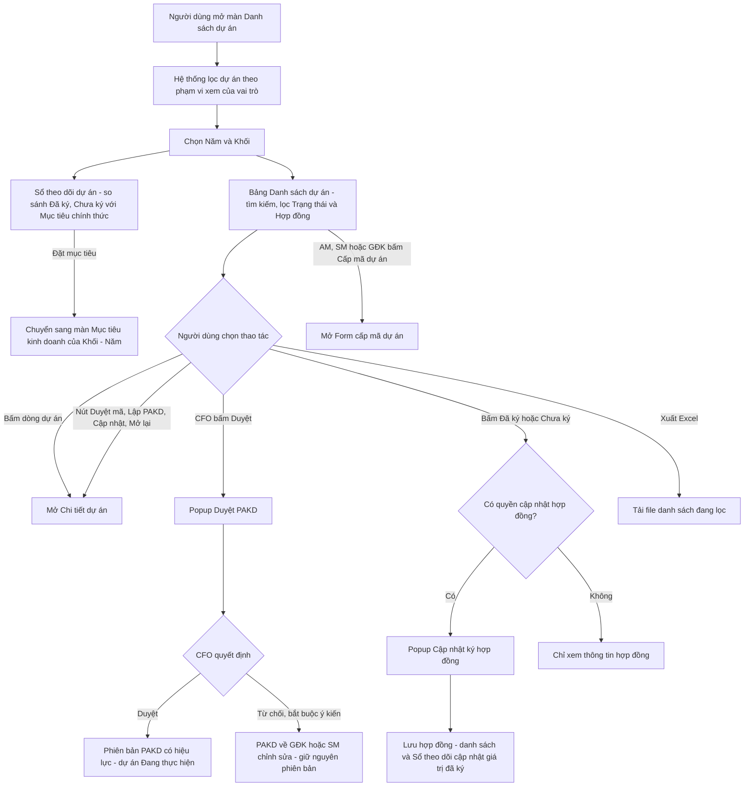
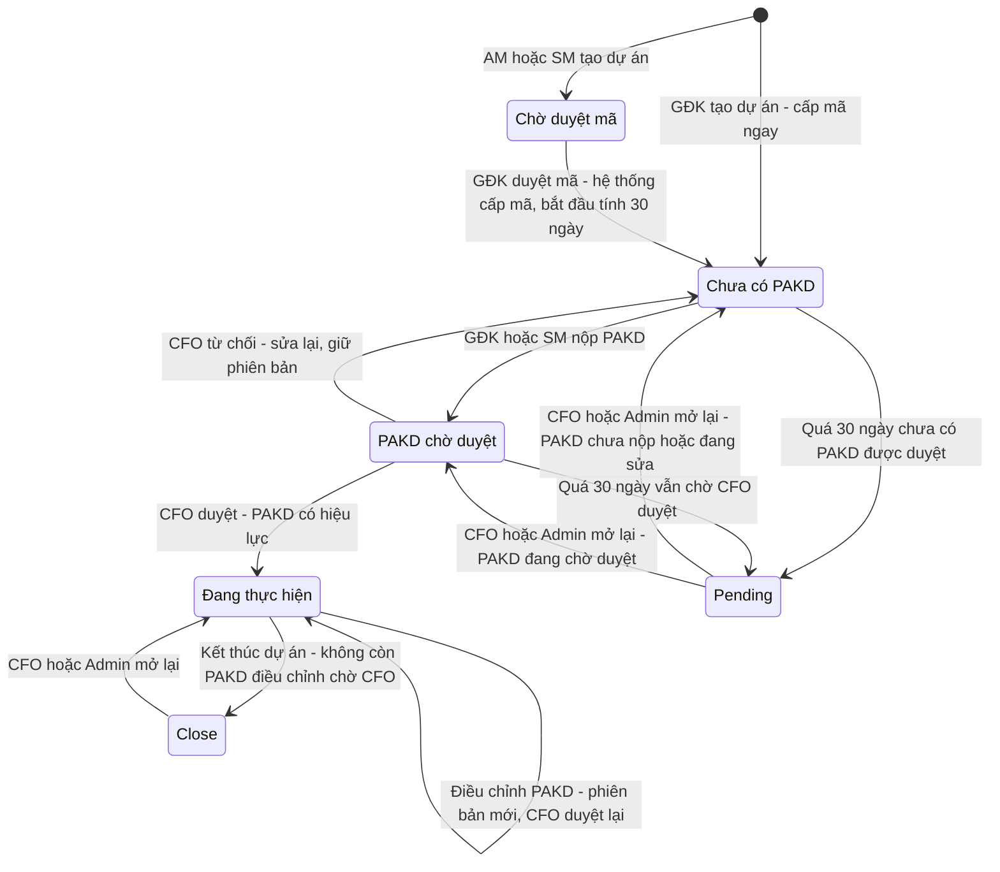
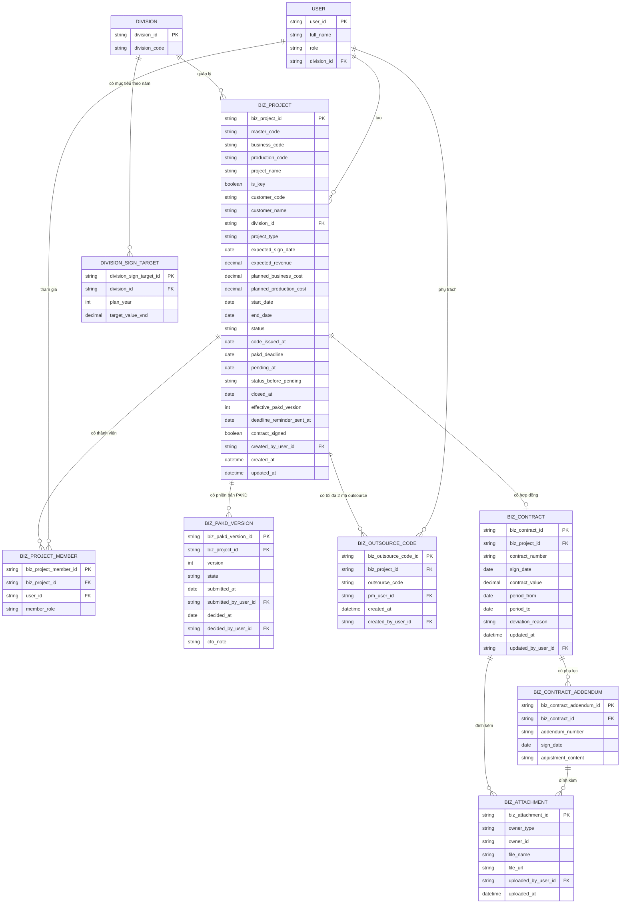
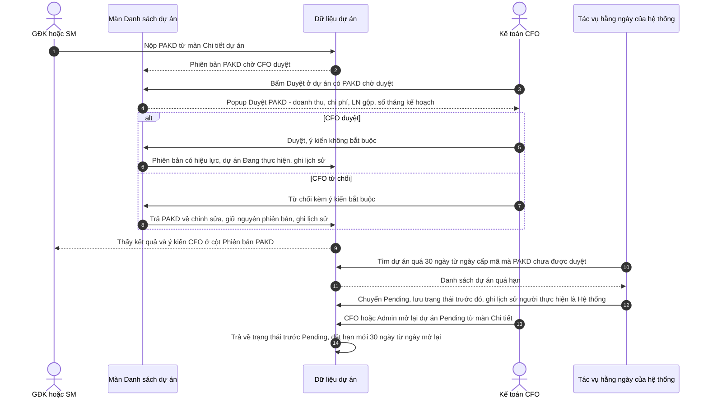

# TÀI LIỆU SRS - CHỨC NĂNG "DANH SÁCH DỰ ÁN"

## Version control

| Tên version | Ngày cập nhật | PIC | Mô tả |
| :--- | :--- | :--- | :--- |
| v01 | 2026-10-02 | AI Agent | - Khởi tạo tài liệu SRS màn Danh sách dự án. - Mục 1: mô tả màn, quy trình dự án và PAKD (chỉ CFO duyệt), vai trò và phạm vi dữ liệu 6 vai trò, 6 trạng thái dự án (gồm Pending, Close), ma trận thao tác, sơ đồ luồng, state diagram, ERD, sequence diagram. - Mục 2: 15 User Story / 4 Epic kèm AC. - Mục 3: 33 Business Rule / 8 nhóm. - Mục 4: Data Dictionary 6 bảng; mục 5: Interaction Details. - Thêm mục lục; bổ sung trường hợp biên CFO duyệt khi dự án vừa chuyển Pending (BR6, BR10). - Chốt câu hỏi mở: tác vụ Pending chạy 00:00 (BR8); chặn kết thúc khi còn PAKD điều chỉnh chờ CFO (BR11); thêm 3 cột Excel (BR24); thêm BR32 nhắc hạn PAKD (còn 3 ngày, gửi GĐK và SM, BA đã chốt), BR33 chuyển đổi dữ liệu cũ. |
| **v02 (hiện tại)** | **2026-10-02** | **AI Agent** | - Rà soát theo code commit d8a9358. - Bộ lọc Năm / Khối chuyển xuống khung Danh sách dự án, vẫn áp dụng cho Sổ theo dõi (mục 1, mục 5). - Giữ bộ lọc Hợp đồng (yêu cầu dev khôi phục). - Thêm BR34: số liệu PAKD chỉ cập nhật vào dự án khi CFO duyệt; thêm AC13.7. - Thêm mã outsource (BR12): tìm kiếm theo mã outsource (BR21, AC4.1), cột Mã outsource trong file Excel (BR24, AC9.1), bảng 4.7 BIZ_OUTSOURCE_CODE. - BR28: lệch giá trị hợp đồng quá 2% chỉ cảnh báo, lý do lệch không bắt buộc (AC14.3, mục 4.4, mục 5). |

## Mục lục
1. [Luồng trạng thái và Nghiệp vụ](#1-luồng-trạng-thái-và-nghiệp-vụ-business-flow): mô tả, quy trình, vai trò, trạng thái, ma trận thao tác, 4 sơ đồ
2. [User Stories & Acceptance Criteria](#2-user-stories--acceptance-criteria-ac): 15 User Story / 4 Epic, 56 AC
3. [Quy tắc nghiệp vụ](#3-quy-tắc-nghiệp-vụ-business-rules): 34 BR / 8 nhóm
4. [Đặc tả trường dữ liệu](#4-đặc-tả-trường-dữ-liệu-data-dictionary): 7 bảng
5. [Mô tả các hiệu ứng tương tác](#5-mô-tả-các-hiệu-ứng-tương-tác-interaction-details)

**Tài liệu liên quan:** `SRS_MucTieuKinhDoanh.md` (nguồn mục tiêu của Sổ theo dõi). SRS Form cấp mã dự án và SRS Chi tiết dự án sẽ được viết sau.

---

## 1. Luồng trạng thái và Nghiệp vụ (Business Flow)

**Mô tả:** Màn *Danh sách dự án* là nơi tập trung theo dõi mọi **dự án kinh doanh** của công ty. Người dùng làm được 4 việc trên màn:
- Theo dõi **tiến độ ký hợp đồng so với mục tiêu** của từng khối qua *Sổ theo dõi dự án*.
- **Tra cứu, lọc** dự án và **xuất Excel**.
- Biết mỗi dự án đang ở bước nào của quy trình **PAKD** (phương án kinh doanh): còn bao nhiêu ngày trước hạn 30 ngày, PAKD đang ở phiên bản nào, đã được Kế toán (CFO) duyệt hay chưa.
- Thao tác nhanh theo vai trò: tạo yêu cầu cấp mã, CFO duyệt PAKD, cập nhật ký hợp đồng.

Màn gồm 3 khu vực:
1. **Thanh tiêu đề "Sổ theo dõi dự án":** nút *Cấp mã dự án*.
2. **Sổ theo dõi dự án:** so sánh giá trị HĐ đã ký và chưa ký với mục tiêu chính thức của từng khối. Mục tiêu lấy từ màn *Mục tiêu kinh doanh*, đã được BOD duyệt.
3. **Bảng Danh sách dự án:** bộ lọc *Năm* và *Khối* (áp dụng cho cả Sổ theo dõi phía trên), tìm kiếm, lọc trạng thái và hợp đồng; thông tin dự án, trạng thái, hạn lập PAKD, phiên bản PAKD, thao tác và thông tin hợp đồng đã ký.

Hai popup mở trực tiếp từ danh sách: **Duyệt PAKD** (chỉ Kế toán – CFO) và **Cập nhật ký hợp đồng**. Các thao tác khác (duyệt mã, lập / chỉnh sửa PAKD, cập nhật thông tin dự án, mở lại) chuyển sang màn *Chi tiết dự án*. Tạo dự án chuyển sang màn *Form cấp mã dự án*. Hai màn này được đặc tả ở SRS riêng.

Đường dẫn: **Quản trị dự án & Tài chính → Danh sách dự án**. ĐVT: **VNĐ**. Trong tài liệu này, **GĐK** và **HOD** (Head of Division) cùng chỉ Giám đốc khối.

**Quy trình dự án và PAKD:**
1. **Tạo dự án:** AM, SM hoặc GĐK tạo dự án (yêu cầu cấp mã).
2. **Duyệt tạo mã:** GĐK duyệt, hệ thống cấp mã. Nếu chính GĐK tạo dự án thì bỏ qua bước này, mã được cấp ngay. Ngày cấp mã là mốc bắt đầu tính hạn **30 ngày**.
3. **Lập và nộp PAKD:** GĐK hoặc SM lập và nộp PAKD, tạo phiên bản **V1**. Bước duyệt chỉ xuất hiện sau khi PAKD đã được nộp.
4. **CFO duyệt hoặc từ chối:**
   - **Duyệt:** dự án chuyển *Đang thực hiện*. Phiên bản này trở thành PAKD có hiệu lực.
   - **Từ chối:** PAKD quay lại bước 3 để GĐK / SM chỉnh sửa và nộp lại, **giữ nguyên số phiên bản**.
5. **Điều chỉnh PAKD khi dự án Đang thực hiện:** GĐK / SM chỉnh sửa PAKD đã duyệt thì tạo **phiên bản mới** (V2, V3…) và gửi CFO duyệt lại.
   - Trong lúc chờ, dự án vẫn ở *Đang thực hiện*, và PAKD có hiệu lực vẫn là phiên bản đã duyệt gần nhất.
   - Phiên bản điều chỉnh bị từ chối thì quay lại chỉnh sửa, vẫn giữ số phiên bản đó.
6. **Pending:** quá 30 ngày kể từ ngày cấp mã mà PAKD vẫn chưa được CFO duyệt thì hệ thống chuyển dự án sang **Pending**. Áp dụng cho cả hai trường hợp: chưa nộp PAKD, hoặc đã nộp nhưng còn chờ CFO duyệt / đang sửa sau khi bị từ chối. Ở trạng thái Pending, **không ai sửa được gì** trên dự án. CFO hoặc Admin mở lại thì dự án được làm tiếp.
7. **Close:** dự án kết thúc thì chuyển **Close** và không sửa được gì nữa. CFO hoặc Admin vẫn mở lại được dự án Close.

**Vai trò, phạm vi dữ liệu và quyền:**

| Vai trò | Phạm vi dự án được xem | Tạo dự án | Thông tin PAKD | Thao tác chính |
| :--- | :--- | :--- | :--- | :--- |
| AM | Dự án mình tạo hoặc được assign | Có, cần GĐK duyệt mã | **Không xem**. Ẩn cột Hạn lập PAKD và Phiên bản PAKD, vẫn thấy cột Trạng thái | Cập nhật thông tin dự án, cập nhật ký hợp đồng |
| SM | Dự án mình tạo hoặc được assign | Có, cần GĐK duyệt mã | Xem, **lập / chỉnh sửa và nộp PAKD** | Lập PAKD, cập nhật thông tin dự án, cập nhật ký hợp đồng |
| GĐK (HOD) | Dự án thuộc khối mình | Có, được cấp mã ngay | Xem, **lập / chỉnh sửa và nộp PAKD** | Duyệt mã, lập PAKD, cập nhật thông tin dự án, cập nhật ký hợp đồng |
| Kế toán (CFO) | Toàn công ty | Không | Xem, **duyệt / từ chối** | Duyệt PAKD, mở lại dự án Pending / Close |
| BOD | Toàn công ty | Không | Xem | Chỉ xem |
| Admin | Toàn công ty | Không | Xem | Mở lại dự án Pending / Close |

> Sổ theo dõi dự án, các số đếm và dòng tổng chỉ tính trên các dự án nằm trong phạm vi xem của người dùng.

**Trạng thái dự án (6 trạng thái):**

| Trạng thái | Ý nghĩa |
| :--- | :--- |
| Chờ duyệt mã | AM hoặc SM đã tạo dự án, chờ GĐK duyệt. Chưa có mã dự án |
| Chưa có PAKD | Đã có mã, chưa nộp PAKD, hoặc PAKD vừa bị CFO từ chối và đang được chỉnh sửa |
| PAKD chờ duyệt | Đã nộp PAKD lần đầu, chờ CFO duyệt |
| Đang thực hiện | PAKD đã được CFO duyệt, dự án đang triển khai. Có thể đang có một phiên bản PAKD điều chỉnh chờ CFO duyệt |
| Pending | Quá 30 ngày kể từ ngày cấp mã mà PAKD chưa được CFO duyệt. Không ai sửa được thông tin dự án, PAKD hay hợp đồng cho đến khi CFO hoặc Admin mở lại |
| Close | Dự án đã kết thúc. Không sửa được gì. CFO hoặc Admin có thể mở lại |

**Ma trận thao tác (cột *Thao tác* trên danh sách):**

| Trạng thái | AM | SM | GĐK (HOD) | Kế toán (CFO) | BOD | Admin |
| :--- | :--- | :--- | :--- | :--- | :--- | :--- |
| Chờ duyệt mã | Xem | Xem | **Duyệt mã** → mở Chi tiết | Xem | Xem | Xem |
| Chưa có PAKD | Cập nhật → mở Chi tiết | **Lập PAKD** → mở Chi tiết | **Lập PAKD** → mở Chi tiết | Xem | Xem | Xem |
| PAKD chờ duyệt | Xem | Xem | Xem | **Duyệt** → popup Duyệt PAKD | Xem | Xem |
| Đang thực hiện | Cập nhật → mở Chi tiết | Cập nhật → mở Chi tiết | Cập nhật → mở Chi tiết | Xem. Nếu có PAKD điều chỉnh chờ duyệt thì **Duyệt** → popup Duyệt PAKD | Xem | Xem |
| Pending | Xem | Xem | Xem | **Mở lại** → mở Chi tiết | Xem | **Mở lại** → mở Chi tiết |
| Close | Xem | Xem | Xem | **Mở lại** → mở Chi tiết | Xem | **Mở lại** → mở Chi tiết |

> - *Cập nhật* nghĩa là cập nhật **thông tin dự án**. Với SM và GĐK, *Cập nhật* bao gồm cả chỉnh sửa PAKD (tạo phiên bản điều chỉnh).
> - Ở mọi trạng thái, bấm vào dòng dự án đều mở *Chi tiết dự án*.
> - Nút *Cấp mã dự án* trên thanh tiêu đề hiện với AM, SM và GĐK.

**Sơ đồ luồng thao tác trên danh sách:**

**State diagram — vòng đời dự án:**

> **Phiên bản PAKD:**
> - V1 sinh khi nộp PAKD lần đầu.
> - CFO từ chối thì sửa và nộp lại vẫn là cùng phiên bản.
> - Phiên bản mới (V2, V3…) chỉ sinh khi chỉnh sửa PAKD **đã được CFO duyệt**, tức là lúc dự án đang *Đang thực hiện*.

**Lát cắt ERD:**

> - `BIZ_PROJECT_MEMBER` lưu những người được assign vào dự án: AM, SM, PM kinh doanh, PM sản xuất, GĐKD (`member_role`). Bảng này dùng để xác định phạm vi xem của AM và SM.
> - `BIZ_PAKD_VERSION.state`: Đang soạn → Chờ CFO → Đã duyệt, hoặc Từ chối. Bị từ chối thì sửa và nộp lại trên cùng bản ghi phiên bản.
> - `BIZ_PROJECT.effective_pakd_version`: phiên bản PAKD đang có hiệu lực, tức phiên bản CFO duyệt gần nhất.
> - `BIZ_PROJECT.status_before_pending`: trạng thái trước khi chuyển Pending, để CFO mở lại về đúng bước.
> - `DIVISION_SIGN_TARGET` thuộc chức năng Mục tiêu kinh doanh (SRS_MucTieuKinhDoanh mục 4.5). Màn này chỉ đọc bảng đó.
> - Chi tiết trường dữ liệu: xem mục 4.

**Sequence diagram — CFO duyệt PAKD từ danh sách, và chuyển Pending khi quá hạn:**

---

## 2. User Stories & Acceptance Criteria (AC)

> Ký hiệu **[Mới]**: yêu cầu đã chốt với BA nhưng chưa có hoặc khác so với prototype hiện tại.

**Epic A:** Sổ theo dõi dự án

### User Story 1: Theo dõi tiến độ ký hợp đồng so với mục tiêu — Là GĐK, CFO, BOD hoặc Admin, tôi muốn thấy giá trị hợp đồng đã ký và chưa ký so với mục tiêu của từng khối, để biết khối nào đang thiếu so với mục tiêu.
*   **Acceptance Criteria:**
    *   **AC1.1:** Người dùng xem được, cho từng khối và cho tổng: giá trị mục tiêu, giá trị đã ký, giá trị chưa ký, giá trị còn thiếu so với mục tiêu và % đạt *(BR15–BR18)*.
    *   **AC1.2:** Mục tiêu của khối là mục tiêu chính thức đã được BOD duyệt ở màn Mục tiêu kinh doanh *(BR15)*.
    *   **AC1.3:** Giá trị đã ký chỉ tính theo hợp đồng đã nhập. Dự án đánh dấu đã ký nhưng chưa nhập hợp đồng thì chưa được tính *(BR16)* **[Mới]**.
    *   **AC1.4:** Số liệu thay đổi theo bộ lọc Năm và Khối. Khi chọn Năm = *Tất cả*, mục tiêu và giá trị được cộng dồn qua các năm *(BR19)*.
    *   **AC1.5:** Khối chưa có mục tiêu chính thức thì phần còn thiếu và % đạt hiển thị "—". Khối vượt mục tiêu thì thể hiện rõ phần vượt *(BR18)*.
    *   **AC1.6:** Sổ theo dõi chỉ hiển thị với GĐK (khối mình), CFO, BOD và Admin *(BR4)* **[Mới]**.

### User Story 2: Đi tới hồ sơ mục tiêu của khối — Là GĐK hoặc BOD, tôi muốn mở nhanh hồ sơ mục tiêu kinh doanh từ Sổ theo dõi, để lập, điều chỉnh hoặc duyệt mục tiêu.
*   **Acceptance Criteria:**
    *   **AC2.1:** Người dùng không nhập mục tiêu trực tiếp trên Sổ theo dõi *(BR15)* **[Mới]**.
    *   **AC2.2:** GĐK được dẫn tới hồ sơ lập mục tiêu của khối mình cho năm đang xem. BOD được dẫn tới tab phê duyệt hồ sơ của khối / năm tương ứng *(BR15)* **[Mới]**.

---

**Epic B:** Tra cứu danh sách dự án

### User Story 3: Lọc theo năm và khối — Là người dùng, tôi muốn lọc dự án theo năm và khối, để tập trung vào nhóm dự án mình quan tâm.
*   **Acceptance Criteria:**
    *   **AC3.1:** Người dùng chọn được một năm hoặc *Tất cả*, và một khối hoặc *Tất cả*. Bộ lọc áp dụng cho cả Sổ theo dõi lẫn danh sách *(BR20, BR25)*.
    *   **AC3.2:** Danh sách năm gồm năm hiện tại, các năm có dự án và các năm đã có mục tiêu kinh doanh *(BR25)*.
    *   **AC3.3:** Mặc định khi mở màn: năm hiện tại, tất cả các khối trong phạm vi xem.

### User Story 4: Tìm kiếm và lọc theo trạng thái, hợp đồng — Là người dùng, tôi muốn tìm nhanh một dự án và lọc theo trạng thái hoặc tình trạng ký hợp đồng.
*   **Acceptance Criteria:**
    *   **AC4.1:** Người dùng tìm được dự án theo mã dự án, mã outsource, tên dự án, mã / tên khách hàng, PM kinh doanh, PM sản xuất *(BR21)* **[Mới — mã outsource]**.
    *   **AC4.2:** Người dùng lọc được theo 1 trong 6 trạng thái dự án, và theo hợp đồng *Đã ký* / *Chưa ký* *(BR22)*.
    *   **AC4.3:** Mỗi lựa chọn lọc cho biết có bao nhiêu dự án, tính theo các điều kiện lọc còn lại *(BR22)*.
    *   **AC4.4:** Không có dự án phù hợp thì người dùng được báo rõ.

### User Story 5: Xem thông tin dự án trên danh sách — Là người dùng, tôi muốn thấy các thông tin chính của từng dự án ngay trên danh sách mà không phải mở chi tiết.
*   **Acceptance Criteria:**
    *   **AC5.1:** Mỗi dự án hiển thị: mã dự án, tên, khách hàng, khối, loại dự án, thời điểm dự kiến ký HĐ, giá trị HĐ dự kiến, PM kinh doanh, PM sản xuất, trạng thái, hạn lập PAKD, phiên bản PAKD *(BR12)*.
    *   **AC5.2:** Dự án KEY được nhận biết rõ. Dự án chưa được cấp mã thể hiện là đang chờ cấp mã.
    *   **AC5.3:** Người dùng chỉ thấy các dự án thuộc phạm vi xem của vai trò mình *(BR1, BR2)* **[Mới]**.
    *   **AC5.4:** AM không thấy thông tin PAKD (hạn lập PAKD, phiên bản PAKD) nhưng vẫn thấy trạng thái dự án *(BR3)* **[Mới]**.

### User Story 6: Theo dõi hạn và phiên bản PAKD — Là GĐK, SM, CFO hoặc BOD, tôi muốn biết dự án còn bao nhiêu ngày để có PAKD được duyệt và PAKD đang ở phiên bản nào, để đôn đốc kịp thời.
*   **Acceptance Criteria:**
    *   **AC6.1:** Với dự án chưa có PAKD được duyệt, người dùng biết còn bao nhiêu ngày đến hạn 30 ngày. Dự án sắp đến hạn được làm nổi bật *(BR8, BR13)*.
    *   **AC6.2:** Người dùng biết PAKD đã nộp, đang chờ CFO duyệt, bị từ chối (kèm ngày) hay đã duyệt (kèm ngày) *(BR13, BR14)*.
    *   **AC6.3:** Với dự án đang thực hiện có PAKD điều chỉnh chờ duyệt, người dùng biết phiên bản nào đang chờ duyệt và phiên bản nào đang có hiệu lực *(BR7, BR14)* **[Mới]**.
    *   **AC6.4:** Dự án quá hạn 30 ngày mà PAKD chưa được duyệt thì tự chuyển *Pending*, và người dùng thấy ngày chuyển *(BR8)* **[Mới]**.
    *   **AC6.5:** GĐK và SM của dự án được nhắc qua email khi dự án sắp đến hạn 30 ngày mà PAKD chưa được duyệt *(BR32)* **[Mới]**.

### User Story 7: Xem thông tin hợp đồng đã ký — Là người dùng, tôi muốn thấy thông tin hợp đồng của dự án đã ký ngay trên danh sách.
*   **Acceptance Criteria:**
    *   **AC7.1:** Với dự án đã nhập hợp đồng, người dùng thấy giá trị HĐ ký, số HĐ, ngày ký, ngày hết hạn, số tệp đính kèm và tình trạng *Đã ký* *(BR30)*.
    *   **AC7.2:** Dự án đánh dấu đã ký nhưng chưa nhập hợp đồng thì các thông tin hợp đồng để trống, kèm nhãn "Chưa nhập HĐ" *(BR30)* **[Mới]**.
    *   **AC7.3:** Dự án chưa ký thể hiện tình trạng *Chưa ký*.

### User Story 8: Xem tổng giá trị — Là người dùng, tôi muốn biết tổng giá trị HĐ dự kiến và tổng giá trị HĐ ký của các dự án đang lọc.
*   **Acceptance Criteria:**
    *   **AC8.1:** Người dùng thấy số dự án đang hiển thị trên tổng số dự án trong phạm vi xem *(BR23)*.
    *   **AC8.2:** Người dùng thấy tổng giá trị HĐ dự kiến và tổng giá trị HĐ ký, tính trên các dự án đang lọc *(BR23)*.

### User Story 9: Xuất Excel — Là người dùng, tôi muốn xuất danh sách đang lọc ra Excel để báo cáo hoặc xử lý tiếp.
*   **Acceptance Criteria:**
    *   **AC9.1:** File xuất gồm đúng các dự án đang lọc, đủ các cột thông tin dự án và thông tin hợp đồng, kèm mã kinh doanh, mã sản xuất, mã outsource và ngày cấp mã *(BR24)* **[Mới — 4 cột thêm]**.
    *   **AC9.2:** File xuất của AM không có thông tin PAKD *(BR3, BR24)* **[Mới]**.

### User Story 10: Mở chi tiết dự án — Là người dùng, tôi muốn mở chi tiết của một dự án từ danh sách để xem đầy đủ hoặc thao tác tiếp.
*   **Acceptance Criteria:**
    *   **AC10.1:** Người dùng mở được chi tiết của bất kỳ dự án nào trong danh sách.
    *   **AC10.2:** Khi quay lại danh sách, người dùng thấy dữ liệu đã cập nhật theo các thao tác vừa làm.

---

**Epic C:** Thao tác theo vai trò

### User Story 11: Cấp mã dự án — Là AM, SM hoặc GĐK, tôi muốn tạo dự án mới từ danh sách để bắt đầu quy trình kinh doanh.
*   **Acceptance Criteria:**
    *   **AC11.1:** Chỉ AM, SM và GĐK tạo được dự án *(BR5)*.
    *   **AC11.2:** Dự án do AM hoặc SM tạo phải chờ GĐK duyệt mã. Dự án do GĐK tạo được cấp mã ngay *(BR5, BR12)*.
    *   **AC11.3:** Thông tin cần nhập khi tạo dự án được đặc tả ở SRS Form cấp mã dự án.

### User Story 12: Thao tác nhanh theo trạng thái — Là người dùng, tôi muốn thấy ngay việc mình cần làm với từng dự án, để xử lý đúng bước của quy trình.
*   **Acceptance Criteria:**
    *   **AC12.1:** Mỗi dự án chỉ gợi ý thao tác mà vai trò của người dùng được phép làm ở trạng thái hiện tại, theo ma trận ở mục 1 *(BR5–BR10)*.
    *   **AC12.2:** GĐK được nhắc duyệt mã các dự án đang chờ duyệt mã của khối mình.
    *   **AC12.3:** GĐK và SM được nhắc lập PAKD cho dự án chưa có PAKD **[Mới — SM]**.
    *   **AC12.4:** CFO được nhắc duyệt các PAKD đang chờ duyệt, gồm cả PAKD lần đầu lẫn PAKD điều chỉnh.
    *   **AC12.5:** CFO và Admin mở lại được dự án *Pending* hoặc *Close* *(BR9)* **[Mới]**.
    *   **AC12.6:** Dự án *Pending* hoặc *Close* không cho bất kỳ ai cập nhật thông tin dự án, PAKD hay hợp đồng *(BR10)* **[Mới]**.

### User Story 13: CFO duyệt PAKD từ danh sách — Là Kế toán (CFO), tôi muốn duyệt hoặc từ chối PAKD ngay trên danh sách, để xử lý nhanh mà không phải mở từng dự án.
*   **Acceptance Criteria:**
    *   **AC13.1:** CFO duyệt được PAKD đang chờ duyệt ngay trên danh sách *(BR6)*.
    *   **AC13.2:** Trước khi quyết định, CFO xem được tóm tắt: dự án, người nộp và ngày nộp, doanh thu PAKD, chi phí kế hoạch, LN gộp kế hoạch và tỷ lệ, tình trạng import kế hoạch theo tháng. Với PAKD điều chỉnh, CFO biết phiên bản đang có hiệu lực *(BR6, BR7)*.
    *   **AC13.3:** Khi duyệt, ý kiến không bắt buộc. Khi từ chối, ý kiến là bắt buộc *(BR6)*.
    *   **AC13.4:** Duyệt PAKD lần đầu thì dự án chuyển *Đang thực hiện*. Duyệt PAKD điều chỉnh thì phiên bản đó trở thành phiên bản có hiệu lực *(BR6, BR7)*.
    *   **AC13.5:** Từ chối thì PAKD quay về GĐK / SM chỉnh sửa và giữ nguyên số phiên bản *(BR7)* **[Mới]**.
    *   **AC13.6:** Mọi quyết định đều được ghi lịch sử dự án, kèm người quyết định, thời điểm và ý kiến.
    *   **AC13.7:** Số liệu của PAKD (giá trị HĐ dự kiến, chi phí kế hoạch, thời điểm dự kiến ký, kế hoạch theo tháng) chỉ được cập nhật vào dự án, danh sách và Sổ theo dõi **sau khi CFO duyệt**. Lúc nộp hoặc khi bị từ chối, số liệu dự án giữ nguyên *(BR34)* **[Mới]**.

---

**Epic D:** Hợp đồng

### User Story 14: Cập nhật ký hợp đồng — Là AM, SM hoặc GĐK của dự án, tôi muốn ghi nhận hợp đồng đã ký ngay từ danh sách, để số liệu ký hợp đồng và Sổ theo dõi luôn đúng.
*   **Acceptance Criteria:**
    *   **AC14.1:** Chỉ AM, SM, GĐK của dự án cập nhật được hợp đồng, và chỉ khi dự án đã có mã và không ở *Pending* / *Close* *(BR26)* **[Mới]**.
    *   **AC14.2:** Hệ thống chỉ ghi nhận hợp đồng khi có đủ số HĐ, ngày ký, giá trị HĐ và thời hạn thực hiện hợp lệ *(BR27)*.
    *   **AC14.3:** Khi giá trị HĐ lệch quá 2% so với giá trị HĐ dự kiến đã khai báo, người dùng được cảnh báo. Lý do lệch có thể ghi thêm nhưng không bắt buộc *(BR28)* **[Mới]**.
    *   **AC14.4:** Người dùng thêm được phụ lục điều chỉnh và tài liệu đính kèm cho hợp đồng *(BR29)*.
    *   **AC14.5:** Sau khi lưu, dự án được tính là *Đã ký*, và giá trị đã ký ở Sổ theo dõi cập nhật theo hợp đồng vừa nhập *(BR16, BR31)*.
    *   **AC14.6:** Người không có quyền chỉ xem được thông tin hợp đồng đã có.

### User Story 15: Xem tài liệu hợp đồng — Là người dùng, tôi muốn mở nhanh các tài liệu hợp đồng đã đính kèm từ danh sách.
*   **Acceptance Criteria:**
    *   **AC15.1:** Người dùng biết dự án có bao nhiêu tệp hợp đồng đính kèm và mở xem được *(BR30)*.

---

## 3. Quy tắc nghiệp vụ (Business Rules)

**Nhóm 1 — Vai trò và phạm vi dữ liệu**

*   **BR1 (Vai trò theo tài khoản):** Vai trò và khối của người dùng được lấy theo tài khoản đăng nhập. Người dùng không tự chọn vai trò trên màn. Một người có nhiều vai trò thì được hợp quyền của các vai trò đó. **[Mới]**
*   **BR2 (Phạm vi xem dự án):**
    *   AM và SM: dự án do mình tạo, hoặc dự án mình được assign (thành viên dự án).
    *   GĐK: mọi dự án thuộc khối mình.
    *   CFO, BOD, Admin: toàn công ty.

    Dự án ngoài phạm vi không hiển thị, không được đếm và không được tính tổng. **[Mới]**
*   **BR3 (Quyền xem PAKD):** SM, GĐK, CFO, BOD và Admin xem được thông tin PAKD. AM **không** xem được PAKD: ẩn cột *Hạn lập PAKD* và *Phiên bản PAKD* trên danh sách và trong file xuất. AM vẫn thấy *Trạng thái* dự án. **[Mới]**
*   **BR4 (Hiển thị Sổ theo dõi):** Sổ theo dõi dự án hiển thị với GĐK (chỉ khối mình), CFO, BOD và Admin. AM và SM không thấy Sổ theo dõi, vì mục tiêu là của cả khối, không so được với vài dự án trong phạm vi của họ. **[Mới]**

**Nhóm 2 — Vòng đời dự án và PAKD**

*   **BR5 (Tạo dự án và duyệt mã):**
    *   AM, SM hoặc GĐK tạo dự án.
    *   Dự án do AM hoặc SM tạo ở trạng thái *Chờ duyệt mã* cho tới khi GĐK của khối duyệt.
    *   GĐK tạo dự án thì mã được cấp ngay, dự án vào thẳng *Chưa có PAKD*.
    *   Ngày cấp mã (`code_issued_at`) là mốc bắt đầu tính hạn PAKD.
*   **BR6 (Nộp và duyệt PAKD):**
    *   GĐK hoặc SM nộp PAKD. Chỉ CFO duyệt hoặc từ chối.
    *   Khi duyệt, ý kiến không bắt buộc. Khi từ chối, ý kiến là bắt buộc, không chấp nhận nội dung trống hoặc chỉ có khoảng trắng.
    *   Duyệt PAKD lần đầu thì dự án chuyển *Đang thực hiện*.
    *   Bước duyệt chỉ phát sinh sau khi PAKD đã được nộp.
    *   CFO chỉ quyết định được khi dự án đang có PAKD *chờ CFO* và **không ở Pending / Close**. Nếu dự án vừa chuyển Pending trong lúc CFO đang mở popup, quyết định bị chặn và CFO được báo "Dự án đã chuyển Pending — cần mở lại trước khi duyệt".
*   **BR7 (Phiên bản PAKD):**
    *   Nộp PAKD lần đầu thì tạo **V1**.
    *   CFO từ chối thì GĐK / SM chỉnh sửa và nộp lại trên **cùng phiên bản**.
    *   Phiên bản mới (V2, V3…) chỉ sinh khi GĐK / SM chỉnh sửa PAKD **đã được duyệt** lúc dự án đang *Đang thực hiện*. Phiên bản điều chỉnh chỉ cần CFO duyệt.
    *   Trong lúc chờ, dự án giữ trạng thái *Đang thực hiện*. Phiên bản có hiệu lực (`effective_pakd_version`) vẫn là phiên bản được duyệt gần nhất, và chỉ đổi khi phiên bản điều chỉnh được duyệt. **[Mới]**
*   **BR8 (Hạn 30 ngày và Pending):**
    *   Hạn PAKD = ngày cấp mã + **30 ngày**.
    *   Tác vụ chạy lúc **00:00 hằng ngày** và tính theo ngày. Tác vụ chuyển sang *Pending* các dự án đã quá hạn mà chưa có PAKD nào được CFO duyệt (đang ở *Chưa có PAKD* hoặc *PAKD chờ duyệt*).
    *   Dự án có hạn đúng ngày D vẫn được làm việc hết ngày D, và chuyển *Pending* lúc 00:00 ngày D + 1.
    *   Hệ thống lưu ngày chuyển (`pending_at`) và trạng thái trước đó (`status_before_pending`), rồi ghi lịch sử với người thực hiện là "Hệ thống".
    *   Dự án đã có PAKD được duyệt thì không bao giờ bị chuyển Pending. **[Mới]**
*   **BR9 (Mở lại dự án):**
    *   Chỉ CFO hoặc Admin được mở lại.
    *   Mở lại dự án *Pending*: dự án về đúng trạng thái trước khi Pending, và hạn PAKD mới = ngày mở lại + 30 ngày.
    *   Mở lại dự án *Close*: dự án về *Đang thực hiện*.
    *   Mỗi lần mở lại đều ghi lịch sử. **[Mới]**
*   **BR10 (Khoá ở Pending và Close):** Khi dự án ở *Pending* hoặc *Close*, không ai được sửa thông tin dự án, PAKD hay hợp đồng. CFO cũng không duyệt / từ chối được PAKD đang chờ (BR6). Thao tác duy nhất còn lại là mở lại (BR9). **[Mới]**
*   **BR11 (Kết thúc dự án):**
    *   Dự án *Đang thực hiện* được kết thúc ở màn Chi tiết dự án thì chuyển *Close*.
    *   Nếu dự án đang có phiên bản PAKD điều chỉnh chờ CFO duyệt thì **chưa được kết thúc**. CFO phải xử lý xong phiên bản đó trước.
    *   Trạng thái *Kết thúc* và *Đóng* của prototype không còn dùng (xem BR33). **[Mới]**

**Nhóm 3 — Mã dự án**

*   **BR12 (Cấu trúc mã):**
    *   Mã tổng (Master) = `<Mã khách hàng>.<số thứ tự 3 chữ số>`. Số thứ tự bằng số lớn nhất đang có của cùng mã khách hàng + 1. Ví dụ: `022.061`.
    *   Mã kinh doanh = Master + `.1`. Mã sản xuất = Master + `.2`.
    *   **Mã outsource:** mỗi dự án đã có mã được tạo thêm **tối đa 2** mã outsource, lần lượt là Master + `.3` và Master + `.4`. Mỗi mã gán một PM phụ trách. Mã outsource được tạo / xoá ở màn Chi tiết dự án. Trên màn Danh sách, mã outsource **không có cột riêng**, chỉ dùng cho tìm kiếm (BR21) và file xuất (BR24). **[Mới]**
    *   Dự án chưa được cấp mã hiển thị "Chờ cấp mã".

**Nhóm 4 — Hiển thị hạn và phiên bản PAKD**

*   **BR13 (Cột Hạn lập PAKD):**

    | Tình huống | Hiển thị |
    | :--- | :--- |
    | Chờ duyệt mã | — |
    | Chưa có PAKD, chưa nộp | "Còn N ngày" (nổi bật khi N ≤ 3) hoặc "Hết hạn hôm nay" |
    | Chưa có PAKD, vừa bị từ chối | "Sửa lại V{n}", dòng phụ "Từ chối dd/mm/yyyy · còn N ngày" |
    | PAKD chờ duyệt | "Nộp", dòng phụ ngày nộp và số ngày còn lại |
    | Đang thực hiện | "Duyệt", dòng phụ ngày duyệt của phiên bản có hiệu lực |
    | Pending | "Pending", dòng phụ ngày chuyển Pending |
    | Close | "Close", dòng phụ ngày đóng |
*   **BR14 (Cột Phiên bản PAKD):** Hiển thị theo dạng *"V{n}, {tình trạng}"*, với tình trạng là *chờ CFO*, *từ chối* hoặc *đã duyệt*. Nếu dự án *Đang thực hiện* có phiên bản điều chỉnh chờ duyệt thì hiển thị *"V{n}, chờ CFO · hiệu lực V{m}"*. Chưa nộp PAKD thì hiển thị "—". Tình trạng *từ chối* hiển thị màu đỏ.

**Nhóm 5 — Sổ theo dõi dự án**

*   **BR15 (Mục tiêu khối):**
    *   Giá trị mục tiêu của khối trong năm lấy từ `division_sign_target`, tức mục tiêu chính thức BOD đã duyệt (SRS_MucTieuKinhDoanh BR27).
    *   Sổ theo dõi không cho nhập mục tiêu.
    *   Chức năng *Đặt mục tiêu* dẫn GĐK tới tab lập của khối mình, và dẫn BOD tới tab phê duyệt (SRS_MucTieuKinhDoanh BR28). Vai trò khác không thấy chức năng này. **[Mới]**
*   **BR16 (Giá trị đã ký):** Σ giá trị hợp đồng (`contract_value`) của các dự án đã nhập hợp đồng có **ngày ký thuộc năm đang xem**. Dự án đánh dấu đã ký nhưng chưa nhập hợp đồng thì không được tính. **[Mới]**
*   **BR17 (Giá trị chưa ký):** Σ giá trị HĐ dự kiến (`expected_revenue`) của các dự án chưa ký thỏa cả 3 điều kiện:
    *   Có thời điểm dự kiến ký HĐ thuộc năm đang xem.
    *   Không ở *Pending* hoặc *Close*.
    *   Không phải dự án đã đánh dấu ký mà chưa nhập hợp đồng.
*   **BR18 (Còn thiếu và % đạt):**
    *   Còn thiếu = Mục tiêu − Đã ký − Chưa ký. Kết quả âm thì hiển thị "Vượt {giá trị}".
    *   % Đạt = (Đã ký + Chưa ký) / Mục tiêu.
    *   Chưa có mục tiêu thì cả hai hiển thị "—".
    *   Ô tổng dùng cùng công thức, cộng trên các khối đang xem. **[Mới — thống nhất công thức ô tổng với bảng theo khối]**
*   **BR19 (Năm = Tất cả):** Mục tiêu bằng tổng mục tiêu của mọi năm. Đã ký và Chưa ký không lọc theo năm. Nhãn ô tổng đổi thành "Mục tiêu luỹ kế".

**Nhóm 6 — Tra cứu, tổng và xuất Excel**

*   **BR20 (Năm của dự án trên danh sách):** Năm dùng để lọc danh sách được xác định theo thứ tự ưu tiên: năm ký trên hợp đồng đã nhập → năm của thời điểm dự kiến ký HĐ → năm tạo dự án.
*   **BR21 (Tìm kiếm):** Tìm không phân biệt hoa thường, khớp một phần với: mã dự án, mã outsource, tên dự án, mã khách hàng, tên khách hàng, PM kinh doanh, PM sản xuất.
*   **BR22 (Bộ lọc và số đếm):** Lọc Trạng thái và Hợp đồng kết hợp với Năm, Khối và từ khoá tìm kiếm. Số đếm cạnh mỗi lựa chọn tính theo các điều kiện lọc còn lại. Ví dụ: số đếm của trạng thái tính theo Năm, Khối, từ khoá và lọc Hợp đồng.
*   **BR23 (Dòng tổng):**
    *   Chân bảng ghi "{số dự án đang hiển thị} / {tổng số dự án trong phạm vi xem} dự án".
    *   Dòng tổng gồm: Σ Giá trị HĐ dự kiến, và Σ Giá trị HĐ ký (chỉ hợp đồng đã nhập).
*   **BR24 (Xuất Excel):** Xuất đúng danh sách đang lọc, theo thứ tự đang hiển thị, đủ các cột trừ cột *Thao tác*, kèm nhóm cột hợp đồng. File có thêm 4 cột không hiển thị trên màn: **Mã kinh doanh**, **Mã sản xuất**, **Mã outsource** (các mã cách nhau bằng dấu phẩy, trống nếu không có), **Ngày cấp mã**. Áp dụng BR3 cho AM. Tên file: `du-an-kinh-doanh.xlsx`.
*   **BR25 (Danh sách năm và thứ tự):** Danh sách năm gồm năm hiện tại, các năm của dự án trong phạm vi xem (BR20) và các năm đã có mục tiêu kinh doanh, sắp tăng dần. Danh sách dự án mặc định sắp **dự án tạo mới nhất lên đầu**.

**Nhóm 7 — Hợp đồng**

*   **BR26 (Quyền cập nhật hợp đồng):** AM, SM và GĐK của dự án được cập nhật hợp đồng, với điều kiện dự án đã có mã và không ở *Pending* / *Close* (BR10). Các trường hợp khác chỉ xem được hợp đồng đã có. **[Mới]**
*   **BR27 (Trường bắt buộc):**
    *   Bắt buộc có: số HĐ, ngày ký, giá trị HĐ lớn hơn 0, thời hạn thực hiện từ ngày – đến ngày.
    *   Ngày kết thúc phải sau hoặc bằng ngày bắt đầu.
    *   Chưa hợp lệ thì hệ thống liệt kê tất cả các mục còn thiếu hoặc sai.
*   **BR28 (Cảnh báo lệch giá trị):**
    *   Tỷ lệ lệch = |Giá trị HĐ − Giá trị HĐ dự kiến (`expected_revenue`)| / Giá trị HĐ dự kiến.
    *   Lệch **quá 2%** thì hệ thống chỉ **cảnh báo**, không chặn việc lưu. Lý do lệch là trường không bắt buộc.
    *   Ngưỡng 2% dùng chung với cảnh báo lệch trong form PAKD. **[Mới]**
*   **BR29 (Phụ lục và tài liệu):** Hợp đồng có thể có nhiều phụ lục. Mỗi phụ lục bắt buộc có số phụ lục và ngày ký, kèm nội dung điều chỉnh và tệp (không bắt buộc). Hợp đồng và phụ lục đính kèm được nhiều tệp.
*   **BR30 (Hiển thị hợp đồng trên danh sách):**
    *   Dự án đã nhập hợp đồng: hiển thị giá trị HĐ ký, số HĐ, ngày ký, ngày hết hạn (= ngày cuối của thời hạn thực hiện), số tệp và *Đã ký*.
    *   Dự án đánh dấu đã ký nhưng chưa nhập hợp đồng: các cột để trống, kèm nhãn **"Chưa nhập HĐ"**. Không lấy số dự kiến thay thế. **[Mới]**
    *   Dự án chưa ký: hiển thị *Chưa ký*.
*   **BR31 (Ghi nhận khi lưu hợp đồng):** Lưu hợp đồng hợp lệ thì dự án được đánh dấu đã ký (`contract_signed = true`), ghi lịch sử *Xác nhận ký hợp đồng* (lần đầu) hoặc *Cập nhật hợp đồng*, và Sổ theo dõi tính lại theo BR16, BR17.

**Nhóm 8 — Nhắc hạn, chuyển đổi dữ liệu và đồng bộ PAKD**

*   **BR32 (Nhắc hạn PAKD):**
    *   Tác vụ 00:00 hằng ngày (BR8) gửi **email nhắc** cho GĐK và SM của dự án khi dự án còn **3 ngày** đến hạn PAKD mà chưa có PAKD được CFO duyệt (dự án ở *Chưa có PAKD* hoặc *PAKD chờ duyệt*).
    *   Mỗi hạn chỉ nhắc 1 lần, ghi nhận ở `deadline_reminder_sent_at`. Mở lại dự án (BR9) thì hạn mới được nhắc lại.
    *   Nội dung email: mã và tên dự án, hạn PAKD, số ngày còn lại, tình trạng PAKD, liên kết mở dự án.
    *   Email báo CFO khi có PAKD chờ duyệt đã có sẵn trong hệ thống, tài liệu này không đặc tả lại. **[Mới]**
*   **BR33 (Chuyển đổi dữ liệu cũ):** Khi áp dụng 6 trạng thái mới, dự án đang ở trạng thái *Kết thúc* hoặc *Đóng* của hệ thống cũ đều chuyển thành **Close**. Việc chuyển đổi được ghi lịch sử với người thực hiện là "Hệ thống". **[Mới]**
*   **BR34 (Đồng bộ số liệu PAKD vào dự án):**
    *   Các số liệu lập trong PAKD được ghi vào dự án **chỉ khi CFO duyệt** phiên bản PAKD đó. Gồm: giá trị HĐ dự kiến (`expected_revenue`), chi phí kinh doanh / sản xuất kế hoạch, thời điểm dự kiến ký HĐ, kế hoạch theo tháng.
    *   Khi GĐK / SM lưu nháp hoặc nộp PAKD, hoặc khi CFO từ chối, số liệu dự án **không thay đổi**. Danh sách và Sổ theo dõi tiếp tục hiển thị theo phiên bản đang có hiệu lực.
    *   Với PAKD điều chỉnh (BR7), số liệu chỉ đổi khi phiên bản điều chỉnh được duyệt. **[Mới]**

---

## 4. Đặc tả trường dữ liệu (Data Dictionary)

> - Đơn vị tiền: **VNĐ**. Ngày dạng `YYYY-MM-DD`.
> - Bảng `division` và `user` là bảng có sẵn của hệ thống, chỉ được tham chiếu.
> - Bảng `division_sign_target` thuộc chức năng Mục tiêu kinh doanh (SRS_MucTieuKinhDoanh mục 4.5). Màn này chỉ đọc bảng đó.

### 4.1. Bảng BIZ_PROJECT (Dự án kinh doanh)
Chỉ liệt kê các trường mà màn Danh sách dự án dùng để hiển thị, lọc và tính toán. Các trường còn lại được đặc tả ở SRS Form cấp mã / Chi tiết dự án.

| Tên trường | Loại data | Bắt buộc? | Mô tả |
| :--- | :--- | :--- | :--- |
| `biz_project_id` | String (PK) | Có | Khoá chính, tự sinh. |
| `master_code` | String | Không | Mã tổng `<Mã KH>.<STT 3 chữ số>` (BR12). Trống khi *Chờ duyệt mã*. Duy nhất khi có giá trị. |
| `business_code` | String | Không | Mã kinh doanh = `master_code` + `.1`. |
| `production_code` | String | Không | Mã sản xuất = `master_code` + `.2`. |
| `project_name` | String | Có | Tên dự án. |
| `is_key` | Boolean | Có | Dự án KEY, mặc định `false`. |
| `customer_code` | String | Có | Mã khách hàng, dùng để sinh mã tổng. |
| `customer_name` | String | Có | Tên khách hàng. |
| `division_id` | Foreign Key | Có | Liên kết bảng `division`: khối quản lý dự án. |
| `project_type` | String | Có | Loại dự án. |
| `expected_sign_date` | Date | Không | Thời điểm dự kiến ký HĐ, dùng cho Sổ theo dõi (BR17) và năm của dự án (BR20). |
| `expected_revenue` | Number | Có | Giá trị HĐ dự kiến (VNĐ), là giá trị đã khai báo để so lệch khi nhập hợp đồng (BR28). |
| `planned_business_cost` | Number | Không | Chi phí kinh doanh kế hoạch (VNĐ), hiển thị trong popup Duyệt PAKD. |
| `planned_production_cost` | Number | Không | Chi phí sản xuất kế hoạch (VNĐ), hiển thị trong popup Duyệt PAKD. |
| `start_date` | Date | Có | Ngày bắt đầu dự án. |
| `end_date` | Date | Có | Ngày kết thúc dự án. |
| `status` | Enum | Có | `waiting_code` = Chờ duyệt mã · `no_pakd` = Chưa có PAKD · `pakd_pending` = PAKD chờ duyệt · `in_progress` = Đang thực hiện · `pending` = Pending · `closed` = Close. |
| `code_issued_at` | Date | Không | Ngày cấp mã, mốc tính hạn 30 ngày (BR5, BR8). |
| `pakd_deadline` | Date | Không | Hạn có PAKD được duyệt = `code_issued_at` + 30, hoặc ngày mở lại + 30 (BR8, BR9). |
| `pending_at` | Date | Không | Ngày hệ thống chuyển Pending (BR8). |
| `status_before_pending` | Enum | Không | `no_pakd` hoặc `pakd_pending`: trạng thái trước khi Pending, để mở lại về đúng bước (BR9). |
| `closed_at` | Date | Không | Ngày dự án chuyển Close (BR11). |
| `effective_pakd_version` | Number | Không | Phiên bản PAKD đang có hiệu lực, tức phiên bản CFO duyệt gần nhất (BR7). Trống khi chưa có PAKD nào được duyệt. |
| `deadline_reminder_sent_at` | Date | Không | Ngày đã gửi email nhắc hạn PAKD cho hạn hiện tại (BR32). Xoá trống khi hạn được đặt lại lúc mở lại dự án. |
| `contract_signed` | Boolean | Có | Đã ký hợp đồng hay chưa, mặc định `false`. Chuyển `true` khi lưu hợp đồng (BR31). |
| `created_by_user_id` | Foreign Key | Có | Liên kết bảng `user`: người tạo dự án, dùng cho phạm vi xem của AM / SM (BR2). |
| `created_at` | DateTime | Có | Thời điểm tạo, dùng cho năm của dự án (BR20) và thứ tự mặc định (BR25). |
| `updated_at` | DateTime | Có | Thời điểm cập nhật gần nhất. |

### 4.2. Bảng BIZ_PROJECT_MEMBER (Thành viên được assign vào dự án)
Ràng buộc duy nhất: (`biz_project_id`, `user_id`, `member_role`).

| Tên trường | Loại data | Bắt buộc? | Mô tả |
| :--- | :--- | :--- | :--- |
| `biz_project_member_id` | String (PK) | Có | Khoá chính, tự sinh. |
| `biz_project_id` | Foreign Key | Có | Liên kết bảng `biz_project`. |
| `user_id` | Foreign Key | Có | Liên kết bảng `user`. |
| `member_role` | Enum | Có | `am` = AM · `sm` = SM · `business_pm` = PM kinh doanh · `production_pm` = PM sản xuất · `business_director` = GĐKD. Cột *PM Kinh doanh* / *PM sản xuất* trên danh sách lấy theo vai trò này. |

### 4.3. Bảng BIZ_PAKD_VERSION (Phiên bản PAKD)
Ràng buộc duy nhất: (`biz_project_id`, `version`). Bị từ chối thì sửa và nộp lại trên **cùng bản ghi** (BR7).

| Tên trường | Loại data | Bắt buộc? | Mô tả |
| :--- | :--- | :--- | :--- |
| `biz_pakd_version_id` | String (PK) | Có | Khoá chính, tự sinh. |
| `biz_project_id` | Foreign Key | Có | Liên kết bảng `biz_project`. |
| `version` | Number | Có | Số phiên bản, bắt đầu từ 1, hiển thị "V{n}". |
| `state` | Enum | Có | `drafting` = Đang soạn / đang sửa sau khi bị từ chối · `pending_cfo` = Chờ CFO · `approved` = Đã duyệt · `rejected` = Từ chối. |
| `submitted_at` | Date | Không | Ngày nộp gần nhất của phiên bản này. |
| `submitted_by_user_id` | Foreign Key | Không | Liên kết bảng `user`: GĐK hoặc SM nộp. |
| `decided_at` | Date | Không | Ngày CFO duyệt / từ chối gần nhất. |
| `decided_by_user_id` | Foreign Key | Không | Liên kết bảng `user`: CFO quyết định. |
| `cfo_note` | String | Không | Ý kiến của CFO. Bắt buộc khi `state = rejected` (BR6). |

### 4.4. Bảng BIZ_CONTRACT (Hợp đồng)
Mỗi dự án có tối đa một hợp đồng. Ràng buộc duy nhất: `biz_project_id`.

| Tên trường | Loại data | Bắt buộc? | Mô tả |
| :--- | :--- | :--- | :--- |
| `biz_contract_id` | String (PK) | Có | Khoá chính, tự sinh. |
| `biz_project_id` | Foreign Key | Có | Liên kết bảng `biz_project`. |
| `contract_number` | String | Có | Số hợp đồng (BR27). |
| `sign_date` | Date | Có | Ngày ký. Năm của ngày ký quyết định năm tính *Đã ký* (BR16). |
| `contract_value` | Number | Có | Giá trị hợp đồng (VNĐ), lớn hơn 0 (BR27). |
| `period_from` | Date | Có | Thời hạn thực hiện từ ngày. |
| `period_to` | Date | Có | Thời hạn thực hiện đến ngày, sau hoặc bằng `period_from`. Hiển thị ở cột *Ngày hết hạn*. |
| `deviation_reason` | String | Không | Lý do lệch so với `expected_revenue`. Không bắt buộc. Hệ thống chỉ cảnh báo khi lệch quá 2% (BR28). |
| `updated_at` | DateTime | Có | Thời điểm cập nhật gần nhất. |
| `updated_by_user_id` | Foreign Key | Có | Liên kết bảng `user`: người cập nhật gần nhất. |

### 4.5. Bảng BIZ_CONTRACT_ADDENDUM (Phụ lục hợp đồng) và BIZ_ATTACHMENT (Tệp đính kèm)

**BIZ_CONTRACT_ADDENDUM**

| Tên trường | Loại data | Bắt buộc? | Mô tả |
| :--- | :--- | :--- | :--- |
| `biz_contract_addendum_id` | String (PK) | Có | Khoá chính, tự sinh. |
| `biz_contract_id` | Foreign Key | Có | Liên kết bảng `biz_contract`. |
| `addendum_number` | String | Có | Số phụ lục (BR29). |
| `sign_date` | Date | Có | Ngày ký phụ lục (BR29). |
| `adjustment_content` | String | Không | Nội dung điều chỉnh. |

**BIZ_ATTACHMENT**

| Tên trường | Loại data | Bắt buộc? | Mô tả |
| :--- | :--- | :--- | :--- |
| `biz_attachment_id` | String (PK) | Có | Khoá chính, tự sinh. |
| `owner_type` | Enum | Có | `contract` = Tệp hợp đồng · `addendum` = Tệp phụ lục. |
| `owner_id` | String | Có | Mã bản ghi sở hữu: `biz_contract_id` hoặc `biz_contract_addendum_id`. |
| `file_name` | String | Có | Tên tệp, hiển thị trong tooltip của cột *Tệp*. |
| `file_url` | String | Có | Đường dẫn lưu tệp. |
| `uploaded_by_user_id` | Foreign Key | Có | Liên kết bảng `user`: người tải lên. |
| `uploaded_at` | DateTime | Có | Thời điểm tải lên. |

### 4.6. Bảng tham chiếu DIVISION_SIGN_TARGET (chỉ đọc)
| Tên trường | Loại data | Bắt buộc? | Mô tả |
| :--- | :--- | :--- | :--- |
| `division_sign_target_id` | String (PK) | Có | Khoá chính. |
| `division_id` | Foreign Key | Có | Liên kết bảng `division`. |
| `plan_year` | Number | Có | Năm kế hoạch. |
| `target_value_vnd` | Number | Có | Mục tiêu chính thức (VNĐ), dùng làm *Giá trị mục tiêu* ở Sổ theo dõi (BR15). |

### 4.7. Bảng BIZ_OUTSOURCE_CODE (Mã outsource)
Ràng buộc duy nhất: `outsource_code`. Mỗi dự án có tối đa 2 bản ghi (BR12).

| Tên trường | Loại data | Bắt buộc? | Mô tả |
| :--- | :--- | :--- | :--- |
| `biz_outsource_code_id` | String (PK) | Có | Khoá chính, tự sinh. |
| `biz_project_id` | Foreign Key | Có | Liên kết bảng `biz_project`. |
| `outsource_code` | String | Có | `master_code` + `.3` hoặc `.4`. Dùng cho tìm kiếm (BR21) và cột *Mã outsource* trong file xuất (BR24). |
| `pm_user_id` | Foreign Key | Không | Liên kết bảng `user`: PM phụ trách mã outsource. |
| `created_at` | DateTime | Có | Thời điểm tạo mã. |
| `created_by_user_id` | Foreign Key | Có | Liên kết bảng `user`: người tạo mã. |

---

## 5. Mô tả các hiệu ứng tương tác (Interaction Details)

**Thanh tiêu đề**
*   **Bỏ ô chọn Vai trò:** prototype đang cho chọn vai trò ngay trên màn. Yêu cầu mới bỏ ô này, vai trò lấy theo tài khoản (BR1) **[Mới]**.
*   **Nút Cấp mã dự án:** nút màu chính, có biểu tượng "+", chỉ hiện với AM, SM, GĐK. Tooltip thay đổi theo vai trò:
    *   GĐK: "GĐK tạo → mã được cấp ngay".
    *   AM / SM: "Tạo yêu cầu → chờ GĐK duyệt mã".

**Sổ theo dõi dự án**
*   **Ô tổng:**
    *   Hiển thị giá trị dự kiến ký trong năm, mục tiêu (hoặc "Mục tiêu luỹ kế" khi Năm = Tất cả), còn thiếu và % đạt, kèm thanh tiến độ.
    *   *Còn thiếu* màu đỏ khi còn thiếu. Khi vượt mục tiêu thì hiển thị "Vượt …" màu xanh.
*   **Thanh so với mục tiêu ở từng khối:**
    *   Phần xanh đậm là đã ký, phần xanh nhạt là đã ký + chưa ký, vạch đen là mục tiêu.
    *   Rê chuột hiện tooltip "Đã ký … · Chưa ký … · Mục tiêu …".
*   **Cột % Đạt:** chữ xanh khi đạt từ 100% trở lên. Khối chưa có mục tiêu thì cột Còn thiếu và % Đạt hiển thị "—" màu xám.
*   **Chân khung:** ghi công thức: Đã ký, Chưa ký, Còn thiếu = Mục tiêu − Đã ký − Chưa ký, % Đạt = (Đã ký + Chưa ký) / Mục tiêu.
*   **Nút Đặt mục tiêu:** chỉ hiện với GĐK và BOD. Bấm thì chuyển sang màn Mục tiêu kinh doanh, mở đúng khối / năm. Không mở popup nhập số như prototype (BR15) **[Mới]**.
*   **Ẩn với AM và SM:** toàn bộ khung Sổ theo dõi không hiển thị với AM và SM (BR4) **[Mới]**.

**Bảng Danh sách dự án**
*   **Công cụ trên khung:** theo thứ tự từ trái sang phải.
    *   Hai ô *Năm* và *Khối*: danh sách thả xuống, đều có lựa chọn *Tất cả*. GĐK chỉ thấy khối của mình. Hai ô này điều khiển cả **Sổ theo dõi dự án** phía trên, nên khi đổi giá trị thì số liệu Sổ theo dõi cập nhật ngay.
    *   Ô tìm kiếm có biểu tượng kính lúp, placeholder "Tìm mã, tên dự án, khách hàng, PM...". Kết quả lọc ngay khi gõ.
    *   Hai ô lọc *Tất cả trạng thái* và *Tất cả hợp đồng*, mỗi lựa chọn kèm số đếm trong ngoặc, ví dụ "Pending (3)".
    *   Nút *Xuất Excel*.
*   **Tiêu đề bảng:** tiêu đề 2 tầng. Nhóm *Thông tin hợp đồng đã ký* gồm 6 cột con.
*   **Dòng dự án:**
    *   Rê chuột đổi nền và con trỏ thành bàn tay, bấm vào dòng là mở Chi tiết dự án.
    *   Mã dự án dùng font đơn cách, chữ đậm. Chưa có mã thì hiển thị "Chờ cấp mã" chữ xám.
    *   Dự án KEY có nhãn vàng "KEY" kèm biểu tượng ngôi sao, đặt cạnh tên.
*   **Màu nhãn trạng thái:**
    *   Chờ duyệt mã: xám nhạt.
    *   Chưa có PAKD: đỏ nhạt.
    *   PAKD chờ duyệt: vàng.
    *   Đang thực hiện: xanh dương.
    *   **Pending: cam [Mới]**.
    *   **Close: xám đậm [Mới]**.
*   **Cột Hạn lập PAKD:**
    *   Dòng chính đổi màu: vàng đậm khi còn từ 3 ngày trở xuống, đỏ đậm khi hết hạn hôm nay, xám khi Pending / Close.
    *   Dòng phụ (ngày, ghi chú) chữ nhỏ màu xám (BR13).
*   **Cột Phiên bản PAKD:** chữ đỏ khi tình trạng là *từ chối* (BR14). Hai cột PAKD bị ẩn hoàn toàn với AM (BR3) **[Mới]**.
*   **Cột Thao tác:**
    *   Liên kết gạch chân. *Duyệt* chữ đỏ đậm, các nút khác chữ xanh.
    *   Bấm nút thao tác không kích hoạt việc mở dòng, trừ khi nút đó là mở Chi tiết.
*   **Nhóm cột hợp đồng:**
    *   Giá trị số căn phải.
    *   Cột *Tệp*: biểu tượng kẹp giấy kèm "N tệp". Rê chuột hiện tên các tệp, bấm thì mở popup hợp đồng. Không có tệp thì hiển thị "—" mờ.
    *   Cột *Trạng thái*: *Đã ký* (chữ xanh lá) hoặc *Chưa ký* (chữ xanh dương), là liên kết mở popup Cập nhật ký hợp đồng.
    *   Người không có quyền (BR26) bấm vào thì mở popup ở chế độ chỉ xem. Nếu dự án *Chưa ký* thì không bấm được **[Mới]**.
*   **Nhãn "Chưa nhập HĐ":** dự án đã ký mà chưa nhập hợp đồng thì các cột hợp đồng để trống, cột Trạng thái hiển thị nhãn xám "Chưa nhập HĐ" cạnh *Đã ký* (BR30) **[Mới]**.
*   **Bảng rỗng và dòng tổng:**
    *   Bảng rỗng hiển thị "Không có dự án phù hợp.".
    *   Dòng tổng nền xám đậm, ghi "Tổng cộng (N dự án)", kèm tổng Giá trị HĐ dự kiến và tổng Giá trị HĐ ký.
*   **Chân bảng:** ghi "{x} / {y} dự án · Bấm vào dòng để xem chi tiết, bấm “Đã ký / Chưa ký” để cập nhật hợp đồng".
*   **Dự án Pending / Close:** dòng vẫn hiển thị bình thường. Cột Thao tác chỉ còn *Xem*, hoặc *Mở lại* với CFO / Admin. Liên kết hợp đồng chỉ mở chế độ xem (BR10).

**Popup Duyệt PAKD**
*   **Mở và đóng:** popup giữa màn, nền phía sau tối mờ. Bấm ra ngoài hoặc bấm "×" để đóng mà không thay đổi gì.
*   **Thanh tiêu đề:** nền xanh đậm, ghi "CFO duyệt PAKD — V{n}". Với PAKD điều chỉnh thì ghi thêm "· đang hiệu lực V{m}" **[Mới]**.
*   **Bảng tóm tắt:**
    *   Dự án, người nộp / ngày nộp, Doanh thu PAKD (chữ đậm), Chi phí kế hoạch, LN gộp kế hoạch kèm %, Kế hoạch theo tháng.
    *   Kế hoạch theo tháng chưa import thì hiển thị "Chưa import" chữ đỏ.
*   **Ô ý kiến:** ô nhập nhiều dòng, placeholder "Ý kiến phê duyệt / lý do từ chối".
    *   Bấm *Từ chối* khi ô trống: ô chuyển trạng thái bắt buộc và báo "Nhập lý do từ chối".
    *   Dòng hướng dẫn: "CFO duyệt → PAKD có hiệu lực. Từ chối → trả về GĐK / SM chỉnh sửa, giữ nguyên phiên bản" **[Mới]**.
*   **Nút:** *Huỷ*, *Từ chối* (đỏ), *Duyệt* (xanh lá).
*   **Toast sau quyết định:**
    *   "Kế toán đã duyệt PAKD V{n} — dự án chuyển “Đang thực hiện”". Với PAKD điều chỉnh thì ghi "… — V{n} có hiệu lực".
    *   "Kế toán đã từ chối PAKD V{n} — trả về GĐK / SM chỉnh sửa".

**Popup Cập nhật ký hợp đồng**
*   **Thanh tiêu đề:** "Cập nhật ký hợp đồng", kèm mã và tên dự án.
*   **Trường nhập:** Số HĐ, Ngày ký, Giá trị HĐ, Thời hạn thực hiện từ – đến, Lý do lệch, Tệp tài liệu, Phụ lục. Trường bắt buộc có dấu "*".
*   **So sánh giá trị:** bảng nhỏ so *Giá trị đã khai báo* (Giá trị HĐ dự kiến) với *Giá trị hợp đồng*, kèm cột *Chênh lệch* (số và %). Lệch quá 2% thì chữ vàng đậm, kèm biểu tượng cảnh báo và dòng "Giá trị hợp đồng lệch {x}% so với giá trị đã khai báo". Ô *Lý do lệch* vẫn không bắt buộc, và nút *Lưu* không bị chặn (BR28) **[Mới]**.
*   **Phụ lục:** mỗi phụ lục là một dòng gồm Số phụ lục, Ngày ký, Nội dung điều chỉnh, Tệp. Có nút thêm dòng và nút xoá từng dòng.
*   **Kiểm tra khi lưu:**
    *   Lỗi chỉ hiện sau lần bấm *Lưu* đầu tiên.
    *   Mỗi trường lỗi có chữ đỏ ngay dưới trường.
    *   Đầu popup có hộp tổng hợp "Còn N mục chưa hợp lệ: …" (BR27).
*   **Toast:** "Đã xác nhận ký hợp đồng {số HĐ} — {mã dự án}" (lần đầu) hoặc "Đã cập nhật hợp đồng {số HĐ} — {mã dự án}".
*   **Chế độ chỉ xem:** các trường bị khoá, không có nút *Lưu* (BR26).

**Chung**
*   **Toast:** thông báo nổi ở góc trên bên phải, nền xanh đậm, biểu tượng tích xanh, tự ẩn sau khoảng 2,5 giây.
