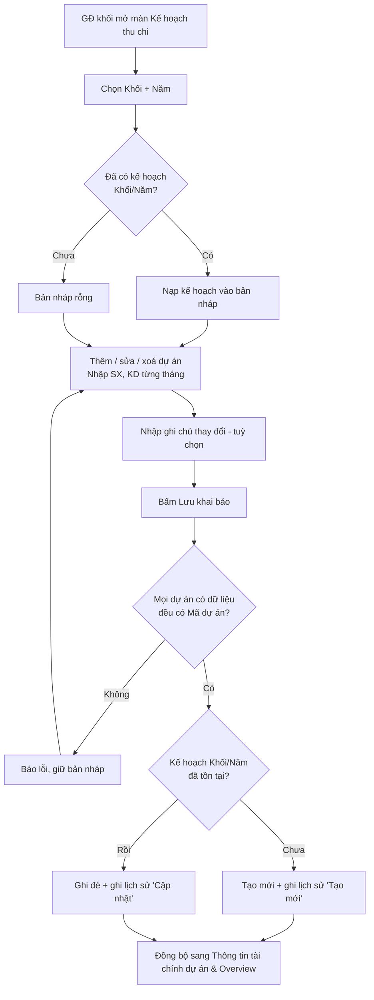

# TÀI LIỆU SRS - CHỨC NĂNG "KẾ HOẠCH THU CHI CỦA KHỐI"

## Version control

| Tên version | Ngày cập nhật | PIC | Mô tả |
| :--- | :--- | :--- | :--- |
| **v01 (hiện tại)** | **2026-09-28** | **AI Agent** | - Khởi tạo tài liệu SRS màn Kế hoạch thu chi. - Mô tả khai báo theo dự án, tách SX/KD theo tháng, KLCV (%), lịch sử và liên kết sang màn Thông tin tài chính dự án. |

---

## 1. Luồng trạng thái và Nghiệp vụ (Business Flow)

**Mô tả:** Màn *Kế hoạch thu chi* cho phép Giám đốc khối lập kế hoạch tài chính của năm cho các dự án khối mình phụ trách. Mỗi dự án được khai báo 4 chỉ tiêu theo 12 tháng: Doanh thu dự kiến, Thu dự kiến, Chi dự kiến và Khối lượng công việc (%). Mỗi ô tháng tách 2 phần: **SX** (sản xuất) và **KD** (kinh doanh). Kế hoạch được lưu theo cặp *(Khối, Năm)*. Sau khi lưu, **Doanh thu dự kiến** và **Khối lượng công việc** của từng dự án được màn *Thông tin tài chính dự án* đọc lại theo Mã dự án + Năm. Màn *Overview* dùng kế hoạch này để tổng hợp toàn công ty.

**Sơ đồ luồng:**

---

## 2. User Stories & Acceptance Criteria (AC)

**Epic:** Quản lý tài chính dự án theo khối

### User Story 1: Chọn phạm vi kế hoạch — Là Giám đốc khối, tôi muốn chọn khối và năm cần lập kế hoạch để làm việc đúng phạm vi mình phụ trách.
*   **Acceptance Criteria:**
    *   **AC1.1:** Cho phép chọn Khối và Năm (2025, 2026, 2027) để xem hoặc lập kế hoạch.
    *   **AC1.2:** Khi đổi Khối hoặc Năm, hệ thống nạp kế hoạch đã lưu của phạm vi đó. Nếu chưa có thì hiển thị kế hoạch rỗng.
    *   **AC1.3:** Mọi thay đổi chưa lưu của phạm vi cũ bị huỷ khi chuyển sang phạm vi khác.
    *   **AC1.4:** Hiển thị người lập, đơn vị tính (triệu VNĐ) và thời điểm cập nhật gần nhất của kế hoạch.

### User Story 2: Khai báo dự án phụ trách — Là Giám đốc khối, tôi muốn thêm các dự án khối mình phụ trách để lập kế hoạch cho từng dự án.
*   **Acceptance Criteria:**
    *   **AC2.1:** Cho phép thêm dự án mới vào kế hoạch, nhập Tên dự án và Mã dự án.
    *   **AC2.2:** Cho phép xoá một dự án khỏi kế hoạch trước khi lưu.
    *   **AC2.3:** Mỗi dự án được đánh số thứ tự và hiển thị tổng Khối lượng công việc cả năm.

### User Story 3: Nhập kế hoạch theo tháng, tách Sản xuất / Kinh doanh — Là Giám đốc khối, tôi muốn nhập số dự kiến từng tháng, tách phần sản xuất và kinh doanh, để kế hoạch phản ánh đúng cơ cấu nguồn thu – chi.
*   **Acceptance Criteria:**
    *   **AC3.1:** Mỗi dự án có 4 chỉ tiêu: Doanh thu dự kiến, Thu dự kiến, Chi dự kiến, Khối lượng công việc (%).
    *   **AC3.2:** Mỗi chỉ tiêu nhập được riêng phần SX và phần KD cho từng tháng từ Tháng 1 đến Tháng 12.
    *   **AC3.3:** Hệ thống tự tính tổng cả năm của từng chỉ tiêu (SX + KD của 12 tháng).
    *   **AC3.4:** Khối lượng công việc được thể hiện theo phần trăm.

### User Story 4: Xem tổng hợp toàn khối — Là Giám đốc khối, tôi muốn thấy tổng thu, tổng chi và chênh lệch của cả khối để đánh giá kế hoạch trước khi lưu.
*   **Acceptance Criteria:**
    *   **AC4.1:** Hệ thống tổng hợp theo từng tháng (SX, KD riêng) và cả năm các chỉ tiêu: Tổng doanh thu dự kiến, Tổng thu dự kiến, Tổng chi dự kiến.
    *   **AC4.2:** Hệ thống tính Chênh lệch thu – chi toàn khối theo tháng cho từng phần SX và KD.
    *   **AC4.3:** Số tổng hợp cập nhật ngay khi người dùng thay đổi bất kỳ ô nhập nào.

### User Story 5: Lưu kế hoạch và đồng bộ — Là Giám đốc khối, tôi muốn lưu kế hoạch để các màn tài chính dùng làm số kế hoạch chính thức.
*   **Acceptance Criteria:**
    *   **AC5.1:** Cho phép lưu toàn bộ kế hoạch của Khối/Năm đang chọn, kèm ghi chú thay đổi (tuỳ chọn).
    *   **AC5.2:** Hệ thống chỉ ghi nhận khi mọi dự án có dữ liệu đều đã có Mã dự án.
    *   **AC5.3:** Dự án trống hoàn toàn (không tên, không mã, không số liệu) được bỏ qua khi lưu.
    *   **AC5.4:** Sau khi lưu, Doanh thu dự kiến và Khối lượng công việc của dự án được dùng tại màn Thông tin tài chính dự án theo Mã dự án + Năm.

### User Story 6: Theo dõi lịch sử và yêu cầu sửa — Là Giám đốc khối, tôi muốn xem lịch sử khai báo và các yêu cầu điều chỉnh đang chờ để kiểm soát thay đổi kế hoạch.
*   **Acceptance Criteria:**
    *   **AC6.1:** Cho phép xem lịch sử các lần tạo mới / cập nhật kế hoạch của Khối/Năm: người thực hiện, thời điểm, ghi chú.
    *   **AC6.2:** Cho phép xem danh sách yêu cầu sửa kế hoạch của khối đang ở trạng thái "Chờ duyệt".

---

## 3. Quy tắc nghiệp vụ (Business Rules)

*   **BR1 (Phạm vi kế hoạch):** Mỗi cặp *(Khối, Năm)* có tối đa 1 kế hoạch. Lưu lần đầu thì tạo mới, các lần sau ghi đè toàn bộ danh sách dự án của kế hoạch đó.
*   **BR2 (Bản nháp):** Dữ liệu chỉnh sửa là bản nháp cục bộ. Các màn khác chỉ nhận số liệu sau khi người dùng bấm Lưu khai báo.
*   **BR3 (Tổng theo tháng):** Giá trị một chỉ tiêu của tháng *m* = SX(*m*) + KD(*m*).
*   **BR4 (Cả năm):** Cả năm của một chỉ tiêu = Σ (SX + KD) của 12 tháng.
*   **BR5 (Tổng khối):** Tổng khối của chỉ tiêu X tại tháng *m*, phần SX (hoặc KD) = Σ giá trị phần đó của tất cả dự án trong kế hoạch.
*   **BR6 (Chênh lệch toàn khối):** Chênh lệch (*m*, phần P) = Tổng thu dự kiến (*m*, P) − Tổng chi dự kiến (*m*, P), với P ∈ {SX, KD}.
*   **BR7 (KLCV dự án):** KLCV cả năm của dự án = Σ (SX + KD) Khối lượng công việc của 12 tháng. Giá trị mong đợi là 100%.
*   **BR8 (Khoá liên kết):** Mã dự án là khoá liên kết sang màn Thông tin tài chính dự án. Liên kết theo cặp *(Mã dự án, Năm)*.
*   **BR9 (Số dùng để đồng bộ):**
    *   Doanh thu kế hoạch sang màn Thông tin tài chính dự án = Doanh thu dự kiến (SX + KD) theo tháng. Nếu dự án không có Doanh thu dự kiến thì lấy Thu dự kiến.
    *   Khối lượng công việc sang tab Dòng tiền = KLCV (SX + KD) theo tháng.
*   **BR10 (Lịch sử):** Mỗi lần lưu thêm 1 bản ghi lịch sử: hành động "Tạo mới" hoặc "Cập nhật", người thực hiện "{Người dùng} (GĐ Khối {Khối})", thời điểm, ghi chú (nếu có). Lịch sử hiển thị mới nhất trước.
*   **BR11 (Làm sạch khi lưu):** Dự án không có tên, không có mã và tổng Thu dự kiến, Chi dự kiến bằng 0 thì bị loại khỏi kế hoạch khi lưu.

---

## 4. Đặc tả trường dữ liệu (Data Dictionary)

### 4.1. Bảng `fin_block_plan` — Kế hoạch của khối theo năm
| Tên trường | Loại data | Bắt buộc? | Mô tả |
| :--- | :--- | :--- | :--- |
| `id` | String (PK) | Có | Khóa chính, tự sinh. |
| `khoi_code` | String (FK) | Có | Mã khối (G1, G2, G3, G4, BFSI, GPDV). Liên kết bảng danh mục khối. |
| `year` | Number | Có | Năm kế hoạch. Unique cùng `khoi_code`. |
| `created_by` | String (FK) | Có | Người tạo kế hoạch. |
| `updated_by` | String (FK) | Có | Người cập nhật gần nhất. |
| `updated_at` | DateTime | Có | Thời điểm cập nhật gần nhất. |

### 4.2. Bảng `fin_block_plan_project` — Dự án trong kế hoạch
| Tên trường | Loại data | Bắt buộc? | Mô tả |
| :--- | :--- | :--- | :--- |
| `id` | String (PK) | Có | Khóa chính, tự sinh. |
| `block_plan_id` | Foreign Key | Có | Liên kết `fin_block_plan.id`. |
| `project_code` | String | Có | Mã dự án. Unique trong 1 kế hoạch. Khoá liên kết sang màn tài chính. |
| `project_name` | String | Không | Tên dự án. |
| `sort_order` | Number | Có | Thứ tự hiển thị. |

### 4.3. Bảng `fin_block_plan_monthly` — Số liệu tháng theo chỉ tiêu và phần
| Tên trường | Loại data | Bắt buộc? | Mô tả |
| :--- | :--- | :--- | :--- |
| `id` | String (PK) | Có | Khóa chính, tự sinh. |
| `plan_project_id` | Foreign Key | Có | Liên kết `fin_block_plan_project.id`. |
| `month` | Number | Có | Tháng 1–12. |
| `metric` | Enum | Có | `PLANNED_REVENUE` (Doanh thu dự kiến), `CASH_IN` (Thu dự kiến), `EXPENSE` (Chi dự kiến), `WORKLOAD` (KLCV %). |
| `segment` | Enum | Có | `SX` (sản xuất) hoặc `KD` (kinh doanh). |
| `amount` | Number | Có | Giá trị. Đơn vị triệu VNĐ, riêng `WORKLOAD` là %. Mặc định 0. |

> Unique: (`plan_project_id`, `month`, `metric`, `segment`).

### 4.4. Bảng `fin_block_plan_history` — Lịch sử khai báo
| Tên trường | Loại data | Bắt buộc? | Mô tả |
| :--- | :--- | :--- | :--- |
| `id` | String (PK) | Có | Khóa chính, tự sinh. |
| `block_plan_id` | Foreign Key | Có | Liên kết `fin_block_plan.id`. |
| `action` | Enum | Có | `CREATE` (Tạo mới) / `UPDATE` (Cập nhật). |
| `actor_name` | String | Có | Người thực hiện, dạng "{Tên} (GĐ Khối {Khối})". |
| `note` | String | Không | Ghi chú thay đổi. |
| `created_at` | DateTime | Có | Thời điểm lưu. |

### 4.5. Bảng `fin_plan_edit_request` — Yêu cầu sửa kế hoạch
| Tên trường | Loại data | Bắt buộc? | Mô tả |
| :--- | :--- | :--- | :--- |
| `id` | String (PK) | Có | Khóa chính, tự sinh. |
| `khoi_code` | String (FK) | Có | Khối của yêu cầu. |
| `project_code` | String | Có | Dự án cần điều chỉnh. |
| `requested_by` | String (FK) | Có | Người gửi yêu cầu. |
| `reason` | String | Có | Lý do điều chỉnh. |
| `status` | Enum | Có | `PENDING` (Chờ duyệt) / `APPROVED` (Đã duyệt) / `REJECTED` (Từ chối). |
| `created_at` | DateTime | Có | Thời điểm gửi. |

---

## 5. Mô tả các hiệu ứng tương tác (Interaction Details)

*   **Bảng 2 tầng tiêu đề:** Mỗi cột "Tháng N" gộp 2 cột con SX và KD. Cột Nội dung được ghim bên trái khi cuộn ngang.
*   **Khối dự án:** Mỗi dự án có dòng tiêu đề nền vàng nhạt, số thứ tự dạng ô vuông cam, ô nhập Tên và Mã dự án, cột KLCV hiển thị tổng % của dự án, icon thùng rác để xoá.
*   **Màu nhãn chỉ tiêu:** Doanh thu và Thu dự kiến màu xanh lá, Chi dự kiến màu đỏ, Khối lượng công việc màu chàm. Cột CẢ NĂM tô nền nhạt cùng tông.
*   **Ô nhập số:** Tự định dạng phân cách hàng nghìn theo vi-VN. Ô trống hiển thị "–". Ô KLCV có hậu tố "%".
*   **Dòng tổng toàn khối:** Nền xanh cho doanh thu/thu, đỏ cho chi, xám cho chênh lệch. Giá trị âm ở dòng chênh lệch hiển thị màu đỏ.
*   **Toast:** Hiển thị góc trên phải khoảng 2,8 giây sau khi lưu hoặc khi có lỗi.
*   **Popup Lịch sử:** Danh sách thẻ, nhãn "Tạo mới" màu xanh, "Cập nhật" màu lam.
*   **Popup Yêu cầu sửa:** Danh sách thẻ gồm mã dự án, trạng thái "Chờ duyệt" màu vàng, lý do, người gửi, thời điểm. Nếu trống hiển thị trạng thái rỗng.
*   **Liên kết "Yêu cầu sửa của tôi (N)":** N là số yêu cầu đang chờ duyệt của khối.

---

## 6. Quy tắc Validate Dữ liệu (Validation Rules)

| Màn hình / Form | Trường dữ liệu | Bắt buộc | Kiểu dữ liệu | Rule Validate / Giới hạn |
| :--- | :--- | :--- | :--- | :--- |
| Kế hoạch thu chi | Tên khối | Có | Enum | Chọn từ danh mục khối. |
| Kế hoạch thu chi | Năm | Có | Int | 2025, 2026, 2027. |
| Khối dự án | Tên dự án | Không | String | Max 200 ký tự. |
| Khối dự án | Mã dự án | Có (khi dự án có dữ liệu) | String | Max 50 ký tự. Không trùng trong cùng 1 kế hoạch. Trim khoảng trắng. |
| Khối dự án | Doanh thu dự kiến – SX / KD (T1–T12) | Không | Int | ≥ 0, chỉ chấp nhận chữ số, mặc định 0. Đơn vị triệu VNĐ. |
| Khối dự án | Thu dự kiến – SX / KD (T1–T12) | Không | Int | ≥ 0, chỉ chấp nhận chữ số, mặc định 0. |
| Khối dự án | Chi dự kiến – SX / KD (T1–T12) | Không | Int | ≥ 0, chỉ chấp nhận chữ số, mặc định 0. |
| Khối dự án | Khối lượng công việc – SX / KD (T1–T12) | Không | Int | 0–100 mỗi ô. Tổng cả năm của dự án nên bằng 100 (cảnh báo nếu khác). |
| Kế hoạch thu chi | Ghi chú thay đổi | Không | String | Max 500 ký tự. Trim khoảng trắng. |

---

## 7. Các trường hợp ngoại lệ & Thông báo lỗi (Edge Cases & Exception Handling)

| Ngữ cảnh / Hành động | Kịch bản ngoại lệ (Edge Case) | Thông báo lỗi hiển thị ra UI (Error Message) | Loại hiển thị (UI Type) |
| :--- | :--- | :--- | :--- |
| Lưu khai báo | Có dự án có dữ liệu nhưng chưa nhập Mã dự án | "⚠️ Có dự án chưa nhập Mã dự án." | Toast |
| Lưu khai báo | Lưu thành công | "💾 Đã lưu kế hoạch. Doanh thu dự kiến theo dự án sẽ đồng bộ sang màn Thông tin tài chính dự án." | Toast |
| Lưu khai báo | Trùng Mã dự án trong cùng kế hoạch | "Mã dự án {mã} bị trùng trong kế hoạch." | In-line Red Text + Toast |
| Lưu khai báo | Tổng KLCV cả năm của dự án khác 100% | "Khối lượng công việc của dự án {mã} là {x}%, chưa bằng 100%." | Toast (cảnh báo, vẫn cho lưu) |
| Lưu khai báo | Mất kết nối khi gọi API | "Lỗi kết nối. Vui lòng kiểm tra lại mạng và thử lại." | Toast (Red) |
| Đổi Khối / Năm | Còn thay đổi chưa lưu | "Bạn có thay đổi chưa lưu. Chuyển phạm vi sẽ huỷ các thay đổi này?" | Popup xác nhận |
| Mở màn | Khối/Năm chưa có kế hoạch | "Chưa có dự án. Bấm “Thêm dự án” để khai báo kế hoạch thu - chi." | Empty state trong bảng |
| Xem Lịch sử | Chưa có lần lưu nào | "Chưa có lịch sử." | Empty state trong popup |
| Xem Yêu cầu sửa | Không có yêu cầu chờ | "Không có yêu cầu nào đang chờ." | Empty state trong popup |

---

## 8. Mapping Giao diện & Design System (UI/UX Component Mapping)

| Tính năng / UI Element | Component Design System (Gợi ý) | Ghi chú thêm |
| :--- | :--- | :--- |
| Chọn Khối, Năm | `Select` | Đổi giá trị thì nạp lại kế hoạch. Cần xác nhận nếu còn dữ liệu chưa lưu. |
| Bảng kế hoạch theo dự án | `Table` | Header 2 tầng (`children` cho SX/KD). `fixed="left"` cho cột Nội dung. `scroll={{ x: 2000 }}`. |
| Ô nhập số SX / KD | `InputNumber` | `min={0}`, `formatter` phân cách nghìn vi-VN, `precision={0}`. Ô KLCV có `addonAfter="%"`, `max={100}`. |
| Tên / Mã dự án | `Input` | `maxLength` 200 / 50. |
| Thêm dự án | `Button` | `type="dashed"`, icon `PlusOutlined`. Có 2 vị trí: đầu bảng và cuối bảng. |
| Xoá dự án | `Popconfirm` + `Button` | Confirm "Xoá dự án khỏi kế hoạch?". |
| Dòng tổng toàn khối | `Table.Summary` | 4 dòng: Tổng doanh thu, Tổng thu, Tổng chi, Chênh lệch toàn khối. |
| Ghi chú thay đổi | `Input` | `maxLength={500}`. |
| Lưu khai báo | `Button` | `type="primary"`, `loading` khi gọi API. |
| Lịch sử | `Modal` + `Timeline` | Tag "Tạo mới" `color="green"`, "Cập nhật" `color="blue"`. |
| Yêu cầu sửa của tôi | `Modal` + `List` | Tag trạng thái `color="gold"`. `Empty` khi rỗng. |
| Thông báo | `message` / `notification` | Thời gian hiển thị ~3 giây. |
