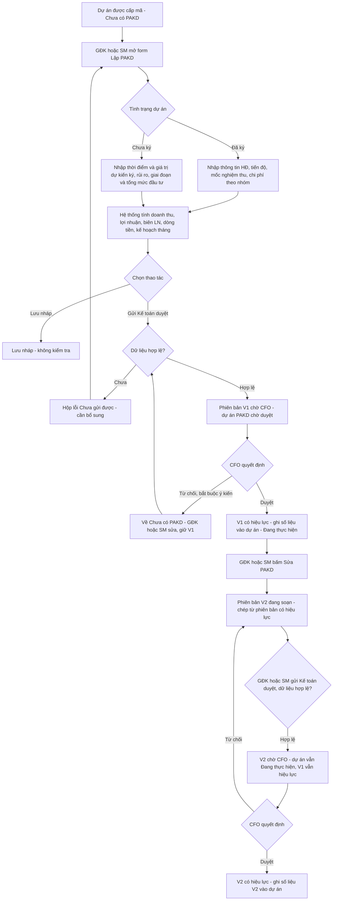
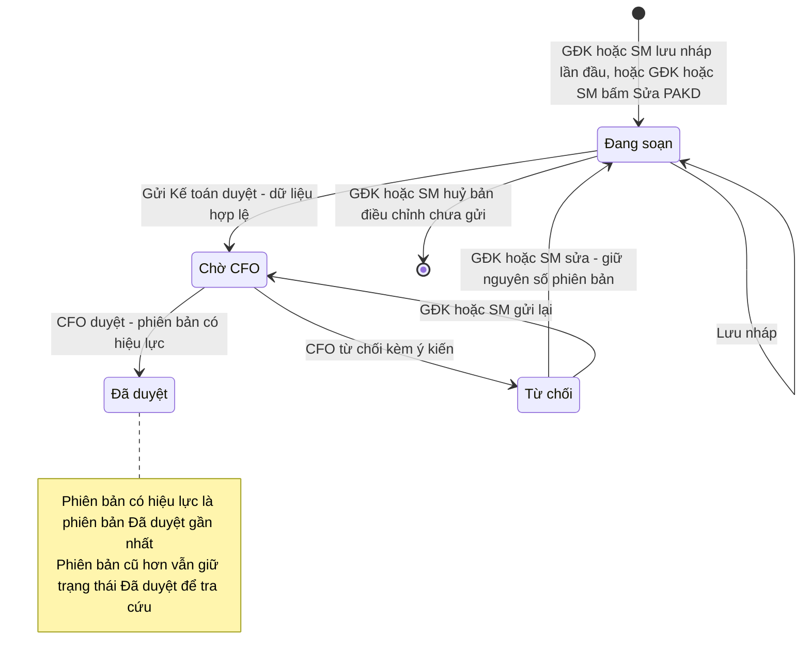
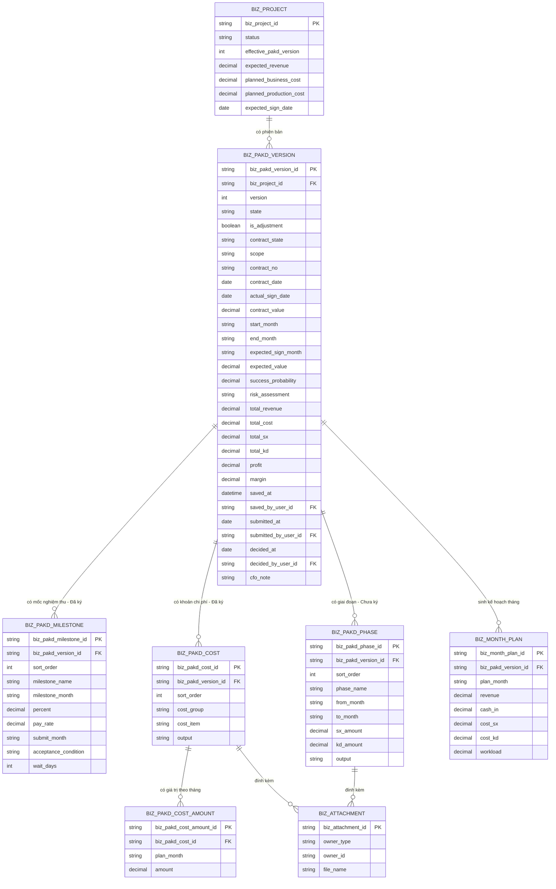
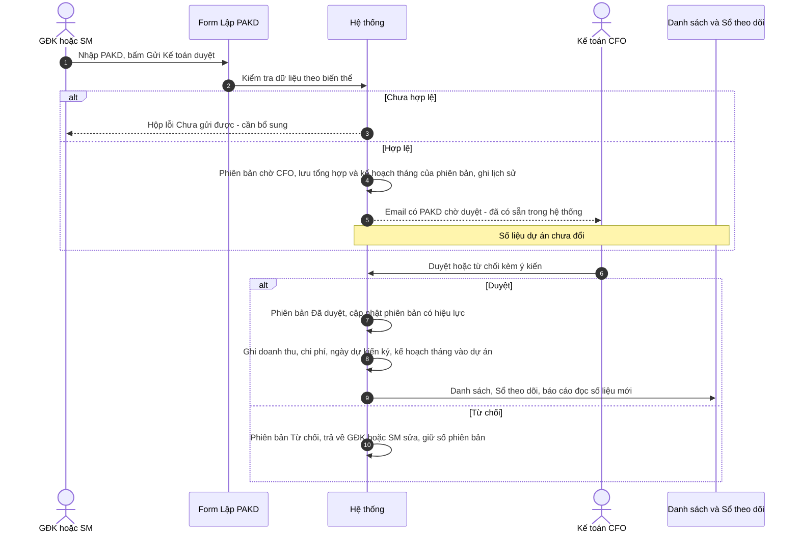

# TÀI LIỆU SRS - CHỨC NĂNG "LẬP PHƯƠNG ÁN KINH DOANH (PAKD)"

## Version control

| Tên version | Ngày cập nhật | PIC | Mô tả |
| :--- | :--- | :--- | :--- |
| v01 | 2026-10-02 | AI Agent | - Khởi tạo tài liệu SRS form Lập PAKD trên màn Chi tiết dự án, theo prototype commit d8a9358 và các quyết định đã chốt. - Mục 1: mô tả, quyền theo tình huống, 4 sơ đồ. - Mục 2: User Story và AC. - Mục 3: Business Rules, gồm công thức tính kèm ví dụ. - Mục 4: Data Dictionary 7 bảng; mục 5: Interaction Details. - Chốt Checkpoint C: huỷ bản điều chỉnh; kiểm tra Từ / Đến của giai đoạn; hợp đồng tạo từ PAKD Đã ký phải chờ CFO duyệt; nhắc hợp đồng chỉ hiển thị. |
| **v02 (hiện tại)** | **2026-10-02** | **AI Agent** | - Rà soát theo code commit 8cff07a và quyết định BA. - GĐK và SM đều được sửa PAKD (sau khi bị từ chối) và điều chỉnh PAKD đã duyệt; nút *Sửa PAKD* mở màn Sửa dự án, tab PAKD. - Đã ký: chi phí lập theo **kế hoạch chi phí theo tháng** (khoản mục × tháng, 8 khoản mục mặc định, Chia đều, Luỹ kế); thêm BR24; đổi BR6, BR10, BR12, BR17; bảng 4.8. - Đổi Chưa ký → Đã ký tự điền sẵn (BR5); hợp đồng được CFO duyệt thì điền vào bản điều chỉnh PAKD, không ghi thẳng vào bản đã duyệt (BR22). - Bỏ ngăn Quy trình; danh sách phiên bản đặt dưới form; hàng thông tin chung còn 4 ô; biểu đồ Chưa ký dạng cột. |

---

## Mục lục
1. [Luồng trạng thái và Nghiệp vụ](#1-luồng-trạng-thái-và-nghiệp-vụ-business-flow)
2. [User Stories & Acceptance Criteria](#2-user-stories--acceptance-criteria-ac)
3. [Quy tắc nghiệp vụ](#3-quy-tắc-nghiệp-vụ-business-rules)
4. [Đặc tả trường dữ liệu](#4-đặc-tả-trường-dữ-liệu-data-dictionary): 8 bảng
5. [Mô tả các hiệu ứng tương tác](#5-mô-tả-các-hiệu-ứng-tương-tác-interaction-details)

**Tài liệu liên quan:**
- `SRS_DanhSachDuAn.md`: vòng đời dự án, hạn 30 ngày và Pending (BR8), popup CFO duyệt PAKD từ danh sách (US13, BR6), phiên bản PAKD (BR7), đồng bộ số liệu khi CFO duyệt (BR34), cảnh báo lệch giá trị HĐ 2% (BR28).
- `SRS_ChiTietDuAn.md`: màn Chi tiết dự án chứa form này (chế độ xem / lập lần đầu), màn Sửa dự án tab PAKD (điều chỉnh), thanh thao tác, ma trận quyền.

---

## 1. Luồng trạng thái và Nghiệp vụ (Business Flow)

**Mô tả:** Form *Lập phương án kinh doanh (PAKD)* nằm trên màn Chi tiết dự án. GĐK hoặc SM dùng form để lập PAKD cho dự án vừa được cấp mã, rồi gửi Kế toán (CFO) duyệt. Form có **2 biến thể** theo tình trạng hợp đồng:
- **Đã ký:** lập theo hợp đồng, gồm thông tin HĐ, tiến độ, các mốc nghiệm thu / thu tiền, chi phí theo 6 nhóm.
- **Chưa ký:** lập theo cơ hội, gồm thời điểm và giá trị dự kiến ký, xác suất, rủi ro, các giai đoạn kèm tổng mức đầu tư SX / KD.

Hệ thống tự tính doanh thu kế hoạch, lợi nhuận, biên lợi nhuận (chuẩn tối thiểu 20%), dòng tiền theo tháng, tóm tắt chi phí, và sinh **kế hoạch theo tháng** cho dự án.

Khi CFO duyệt, phiên bản PAKD có hiệu lực, và các số liệu của PAKD được ghi vào dự án (danh sách, Sổ theo dõi, báo cáo). Khi dự án đang thực hiện, GĐK hoặc SM điều chỉnh PAKD (nút *Sửa PAKD*) bằng cách tạo phiên bản mới để CFO duyệt lại.

ĐVT: **VNĐ**. Tháng nhập dạng MM/YYYY.

**Quyền theo tình huống:**

| Tình huống | Ai thấy form | Ai sửa / gửi được |
| :--- | :--- | :--- |
| Dự án *Chờ duyệt mã* | Không hiển thị form | — |
| *Chưa có PAKD*, chưa nộp lần nào | SM, GĐK, CFO, BOD, Admin | **GĐK, SM** lập, lưu nháp, gửi duyệt |
| *PAKD chờ duyệt* (phiên bản đầu chờ CFO) | SM, GĐK, CFO, BOD, Admin | Không ai sửa. CFO duyệt / từ chối |
| *Chưa có PAKD*, vừa bị CFO từ chối | SM, GĐK, CFO, BOD, Admin | **GĐK, SM** sửa và gửi lại, giữ nguyên phiên bản |
| *Đang thực hiện* | SM, GĐK, CFO, BOD, Admin | **GĐK, SM** bấm *Sửa PAKD* (mở màn Sửa dự án, tab PAKD) để tạo bản điều chỉnh |
| *Đang thực hiện*, có phiên bản điều chỉnh đang soạn / bị từ chối | SM, GĐK, CFO, BOD, Admin | **GĐK, SM** sửa và gửi |
| *Đang thực hiện*, có phiên bản điều chỉnh chờ CFO | SM, GĐK, CFO, BOD, Admin | Không ai sửa. CFO duyệt / từ chối |
| *Pending* hoặc *Close* | SM, GĐK, CFO, BOD, Admin | Không ai sửa (SRS_DanhSachDuAn BR10) |

> **AM không thấy form PAKD** ở mọi tình huống (SRS_DanhSachDuAn BR3).

**Sơ đồ luồng:**

**State diagram — phiên bản PAKD:**

> **Số phiên bản:**
> - Phiên bản đầu tiên là **V1**. Số V1 hiển thị từ lần gửi duyệt đầu tiên. Trước đó form hiển thị trạng thái "Nháp".
> - Bị từ chối thì sửa trên **cùng phiên bản**.
> - Phiên bản mới chỉ sinh khi GĐK hoặc SM *Sửa PAKD* (điều chỉnh) lúc dự án đang thực hiện (SRS_DanhSachDuAn BR7).

**Lát cắt ERD:**

> `BIZ_PROJECT` chỉ liệt kê các trường liên quan. Các trường số liệu (`expected_revenue`, chi phí kế hoạch, `expected_sign_date`) được ghi từ phiên bản có hiệu lực khi CFO duyệt (BR22).

**Sequence diagram — gửi PAKD, CFO duyệt, đồng bộ số liệu:**

---

## 2. User Stories & Acceptance Criteria (AC)

> Ký hiệu **[Mới]**: yêu cầu đã chốt nhưng chưa có hoặc khác so với prototype commit d8a9358.

**Epic A:** Lập PAKD

### User Story 1: Xem PAKD của dự án — Là SM, GĐK, CFO, BOD hoặc Admin, tôi muốn xem PAKD của dự án để nắm phương án kinh doanh.
*   **Acceptance Criteria:**
    *   **AC1.1:** Người dùng xem được form PAKD khi dự án đã được cấp mã. AM không xem được *(BR1)* **[Mới — AM]**.
    *   **AC1.2:** Người dùng thấy thông tin chung: mã dự án, tên, khối, người lập, hạn lập PAKD, thời gian còn lại, trạng thái PAKD *(BR4)*.
    *   **AC1.3:** Khi không có quyền sửa, người dùng xem toàn bộ nội dung ở chế độ chỉ đọc, và được báo lý do *(BR2, BR3)*.

### User Story 2: Lập PAKD cho dự án đã ký hợp đồng — Là GĐK hoặc SM, tôi muốn lập PAKD theo hợp đồng đã ký để có kế hoạch doanh thu, thu tiền và chi phí của dự án.
*   **Acceptance Criteria:**
    *   **AC2.1:** Người dùng khai báo được thông tin hợp đồng: số HĐ, ngày ký trên HĐ, ngày ký thực tế, giá trị HĐ. Một số thông tin được điền sẵn từ dự án *(BR5, BR6, BR7)*.
    *   **AC2.2:** Người dùng khai báo được tiến độ (tháng bắt đầu, tháng kết thúc) và phạm vi công việc. Hệ thống tự tính số tháng thực hiện *(BR8)*.
    *   **AC2.3:** Người dùng khai báo được nhiều mốc nghiệm thu: tên mốc, thời điểm, % giá trị, tỷ lệ được thanh toán, tháng gửi hồ sơ, điều kiện nghiệm thu, thời gian chờ. Hệ thống tự tính giá trị mốc, giá trị thu và tháng thu tiền *(BR8)*.
    *   **AC2.4:** Người dùng lập **kế hoạch chi phí theo tháng**: mỗi khoản mục thuộc một trong 6 nhóm, nhập giá trị cho từng tháng trong kỳ thực hiện, kèm kết quả đầu ra và tệp đính kèm *(BR10, BR24)* **[Mới]**.
    *   **AC2.5:** Người dùng chia đều nhanh một tổng giá trị cho các tháng trong kỳ, và thấy tổng chi phí, luỹ kế chi phí theo tháng *(BR24)* **[Mới]**.
    *   **AC2.6:** Người dùng được cảnh báo khi có chi phí nằm ngoài kỳ thực hiện *(BR24)* **[Mới]**.

### User Story 3: Lập PAKD cho dự án chưa ký hợp đồng — Là GĐK hoặc SM, tôi muốn lập PAKD tạm cho cơ hội chưa ký để có kế hoạch đầu tư và đánh giá hiệu quả.
*   **Acceptance Criteria:**
    *   **AC3.1:** Người dùng khai báo được thời điểm dự kiến ký, giá trị HĐ dự kiến, xác suất thành công, phạm vi công việc, đánh giá rủi ro *(BR5, BR7)*.
    *   **AC3.2:** Người dùng khai báo được nhiều giai đoạn: tên, từ tháng – đến tháng, tổng mức đầu tư SX / KD, kết quả đầu ra, tệp đính kèm. Hệ thống tự tính tổng mức đầu tư của từng giai đoạn *(BR10, BR12)*.
    *   **AC3.3:** Người dùng đổi qua lại giữa *Đã ký* và *Chưa ký* mà không mất dữ liệu đã nhập ở biến thể kia *(BR5)*.

### User Story 4: Xem hiệu quả của phương án — Là GĐK, SM hoặc CFO, tôi muốn thấy ngay doanh thu, lợi nhuận, biên lợi nhuận và dòng tiền của phương án để đánh giá trước khi gửi / duyệt.
*   **Acceptance Criteria:**
    *   **AC4.1:** Người dùng thấy doanh thu kế hoạch, lợi nhuận và biên lợi nhuận, được tính lại ngay khi nhập liệu *(BR9–BR11)*.
    *   **AC4.2:** Biên lợi nhuận dưới 20% thì được cảnh báo, nhưng vẫn gửi duyệt được *(BR11)*.
    *   **AC4.3:** Với dự án đã ký, người dùng thấy dòng thu, dòng chi và luỹ kế dòng tiền theo tháng. Với dự án chưa ký, người dùng thấy dòng tiền chi SX / KD theo tháng *(BR12, BR13)*.
    *   **AC4.4:** Người dùng thấy tóm tắt chi phí: theo nhóm với % doanh thu (đã ký), hoặc theo tháng với % tổng (chưa ký) *(BR14)*.
    *   **AC4.5:** Với dự án đã có hợp đồng, người dùng được cảnh báo khi giá trị HĐ lệch quá 2% so với doanh thu PAKD *(BR15)*.
    *   **AC4.6:** Người dùng thấy hướng dẫn cập nhật thông tin hợp đồng sau khi lập PAKD, theo tình trạng ký và thời điểm dự kiến ký *(BR23)*.

### User Story 5: Lưu nháp PAKD — Là GĐK hoặc SM, tôi muốn lưu PAKD đang soạn dở để hoàn thiện sau.
*   **Acceptance Criteria:**
    *   **AC5.1:** Người có quyền sửa lưu nháp được bất cứ lúc nào, không cần đủ thông tin *(BR16)*.
    *   **AC5.2:** Người dùng thấy lần lưu cuối do ai, lúc nào *(BR16)*.
    *   **AC5.3:** Lưu nháp không làm thay đổi số liệu dự án và không gửi cho CFO *(BR16, BR22)*.

### User Story 6: Gửi Kế toán duyệt — Là GĐK hoặc SM, tôi muốn gửi PAKD cho Kế toán (CFO) duyệt để dự án được triển khai.
*   **Acceptance Criteria:**
    *   **AC6.1:** Hệ thống chỉ nhận PAKD khi đủ thông tin bắt buộc và hợp lệ theo biến thể. Nếu chưa đủ, người dùng thấy danh sách các mục cần bổ sung *(BR17)*.
    *   **AC6.2:** Gửi thành công thì phiên bản chuyển *Chờ CFO*, form khoá lại. Với lần gửi đầu, dự án chuyển *PAKD chờ duyệt* *(BR18)*.
    *   **AC6.3:** Gửi duyệt chưa làm thay đổi số liệu dự án, danh sách hay Sổ theo dõi *(BR22)* **[Mới]**.
    *   **AC6.4:** CFO nhận email có PAKD chờ duyệt (chức năng đã có của hệ thống) *(BR18)*.

---

**Epic B:** Duyệt, sửa và điều chỉnh PAKD

### User Story 7: CFO duyệt PAKD — Là Kế toán (CFO), tôi muốn xem đầy đủ PAKD rồi duyệt hoặc từ chối.
*   **Acceptance Criteria:**
    *   **AC7.1:** CFO xem được toàn bộ nội dung phiên bản chờ duyệt, gồm bảng điều khiển và kế hoạch tháng. Với bản điều chỉnh, CFO biết phiên bản đang có hiệu lực *(BR19)*.
    *   **AC7.2:** CFO duyệt được (ý kiến không bắt buộc), hoặc từ chối (ý kiến bắt buộc), từ màn Chi tiết hoặc từ danh sách (SRS_DanhSachDuAn US13) *(BR19)*.
    *   **AC7.3:** Duyệt thì phiên bản có hiệu lực, và số liệu của phiên bản được ghi vào dự án *(BR22)*.

### User Story 8: Sửa PAKD bị từ chối — Là GĐK hoặc SM, tôi muốn sửa PAKD theo ý kiến của CFO rồi gửi lại.
*   **Acceptance Criteria:**
    *   **AC8.1:** GĐK và SM sửa và gửi lại được PAKD bị từ chối. AM không xem được *(BR2, BR20)* **[Mới]**.
    *   **AC8.2:** GĐK thấy ý kiến từ chối của CFO ngay trên form.
    *   **AC8.3:** Gửi lại vẫn giữ nguyên số phiên bản *(BR20)* **[Mới]**.

### User Story 9: Điều chỉnh PAKD đã duyệt — Là GĐK hoặc SM, tôi muốn điều chỉnh PAKD khi dự án đang thực hiện có thay đổi, để phương án luôn sát thực tế.
*   **Acceptance Criteria:**
    *   **AC9.1:** Khi dự án *Đang thực hiện*, GĐK và SM tạo được bản điều chỉnh bằng nút *Sửa PAKD* (mở màn Sửa dự án, tab PAKD). Bản điều chỉnh là phiên bản mới, chép nội dung từ phiên bản đang có hiệu lực *(BR21)* **[Mới]**.
    *   **AC9.2:** Trong lúc soạn và chờ duyệt bản điều chỉnh, dự án vẫn *Đang thực hiện*, và số liệu dự án vẫn theo phiên bản cũ *(BR21, BR22)* **[Mới]**.
    *   **AC9.3:** Bản điều chỉnh chỉ cần CFO duyệt. Bị từ chối thì GĐK / SM sửa tiếp trên cùng phiên bản *(BR20, BR21)*.
    *   **AC9.4:** GĐK / SM huỷ được bản điều chỉnh khi chưa gửi duyệt *(BR21)* **[Mới]**.
    *   **AC9.5:** Khi đang có bản điều chỉnh chờ CFO, dự án không kết thúc được (SRS_ChiTietDuAn BR13).

### User Story 10: Xem các phiên bản PAKD — Là người được xem PAKD, tôi muốn xem lại các phiên bản đã nộp để biết phương án đã thay đổi thế nào.
*   **Acceptance Criteria:**
    *   **AC10.1:** Người dùng xem được danh sách phiên bản, mới nhất ở trên: số phiên bản, trạng thái, ngày nộp và người nộp, ngày quyết định và người quyết định, ý kiến CFO *(BR20)*.
    *   **AC10.2:** Người dùng mở được nội dung của từng phiên bản đã nộp ở chế độ chỉ đọc, và biết phiên bản nào đang có hiệu lực *(BR20)* **[Mới]**.

### User Story 11: Số liệu dự án theo PAKD đã duyệt — Là BOD, CFO hoặc GĐK, tôi muốn số liệu dự án, danh sách và báo cáo luôn lấy theo PAKD đã được duyệt.
*   **Acceptance Criteria:**
    *   **AC11.1:** Khi CFO duyệt, doanh thu kế hoạch (giá trị HĐ dự kiến), chi phí kế hoạch SX / KD, thời điểm dự kiến ký và kế hoạch theo tháng của dự án được cập nhật theo phiên bản vừa duyệt *(BR22)*.
    *   **AC11.2:** Lưu nháp, gửi duyệt hoặc từ chối không làm thay đổi các số liệu trên *(BR22)* **[Mới]**.
    *   **AC11.3:** Kế hoạch theo tháng của dự án được sinh tự động từ PAKD, người dùng không phải import *(BR12)* **[Mới]**.
    *   **AC11.4:** Với PAKD Đã ký của dự án chưa có hợp đồng: khi CFO duyệt PAKD, hệ thống tạo hợp đồng từ thông tin trong PAKD ở trạng thái chờ CFO duyệt. Hợp đồng chỉ được tính là đã ký sau khi CFO duyệt *(BR22)* **[Mới]**.
    *   **AC11.5:** Khi một hợp đồng mới / cập nhật được CFO duyệt, thông tin hợp đồng không ghi thẳng vào PAKD đã duyệt mà được điền vào bản điều chỉnh PAKD để GĐK / SM gửi duyệt *(BR22)* **[Mới]**.

---

## 3. Quy tắc nghiệp vụ (Business Rules)

**Nhóm 1 — Quyền, trạng thái và hạn**

*   **BR1 (Ai xem PAKD):** SM, GĐK, CFO, BOD và Admin xem được PAKD của dự án trong phạm vi xem (SRS_DanhSachDuAn BR2), khi dự án đã có mã. AM không xem được. **[Mới]**
*   **BR2 (Ai sửa PAKD):** theo bảng *Quyền theo tình huống* ở mục 1.
    *   **GĐK và SM** lập, lưu nháp và gửi PAKD lần đầu; sửa và gửi lại khi bị từ chối; điều chỉnh khi dự án Đang thực hiện.
    *   **AM không** lập, sửa hay xem PAKD (SRS_DanhSachDuAn BR3).
    *   GĐK là GĐK của khối quản lý dự án; SM là SM được assign / tạo dự án. **[Mới]**
*   **BR3 (Khoá form):** Form khoá, chỉ đọc khi: phiên bản đang *Chờ CFO*; dự án *Pending* / *Close*; hoặc người dùng không có quyền sửa. Dòng chú thích ở chân form nêu lý do:
    *   "PAKD đang chờ Kế toán (CFO) duyệt — chỉ xem."
    *   "Dự án đang Pending / Close — chỉ xem."
    *   "Chỉ Giám đốc khối / SM được sửa PAKD."
    *   "Bản điều chỉnh đang chờ Kế toán (CFO) duyệt — chỉ xem."
*   **BR4 (Thông tin chung và hạn):**
    *   Hạn lập PAKD và Pending theo SRS_DanhSachDuAn BR8.
    *   *Thời gian còn lại* hiển thị:
        *   "Còn N ngày" (chữ đỏ khi N ≤ 3).
        *   "Hết hạn hôm nay".
        *   "Đã nộp" (khi đã có phiên bản).
        *   "—" (khi không có hạn).
    *   *Trạng thái PAKD*:
        *   "Nháp" (xám): chưa nộp lần nào.
        *   "Chờ duyệt" (vàng).
        *   "Đã duyệt" (xanh).
        *   "Từ chối — làm lại" (đỏ).
        *   "Đang điều chỉnh" / "Chờ duyệt V{n}" / "Điều chỉnh bị từ chối" (vàng / đỏ) cho bản điều chỉnh **[Mới]**.
    *   *Người lập* là người lưu gần nhất, nếu không có thì là người nộp phiên bản mới nhất.

**Nhóm 2 — Biến thể và dữ liệu nhập**

*   **BR5 (Biến thể theo tình trạng dự án):**
    *   Trường *Tình trạng dự án* (*Đã ký* / *Chưa ký*) quyết định bố cục form. Mặc định là *Đã ký* nếu dự án đã ký hợp đồng, ngược lại là *Chưa ký*.
    *   Đổi biến thể vẫn giữ dữ liệu của biến thể kia. Khi lưu / gửi, chỉ dữ liệu của biến thể đang chọn được dùng để tính toán.
    *   **Đã ký:** Số HĐ, Ngày ký trên HĐ, Ngày ký thực tế, **Giá trị HĐ\***, **Bắt đầu thực hiện\***, **Kết thúc dự kiến\***, **Phạm vi công việc\***, bảng Mốc nghiệm thu, bảng Kế hoạch chi phí theo tháng (BR24).
    *   **Chưa ký:** **Thời điểm dự kiến ký\***, **Giá trị HĐ dự kiến\***, Xác suất thành công (%, tối đa 100, chỉ để tham khảo, không dùng trong công thức), **Phạm vi công việc\***, **Đánh giá rủi ro\***, bảng Mốc kế hoạch.
    *   **Chuyển Chưa ký → Đã ký** (ví dụ khi vừa ký hợp đồng), hệ thống điền sẵn:
        *   Giá trị HĐ = Giá trị HĐ dự kiến, nếu Giá trị HĐ đang trống.
        *   Bắt đầu / Kết thúc = tháng *Từ* sớm nhất / *Đến* muộn nhất của các mốc kế hoạch, nếu đang trống.
        *   Nếu chưa có khoản chi phí nào: mỗi mốc kế hoạch thành tối đa 2 khoản mục (Sản xuất, Kinh doanh) cùng tên mốc, giá trị chia đều cho các tháng *Từ → Đến* (BR24).
    *   Khi điều chỉnh mà phiên bản có hiệu lực là *Đã ký*, không chọn lại được *Chưa ký*. **[Mới]**
*   **BR6 (Giá trị mặc định khi lập mới):**
    *   Lấy sẵn từ dự án: số HĐ, ngày ký (cả ngày ký trên HĐ và ngày ký thực tế), giá trị HĐ (đã ký) hoặc giá trị dự kiến (chưa ký), tháng bắt đầu / kết thúc, tháng dự kiến ký.
    *   Xác suất thành công mặc định 50%.
    *   4 mốc gợi ý: "Tạm ứng khi có hợp đồng", "Nghiệm thu giai đoạn 1", "Nghiệm thu giai đoạn 2", "Quyết toán, bảo hành". Mỗi mốc 0%, tỷ lệ thanh toán 100%, thời gian chờ 30 ngày.
    *   **8 khoản mục chi phí mặc định** (theo mẫu Excel), giá trị 0: Sản xuất – "Chi phí lương", Sản xuất – "Thuê ngoài / mua sắm", Dự phòng sản xuất – "Dự phòng", Thưởng sản xuất – "Thưởng", Kinh doanh – "Chi phí lương", Kinh doanh – "Tiếp khách, công tác", Dự phòng kinh doanh – "Dự phòng", Thưởng kinh doanh – "Thưởng". **[Mới]**
    *   1 dòng giai đoạn trống (Chưa ký).
    *   Dự án đã có chi phí kế hoạch từ dữ liệu cũ thì điền sẵn: đã ký thì thành 2 khoản mục SX / KD, giá trị **chia đều** cho các tháng của hợp đồng (BR24); chưa ký thì thành 1 giai đoạn "Toàn dự án".
*   **BR7 (Định dạng nhập):**
    *   Tiền: số nguyên không âm, hiển thị phân cách hàng nghìn.
    *   %: số thập phân 0–100.
    *   Tháng: MM/YYYY. Ô chỉ nhận chữ số, tự chèn "/" sau 2 số đầu, tối đa 7 ký tự; tháng phải từ 1 đến 12. Gõ sai thì không ghi nhận.
    *   Ngày: chọn trên lịch.
    *   Tệp đính kèm của chi phí / giai đoạn: nhiều tệp, có thể gỡ.

**Nhóm 3 — Công thức tính**

*   **BR8 (Tiến độ và mốc nghiệm thu, Đã ký):**
    *   Số tháng thực hiện = số tháng từ *Bắt đầu* đến *Kết thúc*, **tính cả hai đầu**. Ví dụ: 01/2027 → 06/2027 = 6 tháng.
    *   Giá trị mốc = Giá trị HĐ × % / 100.
    *   Giá trị thu đợt này = Giá trị mốc × Tỷ lệ được thanh toán / 100.
    *   Tháng thu tiền = (Tháng gửi hồ sơ, nếu trống thì Thời điểm của mốc) + làm tròn (Thời gian chờ / 30) tháng.
    *   *Ví dụ:* HĐ 1.000.000.000; mốc 30%, tỷ lệ thanh toán 90%, gửi hồ sơ 03/2027, chờ 45 ngày. Kết quả: giá trị mốc 300.000.000; giá trị thu 270.000.000; 45 / 30 = 1,5 làm tròn thành 2, nên tháng thu tiền là 05/2027.
    *   Dòng *TỔNG* cộng %, giá trị và giá trị thu. Tổng % phải bằng 100 (sai số tối đa 0,01), xem BR17.
*   **BR9 (Doanh thu kế hoạch):** Đã ký thì bằng Giá trị HĐ. Chưa ký thì bằng Giá trị HĐ dự kiến.
*   **BR10 (Chi phí):**
    *   **Đã ký:** Tổng của một khoản mục = Σ giá trị các tháng của khoản mục đó (BR24). Chi phí theo nhóm = Σ tổng các khoản mục thuộc nhóm, với 6 nhóm: *Sản xuất, Kinh doanh, Dự phòng sản xuất, Dự phòng kinh doanh, Thưởng sản xuất, Thưởng kinh doanh*.
    *   **Chưa ký:** Σ tổng mức đầu tư SX của các giai đoạn vào nhóm *Sản xuất*, Σ KD vào nhóm *Kinh doanh*. Tổng mức đầu tư của một giai đoạn = SX + KD.
    *   Tổng chi phí = Σ 6 nhóm.
    *   Chi phí SX = Sản xuất + Dự phòng SX + Thưởng SX.
    *   Chi phí KD = Tổng chi phí − Chi phí SX.
*   **BR11 (Lợi nhuận và biên lợi nhuận):**
    *   Lợi nhuận = Doanh thu kế hoạch − Tổng chi phí. Lợi nhuận âm thì hiển thị đỏ.
    *   Biên lợi nhuận = Lợi nhuận / Doanh thu kế hoạch, 1 chữ số thập phân. Doanh thu bằng 0 thì hiển thị "—".
    *   **Ngưỡng tối thiểu 20%:** từ 20% trở lên hiển thị xanh, nhãn "▲ Đạt". Dưới 20% hiển thị đỏ, nhãn "! Dưới khung". Đây chỉ là **cảnh báo**, không chặn gửi duyệt.
    *   *Ví dụ:* doanh thu 1.000.000.000; chi phí SX 400tr, Dự phòng SX 50tr, Thưởng SX 20tr, KD 150tr.
        *   Tổng chi phí = 620.000.000, gồm SX 470.000.000 và KD 150.000.000.
        *   Lợi nhuận = 380.000.000. Biên lợi nhuận = 38,0%, hiển thị "▲ Đạt".
*   **BR12 (Kế hoạch theo tháng):** sinh tự động từ PAKD, theo tháng gồm doanh thu, dòng thu, chi SX, chi KD, khối lượng công việc.
    *   **Đã ký:**
        *   Doanh thu tháng: cộng giá trị mốc vào tháng *Thời điểm* của mốc. Mốc không có thời điểm thì không vào kế hoạch tháng.
        *   Dòng thu: cộng giá trị thu vào *Tháng thu tiền*.
        *   Chi SX / KD: với mỗi khoản mục, cộng giá trị **từng tháng** (BR24) vào chi SX nếu nhóm thuộc SX (Sản xuất, Dự phòng SX, Thưởng SX), ngược lại vào chi KD. Tháng có giá trị 0 thì bỏ qua.
    *   **Chưa ký:**
        *   Tổng mức đầu tư SX / KD của mỗi giai đoạn được **chia đều** cho các tháng từ *Từ* đến *Đến*. *Đến* trống thì coi bằng *Từ*.
        *   Không có doanh thu và dòng thu theo tháng.
        *   *Ví dụ:* giai đoạn 06/2027 – 08/2027, SX 300.000.000, thì chi SX là 100.000.000 / tháng cho 06, 07 và 08/2027.
    *   Khối lượng công việc theo tháng luôn bằng 0. PAKD không khai báo khối lượng công việc.
*   **BR13 (Dòng tiền):**
    *   **Đã ký: luỹ kế dòng tiền.** Lấp đủ các tháng từ tháng đầu đến tháng cuối của kế hoạch. Luỹ kế tháng t = Luỹ kế tháng t−1 + Dòng thu tháng t − (Chi SX + Chi KD) tháng t. Biểu đồ có cột *Dòng thu*, cột *Dòng chi* và đường *Luỹ kế dòng tiền*.
    *   **Chưa ký:** biểu đồ **cột** 2 chuỗi *Sản xuất* và *Kinh doanh*, là chi phí theo tháng.
*   **BR14 (Tóm tắt chi phí):**
    *   **Đã ký:** bảng theo 6 nhóm: Số tiền, % doanh thu (= nhóm / doanh thu). Dòng *TỔNG CHI PHÍ* có % = tổng chi phí / doanh thu. Doanh thu bằng 0 thì cột % hiển thị "—".
    *   **Chưa ký:** bảng theo tháng: SX, % / Tổng SX, KD, % / Tổng KD, % / Tổng mức đầu tư.
*   **BR15 (Đối chiếu giá trị hợp đồng):**
    *   Với biến thể Đã ký, khi dự án đã có hợp đồng: tỷ lệ lệch = |Giá trị hợp đồng đã lưu − Doanh thu PAKD| / Doanh thu PAKD.
    *   Lệch quá **2%** thì chỉ cảnh báo "— đang lệch {x}%", không chặn (SRS_DanhSachDuAn BR28).

**Nhóm 4 — Lưu và gửi duyệt**

*   **BR16 (Lưu nháp):**
    *   Người có quyền sửa lưu nháp bất cứ lúc nào, **không kiểm tra** dữ liệu.
    *   Hệ thống ghi người lưu, thời điểm lưu và lịch sử *Lưu nháp PAKD*.
    *   Lưu nháp không đổi trạng thái phiên bản / dự án, và không đổi số liệu dự án.
*   **BR17 (Kiểm tra khi gửi duyệt):** hệ thống chặn gửi và liệt kê đủ các lỗi trong hộp "Chưa gửi được — cần bổ sung:".

    | Biến thể | Điều kiện | Thông báo |
    | :--- | :--- | :--- |
    | Cả hai | Phạm vi công việc trống | "Nhập Phạm vi công việc" |
    | Đã ký | Giá trị HĐ bằng 0 | "Nhập Giá trị hợp đồng" |
    | Đã ký | Thiếu tháng bắt đầu hoặc kết thúc | "Nhập Bắt đầu / Kết thúc thực hiện (tháng)" |
    | Đã ký | Kết thúc trước Bắt đầu (cùng tháng là hợp lệ) | "Kết thúc phải sau Bắt đầu" |
    | Đã ký | Tổng % mốc khác 100 quá 0,01 | "Tổng % các mốc nghiệm thu phải bằng 100% (hiện {x}%)" |
    | Đã ký | Không có khoản mục / tháng nào có giá trị lớn hơn 0 | "Lập kế hoạch chi phí: nhập giá trị cho ít nhất một khoản mục / tháng" |
    | Đã ký | Khoản mục có tổng lớn hơn 0 nhưng chưa có tên | "Nhập tên khoản mục cho các dòng chi phí có giá trị" **[Mới]** |
    | Chưa ký | Thiếu thời điểm dự kiến ký | "Nhập Thời điểm dự kiến ký" |
    | Chưa ký | Giá trị dự kiến bằng 0 | "Nhập Giá trị hợp đồng dự kiến" |
    | Chưa ký | Đánh giá rủi ro trống | "Nhập Đánh giá rủi ro" |
    | Chưa ký | Không có giai đoạn nào có tên và tổng mức đầu tư lớn hơn 0 | "Nhập ít nhất một mốc kế hoạch có tổng mức đầu tư" |
    | Chưa ký | Giai đoạn có tổng mức đầu tư lớn hơn 0 nhưng thiếu *Từ*, hoặc *Đến* trước *Từ* | "Giai đoạn {tên}: nhập Từ / Đến hợp lệ" **[Mới]** |

    *   Biên LN dưới 20% (BR11) và lệch HĐ quá 2% (BR15) **không** chặn gửi.
*   **BR18 (Gửi duyệt):**
    *   **Lần gửi đầu:** tạo phiên bản **V1** ở trạng thái *Chờ CFO*, dự án chuyển *PAKD chờ duyệt*.
    *   **Gửi lại sau khi bị từ chối:** cùng phiên bản chuyển lại *Chờ CFO*, dự án chuyển lại *PAKD chờ duyệt*.
    *   **Gửi bản điều chỉnh:** phiên bản điều chỉnh chuyển *Chờ CFO*, dự án giữ *Đang thực hiện*.
    *   Khi gửi, hệ thống lưu kết quả tính (doanh thu, chi phí, SX, KD, lợi nhuận, biên) và kế hoạch tháng **của phiên bản**, nhưng chưa ghi vào dự án (BR22).
    *   Ghi lịch sử *Nộp PAKD* (ghi chú: Đã ký / Chưa ký · Doanh thu · Chi phí). CFO nhận email (chức năng đã có).

**Nhóm 5 — Duyệt, phiên bản và đồng bộ số liệu**

*   **BR19 (CFO quyết định):**
    *   Theo SRS_DanhSachDuAn BR6: chỉ CFO duyệt / từ chối. Ý kiến bắt buộc khi từ chối. Không quyết định được khi dự án đã Pending / Close.
    *   CFO quyết định được từ thanh thao tác ở màn Chi tiết, hoặc từ danh sách (nút *Duyệt* / *Duyệt điều chỉnh*).
    *   Với bản điều chỉnh, popup ghi rõ phiên bản đang có hiệu lực và so sánh **cũ → mới**: tình trạng hợp đồng, doanh thu, chi phí kế hoạch, LN gộp kế hoạch (%), số HĐ / ngày ký (nếu đã ký).
*   **BR20 (Phiên bản PAKD):**
    *   Số phiên bản bắt đầu từ V1.
    *   Bị từ chối thì GĐK hoặc SM sửa và gửi lại trên **cùng phiên bản** (SRS_DanhSachDuAn BR7). Số phiên bản chỉ tăng khi có thêm một phiên bản được duyệt.
    *   Mỗi phiên bản lưu đầy đủ nội dung form (mốc, chi phí, giai đoạn, tệp) và kết quả tính, để tra cứu lại.
    *   Phiên bản có hiệu lực (`effective_pakd_version` của dự án) là phiên bản *Đã duyệt* gần nhất. **[Mới]**
*   **BR21 (Điều chỉnh PAKD):**
    *   GĐK hoặc SM, khi dự án *Đang thực hiện*, và chưa có bản điều chỉnh nào đang chờ duyệt.
    *   Nút **Sửa PAKD** trên thanh thao tác mở màn **Sửa dự án**, tab *Phương án kinh doanh (PAKD)* (SRS_ChiTietDuAn BR22). Hệ thống tạo bản điều chỉnh **V(n+1)** ở trạng thái *Đang soạn*, chép toàn bộ nội dung từ phiên bản có hiệu lực.
    *   Lưu nháp / gửi duyệt như BR16–BR18; hệ thống ghi lịch sử *Lưu nháp điều chỉnh PAKD*, *Gửi điều chỉnh PAKD*.
    *   GĐK / SM huỷ được bản điều chỉnh khi chưa gửi, sau khi xác nhận. Bản bị huỷ không giữ lại số phiên bản. Ghi lịch sử *Huỷ bản điều chỉnh PAKD*.
    *   Bị CFO từ chối: phiên bản có hiệu lực giữ nguyên, bản điều chỉnh trả về GĐK / SM sửa tiếp hoặc huỷ.
    *   Đang có bản điều chỉnh chờ CFO thì dự án không kết thúc được (SRS_ChiTietDuAn BR13). **[Mới]**
*   **BR22 (Đồng bộ số liệu khi CFO duyệt):**
    *   Theo SRS_DanhSachDuAn BR34, chỉ khi CFO **duyệt** một phiên bản, hệ thống mới ghi vào dự án:
        *   `expected_revenue` = Doanh thu kế hoạch (BR9).
        *   `planned_production_cost` = Chi phí SX.
        *   `planned_business_cost` = Chi phí KD (BR10).
        *   `expected_sign_date`: Đã ký thì lấy ngày ký thực tế, nếu không có thì ngày ký trên HĐ. Chưa ký thì lấy ngày 01 của tháng dự kiến ký.
        *   Kế hoạch theo tháng của dự án = kế hoạch tháng của phiên bản (BR12), dùng cho Báo cáo hiệu quả dự án.
    *   **Thông tin hợp đồng từ PAKD Đã ký:**
        *   Nếu dự án **chưa có** hợp đồng, hệ thống tạo hợp đồng từ số HĐ, ngày ký, giá trị và thời hạn (tháng bắt đầu – kết thúc) của PAKD.
        *   Hợp đồng này ở trạng thái **Chờ CFO duyệt**, giống mọi hợp đồng khác. Trong lúc chờ, dự án **chưa** được tính là đã ký, và Sổ theo dõi **chưa** cộng giá trị hợp đồng.
        *   CFO duyệt thì hợp đồng có hiệu lực, dự án được đánh dấu đã ký (SRS_DanhSachDuAn BR35). Hợp đồng này đi cùng luồng duyệt với hợp đồng nhập qua popup (SRS_DanhSachDuAn BR31).
        *   Nếu dự án **đã có** hợp đồng, hệ thống không ghi đè, chỉ đối chiếu theo BR15.
    *   **Hợp đồng → PAKD:** khi một hợp đồng mới hoặc bản sửa hợp đồng được CFO **duyệt**, hệ thống **không** ghi thẳng vào PAKD đã duyệt. Hệ thống điền thông tin HĐ (tình trạng Đã ký, số HĐ, ngày ký, ngày ký thực tế, giá trị, tháng bắt đầu / kết thúc) vào **bản điều chỉnh PAKD** (tạo mới nếu chưa có), và báo GĐK / SM xem lại rồi gửi CFO duyệt. Nếu chuyển từ Chưa ký thì áp dụng điền sẵn chi phí theo BR5. **[Mới]**
    *   Lưu nháp, gửi duyệt, từ chối, huỷ điều chỉnh: **không** ghi gì vào dự án. **[Mới]**
*   **BR23 (Nhắc cập nhật hợp đồng):** khối *Kế hoạch cập nhật thông tin hợp đồng sau khi lập PAKD* chỉ hiển thị hướng dẫn. Đợt này **chưa gửi nhắc tự động**.
    *   Chưa ký, có thời điểm dự kiến ký: "Nhắc cập nhật thông tin hợp đồng từ 01/{tháng dự kiến ký − 1}. Cảnh báo nếu quá tháng dự kiến ký {MM/YYYY}."
    *   Chưa ký, chưa có thời điểm: "PAKD tạm: cập nhật thông tin hợp đồng (giá trị, ngày ký) ngay khi có…"
    *   Luôn kèm câu: "Khi có hợp đồng ký, hệ thống đối chiếu giá trị ký với PAKD và cảnh báo nếu lệch; lập bản điều chỉnh PAKD khi cần."

**Nhóm 6 — Kế hoạch chi phí theo tháng (Đã ký)**

*   **BR24 (Kế hoạch chi phí theo tháng):** **[Mới]**
    *   **Kỳ kế hoạch** = các tháng từ *Bắt đầu thực hiện* đến *Kết thúc dự kiến* (mục 2). Chưa nhập thì tạm lấy 12 tháng của năm hiện tại, kèm cảnh báo "Chưa nhập Bắt đầu / Kết thúc ở mục 2 — tạm lập kế hoạch 12 tháng năm {năm}."
    *   **Bảng** gồm 2 khối: **A. Chi phí sản xuất** (nhóm Sản xuất, Dự phòng SX, Thưởng SX) và **B. Chi phí kinh doanh** (nhóm Kinh doanh, Dự phòng KD, Thưởng KD). Mỗi khối có nút *+ Thêm khoản mục*; ô *Nhóm chi phí* của khối chỉ cho chọn nhóm thuộc khối đó.
    *   Mỗi khoản mục có: Nhóm, Khoản mục, **giá trị từng tháng trong kỳ** (cột "T{tháng}/{yy}"), *Tổng* (= Σ các tháng, chỉ đọc), Kết quả đầu ra, Tệp đính kèm.
    *   **Dòng tổng:** *Cộng chi phí sản xuất* / *Cộng chi phí kinh doanh* theo từng tháng; *TỔNG CHI PHÍ* theo tháng và tổng chung; **Luỹ kế chi phí** tháng t = Σ TỔNG CHI PHÍ các tháng từ đầu kỳ đến t.
    *   **Chia đều:** nút ÷ trên mỗi khoản mục, nhập *Tổng giá trị* rồi chia cho n tháng trong kỳ: mỗi tháng = làm tròn xuống tới nghìn đồng (Tổng / n); tháng cuối = Tổng − mỗi tháng × (n − 1). Giá trị cũ của khoản mục bị ghi đè.
        *   *Ví dụ:* 100.000.000 chia 3 tháng → 33.333.000, 33.333.000, 33.334.000.
    *   **Ngoài kỳ:** khoản mục có giá trị ở tháng ngoài kỳ (ví dụ sau khi đổi Bắt đầu / Kết thúc) thì cột tháng đó tô vàng, kèm cảnh báo "Có chi phí ngoài kỳ thực hiện (…) — các cột tô vàng." Giá trị ngoài kỳ vẫn được tính vào tổng và kế hoạch tháng.
    *   Dữ liệu cũ lưu theo một tháng / một giá trị được chuyển thành giá trị của đúng tháng đó.

---

## 4. Đặc tả trường dữ liệu (Data Dictionary)

> - Bảng `biz_pakd_version` ở đây **mở rộng** bảng cùng tên ở SRS_DanhSachDuAn mục 4.3: thêm nội dung form và kết quả tính của từng phiên bản.
> - Tiền: VNĐ. Tháng: chuỗi `YYYY-MM`.

### 4.1. Bảng BIZ_PAKD_VERSION (Phiên bản PAKD)
Ràng buộc duy nhất: (`biz_project_id`, `version`). Mỗi dự án có tối đa **một** phiên bản ở trạng thái `drafting` hoặc `pending_cfo` tại một thời điểm.

| Tên trường | Loại data | Bắt buộc? | Mô tả |
| :--- | :--- | :--- | :--- |
| `biz_pakd_version_id` | String (PK) | Có | Khoá chính, tự sinh. |
| `biz_project_id` | Foreign Key | Có | Liên kết bảng `biz_project`. |
| `version` | Number | Có | Số phiên bản, bắt đầu từ 1 (BR20). |
| `state` | Enum | Có | `drafting` = Đang soạn · `pending_cfo` = Chờ CFO · `approved` = Đã duyệt · `rejected` = Từ chối. |
| `is_adjustment` | Boolean | Có | `true` nếu là bản điều chỉnh tạo khi dự án Đang thực hiện (BR21). |
| `contract_state` | Enum | Có | `signed` = Đã ký · `unsigned` = Chưa ký (BR5). |
| `scope` | String | Có khi gửi | Phạm vi công việc. |
| `contract_no` | String | Không | Số hợp đồng (Đã ký). |
| `contract_date` | Date | Không | Ngày ký trên hợp đồng (Đã ký). |
| `actual_sign_date` | Date | Không | Ngày ký thực tế (Đã ký). |
| `contract_value` | Number | Có khi gửi (Đã ký) | Giá trị hợp đồng, lớn hơn 0. |
| `start_month` | String (YYYY-MM) | Có khi gửi (Đã ký) | Tháng bắt đầu thực hiện. |
| `end_month` | String (YYYY-MM) | Có khi gửi (Đã ký) | Tháng kết thúc dự kiến, không trước `start_month`. |
| `expected_sign_month` | String (YYYY-MM) | Có khi gửi (Chưa ký) | Thời điểm dự kiến ký. |
| `expected_value` | Number | Có khi gửi (Chưa ký) | Giá trị hợp đồng dự kiến, lớn hơn 0. |
| `success_probability` | Number | Không | Xác suất thành công (%), 0–100, mặc định 50. Chỉ để tham khảo. |
| `risk_assessment` | String | Có khi gửi (Chưa ký) | Đánh giá rủi ro. |
| `total_revenue` | Number | Có | Doanh thu kế hoạch (BR9). Lưu lúc gửi. |
| `total_cost` | Number | Có | Tổng chi phí (BR10). |
| `total_sx` | Number | Có | Chi phí sản xuất (BR10). |
| `total_kd` | Number | Có | Chi phí kinh doanh (BR10). |
| `profit` | Number | Có | Lợi nhuận (BR11). |
| `margin` | Number | Có | Biên lợi nhuận, dạng tỷ lệ 0–1 (BR11). |
| `saved_at` | DateTime | Không | Lần lưu gần nhất (BR16). |
| `saved_by_user_id` | Foreign Key | Không | Liên kết bảng `user`: người lưu gần nhất. |
| `submitted_at` | Date | Không | Lần gửi duyệt gần nhất. |
| `submitted_by_user_id` | Foreign Key | Không | Liên kết bảng `user`: GĐK hoặc SM (lần đầu), GĐK (các lần sau). |
| `decided_at` | Date | Không | Lần CFO quyết định gần nhất. |
| `decided_by_user_id` | Foreign Key | Không | Liên kết bảng `user`: CFO. |
| `cfo_note` | String | Không | Ý kiến CFO. Bắt buộc khi `state = rejected`. |

> "Có khi gửi": được để trống khi lưu nháp, nhưng bắt buộc khi gửi duyệt (BR17).

### 4.2. Bảng BIZ_PAKD_MILESTONE (Mốc nghiệm thu, Đã ký)
| Tên trường | Loại data | Bắt buộc? | Mô tả |
| :--- | :--- | :--- | :--- |
| `biz_pakd_milestone_id` | String (PK) | Có | Khoá chính, tự sinh. |
| `biz_pakd_version_id` | Foreign Key | Có | Liên kết bảng `biz_pakd_version`. |
| `sort_order` | Number | Có | Thứ tự (STT). |
| `milestone_name` | String | Không | Tên mốc. |
| `milestone_month` | String (YYYY-MM) | Không | Thời điểm của mốc, là tháng ghi nhận doanh thu (BR12). |
| `percent` | Number | Có | % giá trị HĐ, 0–100, mặc định 0. Tổng các mốc phải bằng 100 khi gửi (BR17). |
| `pay_rate` | Number | Có | Tỷ lệ được thanh toán (%), 0–100, mặc định 100. |
| `submit_month` | String (YYYY-MM) | Không | Thời gian gửi hồ sơ. |
| `acceptance_condition` | String | Không | Điều kiện nghiệm thu. |
| `wait_days` | Number | Có | Thời gian chờ (ngày), mặc định 30. |

> Giá trị mốc, giá trị thu và tháng thu tiền không lưu vào bảng mà tính khi hiển thị (BR8).

### 4.3. Bảng BIZ_PAKD_COST (Khoản mục chi phí, Đã ký)
Giá trị theo tháng lưu ở bảng 4.8 (BR24).

| Tên trường | Loại data | Bắt buộc? | Mô tả |
| :--- | :--- | :--- | :--- |
| `biz_pakd_cost_id` | String (PK) | Có | Khoá chính, tự sinh. |
| `biz_pakd_version_id` | Foreign Key | Có | Liên kết bảng `biz_pakd_version`. |
| `sort_order` | Number | Có | Thứ tự trong khối. |
| `cost_group` | Enum | Có | `production` = Sản xuất · `business` = Kinh doanh · `production_reserve` = Dự phòng sản xuất · `business_reserve` = Dự phòng kinh doanh · `production_bonus` = Thưởng sản xuất · `business_bonus` = Thưởng kinh doanh. Ba nhóm `production*` thuộc khối A, còn lại thuộc khối B. |
| `cost_item` | String | Có khi có giá trị | Tên khoản mục. Bắt buộc khi tổng giá trị lớn hơn 0 (BR17). |
| `output` | String | Không | Kết quả đầu ra. |

### 4.4. Bảng BIZ_PAKD_PHASE (Giai đoạn kế hoạch, Chưa ký)
| Tên trường | Loại data | Bắt buộc? | Mô tả |
| :--- | :--- | :--- | :--- |
| `biz_pakd_phase_id` | String (PK) | Có | Khoá chính, tự sinh. |
| `biz_pakd_version_id` | Foreign Key | Có | Liên kết bảng `biz_pakd_version`. |
| `sort_order` | Number | Có | Thứ tự (TT). |
| `phase_name` | String | Không | Tên giai đoạn. |
| `from_month` | String (YYYY-MM) | Có khi có tổng mức đầu tư | Từ tháng (BR17). |
| `to_month` | String (YYYY-MM) | Không | Đến tháng, không trước `from_month`. Trống thì coi bằng `from_month` (BR12). |
| `sx_amount` | Number | Có | Tổng mức đầu tư sản xuất, mặc định 0. |
| `kd_amount` | Number | Có | Tổng mức đầu tư kinh doanh, mặc định 0. |
| `output` | String | Không | Kết quả đầu ra. |

### 4.5. Bảng BIZ_MONTH_PLAN (Kế hoạch theo tháng sinh từ PAKD)
Ràng buộc duy nhất: (`biz_pakd_version_id`, `plan_month`). Sinh lại mỗi lần gửi (BR18). Kế hoạch của dự án là kế hoạch của phiên bản có hiệu lực (BR22).

| Tên trường | Loại data | Bắt buộc? | Mô tả |
| :--- | :--- | :--- | :--- |
| `biz_month_plan_id` | String (PK) | Có | Khoá chính, tự sinh. |
| `biz_pakd_version_id` | Foreign Key | Có | Liên kết bảng `biz_pakd_version`. |
| `plan_month` | String (YYYY-MM) | Có | Tháng. |
| `revenue` | Number | Có | Doanh thu kế hoạch của tháng (BR12). |
| `cash_in` | Number | Có | Dòng thu kế hoạch của tháng (BR12). |
| `cost_sx` | Number | Có | Chi phí sản xuất của tháng. |
| `cost_kd` | Number | Có | Chi phí kinh doanh của tháng. |
| `workload` | Number | Có | Khối lượng công việc, luôn bằng 0 với kế hoạch sinh từ PAKD. |

### 4.6. Bảng BIZ_ATTACHMENT (Tệp đính kèm của chi phí / giai đoạn)
Dùng chung với các SRS khác. Ở đây `owner_type` là `pakd_cost` hoặc `pakd_phase`.

| Tên trường | Loại data | Bắt buộc? | Mô tả |
| :--- | :--- | :--- | :--- |
| `biz_attachment_id` | String (PK) | Có | Khoá chính, tự sinh. |
| `owner_type` | Enum | Có | `pakd_cost` = Tệp của khoản chi phí · `pakd_phase` = Tệp của giai đoạn (ngoài các giá trị đã có: `project`, `contract`, `addendum`). |
| `owner_id` | String | Có | `biz_pakd_cost_id` hoặc `biz_pakd_phase_id`. |
| `file_name` | String | Có | Tên tệp. Prototype chỉ lưu tên tệp; bản chính thức lưu cả tệp (`file_url`, xem SRS_ChiTietDuAn mục 4.5). |

### 4.7. Bảng BIZ_PROJECT (các trường liên quan)
| Tên trường | Loại data | Bắt buộc? | Mô tả |
| :--- | :--- | :--- | :--- |
| `biz_project_id` | String (PK) | Có | Khoá chính. |
| `status` | Enum | Có | Trạng thái dự án (SRS_DanhSachDuAn mục 4.1). Lần gửi đầu → `pakd_pending`; CFO duyệt lần đầu → `in_progress`; từ chối → `no_pakd`. |
| `effective_pakd_version` | Number | Không | Phiên bản có hiệu lực (BR20). |
| `expected_revenue` | Number | Có | Ghi từ `total_revenue` của phiên bản được duyệt (BR22). |
| `planned_business_cost` | Number | Không | Ghi từ `total_kd` của phiên bản được duyệt. |
| `planned_production_cost` | Number | Không | Ghi từ `total_sx` của phiên bản được duyệt. |
| `expected_sign_date` | Date | Không | Ghi theo BR22 khi phiên bản được duyệt. |

### 4.8. Bảng BIZ_PAKD_COST_AMOUNT (Giá trị chi phí theo tháng)
Ràng buộc duy nhất: (`biz_pakd_cost_id`, `plan_month`).

| Tên trường | Loại data | Bắt buộc? | Mô tả |
| :--- | :--- | :--- | :--- |
| `biz_pakd_cost_amount_id` | String (PK) | Có | Khoá chính, tự sinh. |
| `biz_pakd_cost_id` | Foreign Key | Có | Liên kết bảng `biz_pakd_cost`. |
| `plan_month` | String (YYYY-MM) | Có | Tháng. Có thể nằm ngoài kỳ kế hoạch (BR24). |
| `amount` | Number | Có | Giá trị chi dự kiến (VNĐ), số nguyên không âm. Tháng có giá trị 0 không cần lưu. |

---

## 5. Mô tả các hiệu ứng tương tác (Interaction Details)

**Khung form**
*   **Vị trí:**
    *   Trên màn Chi tiết, form nằm trong tab *Thông tin dự án*, tiêu đề "Lập phương án kinh doanh (PAKD)". Lập lần đầu và sửa sau khi bị từ chối làm ngay tại đây.
    *   Điều chỉnh khi dự án Đang thực hiện làm ở màn **Sửa dự án**, tab *Phương án kinh doanh (PAKD)*, tiêu đề "Phương án kinh doanh (PAKD) — điều chỉnh" **[Mới]**.
    *   Bấm *Lập PAKD* / *Sửa PAKD* trên thanh thao tác thì cuộn tới form hoặc mở màn Sửa dự án tương ứng.
*   **Hàng thông tin chung:** 4 ô chỉ đọc: Người lập, Hạn lập PAKD, Thời gian còn lại (đỏ khi còn ≤ 3 ngày), Trạng thái PAKD (nhãn màu, BR4). Mã, tên, khối dự án đã có ở khu Mã dự án phía trên **[Mới]**.
*   **Chế độ chỉ đọc:** toàn bộ ô nhập, nút *Thêm khoản mục / Thêm dòng*, nút ÷, nút xoá dòng và nút *Đính kèm* bị khoá và chuyển nền xám nhạt. Bảng điều khiển và biểu đồ vẫn hiển thị bình thường.
*   **Dải thông báo khi điều chỉnh** **[Mới]**:
    *   Đang sửa: "**Đang sửa PAKD.** Cập nhật Tình trạng dự án → Đã ký khi đã ký hợp đồng, rồi nhập tiếp thông tin hợp đồng, mốc nghiệm thu và kế hoạch chi phí theo tháng. Gửi Kế toán duyệt lại để áp dụng."
    *   Chờ duyệt: "Đang hiển thị **bản điều chỉnh V{n}** chờ Kế toán (CFO) duyệt. Số liệu dự án vẫn theo bản đã duyệt V{m} cho đến khi bản điều chỉnh được duyệt."
    *   Bị từ chối: "Bản điều chỉnh V{n} bị Kế toán từ chối: {lý do}. Sửa lại và gửi duyệt, hoặc huỷ bản điều chỉnh để giữ bản đang áp dụng."
*   **Chân form:** dòng chú thích theo tình huống (BR3), cộng " · Lưu lần cuối dd/mm/yyyy bởi {người}" nếu đã lưu.
    *   Có quyền lập: "GĐK / SM nhập PAKD trong 30 ngày kể từ ngày GĐK duyệt → Gửi Kế toán (CFO) duyệt. Quá hạn chưa được duyệt → dự án Pending." **[Mới — câu chữ]**
    *   Đang thực hiện, GĐK / SM: "PAKD đã được duyệt. Bấm “Sửa PAKD” để điều chỉnh — gửi Kế toán duyệt lại, duyệt xong sinh phiên bản mới."
    *   Pending: "Dự án Pending (quá hạn PAKD) — Kế toán mở lại để tiếp tục."
*   **Nút:**
    *   *Lưu nháp* và *Gửi Kế toán duyệt* chỉ hiện khi có quyền sửa. Khi điều chỉnh, nút gửi là *Gửi Kế toán duyệt điều chỉnh*.
    *   Đang điều chỉnh: thêm nút *Huỷ sửa* (chưa lưu) / *Huỷ bản điều chỉnh* (đã lưu nháp), có hỏi xác nhận "Huỷ bản điều chỉnh PAKD V{n}? Nội dung đang soạn sẽ bị xoá." **[Mới]**

**Ô nhập**
*   **Ô tiền:** căn phải, tự thêm phân cách hàng nghìn khi gõ, chỉ nhận chữ số. Giá trị 0 hiển thị trống với placeholder "0".
*   **Ô %:** nhận thêm dấu thập phân, tối đa 100.
*   **Ô tháng:** placeholder "MM/YYYY", chỉ nhận chữ số, tự chèn "/" sau 2 số đầu, tự bôi đen nội dung khi bấm vào; ghi nhận khi rời ô hoặc nhấn Enter. Gõ sai thì ô chuyển nền đỏ nhạt, tooltip "Nhập đúng dạng MM/YYYY".
*   **Tệp:** nút *Đính kèm* chọn được nhiều tệp. Mỗi tệp hiển thị dạng nhãn có nút "×" để gỡ.
*   **Đổi *Tình trạng dự án*:** bố cục form đổi ngay sang biến thể tương ứng, không hỏi xác nhận, dữ liệu của biến thể kia được giữ. Chuyển Chưa ký → Đã ký thì điền sẵn theo BR5. Khi điều chỉnh bản đã ký, lựa chọn *Chưa ký* bị khoá.
*   **Đánh số mục:** biến thể Chưa ký đánh số liền 1, 2, không nhảy từ 1 sang 3 như prototype **[Mới]**.

**Bảng nhập (mốc nghiệm thu, giai đoạn)**
*   **Thêm dòng:** nút "+ Thêm dòng" ở cuối bảng.
*   **Xoá dòng:** nút "×" cuối dòng, tooltip "Xoá dòng", không hỏi xác nhận.
*   **Cột tính:** các cột tự tính (Giá trị, Giá trị thu đợt này, Tháng thu tiền, Tổng mức đầu tư) chỉ đọc, nền xám.
*   **Dòng TỔNG:** chữ đậm. Ở bảng mốc, ô tổng % chuyển **chữ đỏ** khi khác 100%.

**Bảng Kế hoạch chi phí theo tháng (Đã ký)** **[Mới]**
*   **Tiêu đề:** "4. Kế hoạch chi phí theo tháng", góc phải ghi "Kỳ kế hoạch: MM/YYYY – MM/YYYY (n tháng) · ĐVT: VNĐ".
*   **Cột tháng:** tiêu đề "T{tháng}/{yy}", ví dụ "T3/27". Bảng cuộn ngang khi kỳ dài. Cột *Tổng* và các dòng cộng chỉ đọc, chữ đậm.
*   **Khối A / B:** mỗi khối có tiêu đề "A. Chi phí sản xuất" / "B. Chi phí kinh doanh", nút "+ Thêm khoản mục", dòng cộng của khối.
*   **Nút ÷ (Chia đều):** tooltip "Chia đều một tổng giá trị cho các tháng trong kỳ". Bấm mở popup "Chia đều cho {n} tháng (MM/YYYY – MM/YYYY)" có ô *Tổng giá trị (VNĐ)* và nút *Huỷ* / *Chia đều*.
*   **Cảnh báo:** dải vàng khi chưa có kỳ (tạm 12 tháng) hoặc có chi phí ngoài kỳ; cột tháng ngoài kỳ tô vàng (BR24).
*   **Chú thích cuối bảng:** "Nhập giá trị chi dự kiến của từng khoản mục vào các tháng thực hiện. Nút ÷ chia đều một tổng giá trị cho các tháng trong kỳ. Kỳ kế hoạch lấy theo Bắt đầu / Kết thúc ở mục 2."

**Bảng điều khiển**
*   **3 thẻ chỉ số:**
    *   *Doanh thu kế hoạch*, kèm dòng phụ "VNĐ · theo hợp đồng đã ký" / "VNĐ · theo giá trị dự kiến" / "VNĐ · ước tính, chưa có hợp đồng".
    *   *Lợi nhuận*: chữ đỏ khi âm.
    *   *Biên lợi nhuận*: xanh kèm nhãn "▲ Đạt", hoặc đỏ kèm nhãn "! Dưới khung". Dòng phụ "Khung tối thiểu 20.0%".
*   **Biểu đồ:**
    *   Biểu đồ co giãn theo bề rộng khung, cao khoảng 280px. Trục tiền chia theo bước 1 / 2 / 2,5 / 5 × 10ⁿ, ghi "x.x tỷ" / "N tr". Trục tháng ghi MM/YYYY, giãn nhãn theo bề rộng. Cột bo góc, giá trị 0 không vẽ cột.
    *   Chưa ký: 2 chuỗi *Sản xuất* / *Kinh doanh* dạng **cột** **[Mới]**.
    *   Rê chuột hiện tooltip "Tháng MM/YYYY" kèm giá trị từng chuỗi.
    *   Chú giải có "ĐVT: VNĐ".
    *   Chưa có dữ liệu thì hiển thị câu hướng dẫn: "Nhập mốc nghiệm thu (thời điểm, %) và chi phí (thời điểm, giá trị) để xem luỹ kế dòng tiền." (Đã ký) / "Nhập mốc kế hoạch (từ – đến, tổng mức đầu tư) để xem dòng tiền chi theo tháng." (Chưa ký).
*   **Tóm tắt chi phí:** dòng *TỔNG CHI PHÍ* chữ đậm. Chưa có dữ liệu (Chưa ký) thì hiển thị "Chưa có mốc kế hoạch."
*   **Khối đối chiếu / nhắc hợp đồng:** hộp nền xanh nhạt, biểu tượng thông tin. Lệch HĐ quá 2% thì đổi sang biểu tượng cảnh báo vàng, kèm chữ đậm "— đang lệch {x}%" (BR15, BR23).

**Gửi duyệt và kết quả**
*   **Hộp lỗi:** gửi chưa hợp lệ thì hiện hộp đỏ nhạt ở đầu form, tiêu đề "Chưa gửi được — cần bổ sung:" và danh sách lỗi (BR17). Hộp tự ẩn khi người dùng sửa bất kỳ ô nào.
*   **Toast:**
    *   "Đã lưu nháp PAKD"
    *   "Đã gửi PAKD V{n} — chờ Kế toán (CFO) duyệt"
    *   "Đã gửi bản điều chỉnh PAKD V{n} — chờ Kế toán (CFO) duyệt lại" **[Mới]**
    *   "Đã huỷ bản điều chỉnh PAKD V{n}" **[Mới]**
    *   Số V{n} trong mọi toast / nút / cột là số phiên bản thật theo BR20 (bị từ chối thì không tăng) **[Mới — sửa lỗi hiển thị]**
    *   CFO duyệt / từ chối: theo SRS_DanhSachDuAn mục 5.
*   **Sau khi gửi:** form khoá ngay. Thanh thao tác chuyển sang bước *Kế toán (CFO) duyệt PAKD* (SRS_ChiTietDuAn BR19).
*   **Ý kiến CFO khi bị từ chối:** hiển thị ở đầu form trong hộp đỏ nhạt "Kế toán từ chối V{n} dd/mm/yyyy — {ý kiến}", cho tới khi GĐK / SM gửi lại.

**Danh sách và xem phiên bản cũ** **[Mới]**
*   Ngăn Quy trình đã bỏ. Khối **Phiên bản PAKD** đặt ngay dưới form: mỗi phiên bản là một dòng gồm số phiên bản, nhãn trạng thái màu (Chờ CFO vàng / Đã duyệt xanh / Từ chối đỏ), ngày và người nộp, ngày và người quyết định, ý kiến CFO. Mới nhất ở trên.
*   Bấm vào một phiên bản thì form chuyển sang hiển thị nội dung phiên bản đó ở chế độ chỉ đọc.
*   Đầu form có dải thông báo "Đang xem PAKD V{n} ({trạng thái}) — Quay về phiên bản hiện tại".
*   Phiên bản có hiệu lực có nhãn xanh "Đang hiệu lực".
