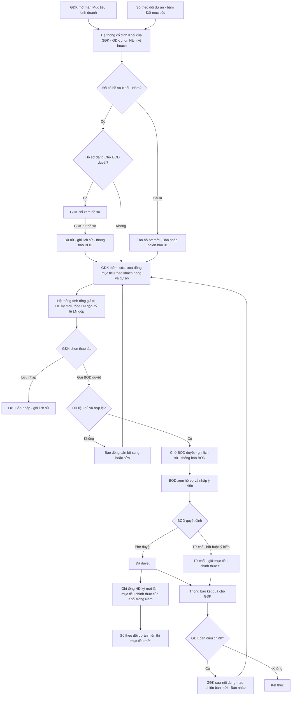
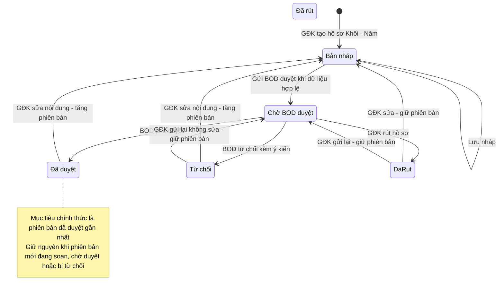
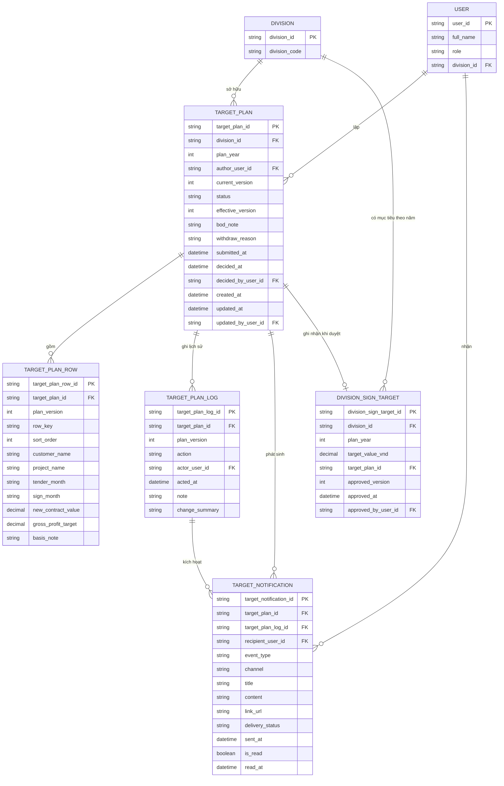
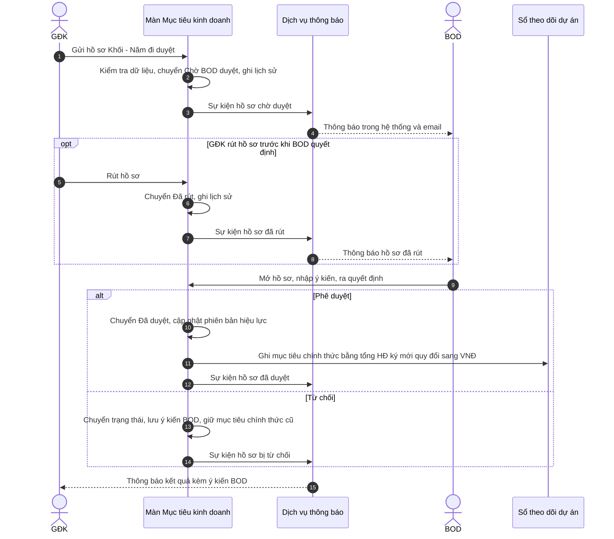

# TÀI LIỆU SRS - CHỨC NĂNG "MỤC TIÊU KINH DOANH CỦA KHỐI"

## Version control

| Tên version | Ngày cập nhật | PIC | Mô tả |
| :--- | :--- | :--- | :--- |
| **v01 (hiện tại)** | **2026-10-02** | **AI Agent** | - Khởi tạo tài liệu SRS màn Mục tiêu kinh doanh. - Mục 1: mô tả phân hệ, vai trò, vòng đời 5 trạng thái hồ sơ, quyền thao tác theo trạng thái, sơ đồ luồng, state diagram, ERD, sequence diagram. - Mục 2: 15 User Story / 3 Epic kèm AC. - Mục 3: 28 Business Rule / 6 nhóm. - Mục 4: Data Dictionary 5 bảng; mục 5: Interaction Details. |

---

## 1. Luồng trạng thái và Nghiệp vụ (Business Flow)

**Mô tả:** Màn *Mục tiêu kinh doanh* cho phép **Giám đốc khối (GĐK)** đăng ký mục tiêu kinh doanh trong năm cho khối mình phụ trách. Mục tiêu gồm **giá trị hợp đồng (HĐ) ký mới** và **lợi nhuận (LN) gộp mục tiêu**, chi tiết theo từng khách hàng / dự án, kèm tháng dự kiến ra thầu, tháng dự kiến ký HĐ và cơ sở đăng ký. GĐK gửi hồ sơ cho **BOD** xem xét. BOD **phê duyệt** hoặc **từ chối** kèm ý kiến. Hồ sơ bị từ chối được GĐK sửa và gửi lại.

Hồ sơ đã duyệt trở thành **mục tiêu chính thức** của khối trong năm. Tổng giá trị HĐ ký mới của hồ sơ này được ghi sang **Sổ theo dõi dự án** (đầu màn *Danh sách dự án*) để so sánh với giá trị HĐ đã ký và chưa ký. LN gộp mục tiêu chỉ hiển thị trong màn này.

- Mỗi hồ sơ gắn với một cặp *(Khối, Năm kế hoạch)*. Mỗi cặp chỉ có một hồ sơ, hồ sơ có nhiều phiên bản.
- Hồ sơ lập theo năm, **không có kỳ lập / kỳ điều chỉnh**. GĐK lập hoặc điều chỉnh lúc nào cũng được, trừ khi hồ sơ đang *Chờ BOD duyệt*. Tháng ra thầu và tháng ký HĐ của từng dòng chỉ được chọn trong 12 tháng của năm kế hoạch.
- Khi GĐK **sửa nội dung** hồ sơ đã có quyết định của BOD (*Đã duyệt* hoặc *Từ chối*), hệ thống tạo **phiên bản mới** và hồ sơ phải được BOD duyệt lại. Gửi lại mà không sửa nội dung thì giữ nguyên phiên bản. Hồ sơ *Đã rút* sửa lại vẫn giữ nguyên phiên bản, vì BOD chưa quyết định phiên bản đó. Trong lúc chờ, mục tiêu chính thức vẫn là **phiên bản đã duyệt gần nhất**.
- Nút *Đặt mục tiêu* ở Sổ theo dõi dự án không cho nhập số trực tiếp mà mở hồ sơ Mục tiêu kinh doanh của khối / năm tương ứng. Nhờ đó mục tiêu chỉ có **một nguồn duy nhất**.
- Mỗi lần gửi, rút, duyệt hoặc từ chối đều ghi lịch sử và gửi thông báo cho bên liên quan.

Đường dẫn: **Quản trị dự án & Tài chính → Mục tiêu kinh doanh**. Màn có 2 tab: *GĐK lập mục tiêu* và *BOD phê duyệt*. ĐVT trên màn: **triệu VNĐ**.

**Vai trò:**

| Vai trò | Phạm vi dữ liệu | Thao tác |
| :--- | :--- | :--- |
| GĐK | Chỉ khối của mình | Lập, lưu nháp, sửa, gửi duyệt, rút hồ sơ, xem lịch sử |
| BOD | Hồ sơ của tất cả các khối, ở mọi trạng thái | Xem danh sách và chi tiết hồ sơ, phê duyệt, từ chối, xem lịch sử |
| Người xem Sổ theo dõi dự án | Theo quyền của màn Danh sách dự án | Xem mục tiêu chính thức của khối |

**Trạng thái hồ sơ:**

| Trạng thái | Ý nghĩa | GĐK sửa / gửi | GĐK rút | BOD quyết định |
| :--- | :--- | :--- | :--- | :--- |
| Bản nháp | Đang soạn, chưa gửi hoặc đang soạn phiên bản điều chỉnh | Có | Không | Không |
| Chờ BOD duyệt | Đã gửi, chờ BOD xem xét | Không | Có | Có |
| Đã duyệt | BOD chấp nhận, là mục tiêu chính thức | Có, sửa nội dung thì tạo phiên bản mới | Không | Không |
| Từ chối | BOD không chấp nhận hoặc yêu cầu bổ sung, có ý kiến bắt buộc | Có, sửa nội dung thì tạo phiên bản mới | Không | Không |
| Đã rút | GĐK rút lại trước khi BOD quyết định | Có, giữ nguyên phiên bản | Không | Không |

**Ghi chú phạm vi:** Tài liệu này chỉ đặc tả màn Mục tiêu kinh doanh và điểm ghi nhận sang Sổ theo dõi dự án. Ba điểm sau được ghi nhận nhưng không xử lý trong đợt này:
- Khách hàng đang nhập tự do, chưa liên kết danh mục khách hàng.
- Đơn vị tiền khác nhau giữa các màn: màn này dùng triệu VNĐ, Sổ theo dõi dùng VNĐ.
- Mục tiêu kinh doanh chưa liên kết với *Kế hoạch thu chi*.

**Sơ đồ luồng:**

**State diagram — vòng đời hồ sơ mục tiêu:**

> **Quy tắc phiên bản:**
> - Phiên bản chỉ tăng 1 khi hồ sơ đang *Đã duyệt* hoặc *Từ chối* và GĐK **lưu nội dung khác** với phiên bản BOD đã quyết định. Nội dung gồm: thêm, sửa hoặc xoá dòng mục tiêu.
> - Các trường hợp sau **giữ nguyên phiên bản**: gửi lại hồ sơ bị từ chối mà không sửa gì; hồ sơ *Đã rút* được sửa hoặc gửi lại; các lần lưu nháp tiếp theo trong cùng một phiên bản.

**Lát cắt ERD:**

> `TARGET_PLAN_ROW` lưu dòng mục tiêu **theo từng phiên bản** (`plan_version`). Cách này giúp giữ nguyên dữ liệu của phiên bản đã duyệt trong lúc GĐK soạn phiên bản điều chỉnh, và giúp so sánh nội dung thay đổi giữa hai phiên bản. Chi tiết trường dữ liệu: xem mục 4.

**Sequence diagram — gửi duyệt, quyết định và ghi nhận mục tiêu:**

---

## 2. User Stories & Acceptance Criteria (AC)

> Ký hiệu **[Mới]**: yêu cầu đã chốt với BA nhưng chưa có trên prototype hiện tại.

**Epic A:** GĐK lập và điều chỉnh mục tiêu kinh doanh của khối

### User Story 1: Mở hồ sơ mục tiêu của khối theo năm — Là GĐK, tôi muốn mở hồ sơ mục tiêu của khối mình theo năm kế hoạch để bắt đầu lập hoặc xem lại mục tiêu.
*   **Acceptance Criteria:**
    *   **AC1.1:** GĐK chỉ làm việc với hồ sơ của khối mình phụ trách. Hệ thống tự xác định khối, GĐK không chọn được khối khác *(BR1)* **[Mới]**.
    *   **AC1.2:** GĐK chọn được năm kế hoạch trong các năm hệ thống cho phép *(BR4)*.
    *   **AC1.3:** Nếu khối đã có hồ sơ của năm đó, hệ thống mở đúng hồ sơ ấy kèm trạng thái và phiên bản hiện tại. Nếu chưa có, hệ thống tạo hồ sơ mới ở trạng thái *Bản nháp*, phiên bản 01 *(BR3)*.
    *   **AC1.4:** GĐK xem được thông tin chung của hồ sơ: khối, người lập, năm kế hoạch, trạng thái và phiên bản.
    *   **AC1.5:** Khi hồ sơ đang *Chờ BOD duyệt*, GĐK chỉ xem được và biết rõ lý do không sửa được *(BR6)*.
    *   **AC1.6:** Khi hồ sơ bị *Từ chối*, GĐK xem được ý kiến của BOD để biết cần điều chỉnh gì.

### User Story 2: Đăng ký mục tiêu theo khách hàng / dự án — Là GĐK, tôi muốn khai báo từng dự án dự kiến ký hợp đồng trong năm để xây dựng mục tiêu của khối từ các cơ hội cụ thể.
*   **Acceptance Criteria:**
    *   **AC2.1:** GĐK thêm được nhiều dòng mục tiêu. Mỗi dòng gồm: khách hàng, tên dự án, tháng dự kiến ra thầu, tháng dự kiến ký HĐ, giá trị HĐ ký mới, LN gộp mục tiêu, cơ sở đăng ký / thuyết minh.
    *   **AC2.2:** GĐK được gợi ý tên khách hàng đã có trong hệ thống, đồng thời vẫn nhập được khách hàng mới *(BR20)*.
    *   **AC2.3:** Tháng ra thầu và tháng ký HĐ chỉ được chọn trong năm kế hoạch của hồ sơ *(BR15)* **[Mới]**.
    *   **AC2.4:** Hệ thống tự tính tỷ lệ LN gộp của từng dòng, GĐK không phải nhập *(BR17)*.
    *   **AC2.5:** GĐK sửa hoặc xoá được bất kỳ dòng nào khi hồ sơ không ở trạng thái *Chờ BOD duyệt* *(BR5, BR6)*.

### User Story 3: Xem tổng hợp mục tiêu của khối — Là GĐK, tôi muốn thấy ngay tổng mục tiêu và cơ cấu theo khách hàng / thời gian để đánh giá mục tiêu trước khi gửi duyệt.
*   **Acceptance Criteria:**
    *   **AC3.1:** GĐK xem được ba chỉ số tổng của khối: tổng giá trị mục tiêu (HĐ ký mới), tổng LN gộp mục tiêu và tỷ lệ LN gộp *(BR17)*.
    *   **AC3.2:** Hệ thống làm nổi bật khi tỷ lệ LN gộp của khối đạt ngưỡng tốt *(BR18)*.
    *   **AC3.3:** GĐK xem được giá trị mục tiêu và LN gộp theo hai góc nhìn: theo khách hàng, hoặc theo tháng ký HĐ *(BR19)*.
    *   **AC3.4:** GĐK xem được bảng chi tiết theo khách hàng (giá trị mục tiêu, LN gộp, tỷ lệ LN gộp) kèm dòng tổng khối.
    *   **AC3.5:** Các số tổng hợp cập nhật ngay khi GĐK thay đổi dòng mục tiêu, kể cả khi chưa lưu.

### User Story 4: Lưu nháp — Là GĐK, tôi muốn lưu hồ sơ đang soạn dở để tiếp tục hoàn thiện sau.
*   **Acceptance Criteria:**
    *   **AC4.1:** GĐK lưu được hồ sơ ở trạng thái *Bản nháp* mà không cần nhập đủ thông tin bắt buộc *(BR13)*.
    *   **AC4.2:** Hệ thống chỉ ghi nhận khi hồ sơ có thay đổi so với lần lưu trước.
    *   **AC4.3:** Mỗi lần lưu nháp được ghi lịch sử kèm nội dung đã thay đổi *(BR22, BR23)*.
    *   **AC4.4:** Lưu nháp không làm thay đổi mục tiêu chính thức đang hiệu lực *(BR11)*.

### User Story 5: Gửi BOD duyệt — Là GĐK, tôi muốn gửi hồ sơ mục tiêu cho BOD để mục tiêu được phê duyệt và ghi nhận chính thức.
*   **Acceptance Criteria:**
    *   **AC5.1:** Hệ thống chỉ nhận hồ sơ gửi duyệt khi có ít nhất một dòng mục tiêu và mọi dòng đã đủ, đúng thông tin bắt buộc *(BR13, BR14, BR15)*.
    *   **AC5.2:** Nếu dữ liệu chưa hợp lệ, GĐK được chỉ rõ dòng nào cần sửa và lý do.
    *   **AC5.3:** Gửi thành công thì hồ sơ chuyển sang *Chờ BOD duyệt* và bị khoá không cho sửa *(BR6)*.
    *   **AC5.4:** Việc gửi duyệt được ghi lịch sử, và BOD nhận được thông báo *(BR22, BR25)* **[Mới — thông báo]**.

### User Story 6: Rút hồ sơ đang chờ duyệt — Là GĐK, tôi muốn rút lại hồ sơ đã gửi khi phát hiện cần chỉnh sửa, để không phải chờ BOD từ chối. **[Mới]**
*   **Acceptance Criteria:**
    *   **AC6.1:** GĐK chỉ rút được hồ sơ của khối mình khi hồ sơ đang *Chờ BOD duyệt* *(BR7)*.
    *   **AC6.2:** GĐK phải xác nhận và bắt buộc ghi lý do khi rút hồ sơ *(BR7)*.
    *   **AC6.3:** Sau khi rút, hồ sơ chuyển sang *Đã rút* và giữ nguyên phiên bản *(BR10)*. BOD không còn quyết định được hồ sơ này.
    *   **AC6.4:** Việc rút hồ sơ được ghi lịch sử, và BOD nhận được thông báo *(BR22, BR25)*.

### User Story 7: Sửa và gửi lại hồ sơ bị từ chối hoặc đã rút — Là GĐK, tôi muốn điều chỉnh hồ sơ bị từ chối hoặc đã rút rồi gửi lại để mục tiêu được duyệt.
*   **Acceptance Criteria:**
    *   **AC7.1:** GĐK sửa và gửi lại được hồ sơ *Từ chối* hoặc *Đã rút* vào bất kỳ thời điểm nào *(BR5)*.
    *   **AC7.2:** Với hồ sơ *Từ chối*: nếu GĐK sửa nội dung, hệ thống tạo phiên bản mới. Nếu gửi lại mà không sửa, hệ thống giữ nguyên phiên bản *(BR9, BR10)*.
    *   **AC7.3:** Với hồ sơ *Đã rút*: dù sửa hay không, hệ thống giữ nguyên phiên bản *(BR10)*.
    *   **AC7.4:** Khi sửa hồ sơ, GĐK vẫn xem được ý kiến BOD của lần từ chối gần nhất.

### User Story 8: Điều chỉnh mục tiêu đã duyệt — Là GĐK, tôi muốn điều chỉnh mục tiêu đã được duyệt khi tình hình kinh doanh thay đổi, để mục tiêu chính thức luôn sát thực tế.
*   **Acceptance Criteria:**
    *   **AC8.1:** GĐK điều chỉnh được hồ sơ *Đã duyệt* vào bất kỳ thời điểm nào, không phụ thuộc kỳ *(BR5)*.
    *   **AC8.2:** Khi GĐK lưu nội dung khác với phiên bản đã duyệt, hệ thống tạo phiên bản mới ở trạng thái *Bản nháp* *(BR9)*.
    *   **AC8.3:** Phiên bản điều chỉnh phải được BOD duyệt mới có hiệu lực. Trong thời gian soạn, chờ duyệt hoặc khi bị từ chối, mục tiêu chính thức vẫn là phiên bản đã duyệt gần nhất *(BR11)*.
    *   **AC8.4:** Trong lúc điều chỉnh, GĐK luôn thấy phiên bản đã duyệt gần nhất là con số chính thức của khối, bao gồm số phiên bản, tổng giá trị mục tiêu và tổng LN gộp, để so với nội dung đang điều chỉnh *(BR11)* **[Mới]**.

### User Story 9: Xem lịch sử điều chỉnh — Là GĐK, tôi muốn xem toàn bộ lịch sử thao tác trên hồ sơ để biết mục tiêu đã thay đổi những gì, khi nào, bởi ai.
*   **Acceptance Criteria:**
    *   **AC9.1:** GĐK xem được mọi lần tạo, lưu nháp, gửi duyệt, rút, phê duyệt và từ chối hồ sơ. Lần mới nhất hiển thị đầu tiên *(BR22)*.
    *   **AC9.2:** Mỗi lần thao tác thể hiện thời gian, người thực hiện, thao tác, phiên bản, nội dung điều chỉnh hoặc ý kiến *(BR23)*.
    *   **AC9.3:** Không ai sửa hoặc xoá được lịch sử *(BR22)*.

---

**Epic B:** BOD phê duyệt mục tiêu kinh doanh

### User Story 10: Xem danh sách hồ sơ mục tiêu — Là BOD, tôi muốn thấy danh sách hồ sơ mục tiêu của tất cả các khối để biết hồ sơ nào đang chờ mình xử lý.
*   **Acceptance Criteria:**
    *   **AC10.1:** BOD xem được hồ sơ mục tiêu của tất cả các khối, các năm, ở mọi trạng thái, kể cả *Bản nháp* *(BR2)*.
    *   **AC10.2:** Mỗi hồ sơ hiển thị: khối, năm kế hoạch, người lập, trạng thái và phiên bản, số dự án, tổng giá trị mục tiêu, LN gộp, tỷ lệ LN gộp, thời điểm cập nhật gần nhất.
    *   **AC10.3:** Hồ sơ *Chờ BOD duyệt* được ưu tiên lên đầu danh sách, và BOD biết số hồ sơ đang chờ duyệt *(BR24)*.

### User Story 11: Xem chi tiết hồ sơ — Là BOD, tôi muốn xem đầy đủ nội dung một hồ sơ để có cơ sở ra quyết định.
*   **Acceptance Criteria:**
    *   **AC11.1:** BOD xem được thông tin chung, các chỉ số tổng hợp, cơ cấu theo khách hàng / tháng ký HĐ và toàn bộ dòng mục tiêu của hồ sơ, giống như GĐK đã lập *(BR17, BR19)*.
    *   **AC11.2:** BOD chỉ xem, không sửa được nội dung hồ sơ *(BR2)*.
    *   **AC11.3:** BOD xem được lịch sử điều chỉnh của hồ sơ, kể cả nội dung thay đổi so với phiên bản trước *(BR22, BR23)*.
    *   **AC11.4:** Với hồ sơ không ở trạng thái *Chờ BOD duyệt*, BOD xem được trạng thái hiện tại, ý kiến BOD gần nhất và lý do rút (nếu có), nhưng không ra quyết định được.

### User Story 12: Phê duyệt hồ sơ — Là BOD, tôi muốn phê duyệt hồ sơ mục tiêu để ghi nhận mục tiêu chính thức của khối trong năm.
*   **Acceptance Criteria:**
    *   **AC12.1:** BOD chỉ phê duyệt được hồ sơ đang *Chờ BOD duyệt* *(BR2)*.
    *   **AC12.2:** BOD có thể ghi ý kiến hoặc bỏ trống khi phê duyệt *(BR21)*.
    *   **AC12.3:** Sau khi phê duyệt, hồ sơ chuyển sang *Đã duyệt*, và phiên bản này trở thành mục tiêu chính thức của khối trong năm *(BR11, BR27)*.
    *   **AC12.4:** Việc phê duyệt được ghi lịch sử, và GĐK nhận được thông báo *(BR22, BR25)* **[Mới — thông báo]**.

### User Story 13: Từ chối hồ sơ — Là BOD, tôi muốn từ chối hồ sơ kèm ý kiến khi mục tiêu chưa phù hợp hoặc cần bổ sung, để GĐK biết cần điều chỉnh gì.
*   **Acceptance Criteria:**
    *   **AC13.1:** BOD chỉ từ chối được hồ sơ đang *Chờ BOD duyệt* *(BR2)*.
    *   **AC13.2:** BOD bắt buộc ghi ý kiến khi từ chối. Hệ thống không nhận ý kiến trống hoặc chỉ có khoảng trắng *(BR21)*.
    *   **AC13.3:** Sau khi từ chối, hồ sơ chuyển sang *Từ chối*. Mục tiêu chính thức của khối giữ nguyên như trước *(BR11)*.
    *   **AC13.4:** Việc từ chối được ghi lịch sử kèm ý kiến, và GĐK nhận được thông báo kèm ý kiến *(BR22, BR25)* **[Mới — thông báo]**.

---

**Epic C:** Thông báo và ghi nhận mục tiêu chính thức

### User Story 14: Nhận thông báo về hồ sơ mục tiêu — Là GĐK hoặc BOD, tôi muốn được báo khi hồ sơ mục tiêu có thay đổi cần mình biết hoặc xử lý, để không bỏ sót việc. **[Mới]**
*   **Acceptance Criteria:**
    *   **AC14.1:** BOD được báo khi GĐK gửi duyệt hoặc rút hồ sơ *(BR25)*.
    *   **AC14.2:** GĐK lập hồ sơ được báo khi BOD phê duyệt hoặc từ chối. Thông báo từ chối kèm ý kiến BOD *(BR25)*.
    *   **AC14.3:** Thông báo được gửi trong hệ thống và qua email. Thông báo cho biết khối, năm, phiên bản, thao tác, người thực hiện, và mở được thẳng hồ sơ liên quan *(BR26)*.
    *   **AC14.4:** Người nhận phân biệt được thông báo đã đọc và chưa đọc.

### User Story 15: Ghi nhận mục tiêu chính thức sang Sổ theo dõi dự án — Là BOD hoặc GĐK, tôi muốn mục tiêu đã duyệt được dùng ngay ở Sổ theo dõi dự án để theo dõi tiến độ ký hợp đồng so với mục tiêu.
*   **Acceptance Criteria:**
    *   **AC15.1:** Khi hồ sơ được phê duyệt, tổng giá trị HĐ ký mới của phiên bản đó trở thành mục tiêu chính thức của khối trong năm ở Sổ theo dõi dự án *(BR27)*.
    *   **AC15.2:** Mục tiêu chính thức chỉ thay đổi khi có một phiên bản mới được phê duyệt. Lưu nháp, gửi duyệt, rút hoặc từ chối đều không làm thay đổi mục tiêu chính thức *(BR11)*.
    *   **AC15.3:** Khối chưa từng có hồ sơ được duyệt trong năm thì chưa có mục tiêu chính thức ở Sổ theo dõi dự án.
    *   **AC15.4:** Mục tiêu chỉ được thay đổi thông qua hồ sơ Mục tiêu kinh doanh. Từ Sổ theo dõi dự án, người dùng được dẫn tới hồ sơ của khối / năm tương ứng thay vì nhập số trực tiếp *(BR28)* **[Mới]**.
    *   **AC15.5:** LN gộp mục tiêu không được ghi sang Sổ theo dõi dự án *(BR27)*.

---

## 3. Quy tắc nghiệp vụ (Business Rules)

**Nhóm 1 — Phân quyền và phạm vi hồ sơ**

*   **BR1 (Phạm vi khối của GĐK):** Mỗi GĐK gắn với một khối trong hồ sơ người dùng. GĐK chỉ xem, lập, sửa, gửi và rút hồ sơ của khối đó. Khối của hồ sơ được lấy theo tài khoản, người dùng không chọn. **[Mới]**
*   **BR2 (Quyền của BOD):** BOD xem được hồ sơ của mọi khối, mọi năm, ở **mọi trạng thái, kể cả *Bản nháp***. Với hồ sơ đang soạn, BOD thấy nội dung GĐK đã lưu gần nhất. BOD không sửa nội dung hồ sơ. BOD chỉ phê duyệt hoặc từ chối được hồ sơ đang *Chờ BOD duyệt*. Nếu hồ sơ đã chuyển trạng thái (ví dụ GĐK vừa rút) trước khi BOD xác nhận, quyết định của BOD không được ghi nhận và BOD được báo lý do.
*   **BR3 (Một hồ sơ cho mỗi Khối – Năm):** Mỗi cặp *(Khối, Năm kế hoạch)* chỉ có một hồ sơ mục tiêu. Mọi lần điều chỉnh đều là phiên bản của chính hồ sơ đó, không tạo hồ sơ mới. Hồ sơ được tạo khi GĐK lưu lần đầu cho cặp Khối – Năm.
*   **BR4 (Năm kế hoạch được chọn):** GĐK chọn được năm hiện tại và năm kế tiếp. Năm mặc định khi mở màn: năm kế tiếp nếu đang ở quý 4 (tháng 10–12), còn lại là năm hiện tại.

**Nhóm 2 — Quyền sửa theo trạng thái**

*   **BR5 (Không có kỳ lập / kỳ điều chỉnh):** Hệ thống không khoá hồ sơ theo tháng hay theo kỳ. GĐK lập, sửa và gửi được hồ sơ vào bất kỳ thời điểm nào, trừ khi hồ sơ đang *Chờ BOD duyệt*.
*   **BR6 (Khoá khi chờ duyệt):** Khi hồ sơ đang *Chờ BOD duyệt*, không ai thêm, sửa, xoá dòng, lưu nháp hay gửi lại được. Thao tác duy nhất của GĐK là rút hồ sơ (BR7).
*   **BR7 (Rút hồ sơ):** Chỉ GĐK của khối được rút, và chỉ khi hồ sơ đang *Chờ BOD duyệt*. Sau khi rút, hồ sơ chuyển sang *Đã rút*, nội dung giữ nguyên và GĐK sửa tiếp được. **Lý do rút là bắt buộc**. Lý do trống hoặc chỉ có khoảng trắng không được chấp nhận. **[Mới]**

**Nhóm 3 — Phiên bản và bản hiệu lực**

*   **BR8 (Đánh số phiên bản):** Hồ sơ mới bắt đầu từ phiên bản 01. Phiên bản hiển thị 2 chữ số, đi kèm trạng thái theo dạng *"Trạng thái — Phiên bản NN"*.
*   **BR9 (Tăng phiên bản):** Phiên bản chỉ tăng 1 khi hồ sơ đang *Đã duyệt* hoặc *Từ chối* và GĐK lưu (nháp hoặc gửi) nội dung **khác** với phiên bản BOD đã quyết định. Nội dung khác nghĩa là có dòng được thêm, xoá, hoặc có trường của dòng bị sửa.
*   **BR10 (Giữ nguyên phiên bản):** Giữ nguyên số phiên bản trong các trường hợp sau:
    *   Gửi lại hồ sơ *Từ chối* mà không sửa nội dung.
    *   Sửa hoặc gửi lại hồ sơ *Đã rút*, vì BOD chưa quyết định phiên bản đó.
    *   Các lần lưu nháp tiếp theo trong cùng một phiên bản.
*   **BR11 (Phiên bản hiệu lực):** Mục tiêu chính thức của khối trong năm là **phiên bản được phê duyệt gần nhất**. Phiên bản mới đang soạn, chờ duyệt, đã rút hoặc bị từ chối không làm thay đổi mục tiêu chính thức. Khối chưa có phiên bản nào được duyệt thì chưa có mục tiêu chính thức.
*   **BR12 (Lưu trữ phiên bản):** Nội dung các dòng mục tiêu được lưu theo từng phiên bản. Một phiên bản đã có quyết định của BOD (*Đã duyệt* / *Từ chối*) không bị ghi đè. Mọi chỉnh sửa sau đó đều thuộc phiên bản mới.

**Nhóm 4 — Dữ liệu dòng mục tiêu và tính toán**

*   **BR13 (Thông tin bắt buộc khi gửi duyệt):** Khi gửi duyệt, hồ sơ phải có ít nhất 1 dòng, và mỗi dòng phải có đủ: khách hàng, tên dự án, tháng ký HĐ, giá trị HĐ ký mới lớn hơn 0. Tháng ra thầu, LN gộp mục tiêu và cơ sở đăng ký không bắt buộc. Lưu nháp không kiểm tra các điều kiện này.
*   **BR14 (Giới hạn LN gộp):** LN gộp mục tiêu không âm và không được lớn hơn giá trị HĐ ký mới của cùng dòng. Điều kiện này được kiểm tra khi gửi duyệt.
*   **BR15 (Tháng thuộc năm kế hoạch):** Tháng ra thầu và tháng ký HĐ (định dạng MM/YYYY) phải thuộc năm kế hoạch của hồ sơ. **[Mới]**
*   **BR16 (Đơn vị và hiển thị số):** Giá trị tiền trên màn tính bằng **triệu VNĐ**, là số nguyên không âm, hiển thị có phân cách hàng nghìn. Tỷ lệ phần trăm hiển thị 1 chữ số thập phân. Khi không tính được thì hiển thị "—".
*   **BR17 (Công thức tính):**
    *   Tỷ lệ LN gộp của dòng = LN gộp mục tiêu / Giá trị HĐ ký mới. Không tính khi giá trị HĐ bằng 0.
    *   Tổng giá trị mục tiêu của khối = Σ giá trị HĐ ký mới của các dòng.
    *   Tổng LN gộp mục tiêu = Σ LN gộp mục tiêu của các dòng.
    *   Tỷ lệ LN gộp của khối = Tổng LN gộp / Tổng giá trị mục tiêu. Đây là tỷ lệ tính trên tổng, không phải trung bình cộng các tỷ lệ dòng.
*   **BR18 (Ngưỡng LN gộp tốt):** Tỷ lệ LN gộp của khối từ **20%** trở lên được coi là đạt ngưỡng tốt và được làm nổi bật.
*   **BR19 (Gom nhóm tổng hợp):** Gom theo khách hàng nghĩa là cộng các dòng có cùng tên khách hàng. Gom theo thời gian nghĩa là cộng các dòng theo tháng ký HĐ, sắp tăng dần. Dòng thiếu khách hàng hoặc thiếu tháng ký HĐ được gom vào nhóm "—".
*   **BR20 (Gợi ý khách hàng):** Danh sách gợi ý khách hàng lấy từ khách hàng của các dự án kinh doanh và từ các hồ sơ mục tiêu đã có, sắp theo bảng chữ cái. GĐK vẫn được nhập tên khách hàng chưa có trong danh sách.

**Nhóm 5 — Phê duyệt và lịch sử**

*   **BR21 (Ý kiến BOD):** Khi từ chối, ý kiến là bắt buộc. Ý kiến trống hoặc chỉ có khoảng trắng không được chấp nhận. Khi phê duyệt, ý kiến không bắt buộc. Ý kiến được cắt bỏ khoảng trắng ở đầu và cuối trước khi lưu. Ý kiến BOD gần nhất được hiển thị cho GĐK cho đến khi có quyết định mới.
*   **BR22 (Ghi lịch sử):** Mỗi thao tác sau tạo một bản ghi lịch sử: *Tạo hồ sơ, Lưu nháp, Gửi BOD duyệt, Rút hồ sơ, BOD phê duyệt, BOD từ chối*. Bản ghi gồm: thời gian, người thực hiện, thao tác, phiên bản, nội dung điều chỉnh, ý kiến / lý do. Lịch sử chỉ được thêm, không được sửa hay xoá.
*   **BR23 (Nội dung điều chỉnh):** Khi lưu hoặc gửi, hệ thống so nội dung với lần lưu trước và ghi lại theo 3 dạng:
    *   **Thêm** *[tên dự án] — [khách hàng]: [giá trị HĐ] tr*
    *   **Sửa** *[tên dự án]: [trường] [giá trị cũ] → [giá trị mới]*, áp dụng cho các trường khách hàng, tên dự án, tháng ra thầu, tháng ký HĐ, giá trị HĐ, LN gộp. Riêng thay đổi thuyết minh chỉ ghi "thuyết minh".
    *   **Xoá** *[tên dự án] — [khách hàng]*

    Nếu không có thay đổi, cột nội dung để trống.
*   **BR24 (Thứ tự danh sách của BOD):** Danh sách hồ sơ sắp theo thứ tự: hồ sơ *Chờ BOD duyệt* lên trước, tiếp theo là năm kế hoạch giảm dần, rồi đến mã khối theo bảng chữ cái. Số hồ sơ đang *Chờ BOD duyệt* được hiển thị cho BOD ở lối vào tab phê duyệt.

**Nhóm 6 — Thông báo và tích hợp**

*   **BR25 (Sự kiện thông báo):** **[Mới]**

    | Sự kiện | Người nhận | Nội dung kèm theo |
    | :--- | :--- | :--- |
    | GĐK gửi BOD duyệt | Tất cả người dùng vai trò BOD | Khối, năm, phiên bản, tổng giá trị mục tiêu |
    | GĐK rút hồ sơ | Tất cả người dùng vai trò BOD | Khối, năm, phiên bản, lý do rút |
    | BOD phê duyệt | GĐK lập hồ sơ | Khối, năm, phiên bản, ý kiến (nếu có) |
    | BOD từ chối | GĐK lập hồ sơ | Khối, năm, phiên bản, ý kiến từ chối |

*   **BR26 (Kênh và nội dung thông báo):** Mỗi sự kiện ở BR25 gửi đồng thời thông báo trong hệ thống và email. Thông báo nêu thao tác, người thực hiện, thời điểm, và có liên kết mở thẳng hồ sơ. Thông báo trong hệ thống có trạng thái đã đọc / chưa đọc. **[Mới]**
*   **BR27 (Ghi nhận mục tiêu chính thức):** Khi BOD phê duyệt, mục tiêu ký HĐ của khối trong năm ở Sổ theo dõi dự án được ghi bằng **Tổng giá trị HĐ ký mới × 1.000.000** (quy đổi từ triệu VNĐ sang VNĐ). Giá trị này thay thế giá trị cũ của cùng khối, cùng năm. LN gộp mục tiêu không được ghi sang Sổ theo dõi dự án.
*   **BR28 (Một nguồn mục tiêu duy nhất):** Mục tiêu ký HĐ của khối chỉ được thay đổi thông qua phê duyệt hồ sơ Mục tiêu kinh doanh. Sổ theo dõi dự án không cho nhập số trực tiếp. Chức năng *Đặt mục tiêu* tại đó dẫn người dùng tới hồ sơ Mục tiêu kinh doanh của khối / năm đang xem, theo quyền của người dùng: GĐK vào tab lập, BOD vào tab phê duyệt. **[Mới]**

---

## 4. Đặc tả trường dữ liệu (Data Dictionary)

> Đơn vị tiền: `target_plan_row` dùng **triệu VNĐ** (đúng đơn vị nhập trên màn). `division_sign_target` dùng **VNĐ** (đúng đơn vị của Sổ theo dõi dự án), xem BR27. Bảng `division` và `user` là bảng có sẵn của hệ thống, chỉ được tham chiếu.

### 4.1. Bảng TARGET_PLAN (Hồ sơ mục tiêu kinh doanh)
Mỗi bản ghi là một hồ sơ của một cặp *(Khối, Năm kế hoạch)*. Ràng buộc duy nhất: (`division_id`, `plan_year`), xem BR3.

| Tên trường | Loại data | Bắt buộc? | Mô tả |
| :--- | :--- | :--- | :--- |
| `target_plan_id` | String (PK) | Có | Khoá chính, tự sinh. Mã hiển thị dạng `TP-<mã khối>-<năm>`, ví dụ `TP-G1-2027`. |
| `division_id` | Foreign Key | Có | Liên kết bảng `division`. Lấy theo khối của GĐK lập hồ sơ (BR1). |
| `plan_year` | Number | Có | Năm kế hoạch, 4 chữ số (BR4). |
| `author_user_id` | Foreign Key | Có | Liên kết bảng `user`: GĐK lập hồ sơ, cũng là người nhận thông báo duyệt / từ chối. |
| `current_version` | Number | Có | Phiên bản hiện tại, bắt đầu từ 1, hiển thị 2 chữ số (BR8–BR10). |
| `status` | Enum | Có | `draft` = Bản nháp · `pending_approval` = Chờ BOD duyệt · `approved` = Đã duyệt · `rejected` = Từ chối · `withdrawn` = Đã rút. |
| `effective_version` | Number | Không | Phiên bản đã duyệt gần nhất, tức mục tiêu chính thức (BR11). Trống nếu chưa có phiên bản nào được duyệt. |
| `bod_note` | String | Không | Ý kiến BOD của lần quyết định gần nhất. Bắt buộc có khi `status = rejected` (BR21). |
| `withdraw_reason` | String | Không | Lý do rút của lần rút gần nhất. Bắt buộc có khi `status = withdrawn` (BR7). |
| `submitted_at` | DateTime | Không | Thời điểm gửi duyệt gần nhất. |
| `decided_at` | DateTime | Không | Thời điểm BOD quyết định gần nhất. |
| `decided_by_user_id` | Foreign Key | Không | Liên kết bảng `user`: BOD ra quyết định gần nhất. |
| `created_at` | DateTime | Có | Thời điểm tạo hồ sơ. |
| `updated_at` | DateTime | Có | Thời điểm cập nhật gần nhất, hiển thị ở cột *Cập nhật* của danh sách BOD. |
| `updated_by_user_id` | Foreign Key | Có | Liên kết bảng `user`: người cập nhật gần nhất. |

### 4.2. Bảng TARGET_PLAN_ROW (Dòng mục tiêu theo khách hàng / dự án)
Dòng được lưu **theo từng phiên bản** (BR12). Ràng buộc duy nhất: (`target_plan_id`, `plan_version`, `row_key`).

| Tên trường | Loại data | Bắt buộc? | Mô tả |
| :--- | :--- | :--- | :--- |
| `target_plan_row_id` | String (PK) | Có | Khoá chính, tự sinh. |
| `target_plan_id` | Foreign Key | Có | Liên kết bảng `target_plan`. |
| `plan_version` | Number | Có | Phiên bản chứa dòng này. |
| `row_key` | String | Có | Mã định danh dòng, giữ nguyên qua các phiên bản. Dùng để so sánh Thêm / Sửa / Xoá giữa hai phiên bản (BR9, BR23). |
| `sort_order` | Number | Có | Thứ tự hiển thị, tức cột STT. |
| `customer_name` | String | Có khi gửi | Tên khách hàng. Nhập tự do, có gợi ý (BR20). |
| `project_name` | String | Có khi gửi | Tên dự án / cơ hội kinh doanh. |
| `tender_month` | String (YYYY-MM) | Không | Tháng dự kiến ra thầu, phải thuộc `plan_year` (BR15). |
| `sign_month` | String (YYYY-MM) | Có khi gửi | Tháng dự kiến ký HĐ, phải thuộc `plan_year` (BR15). |
| `new_contract_value` | Number | Có khi gửi | Giá trị HĐ ký mới, đơn vị triệu VNĐ, số nguyên lớn hơn 0 (BR13, BR16). |
| `gross_profit_target` | Number | Không | LN gộp mục tiêu, đơn vị triệu VNĐ, số nguyên, từ 0 đến `new_contract_value` (BR14). Mặc định 0. |
| `basis_note` | String | Không | Cơ sở đăng ký / thuyết minh kế hoạch. |

> Tỷ lệ LN gộp không lưu vào bảng mà tính khi hiển thị theo BR17. "Có khi gửi" nghĩa là được để trống khi lưu nháp nhưng bắt buộc khi gửi duyệt (BR13).

### 4.3. Bảng TARGET_PLAN_LOG (Lịch sử điều chỉnh)
Chỉ được thêm, không được sửa hay xoá (BR22).

| Tên trường | Loại data | Bắt buộc? | Mô tả |
| :--- | :--- | :--- | :--- |
| `target_plan_log_id` | String (PK) | Có | Khoá chính, tự sinh. |
| `target_plan_id` | Foreign Key | Có | Liên kết bảng `target_plan`. |
| `plan_version` | Number | Có | Phiên bản của hồ sơ tại thời điểm thao tác. |
| `action` | Enum | Có | `create` = Tạo hồ sơ · `save_draft` = Lưu nháp · `submit` = Gửi BOD duyệt · `withdraw` = Rút hồ sơ · `approve` = BOD phê duyệt · `reject` = BOD từ chối. |
| `actor_user_id` | Foreign Key | Có | Liên kết bảng `user`: người thực hiện. |
| `acted_at` | DateTime | Có | Thời điểm thực hiện. |
| `note` | String | Không | Ý kiến BOD (khi `approve` / `reject`) hoặc lý do rút (khi `withdraw`). Bắt buộc với `reject` và `withdraw`. |
| `change_summary` | JSON (mảng chuỗi) | Không | Danh sách nội dung điều chỉnh theo định dạng ở BR23. Trống nếu không có thay đổi. |

### 4.4. Bảng TARGET_NOTIFICATION (Thông báo)
Mỗi sự kiện tạo một bản ghi cho **mỗi người nhận và mỗi kênh** (BR25, BR26).

| Tên trường | Loại data | Bắt buộc? | Mô tả |
| :--- | :--- | :--- | :--- |
| `target_notification_id` | String (PK) | Có | Khoá chính, tự sinh. |
| `target_plan_id` | Foreign Key | Có | Liên kết bảng `target_plan`: hồ sơ liên quan. |
| `target_plan_log_id` | Foreign Key | Có | Liên kết bảng `target_plan_log`: thao tác phát sinh thông báo. |
| `recipient_user_id` | Foreign Key | Có | Liên kết bảng `user`: người nhận. |
| `event_type` | Enum | Có | `submitted` = Gửi duyệt · `withdrawn` = Rút hồ sơ · `approved` = Phê duyệt · `rejected` = Từ chối. |
| `channel` | Enum | Có | `in_app` = Trong hệ thống · `email` = Email. |
| `title` | String | Có | Tiêu đề, ví dụ "Mục tiêu kinh doanh G1 năm 2027 chờ duyệt". |
| `content` | String | Có | Nội dung theo BR25: khối, năm, phiên bản, giá trị / ý kiến / lý do. |
| `link_url` | String | Có | Liên kết mở thẳng hồ sơ. |
| `delivery_status` | Enum | Có | `pending` = Chờ gửi · `sent` = Đã gửi · `failed` = Gửi lỗi. |
| `sent_at` | DateTime | Không | Thời điểm gửi thành công. |
| `is_read` | Boolean | Không | Đã đọc hay chưa. Chỉ dùng cho kênh `in_app`, mặc định `false`. |
| `read_at` | DateTime | Không | Thời điểm đọc, chỉ dùng cho kênh `in_app`. |

### 4.5. Bảng DIVISION_SIGN_TARGET (Mục tiêu ký HĐ chính thức theo khối / năm)
Nguồn dữ liệu cột *Giá trị mục tiêu* của Sổ theo dõi dự án. Chỉ được ghi khi BOD phê duyệt (BR27, BR28). Ràng buộc duy nhất: (`division_id`, `plan_year`).

| Tên trường | Loại data | Bắt buộc? | Mô tả |
| :--- | :--- | :--- | :--- |
| `division_sign_target_id` | String (PK) | Có | Khoá chính, tự sinh. |
| `division_id` | Foreign Key | Có | Liên kết bảng `division`. |
| `plan_year` | Number | Có | Năm kế hoạch. |
| `target_value_vnd` | Number | Có | Mục tiêu giá trị HĐ ký, đơn vị **VNĐ**, bằng Σ `new_contract_value` của phiên bản được duyệt × 1.000.000. |
| `target_plan_id` | Foreign Key | Có | Liên kết bảng `target_plan`: hồ sơ nguồn. |
| `approved_version` | Number | Có | Phiên bản được duyệt, bằng `target_plan.effective_version`. |
| `approved_at` | DateTime | Có | Thời điểm phê duyệt. |
| `approved_by_user_id` | Foreign Key | Có | Liên kết bảng `user`: BOD phê duyệt. |

---

## 5. Mô tả các hiệu ứng tương tác (Interaction Details)

**Chung**
*   **Tab và số hồ sơ chờ duyệt:** Màn có 2 tab dạng thẻ hồ sơ: *GĐK lập mục tiêu* và *BOD phê duyệt*. Khi có hồ sơ đang chờ, tab BOD hiển thị số đó, ví dụ *BOD phê duyệt (2)*.
*   **Nhãn trạng thái:** Trạng thái hiển thị dạng thẻ màu kèm phiên bản, ví dụ *Chờ BOD duyệt — Phiên bản 02*. Màu theo trạng thái:
    *   Bản nháp: xám.
    *   Chờ BOD duyệt: vàng hổ phách.
    *   Đã duyệt: xanh lá.
    *   Từ chối: đỏ.
    *   Đã rút: tím nhạt **[Mới]**.
*   **Toast:** Sau mỗi thao tác thành công, một thông báo nổi hiện ở góc trên bên phải trong khoảng 2,6 giây. Các thông báo gồm:
    *   "Đã lưu nháp"
    *   "Đã gửi BOD duyệt mục tiêu G1 năm 2027"
    *   "Đã rút hồ sơ mục tiêu G1 năm 2027" **[Mới]**
    *   "BOD đã phê duyệt mục tiêu G1 năm 2027 — ghi nhận kế hoạch chính thức"
    *   "BOD đã từ chối mục tiêu G1 năm 2027"
*   **Ghi chú luồng:** Chân các khung thao tác hiển thị dòng *GĐK lập hồ sơ → BOD phê duyệt → Ghi nhận kế hoạch chính thức*.
*   **Bỏ khỏi prototype:** nhãn kỳ mở / khoá và ô *Chế độ thử: bỏ qua khoá kỳ* bị bỏ, vì không còn kỳ lập (BR5).

**Tab GĐK lập mục tiêu**
*   **Khối cố định:** Khối hiển thị dạng chữ, lấy theo tài khoản, không có ô chọn (BR1) **[Mới]**. Ô *Năm kế hoạch* là danh sách thả xuống (BR4).
*   **Đổi năm khi chưa lưu:** Nếu đang có thay đổi chưa lưu mà GĐK đổi năm, hệ thống hỏi xác nhận trước khi bỏ thay đổi **[Mới — đề xuất]**.
*   **Cảnh báo theo trạng thái:**
    *   *Chờ BOD duyệt*: dòng chữ vàng "Hồ sơ đang chờ BOD duyệt — không sửa được cho tới khi BOD phê duyệt hoặc từ chối".
    *   *Từ chối*: hộp nền đỏ nhạt có biểu tượng, nội dung "BOD từ chối: “[ý kiến]” — điều chỉnh và gửi lại".
    *   *Đã rút*: hộp nền tím nhạt, nội dung "Đã rút: “[lý do]”" **[Mới]**.
*   **Khung mục tiêu chính thức:** Khi hồ sơ đã có phiên bản được duyệt mà GĐK đang điều chỉnh (phiên bản hiện tại khác phiên bản hiệu lực), một khung thông tin hiển thị *Mục tiêu chính thức — Phiên bản NN: [tổng giá trị] tr · LN gộp [tổng LN] tr* để GĐK so với nội dung đang sửa (AC8.4) **[Mới]**.
*   **Thẻ chỉ số:** 3 thẻ: Tổng giá trị mục tiêu, Lợi nhuận gộp mục tiêu, % Lợi nhuận gộp. Thẻ % chuyển màu xanh khi đạt từ 20% trở lên (BR18). Thẻ hiển thị "—" khi chưa có giá trị.
*   **Chuyển góc nhìn:** Nút chuyển hai lựa chọn *Theo khách hàng* / *Theo thời gian ký HĐ* đổi dữ liệu của biểu đồ (BR19). Bảng *Chi tiết mục tiêu theo khách hàng* luôn gom theo khách hàng và có dòng *TỔNG KHỐI*.
*   **Biểu đồ cột nhóm:** Mỗi nhóm có 2 cột trên cùng một trục (triệu VNĐ): *Giá trị mục tiêu* màu xanh đậm và *LN gộp* màu cam. Rê chuột vào một nhóm thì nền nhóm được làm nổi, kèm tooltip ghi tên nhóm, giá trị mục tiêu, LN gộp và tỷ lệ. Khi chưa có dòng nào, biểu đồ hiển thị "Chưa có dữ liệu đăng ký.".
*   **Nhập trực tiếp trên bảng:** Các ô của bảng *Đăng ký mục tiêu theo khách hàng / dự án* sửa được ngay trên dòng. Ô đang nhập có nền xanh nhạt và viền xanh.
    *   Ô số chỉ nhận chữ số và tự thêm phân cách hàng nghìn khi gõ.
    *   Cột *% LN gộp mục tiêu* tự tính, chỉ đọc.
    *   Ô *Khách hàng* hiện danh sách gợi ý khi gõ (BR20).
*   **Chọn tháng:** Ô *Ra thầu* và *Ký HĐ* cho chọn 1 trong 12 tháng của năm kế hoạch, hiển thị dạng MM/YYYY (BR15) **[Mới]**. Ô này thay cho ô gõ tự do của prototype.
*   **Thêm / xoá dòng:**
    *   Nút *+ Thêm dòng* có ở đầu và cuối bảng.
    *   Biểu tượng × ở cuối dòng dùng để xoá dòng, chuyển màu đỏ khi rê chuột.
    *   Khi hồ sơ bị khoá, các nút này mờ đi và tooltip ghi lý do, ví dụ "Hồ sơ đang chờ BOD duyệt — không sửa được".
*   **Bảng rỗng:** Khi chưa có dòng nào, bảng hiển thị "Chưa có dự án đăng ký. Bấm “+ Thêm dòng”.". Dòng cuối bảng luôn là *TỔNG MỤC TIÊU KHỐI*.
*   **Nút thao tác ở chân khung:**
    *   *Lưu nháp* và *Gửi BOD duyệt* (màu xanh lá) chỉ hiện khi hồ sơ sửa được. *Lưu nháp* mờ khi không có thay đổi.
    *   Khi hồ sơ *Chờ BOD duyệt*, chỉ còn nút *Rút hồ sơ* **[Mới]**.
*   **Lỗi khi gửi:** Lỗi hiển thị chữ đỏ, kèm biểu tượng cảnh báo, ở chân khung. Các câu báo lỗi:
    *   "Chưa có dự án đăng ký."
    *   "Dòng N: nhập đủ Khách hàng, Tên dự án, Ký HĐ và HĐ ký mới."
    *   "Dòng N: LN gộp không được lớn hơn giá trị HĐ ký mới."

    Lỗi tự ẩn khi GĐK đổi sang năm khác.
*   **Popup Rút hồ sơ:** Bấm *Rút hồ sơ* thì mở popup xác nhận, có ô *Lý do rút* bắt buộc. Nút *Xác nhận rút* chỉ dùng được khi lý do có nội dung khác khoảng trắng. Nút *Huỷ* đóng popup mà không thay đổi gì (BR7) **[Mới]**.

**Tab BOD phê duyệt**
*   **Danh sách hồ sơ:**
    *   Bấm vào bất kỳ đâu trên dòng là mở hồ sơ.
    *   Cột cuối hiển thị *Duyệt* (chữ đỏ, đậm, gạch chân) với hồ sơ đang chờ, và *Xem* (chữ xanh, gạch chân) với hồ sơ còn lại.
    *   Chân bảng ghi "Bấm vào một hồ sơ để xem và phê duyệt. ĐVT: triệu VNĐ".
*   **Chi tiết hồ sơ:** Hồ sơ hiển thị chỉ đọc, gồm thông tin chung, tổng hợp, bảng dòng mục tiêu và lịch sử. Khung *Ý kiến BOD — bắt buộc nếu từ chối* có ô nhập nhiều dòng, bên dưới là dòng hướng dẫn xám.
*   **Lỗi khi từ chối thiếu ý kiến:** Dòng hướng dẫn chuyển chữ đỏ, nội dung "Từ chối bắt buộc nhập ý kiến…". Lỗi tự ẩn khi BOD bắt đầu gõ.
*   **Nút quyết định:**
    *   *Quay lại danh sách* luôn hiện.
    *   *Từ chối* (đỏ) và *Phê duyệt* (xanh lá) chỉ hiện khi hồ sơ *Chờ BOD duyệt*.
    *   Với trạng thái khác, khung ý kiến được thay bằng dòng mô tả trạng thái, ý kiến BOD hoặc lý do rút gần nhất.
*   **Hồ sơ vừa đổi trạng thái:** Nếu GĐK đã rút hồ sơ trong lúc BOD đang xem, quyết định của BOD bị chặn. BOD nhận báo lỗi "Hồ sơ đã được GĐK rút — không thể quyết định", và màn tải lại trạng thái mới (BR2).

**Lịch sử điều chỉnh** (dùng chung cho cả hai tab)
*   Tiêu đề khung kèm số bản ghi, ví dụ *Lịch sử điều chỉnh (4)*. Bản ghi mới nhất ở trên cùng.
*   Cột *Nội dung điều chỉnh / Ý kiến* liệt kê từng thay đổi bằng dấu "•". Ý kiến BOD hoặc lý do rút hiển thị chữ nghiêng, trong ngoặc kép. Khi không có nội dung thì hiển thị "—".

**Thông báo** **[Mới]**
*   Biểu tượng chuông ở thanh đầu trang có số đếm thông báo chưa đọc.
*   Bấm chuông mở danh sách thông báo, thông báo chưa đọc in đậm.
*   Bấm một thông báo thì mở đúng hồ sơ ở tab phù hợp (GĐK hoặc BOD) và đánh dấu thông báo đó là đã đọc.
