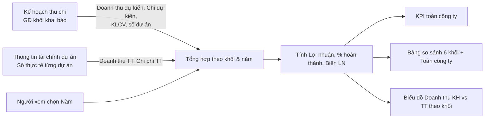

# TÀI LIỆU SRS - CHỨC NĂNG "OVERVIEW - BÁO CÁO TOÀN CẢNH THU CHI CÔNG TY"

## Version control

| Tên version | Ngày cập nhật | PIC | Mô tả |
| :--- | :--- | :--- | :--- |
| **v01 (hiện tại)** | **2026-09-28** | **AI Agent** | - Khởi tạo tài liệu SRS màn Overview (Báo cáo toàn cảnh thu chi công ty). - Mô tả KPI toàn công ty, bảng so sánh 6 khối, biểu đồ Doanh thu KH vs TT. |

---

## 1. Luồng trạng thái và Nghiệp vụ (Business Flow)

**Mô tả:** Màn *Overview* (tiêu đề "Báo Cáo Toàn Cảnh Thu Chi Công Ty") dành cho **Tổng Giám đốc** và **Kế toán**, dùng để xem toàn cảnh thu – chi của công ty và so sánh **6 khối**: G1, G2, G3, G4, BFSI, GPDV. Mỗi khối là một cột, thêm cột **Toàn công ty**. Các hàng là chỉ tiêu tài chính: Doanh thu, Chi phí, Lợi nhuận, Quy mô.
- **Số kế hoạch** lấy từ *Kế hoạch thu chi* do Giám đốc khối khai báo.
- **Số thực tế** tổng hợp từ *Thông tin tài chính dự án* của các dự án thuộc khối.

Màn chỉ để xem, không nhập liệu. Đơn vị: triệu VNĐ. Truy cập qua **Project Management → Overview**.

**Sơ đồ luồng:**

---

## 2. User Stories & Acceptance Criteria (AC)

**Epic:** Quản lý tài chính dự án theo khối

### User Story 1: Xem chỉ số tổng toàn công ty — Là Tổng Giám đốc, tôi muốn thấy nhanh các chỉ số tài chính tổng của công ty để nắm tình hình chung.
*   **Acceptance Criteria:**
    *   **AC1.1:** Hiển thị 5 chỉ số toàn công ty của năm đang chọn: Doanh thu kế hoạch, Doanh thu thực tế, Chi phí thực tế, Lợi nhuận thực tế, % hoàn thành kế hoạch thu.
    *   **AC1.2:** Cho phép chọn năm cần xem (2025, 2026, 2027). Toàn bộ số liệu trên màn tính lại theo năm.

### User Story 2: So sánh các khối — Là Tổng Giám đốc, tôi muốn so sánh chỉ tiêu tài chính giữa 6 khối trên cùng một bảng để biết khối nào làm tốt, khối nào cần chú ý.
*   **Acceptance Criteria:**
    *   **AC2.1:** Hiển thị bảng với 6 cột khối (G1, G2, G3, G4, BFSI, GPDV) và 1 cột Toàn công ty.
    *   **AC2.2:** Nhóm Doanh thu: Doanh thu kế hoạch, Doanh thu thực tế, % hoàn thành kế hoạch.
    *   **AC2.3:** Nhóm Chi phí: Chi phí kế hoạch, Chi phí thực tế, Chênh lệch kế hoạch − thực tế.
    *   **AC2.4:** Nhóm Lợi nhuận: Lợi nhuận kế hoạch, Lợi nhuận thực tế, Biên lợi nhuận thực tế.
    *   **AC2.5:** Nhóm Quy mô: Khối lượng công việc, Số dự án.
    *   **AC2.6:** Khối chưa có kế hoạch vẫn hiển thị cột với giá trị trống.

### User Story 3: Xem trực quan doanh thu theo khối — Là Tổng Giám đốc, tôi muốn xem biểu đồ doanh thu kế hoạch và thực tế của từng khối để nhận ra chênh lệch nhanh.
*   **Acceptance Criteria:**
    *   **AC3.1:** Hiển thị biểu đồ cột nhóm: mỗi khối có 1 cột Kế hoạch và 1 cột Thực tế, kèm nhãn giá trị.
    *   **AC3.2:** Biểu đồ dùng cùng số liệu với bảng so sánh.

### User Story 4: Xuất báo cáo — Là Kế toán, tôi muốn xuất bảng so sánh ra Excel để gửi báo cáo.
*   **Acceptance Criteria:**
    *   **AC4.1:** Cho phép xuất bảng so sánh của năm đang chọn ra file XLSX.

---

## 3. Quy tắc nghiệp vụ (Business Rules)

*   **BR1 (Danh sách khối):** Báo cáo cố định 6 khối theo thứ tự G1, G2, G3, G4, BFSI, GPDV. Khối "Giải pháp - Dịch vụ" hiển thị nhãn "GPDV".
*   **BR2 (Doanh thu kế hoạch khối):** = Σ Doanh thu dự kiến (SX + KD) của 12 tháng, cộng qua mọi dự án trong kế hoạch của khối năm đang chọn. *(Hiện trạng: prototype đang cộng Thu dự kiến phần SX. Cần sửa theo quy tắc này.)*
*   **BR3 (Chi phí kế hoạch khối):** = Σ Chi dự kiến (SX + KD) của 12 tháng, cộng qua mọi dự án trong kế hoạch của khối. *(Hiện trạng: prototype chỉ cộng phần SX.)*
*   **BR4 (Doanh thu thực tế khối):** = Σ Doanh thu thực tế các tháng của các dự án thuộc khối (màn Thông tin tài chính dự án). *(Hiện trạng: prototype đang minh hoạ bằng Doanh thu KH × tỷ lệ thực hiện cố định từng khối.)*
*   **BR5 (Chi phí thực tế khối):** = Σ (Chi phí thực tế trực tiếp + Phân bổ CP vận hành khối) các tháng của các dự án thuộc khối. *(Hiện trạng: prototype minh hoạ bằng Chi phí KH × tỷ lệ cố định.)*
*   **BR6 (Công thức chỉ số):**
    *   % hoàn thành KH = Doanh thu TT / Doanh thu KH × 100. Bằng 0 nếu Doanh thu KH = 0.
    *   Chênh lệch chi phí = Chi phí KH − Chi phí TT. Dương là tiết kiệm, âm là vượt chi.
    *   Lợi nhuận KH = Doanh thu KH − Chi phí KH. Lợi nhuận TT = Doanh thu TT − Chi phí TT.
    *   Biên lợi nhuận TT = Lợi nhuận TT / Doanh thu TT × 100. Bằng 0 nếu Doanh thu TT = 0.
*   **BR7 (Cột Toàn công ty):** Các chỉ tiêu tiền và số dự án = tổng 6 khối. Các chỉ tiêu % (% hoàn thành, Biên LN) tính lại từ tổng, **không** cộng hoặc trung bình % của các khối.
*   **BR8 (Quy mô):**
    *   Số dự án = số dự án trong kế hoạch của khối.
    *   Khối lượng công việc: dùng đơn vị thống nhất với Kế hoạch thu chi (% theo dự án). Cần thống nhất cách tổng hợp cấp khối (ví dụ trung bình % hoặc quy đổi khối lượng tuyệt đối), vì cộng % của nhiều dự án không có ý nghĩa.
*   **BR9 (Chỉ đọc):** Màn không cho nhập hoặc sửa dữ liệu. Muốn thay đổi số liệu phải vào màn nguồn.

---

## 4. Đặc tả trường dữ liệu (Data Dictionary)

Màn không có bảng riêng. Dữ liệu được tổng hợp từ các bảng nguồn (xem SRS Kế hoạch thu chi và SRS Thông tin tài chính dự án). Đề xuất một view tổng hợp:

### 4.1. View `v_company_block_summary` — Tổng hợp tài chính theo khối và năm
| Tên trường | Loại data | Bắt buộc? | Mô tả |
| :--- | :--- | :--- | :--- |
| `khoi_code` | String | Có | Mã khối. |
| `year` | Number | Có | Năm. |
| `revenue_plan` | Number | Có | Doanh thu kế hoạch (triệu VNĐ). Nguồn: `fin_block_plan_monthly` (`PLANNED_REVENUE`, SX + KD). |
| `revenue_actual` | Number | Có | Doanh thu thực tế. Nguồn: `fin_project_actual_monthly.revenue_actual`. |
| `cost_plan` | Number | Có | Chi phí kế hoạch. Nguồn: `fin_block_plan_monthly` (`EXPENSE`, SX + KD). |
| `cost_actual` | Number | Có | Chi phí thực tế. Nguồn: `fin_project_actual_monthly.cost_actual` + `fin_overhead_allocation.allocated_amount`. |
| `profit_plan` | Number | Có | = `revenue_plan` − `cost_plan`. |
| `profit_actual` | Number | Có | = `revenue_actual` − `cost_actual`. |
| `workload` | Number | Không | Khối lượng công việc tổng hợp của khối (theo BR8). |
| `project_count` | Number | Có | Số dự án trong kế hoạch của khối. |

---

## 5. Mô tả các hiệu ứng tương tác (Interaction Details)

*   **Nhãn vai trò:** Tiêu đề có badge "Tổng Giám đốc" (vàng nhạt, icon vương miện).
*   **Menu:** Hiển thị nhãn "Overview" trong nhóm Project Management.
*   **Thẻ KPI:** 5 thẻ ngang. Giá trị màu chàm (màu dành cho số tổng), kèm đơn vị "triệu VNĐ" hoặc "so với KH".
*   **Quy ước màu bảng:** Số của từng khối màu đen. Cột **Toàn công ty** nền chàm nhạt, chữ chàm, đậm. Hàng tiêu đề nhóm (A. Doanh thu, B. Chi phí, C. Lợi nhuận, D. Quy mô) nền xám.
*   **Dòng nhấn mạnh:** "Doanh thu thực tế", "Chi phí thực tế", "Lợi nhuận thực tế" in đậm.
*   **Cột Chỉ tiêu ghim trái** khi cuộn ngang.
*   **Biểu đồ:** Cột Kế hoạch màu xám, cột Thực tế màu chàm, nhãn giá trị trên đỉnh cột. Tooltip "KH: …" / "TT: …" khi hover.
*   **Chú thích cuối bảng:** "Kế hoạch lấy từ khai báo GĐ khối · Thực tế tổng hợp từ Thông tin tài chính dự án."

---

## 6. Quy tắc Validate Dữ liệu (Validation Rules)

| Màn hình / Form | Trường dữ liệu | Bắt buộc | Kiểu dữ liệu | Rule Validate / Giới hạn |
| :--- | :--- | :--- | :--- | :--- |
| Overview | Năm | Có | Int | 2025, 2026, 2027. Mặc định 2026. |

> Màn chỉ đọc, không có trường nhập liệu khác.

---

## 7. Các trường hợp ngoại lệ & Thông báo lỗi (Edge Cases & Exception Handling)

| Ngữ cảnh / Hành động | Kịch bản ngoại lệ (Edge Case) | Thông báo lỗi hiển thị ra UI (Error Message) | Loại hiển thị (UI Type) |
| :--- | :--- | :--- | :--- |
| Mở màn / đổi Năm | Khối chưa có kế hoạch năm đang chọn | Cột khối hiển thị "–" cho mọi chỉ tiêu | In-line trong bảng |
| Mở màn / đổi Năm | Không khối nào có dữ liệu | "Chưa có dữ liệu kế hoạch cho năm {năm}." | Empty state |
| Tính % | Doanh thu KH hoặc Doanh thu TT = 0 | Hiển thị "0%" hoặc "–", không báo lỗi | — |
| Export XLSX | Xuất thành công | "📥 Đã xuất báo cáo toàn cảnh ra file XLSX." | Toast |
| Tải dữ liệu | Mất kết nối khi gọi API | "Lỗi kết nối. Vui lòng kiểm tra lại mạng và thử lại." | Toast (Red) |

---

## 8. Mapping Giao diện & Design System (UI/UX Component Mapping)

| Tính năng / UI Element | Component Design System (Gợi ý) | Ghi chú thêm |
| :--- | :--- | :--- |
| Chọn Năm | `Select` | 2025–2027. |
| Badge vai trò | `Tag` | `color="gold"`, icon `CrownOutlined`. |
| Thẻ KPI | `Card` + `Statistic` | 5 thẻ, `valueStyle` màu chàm. |
| Bảng so sánh | `Table` | Cột Chỉ tiêu `fixed="left"`. 6 cột khối `align="right"`. Cột Toàn công ty tô nền. Hàng nhóm dùng row span / `rowClassName`. |
| Biểu đồ Doanh thu KH vs TT | `Column` (grouped) — Ant Design Charts | `isGroup`, 2 series Kế hoạch / Thực tế, `label` trên cột. |
| Export XLSX | `Button` | Icon `FileExcelOutlined`. |
| Chú thích | `Typography.Text` | `type="secondary"`. |
