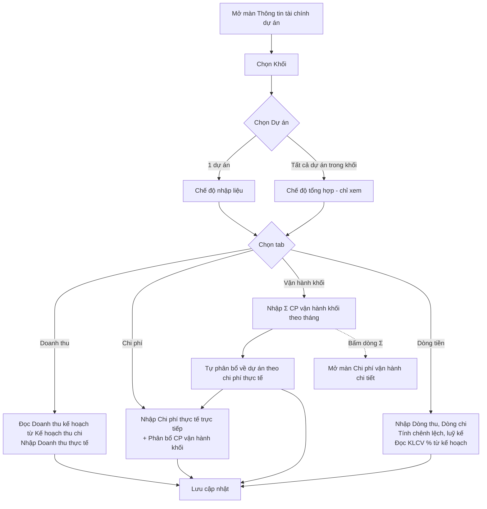

# TÀI LIỆU SRS - CHỨC NĂNG "THÔNG TIN TÀI CHÍNH DỰ ÁN"

## Version control

| Tên version | Ngày cập nhật | PIC | Mô tả |
| :--- | :--- | :--- | :--- |
| **v01 (hiện tại)** | **2026-09-28** | **AI Agent** | - Khởi tạo tài liệu SRS màn Thông tin tài chính dự án. - Mô tả 4 tab: Doanh thu, Chi phí, Vận hành khối (phân bổ), Dòng tiền; chế độ xem 1 dự án / toàn khối. |

---

## 1. Luồng trạng thái và Nghiệp vụ (Business Flow)

**Mô tả:** Màn *Thông tin tài chính dự án* dùng để cập nhật số **thực tế** theo tháng của từng dự án và đối chiếu với **kế hoạch** do Giám đốc khối khai báo ở màn *Kế hoạch thu chi*. Màn gồm 4 tab:
- **Doanh thu:** doanh thu thực tế (giá trị đã nghiệm thu & xuất hoá đơn) so với doanh thu kế hoạch.
- **Chi phí:** chi phí thực tế trực tiếp cộng phần chi phí vận hành khối được phân bổ, so với chi phí kế hoạch.
- **Vận hành khối:** nhập tổng chi phí vận hành chung của khối theo tháng, hệ thống tự phân bổ về các dự án theo chi phí thực tế.
- **Dòng tiền:** dòng thu, dòng chi thực nhận, chênh lệch và luỹ kế dòng tiền, kèm Khối lượng công việc (%) theo kế hoạch.

Người dùng có thể xem **1 dự án** (nhập được) hoặc **tất cả dự án trong khối** (tổng hợp, chỉ xem). Đơn vị: triệu VNĐ.

**Sơ đồ luồng:**

---

## 2. User Stories & Acceptance Criteria (AC)

**Epic:** Quản lý tài chính dự án theo khối

### User Story 1: Chọn dự án cần theo dõi — Là PM / Kế toán, tôi muốn chọn khối và dự án để cập nhật tài chính đúng đối tượng.
*   **Acceptance Criteria:**
    *   **AC1.1:** Cho phép chọn Khối, danh sách Dự án tự lọc theo khối đã chọn.
    *   **AC1.2:** Cho phép chọn "Tất cả dự án trong khối" để xem số tổng hợp của cả khối.
    *   **AC1.3:** Khi đổi khối, nếu đang xem 1 dự án thì hệ thống chuyển sang dự án đầu tiên của khối mới. Nếu đang xem "Tất cả" thì giữ nguyên chế độ tổng hợp.
    *   **AC1.4:** Ở chế độ tổng hợp, mọi số liệu chỉ để xem, không cho nhập và không có thao tác lưu.

### User Story 2: Đối chiếu doanh thu — Là PM / Kế toán, tôi muốn nhập doanh thu thực tế từng tháng và so với kế hoạch để biết mức độ hoàn thành.
*   **Acceptance Criteria:**
    *   **AC2.1:** Hiển thị doanh thu kế hoạch theo tháng lấy từ kế hoạch thu chi của khối (không sửa tại màn này).
    *   **AC2.2:** Cho phép nhập doanh thu thực tế từng tháng (giá trị đã nghiệm thu & xuất hoá đơn trong kỳ).
    *   **AC2.3:** Hệ thống tự tính chênh lệch thực tế − kế hoạch và % hoàn thành theo tháng và cả năm.
    *   **AC2.4:** Hiển thị tóm tắt: Doanh thu KH, Doanh thu TT, Chênh lệch, % hoàn thành.

### User Story 3: Đối chiếu chi phí — Là PM / Kế toán, tôi muốn nhập chi phí thực tế và thấy phần chi phí khối được phân bổ để biết dự án có vượt chi không.
*   **Acceptance Criteria:**
    *   **AC3.1:** Hiển thị chi phí kế hoạch theo tháng.
    *   **AC3.2:** Cho phép nhập chi phí thực tế trực tiếp theo tháng.
    *   **AC3.3:** Hiển thị phần chi phí vận hành khối được phân bổ cho dự án theo tháng.
    *   **AC3.4:** Hệ thống tính Tổng chi phí thực tế = trực tiếp + phân bổ, và Chênh lệch kế hoạch − thực tế.
    *   **AC3.5:** Hiển thị tóm tắt: Chi phí KH, Chi phí TT trực tiếp, Phân bổ từ khối, Chênh lệch KH − TT.

### User Story 4: Phân bổ chi phí vận hành khối — Là Kế toán / GĐ khối, tôi muốn nhập tổng chi phí vận hành chung của khối để hệ thống tự chia về các dự án.
*   **Acceptance Criteria:**
    *   **AC4.1:** Cho phép nhập tổng chi phí vận hành khối theo từng tháng.
    *   **AC4.2:** Hệ thống tự phân bổ tổng chi phí mỗi tháng về các dự án trong khối theo tỷ trọng chi phí thực tế.
    *   **AC4.3:** Tổng các khoản phân bổ của một tháng luôn bằng chi phí vận hành khối của tháng đó.
    *   **AC4.4:** Cho phép mở màn Chi phí vận hành chi tiết của khối đang xem để xem các khoản cấu thành.

### User Story 5: Theo dõi dòng tiền — Là Kế toán, tôi muốn nhập dòng thu, dòng chi thực nhận để theo dõi dòng tiền và luỹ kế của dự án.
*   **Acceptance Criteria:**
    *   **AC5.1:** Cho phép nhập Dòng thu và Dòng chi theo tháng.
    *   **AC5.2:** Hệ thống tính Chênh lệch thu − chi, Luỹ kế kỳ trước và Luỹ kế dòng tiền theo tháng.
    *   **AC5.3:** Hiển thị Khối lượng công việc (%) theo tháng lấy từ kế hoạch thu chi (chỉ xem).
    *   **AC5.4:** Hiển thị tóm tắt: Tổng thu, Tổng chi, Dòng tiền thuần, Luỹ kế cuối kỳ.

### User Story 6: Lưu số thực tế — Là PM / Kế toán, tôi muốn lưu số đã nhập để dùng cho báo cáo.
*   **Acceptance Criteria:**
    *   **AC6.1:** Cho phép lưu số liệu của tab đang thao tác khi đang xem 1 dự án.
    *   **AC6.2:** Hệ thống thông báo kết quả lưu.

---

## 3. Quy tắc nghiệp vụ (Business Rules)

*   **BR1 (Nguồn doanh thu kế hoạch):** Doanh thu kế hoạch tháng *m* của dự án = Doanh thu dự kiến (SX + KD) tháng *m* trong Kế hoạch thu chi, tra theo *(Mã dự án, Năm)*. Nếu không tìm thấy kế hoạch, dùng số kế hoạch mặc định của dự án.
*   **BR2 (Chênh lệch & % doanh thu):** Chênh lệch(*m*) = TT(*m*) − KH(*m*). % hoàn thành(*m*) = TT(*m*) / KH(*m*) × 100, bằng 0 khi KH(*m*) = 0. % cả năm = Σ TT / Σ KH × 100.
*   **BR3 (Phân bổ chi phí vận hành):** Với mỗi tháng *m* có tổng CP vận hành khối Pool(*m*) > 0:
    *   Trọng số dự án *i*: W*i*(*m*) = Chi phí thực tế trực tiếp của dự án *i* tháng *m*.
    *   Phân bổ*i*(*m*) = round( Pool(*m*) × W*i*(*m*) / Σ W(*m*) ).
    *   Nếu Σ W(*m*) = 0 thì chia đều cho các dự án trong khối.
    *   Phần chênh do làm tròn được dồn vào dự án cuối để tổng phân bổ đúng bằng Pool(*m*).
*   **BR4 (Tiêu thức phân bổ):** Chỉ áp dụng một tiêu thức là "Theo chi phí thực tế". Không cho người dùng chọn tiêu thức khác.
*   **BR5 (Tổng chi phí thực tế):** Tổng CP TT(*m*) = Chi phí thực tế trực tiếp(*m*) + Phân bổ CP vận hành khối(*m*). Chênh lệch(*m*) = Chi phí KH(*m*) − Tổng CP TT(*m*). Giá trị dương là tiết kiệm, âm là vượt chi.
*   **BR6 (Dòng tiền):**
    *   Chênh lệch(*m*) = Dòng thu(*m*) − Dòng chi(*m*).
    *   Luỹ kế kỳ trước(1) = Số dư dòng tiền đầu năm. Luỹ kế kỳ trước(*m*) = Luỹ kế dòng tiền(*m* − 1).
    *   Luỹ kế dòng tiền(*m*) = Luỹ kế kỳ trước(*m*) + Chênh lệch(*m*).
    *   Cột cả năm: Luỹ kế kỳ trước hiển thị số dư đầu năm, Luỹ kế dòng tiền hiển thị số cuối tháng 12.
*   **BR7 (KLCV trên Dòng tiền):** Khối lượng công việc(*m*) = KLCV (SX + KD) tháng *m* trong Kế hoạch thu chi. Ở chế độ toàn khối, lấy **trung bình** KLCV của các dự án có kế hoạch, làm tròn số nguyên.
*   **BR8 (Chế độ toàn khối):** Mọi chỉ tiêu tiền = tổng các dự án trong khối theo tháng. Phân bổ CP vận hành = tổng phân bổ của các dự án (bằng CP vận hành khối). Số dư đầu năm = tổng số dư các dự án.
*   **BR9 (Chỉ đọc):** Doanh thu kế hoạch, Chi phí kế hoạch, Phân bổ CP vận hành khối và KLCV không sửa được tại màn này.

---

## 4. Đặc tả trường dữ liệu (Data Dictionary)

### 4.1. Bảng `fin_project_actual_monthly` — Số thực tế theo tháng của dự án
| Tên trường | Loại data | Bắt buộc? | Mô tả |
| :--- | :--- | :--- | :--- |
| `id` | String (PK) | Có | Khóa chính, tự sinh. |
| `project_code` | String (FK) | Có | Mã dự án, liên kết danh mục dự án. |
| `year` | Number | Có | Năm. |
| `month` | Number | Có | Tháng 1–12. Unique (`project_code`, `year`, `month`). |
| `revenue_actual` | Number | Có | Doanh thu thực tế (triệu VNĐ). Mặc định 0. |
| `cost_actual` | Number | Có | Chi phí thực tế trực tiếp (triệu VNĐ). Mặc định 0. |
| `cash_in` | Number | Có | Dòng thu thực nhận (triệu VNĐ). Mặc định 0. |
| `cash_out` | Number | Có | Dòng chi thực chi (triệu VNĐ). Mặc định 0. |
| `updated_by` | String (FK) | Có | Người cập nhật gần nhất. |
| `updated_at` | DateTime | Có | Thời điểm cập nhật. |

### 4.2. Bảng `fin_project_cost_plan_monthly` — Chi phí kế hoạch của dự án
| Tên trường | Loại data | Bắt buộc? | Mô tả |
| :--- | :--- | :--- | :--- |
| `id` | String (PK) | Có | Khóa chính, tự sinh. |
| `project_code` | String (FK) | Có | Mã dự án. |
| `year` | Number | Có | Năm. |
| `month` | Number | Có | Tháng 1–12. |
| `cost_plan` | Number | Có | Chi phí kế hoạch (triệu VNĐ). |

### 4.3. Bảng `fin_project_cash_opening` — Số dư dòng tiền đầu năm
| Tên trường | Loại data | Bắt buộc? | Mô tả |
| :--- | :--- | :--- | :--- |
| `id` | String (PK) | Có | Khóa chính, tự sinh. |
| `project_code` | String (FK) | Có | Mã dự án. |
| `year` | Number | Có | Năm. Unique (`project_code`, `year`). |
| `opening_balance` | Number | Có | Luỹ kế dòng tiền chuyển sang từ kỳ trước (triệu VNĐ), có thể âm. |

### 4.4. Bảng `fin_block_overhead_monthly` — Tổng chi phí vận hành khối theo tháng
| Tên trường | Loại data | Bắt buộc? | Mô tả |
| :--- | :--- | :--- | :--- |
| `id` | String (PK) | Có | Khóa chính, tự sinh. |
| `khoi_code` | String (FK) | Có | Mã khối. |
| `year` | Number | Có | Năm. |
| `month` | Number | Có | Tháng 1–12. Unique (`khoi_code`, `year`, `month`). |
| `amount` | Number | Có | Tổng CP vận hành khối (triệu VNĐ). Mặc định 0. |

### 4.5. Bảng `fin_overhead_allocation` — Kết quả phân bổ (snapshot khi lưu)
| Tên trường | Loại data | Bắt buộc? | Mô tả |
| :--- | :--- | :--- | :--- |
| `id` | String (PK) | Có | Khóa chính, tự sinh. |
| `khoi_code` | String (FK) | Có | Mã khối. |
| `project_code` | String (FK) | Có | Mã dự án nhận phân bổ. |
| `year` | Number | Có | Năm. |
| `month` | Number | Có | Tháng 1–12. |
| `basis` | Enum | Có | Tiêu thức, hiện chỉ có `COST_ACTUAL`. |
| `allocated_amount` | Number | Có | Số phân bổ (triệu VNĐ). |
| `calculated_at` | DateTime | Có | Thời điểm tính. |

> Doanh thu kế hoạch và KLCV không lưu tại màn này. Hai giá trị này được đọc từ `fin_block_plan_monthly` (xem SRS Kế hoạch thu chi).

---

## 5. Mô tả các hiệu ứng tương tác (Interaction Details)

*   **Tab chức năng:** 4 tab Doanh thu / Chi phí / Vận hành khối / Dòng tiền. Tab đang chọn nền trắng, chữ xanh dương.
*   **Ô chọn Dự án:** Mục đầu tiên là "▦ Tất cả dự án trong khối (N)". Ô chọn Dự án bị mờ khi đang ở tab Vận hành khối (vì tab này làm việc ở cấp khối).
*   **Chế độ tổng hợp:** Tiêu đề bảng có nhãn "Tổng hợp toàn khối · chỉ xem". Các ô nhập chuyển thành số chỉ đọc. Ẩn nút "Lưu cập nhật".
*   **Thẻ tóm tắt (KPI):** 4 thẻ phía trên bảng. Giá trị hiển thị màu chàm (màu dùng cho số tổng).
*   **Quy ước màu bảng:** Số chi tiết màu đen. Cột "Cả năm" nền chàm nhạt, chữ chàm.
*   **Cột Nội dung ghim trái** khi cuộn ngang 12 tháng.
*   **Dòng Σ Chi phí vận hành khối:** Có icon con mắt. Hover đổi chữ xanh dương, tooltip "Xem chi tiết chi phí vận hành khối". Bấm để chuyển sang màn Chi phí vận hành chi tiết với đúng khối đang xem.
*   **Nhóm "↳ Phân bổ về dự án":** Mỗi dòng hiển thị mã dự án (xanh) và tên dự án (xám) xếp 2 tầng.
*   **Dòng KLCV (%):** Giá trị kèm hậu tố "%".
*   **Chú thích cuối bảng:** Giải thích công thức của từng tab (ví dụ "Chênh lệch = Thực tế − Kế hoạch").
*   **Toast:** Hiển thị ~2,6 giây sau khi lưu.

---

## 6. Quy tắc Validate Dữ liệu (Validation Rules)

| Màn hình / Form | Trường dữ liệu | Bắt buộc | Kiểu dữ liệu | Rule Validate / Giới hạn |
| :--- | :--- | :--- | :--- | :--- |
| Bộ lọc | Khối | Có | Enum | Chọn từ danh mục khối. |
| Bộ lọc | Dự án | Có | Enum | Dự án thuộc khối đã chọn, hoặc "Tất cả dự án trong khối". |
| Tab Doanh thu | Doanh thu thực tế (T1–T12) | Không | Int | ≥ 0, chỉ chấp nhận chữ số, mặc định 0. Đơn vị triệu VNĐ. |
| Tab Chi phí | Chi phí thực tế trực tiếp (T1–T12) | Không | Int | ≥ 0, chỉ chấp nhận chữ số, mặc định 0. |
| Tab Vận hành khối | Σ Chi phí vận hành khối (T1–T12) | Không | Int | ≥ 0, chỉ chấp nhận chữ số, mặc định 0. |
| Tab Dòng tiền | Dòng thu (T1–T12) | Không | Int | ≥ 0, chỉ chấp nhận chữ số, mặc định 0. |
| Tab Dòng tiền | Dòng chi (T1–T12) | Không | Int | ≥ 0, chỉ chấp nhận chữ số, mặc định 0. |

---

## 7. Các trường hợp ngoại lệ & Thông báo lỗi (Edge Cases & Exception Handling)

| Ngữ cảnh / Hành động | Kịch bản ngoại lệ (Edge Case) | Thông báo lỗi hiển thị ra UI (Error Message) | Loại hiển thị (UI Type) |
| :--- | :--- | :--- | :--- |
| Lưu tab Doanh thu | Lưu thành công | "💾 Đã lưu doanh thu thực tế." | Toast |
| Lưu tab Chi phí | Lưu thành công | "💾 Đã lưu chi phí thực tế." | Toast |
| Lưu tab Vận hành khối | Lưu thành công | "💾 Đã lưu & phân bổ chi phí vận hành khối." | Toast |
| Lưu tab Dòng tiền | Lưu thành công | "💾 Đã lưu dòng tiền." | Toast |
| Mở tab Doanh thu | Dự án chưa có kế hoạch thu chi năm đang xem | "Dự án chưa có kế hoạch doanh thu trong Kế hoạch thu chi. Đang hiển thị số mặc định." | In-line text dưới tiêu đề bảng |
| Mở tab Dòng tiền | Dự án chưa khai báo KLCV | Ẩn dòng "Khối lượng công việc (%)" | Không hiển thị lỗi |
| Tab Vận hành khối | Khối không có dự án nào | "Khối chưa có dự án để phân bổ." | Empty state trong bảng |
| Tab Vận hành khối | Tổng chi phí thực tế các dự án trong tháng = 0 | Tự chia đều, không báo lỗi | — |
| Lưu (mọi tab) | Mất kết nối khi gọi API | "Lỗi kết nối. Vui lòng kiểm tra lại mạng và thử lại." | Toast (Red) |
| Nhập số | Người dùng gõ ký tự không phải chữ số | Ký tự bị bỏ qua, ô giữ giá trị hợp lệ | Không hiển thị lỗi |

---

## 8. Mapping Giao diện & Design System (UI/UX Component Mapping)

| Tính năng / UI Element | Component Design System (Gợi ý) | Ghi chú thêm |
| :--- | :--- | :--- |
| Chọn Khối, Dự án | `Select` | Dự án phụ thuộc Khối. `disabled` ở tab Vận hành khối. |
| 4 tab chức năng | `Tabs` | `type="card"`, icon cho từng tab. |
| Thẻ tóm tắt | `Card` + `Statistic` | 4 thẻ / tab, `valueStyle` màu chàm. |
| Bảng form-view 12 tháng | `Table` | `fixed="left"` cột Nội dung, `scroll={{ x: 1200 }}`, cột "Cả năm" cố định bên phải. |
| Ô nhập số theo tháng | `InputNumber` | `min={0}`, `precision={0}`, formatter phân cách nghìn vi-VN. `readOnly` ở chế độ tổng hợp. |
| Nhãn "Tổng hợp toàn khối · chỉ xem" | `Tag` | `color="default"`. |
| Dòng Σ Chi phí vận hành khối | `Button` (`type="link"`) | Icon `EyeOutlined`, `Tooltip` "Xem chi tiết chi phí vận hành khối". Điều hướng sang màn Chi phí vận hành chi tiết. |
| Nhóm phân bổ về dự án | `Table` (row group) | Dòng tiêu đề nhóm "↳ Phân bổ về dự án". |
| Lưu cập nhật | `Button` | `type="primary"`, ẩn khi chế độ tổng hợp, `loading` khi gọi API. |
| Chú thích công thức | `Typography.Text` | `type="secondary"`, icon `InfoCircleOutlined`. |
| Thông báo | `message` | ~3 giây. |
